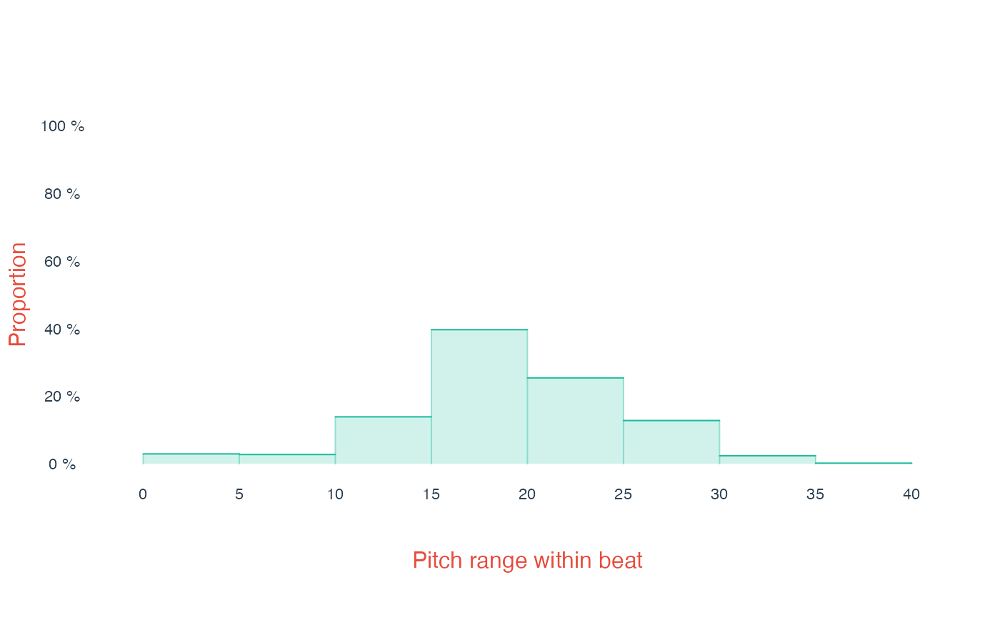

# Contextualizing humdrum data

Welcome to “Contextualizing humdrum data”! This article explains how
humdrum$_{\mathbb{R}}$ can be used to contextualize musical data. When
analyzing musical data, we often treat each and every data token as a
separate, independent “data point.” However, in many cases, we want to
consider data points *in context*—what other data points are nearby in
the data? Since the [humdrum
syntax](https://humdrumR.ccml.gtcmt.gatech.edu/articles/HumdrumSyntax.md)
encodes data in temporal order, the “context” usually means either “what
is happening before or after this data point?” or “what else is
happening at the same time as this this data point?”
Humdrum$_{\mathbb{R}}$ provides a number of ways of analyzing data “in
context.”

This article, like all of our articles, closely parallels information in
humdrum$_{\mathbb{R}}$’s detailed code documentation, which can be found
in the
“[Reference](https://humdrumr.ccml.gtcmt.gatech.edu/reference/index.html#reading-and-writing#manipulating-humdrum-data "HumdrumR function reference, Manipulating humdrum data")”
section of the
humdrum$_{\mathbb{R}}$[homepage](https://humdrumR.ccml.gtcmt.gatech.edu/articles/humdrumR.ccml.gtcmt.gatech.edu).
You can also find this information within R, once humdrum$_{\mathbb{R}}$
is loaded, using
[`?context`](https://humdrumR.ccml.gtcmt.gatech.edu/reference/context.md),
`group_by`, or
[`?withinHumdrum`](https://humdrumR.ccml.gtcmt.gatech.edu/reference/withinHumdrum.md).

## Groupby

The most conventionally “R-style” way to look at data context is using
R/humdrum$_{\mathbb{R}}$’s various “group by” options. This
functionality is described elsewhere, for example in the [Working With
Data](https://humdrumR.ccml.gtcmt.gatech.edu/articles/WorkingWithData.md)
article, and in the
[`within.humdrumR()`](https://humdrumR.ccml.gtcmt.gatech.edu/reference/withinHumdrum.md)
man page. Group-by functionality isn’t necessarily connected to temporal
context: you can, for instance, group together all the data from each
instrument in an ensemble, across all songs in a dataset—this is useful,
but non-temporal-context. If you want to use `groupby` to get more
temporal context, here are a few good options:

#### Group by Record

All humdrum$_{\mathbb{R}}$ data has a `Record` field, indicating data
points that occur at the same time. Using
[`group_by()`](https://humdrumR.ccml.gtcmt.gatech.edu/reference/groupHumdrum.md)
we can perform calculations grouped by record. Let’s load our trusty
Bach-chorale data:

``` r
chorales <- readHumdrum(humdrumRroot, 'HumdrumData/BachChorales/.*krn')
```

Let’s count how many new note onsets (*not* rests) occur on each record
of the data, and tabulate the results. We’ll look for tokens that
*don’t* contain an `r` (for rest), using a regular-expression match
`%~% 'r'` and the negating bang (`!`).

    >    humdrumR count distribution 
    >    with(group_by(chorales, Piece, Record), sum(!Token %~% "r"))    n
    >                                                               0    1
    >                                                               1  211
    >                                                               2   89
    >                                                               3   64
    >                                                               4  462
    >    with(group_by(chorales, Piece, Record), sum(!Token %~% "r"))    n
    >    humdrumR count distribution

Most records (462 out of 827) have new notes in all four voices—no
surprise for choral music—with *one* onset being the next most common
case (211 records). Note that, when we called
[`group_by()`](https://humdrumR.ccml.gtcmt.gatech.edu/reference/groupHumdrum.md),
we included `Piece` *and* `Record`. Why? Because each piece in the data
set repeats the same record numbers—you wouldn’t want to count the 17th
record from the 3rd chorale together with the 17th record from the 7th
chorale, for example. When using
[`group_by()`](https://humdrumR.ccml.gtcmt.gatech.edu/reference/groupHumdrum.md),
you’ll almost always want to have `Piece` as a grouping factor.

#### Group by Bar

Most humdrum data includes bar lines, indicated by `=`. When
humdrum$_{\mathbb{R}}$ reads data (`?readHumdrumR`) data, it will look
at these barlines, count them in each file, and put that count into a
field called `Bar`
([`?fields`](https://humdrumR.ccml.gtcmt.gatech.edu/reference/humTable.md)).
You can then use this data to group data by bar. Remember, that if your
data set has no `=` tokens, the `Bar` field will be nothing but useless
`0`s.

What if we wanted to know what the lowest note in each bar of the music
is? Let’s first extract
[`semits()`](https://humdrumR.ccml.gtcmt.gatech.edu/reference/semits.md)
data, so it is easy to get the lowest value:

``` r
chorales |>
  mutate(Semits = semits(Token),
         SciPitch = pitch(Token)) -> chorales
```

We can now group bars (within pieces, once again!), get the minimum
(using [`which.min()`](https://rdrr.io/r/base/which.min.html)), and
tabulate them.

``` r
chorales |>
  group_by(Piece, Bar) |>
  with(SciPitch[which.min(Semits)]) |>
  count() |> table() -> lownotes

lownotes[lownotes > 0]
>    with(group_by(chorales, Piece, Bar), SciPitch[which.min(Semits)])
>     D2  E2  F2 F#2  G2 G#2 Ab2  A2 Bb2  B2  C3 C#3  D3 D#3 Eb3  E3 E#3  F3 F#3  G3 
>      1   6   9   3  21   1   3  23   7  23   9  15  19   2   1  17   1   1   5   4 
>    G#3  A3 
>      1   4
```

The highest lowest-note-in-bar is A3. The most common lowest-note-in-bar
is A2.

------------------------------------------------------------------------

For further analysis, we might want to save the lowest-note into a new
field, so we’ll use `mutate()`. By default, the `mutate()` function will
[recycle](https://humdrumR.ccml.gtcmt.gatech.edu/reference/recycling.md)
any scalar (length one) result throughout its group, which is usually
what we want:

``` r

chorales |>
  group_by(Piece, Bar) |>
  mutate(LowNote = min(Semits)) |>
  ungroup() -> chorales

chorales
```

```
>    ######################## vvv chor001.krn vvv #########################
>                1:  !!!COM: Bach, Johann Sebastian
>                2:  !!!CDT: 1685/02/21/-1750/07/28/
>                3:  !!!OTL@@DE: Aus meines Herzens Grunde
>                4:  !!!OTL@EN:      From the Depths of My Heart
>                5:  !!!SCT: BWV 269
>                6:  !!!PC#: 1
>                7:  !!!AGN: chorale
>                8:         **semits       **semits       **semits       **semits
>                9:                .              .              .              .
>               10:                .              .              .              .
>               11:                .              .              .              .
>               12:        *>[A,A,B]      *>[A,A,B]      *>[A,A,B]      *>[A,A,B]
>               13:     *>norep[A,B]   *>norep[A,B]   *>norep[A,B]   *>norep[A,B]
>               14:              *>A            *>A            *>A            *>A
>               15:          *clefF4       *clefGv2        *clefG2        *clefG2
>               16:                .              .              .              .
>               17:                .              .              .              .
>               18:                .              .              .              .
>               19:                .              .              .              .
>               20:              -17            -17            -17            -17
>               21:               =1             =1             =1             =1
>               22:               -8             -8             -8             -8
>               23:               -8             -8             -8              .
>               24:                .             -8              .              .
>               25:               -8             -8             -8             -8
>               26:               =2             =2             =2             =2
>               27:              -10            -10            -10            -10
>               28:              -10            -10              .              .
>               29:                .              .              .            -10
>               30:              -10            -10            -10            -10
>    31-133::::::::::::::::::::::::::::::::::::::::::::::::::::::::::::::::
>    ######################## ^^^ chor001.krn ^^^ #########################
>    
>           (eight more pieces...)
>    
>    ######################## vvv chor010.krn vvv #########################
>      1-70::::::::::::::::::::::::::::::::::::::::::::::::::::::::::::::::
>               71:              -17            -17            -17            -17
>               72:                .            -17              .              .
>               73:              -17              .            -17            -17
>               74:                .            -17              .              .
>               75:              -17            -17            -17            -17
>               76:              =11            =11            =11            =11
>               77:              -15            -15            -15            -15
>               78:              -15            -15            -15            -15
>               79:              -15            -15            -15            -15
>               80:                .              .            -15              .
>               81:              =12            =12            =12            =12
>               82:              -15            -15            -15            -15
>               83:              -15            -15            -15            -15
>               84:              -15            -15            -15            -15
>               85:              -15            -15              .            -15
>               86:              =13            =13            =13            =13
>               87:              -20            -20            -20            -20
>               88:              -20            -20            -20              .
>               89:              -20            -20            -20              .
>               90:               ==             ==             ==             ==
>               91:               *-             *-             *-             *-
>               92:  !!!hum2abc: -Q ''
>               93:  !!!title: @{PC#}. @{OTL@@DE}
>               94:  !!!YOR1: 371 vierstimmige Choralges&auml;nge von Johann Sebastian B***
>               95:  !!!YOR2: 4th ed. by Alfred D&ouml;rffel (Leipzig: Breitkopf und H&a***
>               96:  !!!YOR2: c.1875). 178 pp. Plate "V.A.10".  reprint: J.S. Bach, 371 ***
>               97:  !!!YOR4: Chorales (New York: Associated Music Publishers, Inc., c.1***
>               98:  !!!SMS: B&H, 4th ed, Alfred D&ouml;rffel, c.1875, plate V.A.10
>               99:  !!!EED:  Craig Stuart Sapp
>              100:  !!!EEV:  2009/05/22
>    ######################## ^^^ chor010.krn ^^^ #########################
>                  (***four global comments truncated due to screen size***)
>    
>       humdrumR corpus of ten pieces.
>    
>       Data fields: 
>               *LowNote  :: integer (**semits tokens)
>                SciPitch :: character (**pitch tokens)
>                Semits   :: integer (**semits tokens)
>                Token    :: character
```

(Note that we use
[`ungroup()`](https://humdrumR.ccml.gtcmt.gatech.edu/reference/groupHumdrum.md)
before overwriting `chorales`, so that grouping doesn’t affect our
future analyses.) We could then, for example, subtract the bar’s lowest
note from each note:

``` r
chorales |>
  mutate(Semits - LowNote) 
```

```
>    ######################## vvv chor001.krn vvv #########################
>                1:  !!!COM: Bach, Johann Sebastian
>                2:  !!!CDT: 1685/02/21/-1750/07/28/
>                3:  !!!OTL@@DE: Aus meines Herzens Grunde
>                4:  !!!OTL@EN:      From the Depths of My Heart
>                5:  !!!SCT: BWV 269
>                6:  !!!PC#: 1
>                7:  !!!AGN: chorale
>                8:         **semits       **semits       **semits       **semits
>                9:                .              .              .              .
>               10:                .              .              .              .
>               11:                .              .              .              .
>               12:        *>[A,A,B]      *>[A,A,B]      *>[A,A,B]      *>[A,A,B]
>               13:     *>norep[A,B]   *>norep[A,B]   *>norep[A,B]   *>norep[A,B]
>               14:              *>A            *>A            *>A            *>A
>               15:          *clefF4       *clefGv2        *clefG2        *clefG2
>               16:                .              .              .              .
>               17:                .              .              .              .
>               18:                .              .              .              .
>               19:                .              .              .              .
>               20:                0             16             19             24
>               21:               =1             =1             =1             =1
>               22:                3              7             10             15
>               23:                0              8             12              .
>               24:                .              7              .              .
>               25:                2              5             10             22
>               26:               =2             =2             =2             =2
>               27:                5              5             12             21
>               28:                0              4              .              .
>               29:                .              .              .             19
>               30:                2              5              9             17
>    31-133::::::::::::::::::::::::::::::::::::::::::::::::::::::::::::::::
>    ######################## ^^^ chor001.krn ^^^ #########################
>    
>           (eight more pieces...)
>    
>    ######################## vvv chor010.krn vvv #########################
>      1-70::::::::::::::::::::::::::::::::::::::::::::::::::::::::::::::::
>               71:                7             11             19             28
>               72:                .             12              .              .
>               73:                7              .             17             26
>               74:                .             11              .              .
>               75:                0             12             16             24
>               76:              =11            =11            =11            =11
>               77:                3             10             19             22
>               78:                0             12             19             27
>               79:                7             11             19             26
>               80:                .              .             17              .
>               81:              =12            =12            =12            =12
>               82:                8             12             15             24
>               83:                3             10             15             19
>               84:                1             10             17             22
>               85:                0             12              .             20
>               86:              =13            =13            =13            =13
>               87:                4             19             22             24
>               88:                5             17             20              .
>               89:                0             16             19              .
>               90:               ==             ==             ==             ==
>               91:               *-             *-             *-             *-
>               92:  !!!hum2abc: -Q ''
>               93:  !!!title: @{PC#}. @{OTL@@DE}
>               94:  !!!YOR1: 371 vierstimmige Choralges&auml;nge von Johann Sebastian B***
>               95:  !!!YOR2: 4th ed. by Alfred D&ouml;rffel (Leipzig: Breitkopf und H&a***
>               96:  !!!YOR2: c.1875). 178 pp. Plate "V.A.10".  reprint: J.S. Bach, 371 ***
>               97:  !!!YOR4: Chorales (New York: Associated Music Publishers, Inc., c.1***
>               98:  !!!SMS: B&H, 4th ed, Alfred D&ouml;rffel, c.1875, plate V.A.10
>               99:  !!!EED:  Craig Stuart Sapp
>              100:  !!!EEV:  2009/05/22
>    ######################## ^^^ chor010.krn ^^^ #########################
>                  (***four global comments truncated due to screen size***)
>    
>       humdrumR corpus of ten pieces.
>    
>       Data fields: 
>                LowNote          :: integer (**semits tokens)
>                SciPitch         :: character (**pitch tokens)
>                Semits           :: integer (**semits tokens)
>               *Semits - LowNote :: integer (**semits tokens)
>                Token            :: character
```

#### Group by Beat

Another useful contextual group is the beat. There will be no automatic
“beat” field in our data, so we’ll need to make one—obviously, we need
to have data with rhythmic information encoded (like `**kern` or
`**recip`) to do this! We can use the
[`timecount()`](https://humdrumR.ccml.gtcmt.gatech.edu/reference/timecount.md)
function to count the beats in our data. We could count quarter-notes by
setting `unit = '4'`; alternatively, if our data includes time-signature
interpretations (like `*M3/4`) we could use the `TimeSignature` field to
get the tactus of the meter. Let’s try the later and save the result to
a new field, which we’ll call `Beat` (or anything else you want).

``` r
chorales |> select(Token) |>
  mutate(Beat = timecount(Token, unit = tactus(TimeSignature))) -> chorales
```

We can now group by beat (and piece, of course). Maybe we want to know
the range of notes in each beat:

``` r

chorales |>
  group_by(Piece, Beat) |> 
  with(diff(range(Semits))) |>
  draw(xlab = 'Pitch range within beat')
```



> Note: If your data includes spine paths, you’ll want to set
> `mutate(timecount(Token), expandPaths = TRUE, ...)`. Count (and
> similar functions, like
> [`timeline()`](https://humdrumR.ccml.gtcmt.gatech.edu/reference/timeline.md))
> won’t work correctly without paths expanded
> ([`?expandPaths`](https://humdrumR.ccml.gtcmt.gatech.edu/reference/expandPaths.md)).

## Contextual Windows

When you use
[`group_by()`](https://humdrumR.ccml.gtcmt.gatech.edu/reference/groupHumdrum.md),
your data is *exhaustively* partitioned into *non-overlapping* groups;
the groups are also not necessarily ordered—we have to explicitly use
(temporally) ordered groups like `group_by(Piece, Record)` if we want
temporal context. In contrast, the
[`context()`](https://humdrumR.ccml.gtcmt.gatech.edu/reference/context.md)
function, when used in combination with
[`with()`](https://humdrumR.ccml.gtcmt.gatech.edu/reference/withinHumdrum.md)
or `mutate()`, gives us much more flexible control over the context we
want for our data.

[`context()`](https://humdrumR.ccml.gtcmt.gatech.edu/reference/context.md)
takes an input vector and treats it as an ordered sequence of
information. It then identifies arbitrary contextual windows in the
data, based on your criteria. The windows created by
[`context()`](https://humdrumR.ccml.gtcmt.gatech.edu/reference/context.md)
are always sequentially ordered, aren’t necessarily exhaustive (some
data might not fall in any window), and can *overlap* (some data falls
in multiple windows).

We use
[`context()`](https://humdrumR.ccml.gtcmt.gatech.edu/reference/context.md)
by indicating when to “open” (begin) and “close” (end) contextual
windows, using the `open` and `close` arguments. Context can use many
criteria to open/close windows. In the following sections, we layout
just a few examples; we’ll use our chorale data again, as well as the
built-in Beethoven variation data:

``` r
chorales <- readHumdrum(humdrumRroot, 'HumdrumData/BachChorales/.*krn')
beethoven <- readHumdrum(humdrumRroot, 'HumdrumData/BeethovenVariations/.*krn')
```

For most examples, we’ll use
[`within()`](https://humdrumR.ccml.gtcmt.gatech.edu/reference/withinHumdrum.md)
and run the command `paste(Token, collapse = '|')`. This will cause all
the tokens within a contextual group to collapse to single string,
separated by `|`. This is the simplest/fastest way to *see* what
[`context()`](https://humdrumR.ccml.gtcmt.gatech.edu/reference/context.md)
is doing!

### Regular windows

In some cases, we simply want to progress through data and open/close
windows at regular locations. We can do this using the
[`hop()`](https://humdrumR.ccml.gtcmt.gatech.edu/reference/hop.md)
function.
([`hop()`](https://humdrumR.ccml.gtcmt.gatech.edu/reference/hop.md) is a
humdrum$_{\mathbb{R}}$ function which is very similar to R’s base
[`seq()`](https://rdrr.io/r/base/seq.html) function; however,
[`hop()`](https://humdrumR.ccml.gtcmt.gatech.edu/reference/hop.md) has
some special features and, more importantly, gets special treatment from
[`context()`](https://humdrumR.ccml.gtcmt.gatech.edu/reference/context.md)).
Maybe we want to open a four-note window on every note:

``` r
chorales |>
  context(hop(), open + 3) |>
  within(paste(Token, collapse = '|'))
```

```
>    #################### vvv chor001.krn vvv #####################
>                1:  !!!COM: Bach, Johann Sebastian
>                2:  !!!CDT: 1685/02/21/-1750/07/28/
>                3:  !!!OTL@@DE: Aus meines Herzens Grunde
>                4:  !!!OTL@EN:      From the Depths of My Heart
>                5:  !!!SCT: BWV 269
>                6:  !!!PC#: 1
>                7:  !!!AGN: chorale
>                8:               **kern          **kern          **kern    ***
>                9:               *ICvox          *ICvox          *ICvox    ***
>               10:               *Ibass         *Itenor          *Ialto    ***
>               11:              *I"Bass        *I"Tenor         *I"Alto    ***
>               12:            *>[A,A,B]       *>[A,A,B]       *>[A,A,B]    ***
>               13:         *>norep[A,B]    *>norep[A,B]    *>norep[A,B]    ***
>               14:                  *>A             *>A             *>A    ***
>               15:              *clefF4        *clefGv2         *clefG2    ***
>               16:               *k[f#]          *k[f#]          *k[f#]    ***
>               17:                  *G:             *G:             *G:    ***
>               18:                *M3/4           *M3/4           *M3/4    ***
>               19:               *MM100          *MM100          *MM100    ***
>               20:        4GG|4G|4E|4F#   4B|4B|8cL|8BJ     4d|4d|4e|4d    ***
>               21:                   =1              =1              =1    ***
>               22:         4G|4E|4F#|4G   4B|8cL|8BJ|4A     4d|4e|4d|2d    ***
>               23:         4E|4F#|4G|4D   8cL|8BJ|4A|4G     4e|4d|2d|4B    ***
>               24:                    .   8BJ|4A|4G|4F#               .    ***
>               25:         4F#|4G|4D|4E    4A|4G|4F#|4G    4d|2d|4B|8eL    ***
>               26:                   =2              =2              =2    ***
>               27:          4G|4D|4E|4C   4G|4F#|4G|8cL    2d|4B|8eL|8d    ***
>               28:        4D|4E|4C|8BBL  4F#|4G|8cL|8BJ               .    ***
>               29:                    .               .               .    ***
>               30:      4E|4C|8BBL|8AAJ   4G|8cL|8BJ|4c    4B|8eL|8d|8e    ***
>    31-133::::::::::::::::::::::::::::::::::::::::::::::::::::::::
>    #################### ^^^ chor001.krn ^^^ #####################
>    
>           (eight more pieces...)
>    
>    #################### vvv chor010.krn vvv #####################
>      1-70::::::::::::::::::::::::::::::::::::::::::::::::::::::::
>               71:        4D|4D|2GG;|2C  8F#|4G|8F#|2G;    4d|4c|2B;|2e    ***
>               72:                    .   4G|8F#|2G;|2G               .    ***
>               73:       4D|2GG;|2C|4AA               .    4c|2B;|2e|4e    ***
>               74:                    .   8F#|2G;|2G|4A               .    ***
>               75:       2GG;|2C|4AA|4E   2G;|2G|4A|4G#   2B;|2e|4e|8eL    ***
>               76:                  =11             =11             =11    ***
>               77:         2C|4AA|4E|4F    2G|4A|4G#|4A   2e|4e|8eL|8dJ    ***
>               78:         4AA|4E|4F|4C    4A|4G#|4A|4G   4e|8eL|8dJ|4c    ***
>               79:        4E|4F|4C|4BB-    4G#|4A|4G|4G   8eL|8dJ|4c|4c    ***
>               80:                    .               .   8dJ|4c|4c|[2d    ***
>               81:                  =12             =12             =12    ***
>               82:       4F|4C|4BB-|4AA     4A|4G|4G|4A   4c|4c|[2d|4d]    ***
>               83:     4C|4BB-|4AA|4GG#     4G|4G|4A|4B   4c|[2d|4d]|4c    ***
>               84:    4BB-|4AA|4GG#|4AA     4G|4A|4B|4A  [2d|4d]|4c|2B;    ***
>               85:    4AA|4GG#|4AA|2EE;  4A|4B|4A|2G#X;               .    ***
>               86:                  =13             =13             =13    ***
>               87:                    .               .               .    ***
>               88:                    .               .               .    ***
>               89:                    .               .               .    ***
>               90:                   ==              ==              ==    ***
>               91:                   *-              *-              *-    ***
>               92:  !!!hum2abc: -Q ''
>               93:  !!!title: @{PC#}. @{OTL@@DE}
>               94:  !!!YOR1: 371 vierstimmige Choralges&auml;nge von Johann***
>               95:  !!!YOR2: 4th ed. by Alfred D&ouml;rffel (Leipzig: Breit***
>               96:  !!!YOR2: c.1875). 178 pp. Plate "V.A.10".  reprint: J.S***
>               97:  !!!YOR4: Chorales (New York: Associated Music Publisher***
>               98:  !!!SMS: B&H, 4th ed, Alfred D&ouml;rffel, c.1875, plate***
>               99:  !!!EED:  Craig Stuart Sapp
>              100:  !!!EEV:  2009/05/22
>    #################### ^^^ chor010.krn ^^^ #####################
>            (***one spine/path not displayed due to screen size***)
>    
>       humdrumR corpus of ten pieces.
>    
>       Data fields: 
>                Token                        :: character
>               *paste(Token, collapse = "|") :: character
>    
>       With 2,313 (overlapping) contextual windows:
>           All windows length == 4
```

Cool, we’ve got overlapping four-note windows, running through each
spine! How did we do this?

#### Regular Open

The first argument to
[`context()`](https://humdrumR.ccml.gtcmt.gatech.edu/reference/context.md)
is the `open` argument; we give `open` a set of indices (natural
numbers) where to open windows in the data.
[`hop()`](https://humdrumR.ccml.gtcmt.gatech.edu/reference/hop.md)
simply generates a sequence of numbers “along” the input data—by
default, the “hop size” is `1`, but we can change that. For example:

``` r
hop(letters, by = 1)
>     [1]  1  2  3  4  5  6  7  8  9 10 11 12 13 14 15 16 17 18 19 20 21 22 23 24 25
>    [26] 26

hop(letters, by = 2)
>     [1]  1  3  5  7  9 11 13 15 17 19 21 23 25
```

When we use
[`hop()`](https://humdrumR.ccml.gtcmt.gatech.edu/reference/hop.md)
inside
[`context()`](https://humdrumR.ccml.gtcmt.gatech.edu/reference/context.md),
it automatically knows what the input vector(s) (data fields) to hop
along are. So now check this out:

``` r

chorales |>
  context(hop(2), open + 3) |>
  within(paste(Token, collapse = '|'))
```

```
>    #################### vvv chor001.krn vvv ####################
>                1:  !!!COM: Bach, Johann Sebastian
>                2:  !!!CDT: 1685/02/21/-1750/07/28/
>                3:  !!!OTL@@DE: Aus meines Herzens Grunde
>                4:  !!!OTL@EN:      From the Depths of My Heart
>                5:  !!!SCT: BWV 269
>                6:  !!!PC#: 1
>                7:  !!!AGN: chorale
>                8:               **kern          **kern         **kern    ***
>                9:               *ICvox          *ICvox         *ICvox    ***
>               10:               *Ibass         *Itenor         *Ialto    ***
>               11:              *I"Bass        *I"Tenor        *I"Alto    ***
>               12:            *>[A,A,B]       *>[A,A,B]      *>[A,A,B]    ***
>               13:         *>norep[A,B]    *>norep[A,B]   *>norep[A,B]    ***
>               14:                  *>A             *>A            *>A    ***
>               15:              *clefF4        *clefGv2        *clefG2    ***
>               16:               *k[f#]          *k[f#]         *k[f#]    ***
>               17:                  *G:             *G:            *G:    ***
>               18:                *M3/4           *M3/4          *M3/4    ***
>               19:               *MM100          *MM100         *MM100    ***
>               20:        4GG|4G|4E|4F#   4B|4B|8cL|8BJ    4d|4d|4e|4d    ***
>               21:                   =1              =1             =1    ***
>               22:                    .               .              .    ***
>               23:         4E|4F#|4G|4D   8cL|8BJ|4A|4G    4e|4d|2d|4B    ***
>               24:                    .               .              .    ***
>               25:                    .    4A|4G|4F#|4G              .    ***
>               26:                   =2              =2             =2    ***
>               27:          4G|4D|4E|4C               .   2d|4B|8eL|8d    ***
>               28:                    .  4F#|4G|8cL|8BJ              .    ***
>               29:                    .               .              .    ***
>               30:      4E|4C|8BBL|8AAJ               .              .    ***
>    31-133:::::::::::::::::::::::::::::::::::::::::::::::::::::::
>    #################### ^^^ chor001.krn ^^^ ####################
>    
>           (eight more pieces...)
>    
>    #################### vvv chor010.krn vvv ####################
>      1-70:::::::::::::::::::::::::::::::::::::::::::::::::::::::
>               71:                    .  8F#|4G|8F#|2G;   4d|4c|2B;|2e    ***
>               72:                    .               .              .    ***
>               73:       4D|2GG;|2C|4AA               .              .    ***
>               74:                    .   8F#|2G;|2G|4A              .    ***
>               75:                    .               .  2B;|2e|4e|8eL    ***
>               76:                  =11             =11            =11    ***
>               77:         2C|4AA|4E|4F    2G|4A|4G#|4A              .    ***
>               78:                    .               .  4e|8eL|8dJ|4c    ***
>               79:        4E|4F|4C|4BB-    4G#|4A|4G|4G              .    ***
>               80:                    .               .  8dJ|4c|4c|[2d    ***
>               81:                  =12             =12            =12    ***
>               82:                    .               .              .    ***
>               83:     4C|4BB-|4AA|4GG#     4G|4G|4A|4B  4c|[2d|4d]|4c    ***
>               84:                    .               .              .    ***
>               85:    4AA|4GG#|4AA|2EE;  4A|4B|4A|2G#X;              .    ***
>               86:                  =13             =13            =13    ***
>               87:                    .               .              .    ***
>               88:                    .               .              .    ***
>               89:                    .               .              .    ***
>               90:                   ==              ==             ==    ***
>               91:                   *-              *-             *-    ***
>               92:  !!!hum2abc: -Q ''
>               93:  !!!title: @{PC#}. @{OTL@@DE}
>               94:  !!!YOR1: 371 vierstimmige Choralges&auml;nge von Johan***
>               95:  !!!YOR2: 4th ed. by Alfred D&ouml;rffel (Leipzig: Brei***
>               96:  !!!YOR2: c.1875). 178 pp. Plate "V.A.10".  reprint: J.***
>               97:  !!!YOR4: Chorales (New York: Associated Music Publishe***
>               98:  !!!SMS: B&H, 4th ed, Alfred D&ouml;rffel, c.1875, plat***
>               99:  !!!EED:  Craig Stuart Sapp
>              100:  !!!EEV:  2009/05/22
>    #################### ^^^ chor010.krn ^^^ ####################
>           (***one spine/path not displayed due to screen size***)
>    
>       humdrumR corpus of ten pieces.
>    
>       Data fields: 
>                Token                        :: character
>               *paste(Token, collapse = "|") :: character
>    
>       With 1,164 (overlapping) contextual windows:
>           All windows length == 4
```

By saying `hop(2)`, our windows only open on every *other* index. If we
don’t want our four-note windows to overlap at all, we could set
`hop(4)`:

``` r
chorales |>
  context(hop(4), open + 3) |>
  within(paste(Token, collapse = '|'))
```

```
>    ################### vvv chor001.krn vvv ####################
>                1:  !!!COM: Bach, Johann Sebastian
>                2:  !!!CDT: 1685/02/21/-1750/07/28/
>                3:  !!!OTL@@DE: Aus meines Herzens Grunde
>                4:  !!!OTL@EN:      From the Depths of My Heart
>                5:  !!!SCT: BWV 269
>                6:  !!!PC#: 1
>                7:  !!!AGN: chorale
>                8:              **kern          **kern         **kern    ***
>                9:              *ICvox          *ICvox         *ICvox    ***
>               10:              *Ibass         *Itenor         *Ialto    ***
>               11:             *I"Bass        *I"Tenor        *I"Alto    ***
>               12:           *>[A,A,B]       *>[A,A,B]      *>[A,A,B]    ***
>               13:        *>norep[A,B]    *>norep[A,B]   *>norep[A,B]    ***
>               14:                 *>A             *>A            *>A    ***
>               15:             *clefF4        *clefGv2        *clefG2    ***
>               16:              *k[f#]          *k[f#]         *k[f#]    ***
>               17:                 *G:             *G:            *G:    ***
>               18:               *M3/4           *M3/4          *M3/4    ***
>               19:              *MM100          *MM100         *MM100    ***
>               20:       4GG|4G|4E|4F#   4B|4B|8cL|8BJ    4d|4d|4e|4d    ***
>               21:                  =1              =1             =1    ***
>               22:                   .               .              .    ***
>               23:                   .               .              .    ***
>               24:                   .               .              .    ***
>               25:                   .    4A|4G|4F#|4G              .    ***
>               26:                  =2              =2             =2    ***
>               27:         4G|4D|4E|4C               .   2d|4B|8eL|8d    ***
>               28:                   .               .              .    ***
>               29:                   .               .              .    ***
>               30:                   .               .              .    ***
>    31-133::::::::::::::::::::::::::::::::::::::::::::::::::::::
>    ################### ^^^ chor001.krn ^^^ ####################
>    
>           (eight more pieces...)
>    
>    ################### vvv chor010.krn vvv ####################
>      1-70::::::::::::::::::::::::::::::::::::::::::::::::::::::
>               71:                   .  8F#|4G|8F#|2G;              .    ***
>               72:                   .               .              .    ***
>               73:                   .               .              .    ***
>               74:                   .               .              .    ***
>               75:                   .               .  2B;|2e|4e|8eL    ***
>               76:                 =11             =11            =11    ***
>               77:        2C|4AA|4E|4F    2G|4A|4G#|4A              .    ***
>               78:                   .               .              .    ***
>               79:                   .               .              .    ***
>               80:                   .               .  8dJ|4c|4c|[2d    ***
>               81:                 =12             =12            =12    ***
>               82:                   .               .              .    ***
>               83:    4C|4BB-|4AA|4GG#     4G|4G|4A|4B              .    ***
>               84:                   .               .              .    ***
>               85:                   .               .              .    ***
>               86:                 =13             =13            =13    ***
>               87:                   .               .              .    ***
>               88:                   .               .              .    ***
>               89:                   .               .              .    ***
>               90:                  ==              ==             ==    ***
>               91:                  *-              *-             *-    ***
>               92:  !!!hum2abc: -Q ''
>               93:  !!!title: @{PC#}. @{OTL@@DE}
>               94:  !!!YOR1: 371 vierstimmige Choralges&auml;nge von Joha***
>               95:  !!!YOR2: 4th ed. by Alfred D&ouml;rffel (Leipzig: Bre***
>               96:  !!!YOR2: c.1875). 178 pp. Plate "V.A.10".  reprint: J***
>               97:  !!!YOR4: Chorales (New York: Associated Music Publish***
>               98:  !!!SMS: B&H, 4th ed, Alfred D&ouml;rffel, c.1875, pla***
>               99:  !!!EED:  Craig Stuart Sapp
>              100:  !!!EEV:  2009/05/22
>    ################### ^^^ chor010.krn ^^^ ####################
>          (***one spine/path not displayed due to screen size***)
>    
>       humdrumR corpus of ten pieces.
>    
>       Data fields: 
>                Token                        :: character
>               *paste(Token, collapse = "|") :: character
>    
>       With 591 contextual windows:
>           All windows length == 4
```

Note that the `by` argument can be a vector of hop-sizes, which will
cause [`hop()`](https://humdrumR.ccml.gtcmt.gatech.edu/reference/hop.md)
to generate a sequence of irregular hops! You can also use
[`hop()`](https://humdrumR.ccml.gtcmt.gatech.edu/reference/hop.md)’s
`from` and `to` arguments to control when the first/last windows occur,
etc. When using `to`, you can refer to another special
variable—`end`—which
[`context()`](https://humdrumR.ccml.gtcmt.gatech.edu/reference/context.md)
will interpret as the last index. So you could, for example, say
`hop(from = 5, to = end - 5)`.

#### Fixed Close

So [`hop()`](https://humdrumR.ccml.gtcmt.gatech.edu/reference/hop.md) is
telling
[`context()`](https://humdrumR.ccml.gtcmt.gatech.edu/reference/context.md)
when to open windows; how are we telling it when to close windows? The
second argument to
[`context()`](https://humdrumR.ccml.gtcmt.gatech.edu/reference/context.md)
is the `close` argument. Like `open`, the `close` argument should be a
set of natural-number indices. However, the cool thing is that the
`close` argument can *refer to* the `open` argument. So rather than
manually figuring out what index would go with each `open` (don’t try,
because the multiple spines etc. make it confusing), we simply say
`open + 3`. If we want five-note windows, we can say `open + 4`.

------------------------------------------------------------------------

What if we want to the window to simply close before the next opening?
We can do this by having the `close` argument refer to the `nextopen`
variable. So instead of saying `open + 3` we say `nextopen - 1L`!

``` r
chorales |>
  context(hop(4), nextopen - 1) |>
  within(paste(Token, collapse = '|'))
```

```
>    ################### vvv chor001.krn vvv ####################
>                1:  !!!COM: Bach, Johann Sebastian
>                2:  !!!CDT: 1685/02/21/-1750/07/28/
>                3:  !!!OTL@@DE: Aus meines Herzens Grunde
>                4:  !!!OTL@EN:      From the Depths of My Heart
>                5:  !!!SCT: BWV 269
>                6:  !!!PC#: 1
>                7:  !!!AGN: chorale
>                8:              **kern          **kern         **kern    ***
>                9:              *ICvox          *ICvox         *ICvox    ***
>               10:              *Ibass         *Itenor         *Ialto    ***
>               11:             *I"Bass        *I"Tenor        *I"Alto    ***
>               12:           *>[A,A,B]       *>[A,A,B]      *>[A,A,B]    ***
>               13:        *>norep[A,B]    *>norep[A,B]   *>norep[A,B]    ***
>               14:                 *>A             *>A            *>A    ***
>               15:             *clefF4        *clefGv2        *clefG2    ***
>               16:              *k[f#]          *k[f#]         *k[f#]    ***
>               17:                 *G:             *G:            *G:    ***
>               18:               *M3/4           *M3/4          *M3/4    ***
>               19:              *MM100          *MM100         *MM100    ***
>               20:       4GG|4G|4E|4F#   4B|4B|8cL|8BJ    4d|4d|4e|4d    ***
>               21:                  =1              =1             =1    ***
>               22:                   .               .              .    ***
>               23:                   .               .              .    ***
>               24:                   .               .              .    ***
>               25:                   .    4A|4G|4F#|4G              .    ***
>               26:                  =2              =2             =2    ***
>               27:         4G|4D|4E|4C               .   2d|4B|8eL|8d    ***
>               28:                   .               .              .    ***
>               29:                   .               .              .    ***
>               30:                   .               .              .    ***
>    31-133::::::::::::::::::::::::::::::::::::::::::::::::::::::
>    ################### ^^^ chor001.krn ^^^ ####################
>    
>           (eight more pieces...)
>    
>    ################### vvv chor010.krn vvv ####################
>      1-70::::::::::::::::::::::::::::::::::::::::::::::::::::::
>               71:                   .  8F#|4G|8F#|2G;              .    ***
>               72:                   .               .              .    ***
>               73:                   .               .              .    ***
>               74:                   .               .              .    ***
>               75:                   .               .  2B;|2e|4e|8eL    ***
>               76:                 =11             =11            =11    ***
>               77:        2C|4AA|4E|4F    2G|4A|4G#|4A              .    ***
>               78:                   .               .              .    ***
>               79:                   .               .              .    ***
>               80:                   .               .  8dJ|4c|4c|[2d    ***
>               81:                 =12             =12            =12    ***
>               82:                   .               .              .    ***
>               83:    4C|4BB-|4AA|4GG#     4G|4G|4A|4B              .    ***
>               84:                   .               .              .    ***
>               85:                   .               .              .    ***
>               86:                 =13             =13            =13    ***
>               87:                   .               .     4d]|4c|2B;    ***
>               88:            4AA|2EE;        4A|2G#X;              .    ***
>               89:                   .               .              .    ***
>               90:                  ==              ==             ==    ***
>               91:                  *-              *-             *-    ***
>               92:  !!!hum2abc: -Q ''
>               93:  !!!title: @{PC#}. @{OTL@@DE}
>               94:  !!!YOR1: 371 vierstimmige Choralges&auml;nge von Joha***
>               95:  !!!YOR2: 4th ed. by Alfred D&ouml;rffel (Leipzig: Bre***
>               96:  !!!YOR2: c.1875). 178 pp. Plate "V.A.10".  reprint: J***
>               97:  !!!YOR4: Chorales (New York: Associated Music Publish***
>               98:  !!!SMS: B&H, 4th ed, Alfred D&ouml;rffel, c.1875, pla***
>               99:  !!!EED:  Craig Stuart Sapp
>              100:  !!!EEV:  2009/05/22
>    ################### ^^^ chor010.krn ^^^ ####################
>          (***one spine/path not displayed due to screen size***)
>    
>       humdrumR corpus of ten pieces.
>    
>       Data fields: 
>                Token                        :: character
>               *paste(Token, collapse = "|") :: character
>    
>       With 612 contextual windows:
>                 Shortest length == 2
>           Median/Longest length == 4
```

Now we’ll get exhaustive windows no matter where we open the windows.
For example, we can change the hop size and still get exhaustive
windows!

``` r
chorales |>
  context(hop(6), nextopen - 1) |>
  within(paste(Token, collapse = '|'))
```

```
>    ################ vvv chor001.krn vvv #################
>                1:  !!!COM: Bach, Johann Sebastian
>                2:  !!!CDT: 1685/02/21/-1750/07/28/
>                3:  !!!OTL@@DE: Aus meines Herzens Grunde
>                4:  !!!OTL@EN:      From the Depths of My Heart
>                5:  !!!SCT: BWV 269
>                6:  !!!PC#: 1
>                7:  !!!AGN: chorale
>                8:                  **kern                **kern    ***
>                9:                  *ICvox                *ICvox    ***
>               10:                  *Ibass               *Itenor    ***
>               11:                 *I"Bass              *I"Tenor    ***
>               12:               *>[A,A,B]             *>[A,A,B]    ***
>               13:            *>norep[A,B]          *>norep[A,B]    ***
>               14:                     *>A                   *>A    ***
>               15:                 *clefF4              *clefGv2    ***
>               16:                  *k[f#]                *k[f#]    ***
>               17:                     *G:                   *G:    ***
>               18:                   *M3/4                 *M3/4    ***
>               19:                  *MM100                *MM100    ***
>               20:     4GG|4G|4E|4F#|4G|4D   4B|4B|8cL|8BJ|4A|4G    ***
>               21:                      =1                    =1    ***
>               22:                       .                     .    ***
>               23:                       .                     .    ***
>               24:                       .                     .    ***
>               25:                       .                     .    ***
>               26:                      =2                    =2    ***
>               27:                       .                     .    ***
>               28:                       .  4F#|4G|8cL|8BJ|4c|4d    ***
>               29:                       .                     .    ***
>               30:    4E|4C|8BBL|8AAJ...G|                     .    ***
>    31-133::::::::::::::::::::::::::::::::::::::::::::::::
>    ################ ^^^ chor001.krn ^^^ #################
>    
>           (eight more pieces...)
>    
>    ################ vvv chor010.krn vvv #################
>      1-70::::::::::::::::::::::::::::::::::::::::::::::::
>               71:                       .                     .    ***
>               72:                       .                     .    ***
>               73:                       .                     .    ***
>               74:                       .                     .    ***
>               75:                       .                     .    ***
>               76:                     =11                   =11    ***
>               77:    2C|4AA|4E|4F|4C|4BB-    2G|4A|4G#|4A|4G|4G    ***
>               78:                       .                     .    ***
>               79:                       .                     .    ***
>               80:                       .                     .    ***
>               81:                     =12                   =12    ***
>               82:                       .                     .    ***
>               83:                       .                     .    ***
>               84:                       .                     .    ***
>               85:       4AA|4GG#|4AA|2EE;        4A|4B|4A|2G#X;    ***
>               86:                     =13                   =13    ***
>               87:                       .                     .    ***
>               88:                       .                     .    ***
>               89:                       .                     .    ***
>               90:                      ==                    ==    ***
>               91:                      *-                    *-    ***
>               92:  !!!hum2abc: -Q ''
>               93:  !!!title: @{PC#}. @{OTL@@DE}
>               94:  !!!YOR1: 371 vierstimmige Choralges&auml;nge von***
>               95:  !!!YOR2: 4th ed. by Alfred D&ouml;rffel (Leipzig***
>               96:  !!!YOR2: c.1875). 178 pp. Plate "V.A.10".  repri***
>               97:  !!!YOR4: Chorales (New York: Associated Music Pu***
>               98:  !!!SMS: B&H, 4th ed, Alfred D&ouml;rffel, c.1875***
>               99:  !!!EED:  Craig Stuart Sapp
>              100:  !!!EEV:  2009/05/22
>    ################ ^^^ chor010.krn ^^^ #################
>                                                    (***two
>          spines/paths not displayed due to screen size***)
>    
>       humdrumR corpus of ten pieces.
>    
>       Data fields: 
>                Token                        :: character
>               *paste(Token, collapse = "|") :: character
>    
>       With 413 contextual windows:
>                 Shortest length == 2
>           Median/Longest length == 6
```

We could also close windows at `nextopen - 2` or `nextopen + 1`—whatever
we want!

#### Flip it around

We don’t have to define `open` first and have `close` refer to open—we
can also do the opposite!

``` r
chorales |>
  context(close - 3, hop(4, from = 4)) |>
  within(paste(Token, collapse = '|'))
```

```
>    ################### vvv chor001.krn vvv ####################
>                1:  !!!COM: Bach, Johann Sebastian
>                2:  !!!CDT: 1685/02/21/-1750/07/28/
>                3:  !!!OTL@@DE: Aus meines Herzens Grunde
>                4:  !!!OTL@EN:      From the Depths of My Heart
>                5:  !!!SCT: BWV 269
>                6:  !!!PC#: 1
>                7:  !!!AGN: chorale
>                8:              **kern          **kern         **kern    ***
>                9:              *ICvox          *ICvox         *ICvox    ***
>               10:              *Ibass         *Itenor         *Ialto    ***
>               11:             *I"Bass        *I"Tenor        *I"Alto    ***
>               12:           *>[A,A,B]       *>[A,A,B]      *>[A,A,B]    ***
>               13:        *>norep[A,B]    *>norep[A,B]   *>norep[A,B]    ***
>               14:                 *>A             *>A            *>A    ***
>               15:             *clefF4        *clefGv2        *clefG2    ***
>               16:              *k[f#]          *k[f#]         *k[f#]    ***
>               17:                 *G:             *G:            *G:    ***
>               18:               *M3/4           *M3/4          *M3/4    ***
>               19:              *MM100          *MM100         *MM100    ***
>               20:       4GG|4G|4E|4F#   4B|4B|8cL|8BJ    4d|4d|4e|4d    ***
>               21:                  =1              =1             =1    ***
>               22:                   .               .              .    ***
>               23:                   .               .              .    ***
>               24:                   .               .              .    ***
>               25:                   .    4A|4G|4F#|4G              .    ***
>               26:                  =2              =2             =2    ***
>               27:         4G|4D|4E|4C               .   2d|4B|8eL|8d    ***
>               28:                   .               .              .    ***
>               29:                   .               .              .    ***
>               30:                   .               .              .    ***
>    31-133::::::::::::::::::::::::::::::::::::::::::::::::::::::
>    ################### ^^^ chor001.krn ^^^ ####################
>    
>           (eight more pieces...)
>    
>    ################### vvv chor010.krn vvv ####################
>      1-70::::::::::::::::::::::::::::::::::::::::::::::::::::::
>               71:                   .  8F#|4G|8F#|2G;              .    ***
>               72:                   .               .              .    ***
>               73:                   .               .              .    ***
>               74:                   .               .              .    ***
>               75:                   .               .  2B;|2e|4e|8eL    ***
>               76:                 =11             =11            =11    ***
>               77:        2C|4AA|4E|4F    2G|4A|4G#|4A              .    ***
>               78:                   .               .              .    ***
>               79:                   .               .              .    ***
>               80:                   .               .  8dJ|4c|4c|[2d    ***
>               81:                 =12             =12            =12    ***
>               82:                   .               .              .    ***
>               83:    4C|4BB-|4AA|4GG#     4G|4G|4A|4B              .    ***
>               84:                   .               .              .    ***
>               85:                   .               .              .    ***
>               86:                 =13             =13            =13    ***
>               87:                   .               .              .    ***
>               88:                   .               .              .    ***
>               89:                   .               .              .    ***
>               90:                  ==              ==             ==    ***
>               91:                  *-              *-             *-    ***
>               92:  !!!hum2abc: -Q ''
>               93:  !!!title: @{PC#}. @{OTL@@DE}
>               94:  !!!YOR1: 371 vierstimmige Choralges&auml;nge von Joha***
>               95:  !!!YOR2: 4th ed. by Alfred D&ouml;rffel (Leipzig: Bre***
>               96:  !!!YOR2: c.1875). 178 pp. Plate "V.A.10".  reprint: J***
>               97:  !!!YOR4: Chorales (New York: Associated Music Publish***
>               98:  !!!SMS: B&H, 4th ed, Alfred D&ouml;rffel, c.1875, pla***
>               99:  !!!EED:  Craig Stuart Sapp
>              100:  !!!EEV:  2009/05/22
>    ################### ^^^ chor010.krn ^^^ ####################
>          (***one spine/path not displayed due to screen size***)
>    
>       humdrumR corpus of ten pieces.
>    
>       Data fields: 
>                Token                        :: character
>               *paste(Token, collapse = "|") :: character
>    
>       With 591 contextual windows:
>           All windows length == 4
```

We’ve got the exact same result by telling the window closes to hop
along regularly (every four indices) and having the `open` argument
refer to the closing indices (`close - 3`). The `open` argument can also
refer to the `prevclose` (previous close). Notice that our output
windows are still “placed” to align with the opening—we can set
`alignLeft = FALSE` in our call to
[`within.humdrumR()`](https://humdrumR.ccml.gtcmt.gatech.edu/reference/withinHumdrum.md),
if we want the output to align with the close:

``` r
chorales |>
  context(close - 3, hop(4, from = 4)) |>
  within(paste(Token, collapse = '|'), 
         alignLeft = FALSE)
```

```
>    ################### vvv chor001.krn vvv ####################
>                1:  !!!COM: Bach, Johann Sebastian
>                2:  !!!CDT: 1685/02/21/-1750/07/28/
>                3:  !!!OTL@@DE: Aus meines Herzens Grunde
>                4:  !!!OTL@EN:      From the Depths of My Heart
>                5:  !!!SCT: BWV 269
>                6:  !!!PC#: 1
>                7:  !!!AGN: chorale
>                8:              **kern          **kern         **kern    ***
>                9:              *ICvox          *ICvox         *ICvox    ***
>               10:              *Ibass         *Itenor         *Ialto    ***
>               11:             *I"Bass        *I"Tenor        *I"Alto    ***
>               12:           *>[A,A,B]       *>[A,A,B]      *>[A,A,B]    ***
>               13:        *>norep[A,B]    *>norep[A,B]   *>norep[A,B]    ***
>               14:                 *>A             *>A            *>A    ***
>               15:             *clefF4        *clefGv2        *clefG2    ***
>               16:              *k[f#]          *k[f#]         *k[f#]    ***
>               17:                 *G:             *G:            *G:    ***
>               18:               *M3/4           *M3/4          *M3/4    ***
>               19:              *MM100          *MM100         *MM100    ***
>               20:                   .               .              .    ***
>               21:                  =1              =1             =1    ***
>               22:                   .               .              .    ***
>               23:                   .               .              .    ***
>               24:                   .   4B|4B|8cL|8BJ              .    ***
>               25:       4GG|4G|4E|4F#               .    4d|4d|4e|4d    ***
>               26:                  =2              =2             =2    ***
>               27:                   .               .              .    ***
>               28:                   .               .              .    ***
>               29:                   .               .              .    ***
>               30:                   .    4A|4G|4F#|4G              .    ***
>    31-133::::::::::::::::::::::::::::::::::::::::::::::::::::::
>    ################### ^^^ chor001.krn ^^^ ####################
>    
>           (eight more pieces...)
>    
>    ################### vvv chor010.krn vvv ####################
>      1-70::::::::::::::::::::::::::::::::::::::::::::::::::::::
>               71:                   .               .              .    ***
>               72:                   .               .              .    ***
>               73:                   .               .   8fJ|4e|4d|4c    ***
>               74:                   .               .              .    ***
>               75:       4C|4D|4D|2GG;  8F#|4G|8F#|2G;              .    ***
>               76:                 =11             =11            =11    ***
>               77:                   .               .              .    ***
>               78:                   .               .              .    ***
>               79:                   .               .  2B;|2e|4e|8eL    ***
>               80:                   .               .              .    ***
>               81:                 =12             =12            =12    ***
>               82:        2C|4AA|4E|4F    2G|4A|4G#|4A              .    ***
>               83:                   .               .              .    ***
>               84:                   .               .  8dJ|4c|4c|[2d    ***
>               85:                   .               .              .    ***
>               86:                 =13             =13            =13    ***
>               87:    4C|4BB-|4AA|4GG#     4G|4G|4A|4B              .    ***
>               88:                   .               .              .    ***
>               89:                   .               .              .    ***
>               90:                  ==              ==             ==    ***
>               91:                  *-              *-             *-    ***
>               92:  !!!hum2abc: -Q ''
>               93:  !!!title: @{PC#}. @{OTL@@DE}
>               94:  !!!YOR1: 371 vierstimmige Choralges&auml;nge von Joha***
>               95:  !!!YOR2: 4th ed. by Alfred D&ouml;rffel (Leipzig: Bre***
>               96:  !!!YOR2: c.1875). 178 pp. Plate "V.A.10".  reprint: J***
>               97:  !!!YOR4: Chorales (New York: Associated Music Publish***
>               98:  !!!SMS: B&H, 4th ed, Alfred D&ouml;rffel, c.1875, pla***
>               99:  !!!EED:  Craig Stuart Sapp
>              100:  !!!EEV:  2009/05/22
>    ################### ^^^ chor010.krn ^^^ ####################
>          (***one spine/path not displayed due to screen size***)
>    
>       humdrumR corpus of ten pieces.
>    
>       Data fields: 
>                Token                        :: character
>               *paste(Token, collapse = "|") :: character
>    
>       With 591 contextual windows:
>           All windows length == 4
```

------------------------------------------------------------------------

Note that these regular windows are examples of N-grams.
Humdrum$_{\mathbb{R}}$ also defines another approach to defining N-grams
which will generally be faster than using
[`context()`](https://humdrumR.ccml.gtcmt.gatech.edu/reference/context.md)—this
alternative approach is described in the last section of this article.

### Irregular Windows

The regular windows we created in the previous section are useful, but
[`context()`](https://humdrumR.ccml.gtcmt.gatech.edu/reference/context.md)
can do a *lot* more. You can tell
[`context()`](https://humdrumR.ccml.gtcmt.gatech.edu/reference/context.md)
to open, or close, windows based on arbitrary criteria! For example,
let’s say you want to open a window any time the leading tone occurs,
and stay open until the next tonic. To do this, let’s get the
[`solfa()`](https://humdrumR.ccml.gtcmt.gatech.edu/reference/solfa.md)
data into a `Solfa` field:

``` r
chorales |>
  solfa(Token, simple = TRUE) -> chorales
chorales
```

```
>    ######################## vvv chor001.krn vvv #########################
>                1:  !!!COM: Bach, Johann Sebastian
>                2:  !!!CDT: 1685/02/21/-1750/07/28/
>                3:  !!!OTL@@DE: Aus meines Herzens Grunde
>                4:  !!!OTL@EN:      From the Depths of My Heart
>                5:  !!!SCT: BWV 269
>                6:  !!!PC#: 1
>                7:  !!!AGN: chorale
>                8:          **solfa        **solfa        **solfa        **solfa
>                9:                .              .              .              .
>               10:                .              .              .              .
>               11:                .              .              .              .
>               12:        *>[A,A,B]      *>[A,A,B]      *>[A,A,B]      *>[A,A,B]
>               13:     *>norep[A,B]   *>norep[A,B]   *>norep[A,B]   *>norep[A,B]
>               14:              *>A            *>A            *>A            *>A
>               15:          *clefF4       *clefGv2        *clefG2        *clefG2
>               16:           *k[f#]         *k[f#]         *k[f#]         *k[f#]
>               17:              *G:            *G:            *G:            *G:
>               18:                .              .              .              .
>               19:                .              .              .              .
>               20:               do             mi             so             do
>               21:               =1             =1             =1             =1
>               22:               do             mi             so             do
>               23:               la             fa             la              .
>               24:                .             mi              .              .
>               25:               ti             re             so             so
>               26:               =2             =2             =2             =2
>               27:               do             do             so             mi
>               28:               so             ti              .              .
>               29:                .              .              .             re
>               30:               la             do             mi             do
>    31-133::::::::::::::::::::::::::::::::::::::::::::::::::::::::::::::::
>    ######################## ^^^ chor001.krn ^^^ #########################
>    
>           (eight more pieces...)
>    
>    ######################## vvv chor010.krn vvv #########################
>      1-70::::::::::::::::::::::::::::::::::::::::::::::::::::::::::::::::
>               71:               fa             la             fa             re
>               72:                .             te              .              .
>               73:               fa              .             me             do
>               74:                .             la              .              .
>               75:               te             te             re             te
>               76:              =11            =11            =11            =11
>               77:               me             te             so             te
>               78:               do             do             so             me
>               79:               so             ti             so             re
>               80:                .              .             fa              .
>               81:              =12            =12            =12            =12
>               82:               le             do             me             do
>               83:               me             te             me             so
>               84:               ra             te             fa             te
>               85:               do             do              .             le
>               86:              =13            =13            =13            =13
>               87:               ti             re             fa             so
>               88:               do             do             me              .
>               89:               so             ti             re              .
>               90:               ==             ==             ==             ==
>               91:               *-             *-             *-             *-
>               92:  !!!hum2abc: -Q ''
>               93:  !!!title: @{PC#}. @{OTL@@DE}
>               94:  !!!YOR1: 371 vierstimmige Choralges&auml;nge von Johann Sebastian B***
>               95:  !!!YOR2: 4th ed. by Alfred D&ouml;rffel (Leipzig: Breitkopf und H&a***
>               96:  !!!YOR2: c.1875). 178 pp. Plate "V.A.10".  reprint: J.S. Bach, 371 ***
>               97:  !!!YOR4: Chorales (New York: Associated Music Publishers, Inc., c.1***
>               98:  !!!SMS: B&H, 4th ed, Alfred D&ouml;rffel, c.1875, plate V.A.10
>               99:  !!!EED:  Craig Stuart Sapp
>              100:  !!!EEV:  2009/05/22
>    ######################## ^^^ chor010.krn ^^^ #########################
>                  (***four global comments truncated due to screen size***)
>    
>       humdrumR corpus of ten pieces.
>    
>       Data fields: 
>               *Solfa :: character (**solfa tokens)
>                Token :: character
```

Alright, the easy thing to do here is to give
[`context()`](https://humdrumR.ccml.gtcmt.gatech.edu/reference/context.md)’s
`open`/`close` arguments `character` strings, which are matched as
regular expressions against the active field:

``` r
chorales |>
  select(Solfa) |>
  context('ti', 'do') |>
  with(paste(Solfa, collapse = '|'))
```

```
>      [1] "ti|do"                                                                                                            
>      [2] "ti|do"                                                                                                            
>      [3] "ti|do"                                                                                                            
>      [4] "ti|la|la|so|fa|so|do"                                                                                             
>      [5] "ti|do"                                                                                                            
>      [6] "ti|do"                                                                                                            
>      [7] "ti|do"                                                                                                            
>      [8] "ti|do"                                                                                                            
>      [9] "ti|so|do"                                                                                                         
>     [10] "ti|la|ti|do"                                                                                                      
>     [11] "ti|do"                                                                                                            
>     [12] "ti|la|la|ti|do"                                                                                                   
>     [13] "ti|do"                                                                                                            
>     [14] "ti|do"                                                                                                            
>     [15] "ti|ti|la|la|ti|do"                                                                                                
>     [16] "ti|la|la|ti|do|ti|do"                                                                                             
>     [17] "ti|do"                                                                                                            
>     [18] "ti|la|mi|fa|fi|so|re|so|so|do"                                                                                    
>     [19] "ti|do"                                                                                                            
>     [20] "ti|do"                                                                                                            
>     [21] "ti|so|do"                                                                                                         
>     [22] "ti|la|so|fa|so|do"                                                                                                
>     [23] "ti|la|re|do"                                                                                                      
>     [24] "ti|so|so|fi|mi|re|do"                                                                                             
>     [25] "ti|ti|do"                                                                                                         
>     [26] "ti|do|re|mi|fa|so|so|fa|so|so|so|la|re|di|re|mi|fa|ti|do"                                                         
>     [27] "ti|do|ti|la|so|so|fa|mi|fa|so|la|ti|la|la|so|fa|mi|re|mi|fa|so|fa|mi|la|re|so|fa|mi|so|la|so|la|la|so|fi|re|ti|do"
>     [28] "ti|do|ti|la|so|so|fi|re|mi|re|do"                                                                                 
>     [29] "ti|do"                                                                                                            
>     [30] "ti|do"                                                                                                            
>     [31] "ti|di|re|do"                                                                                                      
>     [32] "ti|do"                                                                                                            
>     [33] "ti|la|so|la|ti|do"                                                                                                
>     [34] "ti|la|ti|la|so|so|fa|mi|re|do"                                                                                    
>     [35] "ti|do"                                                                                                            
>     [36] "ti|do"                                                                                                            
>     [37] "ti|do"                                                                                                            
>     [38] "ti|me|do"                                                                                                         
>     [39] "ti|do"                                                                                                            
>     [40] "ti|do"                                                                                                            
>     [41] "ti|do"                                                                                                            
>     [42] "ti|ti|do"                                                                                                         
>     [43] "ti|do|ti|do"                                                                                                      
>     [44] "ti|do"                                                                                                            
>     [45] "ti|do"                                                                                                            
>     [46] "ti|do"                                                                                                            
>     [47] "ti|so|do"                                                                                                         
>     [48] "ti|do"                                                                                                            
>     [49] "ti|la|so|re|so|do"                                                                                                
>     [50] "ti|do"                                                                                                            
>     [51] "ti|do"                                                                                                            
>     [52] "ti|do"                                                                                                            
>     [53] "ti|do"                                                                                                            
>     [54] "ti|do"                                                                                                            
>     [55] "ti|do"                                                                                                            
>     [56] "ti|do"                                                                                                            
>     [57] "ti|la|ti|do"                                                                                                      
>     [58] "ti|do|ti|la|so|so|do"                                                                                             
>     [59] "ti|la|so|so|do|so|la|mi|fa|so|fa|mi|mi|re|fa|mi|re|la|ti|do"                                                      
>     [60] "ti|do"                                                                                                            
>     [61] "ti|do"                                                                                                            
>     [62] "ti|la|mi|fa|so|do"                                                                                                
>     [63] "ti|la|so|la|ti|do"                                                                                                
>     [64] "ti|di|re|re|la|di|re|mi|fa|re|te|la|so|la|la|re|re|mi|fi|so|fi|so|re|so|mi|la|so|do"                              
>     [65] "ti|la|mi|re|do"                                                                                                   
>     [66] "ti|do"                                                                                                            
>     [67] "ti|do"                                                                                                            
>     [68] "ti|ti|do"                                                                                                         
>     [69] "ti|do"                                                                                                            
>     [70] "ti|la|do"                                                                                                         
>     [71] "ti|do"                                                                                                            
>     [72] "ti|so|so|so|la|ti|la|la|so|so|fa|mi|la|so|la|te|la|ti|do"                                                         
>     [73] "ti|la|la|so|so|fa|mi|la|so|la|te|la|ti|do|ti|do"                                                                  
>     [74] "ti|do|ti|do|re|ti|so|do"                                                                                          
>     [75] "ti|do"                                                                                                            
>     [76] "ti|do"                                                                                                            
>     [77] "ti|te|la|so|la|ti|so|do"                                                                                          
>     [78] "ti|do"                                                                                                            
>     [79] "ti|do"                                                                                                            
>     [80] "ti|do"                                                                                                            
>     [81] "ti|do"                                                                                                            
>     [82] "ti|do"                                                                                                            
>     [83] "ti|do"                                                                                                            
>     [84] "ti|la|so|mi|fa|mi|re|re|do"                                                                                       
>     [85] "ti|la|si|la|re|mi|la|fi|so|fa|mi|do"                                                                              
>     [86] "ti|la|so|do"                                                                                                      
>     [87] "ti|la|re|do"                                                                                                      
>     [88] "ti|do"                                                                                                            
>     [89] "ti|do"                                                                                                            
>     [90] "ti|do"                                                                                                            
>     [91] "ti|mi|fa|mi|do"                                                                                                   
>     [92] "ti|do"                                                                                                            
>     [93] "ti|ti|do"                                                                                                         
>     [94] "ti|do|fa|re|so|so|fa|so|la|re|so|fa|mi|re|di|re|ti|do"                                                            
>     [95] "ti|ti|do"                                                                                                         
>     [96] "ti|fa|do"                                                                                                         
>     [97] "ti|si|la|ti|do"                                                                                                   
>     [98] "ti|do|ti|so|so|la|ti|do"                                                                                          
>     [99] "ti|la|si|mi|la|so|so|so|fi|re|mi|mi|la|so|la|ti|do"                                                               
>    [100] "ti|do"                                                                                                            
>    [101] "ti|do"                                                                                                            
>    [102] "ti|do"                                                                                                            
>    [103] "ti|la|so|do"                                                                                                      
>    [104] "ti|la|re|re|do"                                                                                                   
>    [105] "ti|do"                                                                                                            
>    [106] "ti|do"                                                                                                            
>    [107] "ti|la|so|re|mi|re|mi|fa|mi|re|do"                                                                                 
>    [108] "ti|do"                                                                                                            
>    [109] "ti|do"                                                                                                            
>    [110] "ti|do"                                                                                                            
>    [111] "ti|do"                                                                                                            
>    [112] "ti|do"                                                                                                            
>    [113] "ti|so|do"                                                                                                         
>    [114] "ti|do"                                                                                                            
>    [115] "ti|do"                                                                                                            
>    [116] "ti|so|me|me|re|re|re|me|re|do"                                                                                    
>    [117] "ti|ti|do"                                                                                                         
>    [118] "ti|ti|do"                                                                                                         
>    [119] "ti|la|so|do"                                                                                                      
>    [120] "ti|do"                                                                                                            
>    [121] "ti|do"                                                                                                            
>    [122] "ti|do"                                                                                                            
>    [123] "ti|la|ti|do"                                                                                                      
>    [124] "ti|do|la|fi|mi|fi|re|so|mi|fa|so|la|ti|do"                                                                        
>    [125] "ti|la|so|la|ti|mi|la|so|fa|do"                                                                                    
>    [126] "ti|so|la|ti|la|ti|do"                                                                                             
>    [127] "ti|la|ti|do|ti|ti|la|so|la|ti|do"                                                                                 
>    [128] "ti|do|do|ti|so|ti|do"                                                                                             
>    [129] "ti|so|ti|do|re|di|re|di|re|re|di|la|la|si|la|la|la|ti|do"                                                         
>    [130] "ti|do|re|di|re|di|re|re|di|la|la|si|la|la|la|ti|do|ti|ti|do"                                                      
>    [131] "ti|do"                                                                                                            
>    [132] "ti|la|ti|do"                                                                                                      
>    [133] "ti|do"                                                                                                            
>    [134] "ti|do"                                                                                                            
>    [135] "ti|do"                                                                                                            
>    [136] "ti|do"                                                                                                            
>    [137] "ti|do"                                                                                                            
>    [138] "ti|do"                                                                                                            
>    [139] "ti|ti|do"                                                                                                         
>    [140] "ti|so|do"
```

Pretty cool! But wait, something seems odd; one of the outputs is
`"ti-do-fa-re-so-so-fa-so-la-re-so-fa-mi-re-di-re-ti-do"`. Why doesn’t
this window close when it hits that first “do”? This has to do with
[`context()`](https://humdrumR.ccml.gtcmt.gatech.edu/reference/context.md)s
treatment of overlapping windows, which is controlled by the `overlap`
argument. By default, `overlap = 'paired'`, which means
[`context()`](https://humdrumR.ccml.gtcmt.gatech.edu/reference/context.md)
attempts to pair each open with the next *unused* close—the reason we
don’t close on the first “do” in
`"ti-do-fa-re-so-so-fa-so-la-re-so-fa-mi-re-di-re-ti-do"`, is because
the “do” was *already* the close of the previous window. For this
analysis, we might want to try `overlap = 'none'`: with this argument, a
new window will only open after the current window is closed.

``` r
chorales |>
  select(Solfa) |>
  context('ti', 'do', overlap = 'none') |>
  with(paste(Solfa, collapse = '|'))
```

```
>      [1] "ti|do"                                                                              
>      [2] "ti|do"                                                                              
>      [3] "ti|do"                                                                              
>      [4] "ti|la|la|so|fa|so|do"                                                               
>      [5] "ti|do"                                                                              
>      [6] "ti|do"                                                                              
>      [7] "ti|do"                                                                              
>      [8] "ti|do"                                                                              
>      [9] "ti|so|do"                                                                           
>     [10] "ti|la|ti|do"                                                                        
>     [11] "ti|do"                                                                              
>     [12] "ti|la|la|ti|do"                                                                     
>     [13] "ti|do"                                                                              
>     [14] "ti|do"                                                                              
>     [15] "ti|ti|la|la|ti|do"                                                                  
>     [16] "ti|do"                                                                              
>     [17] "ti|do"                                                                              
>     [18] "ti|la|mi|fa|fi|so|re|so|so|do"                                                      
>     [19] "ti|do"                                                                              
>     [20] "ti|do"                                                                              
>     [21] "ti|so|do"                                                                           
>     [22] "ti|la|so|fa|so|do"                                                                  
>     [23] "ti|la|re|do"                                                                        
>     [24] "ti|so|so|fi|mi|re|do"                                                               
>     [25] "ti|ti|do"                                                                           
>     [26] "ti|do"                                                                              
>     [27] "ti|do"                                                                              
>     [28] "ti|la|so|so|fi|re|mi|re|do"                                                         
>     [29] "ti|do"                                                                              
>     [30] "ti|do"                                                                              
>     [31] "ti|di|re|do"                                                                        
>     [32] "ti|do"                                                                              
>     [33] "ti|la|so|la|ti|do"                                                                  
>     [34] "ti|la|ti|la|so|so|fa|mi|re|do"                                                      
>     [35] "ti|do"                                                                              
>     [36] "ti|do"                                                                              
>     [37] "ti|do"                                                                              
>     [38] "ti|me|do"                                                                           
>     [39] "ti|do"                                                                              
>     [40] "ti|do"                                                                              
>     [41] "ti|do"                                                                              
>     [42] "ti|ti|do"                                                                           
>     [43] "ti|do"                                                                              
>     [44] "ti|do"                                                                              
>     [45] "ti|do"                                                                              
>     [46] "ti|do"                                                                              
>     [47] "ti|so|do"                                                                           
>     [48] "ti|do"                                                                              
>     [49] "ti|la|so|re|so|do"                                                                  
>     [50] "ti|do"                                                                              
>     [51] "ti|do"                                                                              
>     [52] "ti|do"                                                                              
>     [53] "ti|do"                                                                              
>     [54] "ti|do"                                                                              
>     [55] "ti|do"                                                                              
>     [56] "ti|do"                                                                              
>     [57] "ti|la|ti|do"                                                                        
>     [58] "ti|la|so|so|do"                                                                     
>     [59] "ti|do"                                                                              
>     [60] "ti|do"                                                                              
>     [61] "ti|do"                                                                              
>     [62] "ti|la|mi|fa|so|do"                                                                  
>     [63] "ti|la|so|la|ti|do"                                                                  
>     [64] "ti|di|re|re|la|di|re|mi|fa|re|te|la|so|la|la|re|re|mi|fi|so|fi|so|re|so|mi|la|so|do"
>     [65] "ti|la|mi|re|do"                                                                     
>     [66] "ti|do"                                                                              
>     [67] "ti|do"                                                                              
>     [68] "ti|ti|do"                                                                           
>     [69] "ti|do"                                                                              
>     [70] "ti|la|do"                                                                           
>     [71] "ti|do"                                                                              
>     [72] "ti|so|so|so|la|ti|la|la|so|so|fa|mi|la|so|la|te|la|ti|do"                           
>     [73] "ti|do"                                                                              
>     [74] "ti|so|do"                                                                           
>     [75] "ti|do"                                                                              
>     [76] "ti|do"                                                                              
>     [77] "ti|te|la|so|la|ti|so|do"                                                            
>     [78] "ti|do"                                                                              
>     [79] "ti|do"                                                                              
>     [80] "ti|do"                                                                              
>     [81] "ti|do"                                                                              
>     [82] "ti|do"                                                                              
>     [83] "ti|do"                                                                              
>     [84] "ti|la|so|mi|fa|mi|re|re|do"                                                         
>     [85] "ti|la|si|la|re|mi|la|fi|so|fa|mi|do"                                                
>     [86] "ti|la|so|do"                                                                        
>     [87] "ti|la|re|do"                                                                        
>     [88] "ti|do"                                                                              
>     [89] "ti|do"                                                                              
>     [90] "ti|do"                                                                              
>     [91] "ti|mi|fa|mi|do"                                                                     
>     [92] "ti|do"                                                                              
>     [93] "ti|ti|do"                                                                           
>     [94] "ti|do"                                                                              
>     [95] "ti|ti|do"                                                                           
>     [96] "ti|fa|do"                                                                           
>     [97] "ti|si|la|ti|do"                                                                     
>     [98] "ti|so|so|la|ti|do"                                                                  
>     [99] "ti|la|si|mi|la|so|so|so|fi|re|mi|mi|la|so|la|ti|do"                                 
>    [100] "ti|do"                                                                              
>    [101] "ti|do"                                                                              
>    [102] "ti|do"                                                                              
>    [103] "ti|la|so|do"                                                                        
>    [104] "ti|la|re|re|do"                                                                     
>    [105] "ti|do"                                                                              
>    [106] "ti|do"                                                                              
>    [107] "ti|la|so|re|mi|re|mi|fa|mi|re|do"                                                   
>    [108] "ti|do"                                                                              
>    [109] "ti|do"                                                                              
>    [110] "ti|do"                                                                              
>    [111] "ti|do"                                                                              
>    [112] "ti|do"                                                                              
>    [113] "ti|so|do"                                                                           
>    [114] "ti|do"                                                                              
>    [115] "ti|do"                                                                              
>    [116] "ti|so|me|me|re|re|re|me|re|do"                                                      
>    [117] "ti|ti|do"                                                                           
>    [118] "ti|ti|do"                                                                           
>    [119] "ti|la|so|do"                                                                        
>    [120] "ti|do"                                                                              
>    [121] "ti|do"                                                                              
>    [122] "ti|do"                                                                              
>    [123] "ti|la|ti|do"                                                                        
>    [124] "ti|do"                                                                              
>    [125] "ti|la|so|la|ti|mi|la|so|fa|do"                                                      
>    [126] "ti|so|la|ti|la|ti|do"                                                               
>    [127] "ti|ti|la|so|la|ti|do"                                                               
>    [128] "ti|so|ti|do"                                                                        
>    [129] "ti|do"                                                                              
>    [130] "ti|ti|do"                                                                           
>    [131] "ti|do"                                                                              
>    [132] "ti|la|ti|do"                                                                        
>    [133] "ti|do"                                                                              
>    [134] "ti|do"                                                                              
>    [135] "ti|do"                                                                              
>    [136] "ti|do"                                                                              
>    [137] "ti|do"                                                                              
>    [138] "ti|do"                                                                              
>    [139] "ti|ti|do"                                                                           
>    [140] "ti|so|do"
```

Another option would be to allow multiple windows to close at the same
place (i.e., on the same “do”). This can be achieved with the setting
`overlap = 'edge'`:

``` r
chorales |>
  select(Solfa) |>
  context('ti', 'do', overlap = 'edge') |>
  with(paste(Solfa, collapse = '|'))
```

```
>      [1] "ti|do"                                                                              
>      [2] "ti|do"                                                                              
>      [3] "ti|do"                                                                              
>      [4] "ti|la|la|so|fa|so|do"                                                               
>      [5] "ti|do"                                                                              
>      [6] "ti|do"                                                                              
>      [7] "ti|do"                                                                              
>      [8] "ti|do"                                                                              
>      [9] "ti|so|do"                                                                           
>     [10] "ti|la|ti|do"                                                                        
>     [11] "ti|do"                                                                              
>     [12] "ti|do"                                                                              
>     [13] "ti|la|la|ti|do"                                                                     
>     [14] "ti|do"                                                                              
>     [15] "ti|do"                                                                              
>     [16] "ti|do"                                                                              
>     [17] "ti|ti|la|la|ti|do"                                                                  
>     [18] "ti|la|la|ti|do"                                                                     
>     [19] "ti|do"                                                                              
>     [20] "ti|do"                                                                              
>     [21] "ti|do"                                                                              
>     [22] "ti|la|mi|fa|fi|so|re|so|so|do"                                                      
>     [23] "ti|do"                                                                              
>     [24] "ti|do"                                                                              
>     [25] "ti|so|do"                                                                           
>     [26] "ti|la|so|fa|so|do"                                                                  
>     [27] "ti|la|re|do"                                                                        
>     [28] "ti|so|so|fi|mi|re|do"                                                               
>     [29] "ti|ti|do"                                                                           
>     [30] "ti|do"                                                                              
>     [31] "ti|do"                                                                              
>     [32] "ti|do"                                                                              
>     [33] "ti|la|so|so|fi|re|mi|re|do"                                                         
>     [34] "ti|do"                                                                              
>     [35] "ti|do"                                                                              
>     [36] "ti|di|re|do"                                                                        
>     [37] "ti|do"                                                                              
>     [38] "ti|la|so|la|ti|do"                                                                  
>     [39] "ti|do"                                                                              
>     [40] "ti|la|ti|la|so|so|fa|mi|re|do"                                                      
>     [41] "ti|la|so|so|fa|mi|re|do"                                                            
>     [42] "ti|do"                                                                              
>     [43] "ti|do"                                                                              
>     [44] "ti|do"                                                                              
>     [45] "ti|me|do"                                                                           
>     [46] "ti|do"                                                                              
>     [47] "ti|do"                                                                              
>     [48] "ti|do"                                                                              
>     [49] "ti|ti|do"                                                                           
>     [50] "ti|do"                                                                              
>     [51] "ti|do"                                                                              
>     [52] "ti|do"                                                                              
>     [53] "ti|do"                                                                              
>     [54] "ti|do"                                                                              
>     [55] "ti|so|do"                                                                           
>     [56] "ti|do"                                                                              
>     [57] "ti|la|so|re|so|do"                                                                  
>     [58] "ti|do"                                                                              
>     [59] "ti|do"                                                                              
>     [60] "ti|do"                                                                              
>     [61] "ti|do"                                                                              
>     [62] "ti|do"                                                                              
>     [63] "ti|do"                                                                              
>     [64] "ti|do"                                                                              
>     [65] "ti|la|ti|do"                                                                        
>     [66] "ti|do"                                                                              
>     [67] "ti|la|so|so|do"                                                                     
>     [68] "ti|do"                                                                              
>     [69] "ti|do"                                                                              
>     [70] "ti|do"                                                                              
>     [71] "ti|la|mi|fa|so|do"                                                                  
>     [72] "ti|la|so|la|ti|do"                                                                  
>     [73] "ti|do"                                                                              
>     [74] "ti|di|re|re|la|di|re|mi|fa|re|te|la|so|la|la|re|re|mi|fi|so|fi|so|re|so|mi|la|so|do"
>     [75] "ti|la|mi|re|do"                                                                     
>     [76] "ti|do"                                                                              
>     [77] "ti|do"                                                                              
>     [78] "ti|ti|do"                                                                           
>     [79] "ti|do"                                                                              
>     [80] "ti|do"                                                                              
>     [81] "ti|la|do"                                                                           
>     [82] "ti|do"                                                                              
>     [83] "ti|so|so|so|la|ti|la|la|so|so|fa|mi|la|so|la|te|la|ti|do"                           
>     [84] "ti|la|la|so|so|fa|mi|la|so|la|te|la|ti|do"                                          
>     [85] "ti|do"                                                                              
>     [86] "ti|do"                                                                              
>     [87] "ti|so|do"                                                                           
>     [88] "ti|do"                                                                              
>     [89] "ti|do"                                                                              
>     [90] "ti|te|la|so|la|ti|so|do"                                                            
>     [91] "ti|so|do"                                                                           
>     [92] "ti|do"                                                                              
>     [93] "ti|do"                                                                              
>     [94] "ti|do"                                                                              
>     [95] "ti|do"                                                                              
>     [96] "ti|do"                                                                              
>     [97] "ti|do"                                                                              
>     [98] "ti|la|so|mi|fa|mi|re|re|do"                                                         
>     [99] "ti|la|si|la|re|mi|la|fi|so|fa|mi|do"                                                
>    [100] "ti|la|so|do"                                                                        
>    [101] "ti|la|re|do"                                                                        
>    [102] "ti|do"                                                                              
>    [103] "ti|do"                                                                              
>    [104] "ti|do"                                                                              
>    [105] "ti|mi|fa|mi|do"                                                                     
>    [106] "ti|do"                                                                              
>    [107] "ti|ti|do"                                                                           
>    [108] "ti|do"                                                                              
>    [109] "ti|do"                                                                              
>    [110] "ti|ti|do"                                                                           
>    [111] "ti|do"                                                                              
>    [112] "ti|fa|do"                                                                           
>    [113] "ti|si|la|ti|do"                                                                     
>    [114] "ti|do"                                                                              
>    [115] "ti|so|so|la|ti|do"                                                                  
>    [116] "ti|do"                                                                              
>    [117] "ti|la|si|mi|la|so|so|so|fi|re|mi|mi|la|so|la|ti|do"                                 
>    [118] "ti|do"                                                                              
>    [119] "ti|do"                                                                              
>    [120] "ti|do"                                                                              
>    [121] "ti|do"                                                                              
>    [122] "ti|la|so|do"                                                                        
>    [123] "ti|la|re|re|do"                                                                     
>    [124] "ti|do"                                                                              
>    [125] "ti|do"                                                                              
>    [126] "ti|la|so|re|mi|re|mi|fa|mi|re|do"                                                   
>    [127] "ti|do"                                                                              
>    [128] "ti|do"                                                                              
>    [129] "ti|do"                                                                              
>    [130] "ti|do"                                                                              
>    [131] "ti|do"                                                                              
>    [132] "ti|so|do"                                                                           
>    [133] "ti|do"                                                                              
>    [134] "ti|do"                                                                              
>    [135] "ti|so|me|me|re|re|re|me|re|do"                                                      
>    [136] "ti|ti|do"                                                                           
>    [137] "ti|do"                                                                              
>    [138] "ti|ti|do"                                                                           
>    [139] "ti|do"                                                                              
>    [140] "ti|la|so|do"                                                                        
>    [141] "ti|do"                                                                              
>    [142] "ti|do"                                                                              
>    [143] "ti|do"                                                                              
>    [144] "ti|la|ti|do"                                                                        
>    [145] "ti|do"                                                                              
>    [146] "ti|do"                                                                              
>    [147] "ti|la|so|la|ti|mi|la|so|fa|do"                                                      
>    [148] "ti|mi|la|so|fa|do"                                                                  
>    [149] "ti|so|la|ti|la|ti|do"                                                               
>    [150] "ti|la|ti|do"                                                                        
>    [151] "ti|do"                                                                              
>    [152] "ti|ti|la|so|la|ti|do"                                                               
>    [153] "ti|la|so|la|ti|do"                                                                  
>    [154] "ti|do"                                                                              
>    [155] "ti|so|ti|do"                                                                        
>    [156] "ti|do"                                                                              
>    [157] "ti|do"                                                                              
>    [158] "ti|ti|do"                                                                           
>    [159] "ti|do"                                                                              
>    [160] "ti|do"                                                                              
>    [161] "ti|la|ti|do"                                                                        
>    [162] "ti|do"                                                                              
>    [163] "ti|do"                                                                              
>    [164] "ti|do"                                                                              
>    [165] "ti|do"                                                                              
>    [166] "ti|do"                                                                              
>    [167] "ti|do"                                                                              
>    [168] "ti|do"                                                                              
>    [169] "ti|ti|do"                                                                           
>    [170] "ti|do"                                                                              
>    [171] "ti|so|do"
```

------------------------------------------------------------------------

If this is a lot to wrap your head around, you are not the only one!
There are many ways to control how contextual windows are defined, and
it’s often difficult to decide what we want in a particular analysis.
You can read the
[`context()`](https://humdrumR.ccml.gtcmt.gatech.edu/reference/context.md)
documentation for some more examples, or simply play around! The
following sections layout a few more examples, just to illustrate some
possibilities.

#### More criteria

What if want to have our windows close on tonic (do), but only on
long-durations? Let’s extract duration information into a new field:

``` r
chorales |>
  select(Token) |>
  duration(Token) -> chorales
```

We could now do something like this:

``` r
chorales |>
  select(Solfa) |>
  context('ti', 
          Solfa == 'do' & Duration >= .5, 
          overlap = 'edge') |>
  with(paste(Solfa, collapse = '|'))
```

```
>     [1] "ti|do|so|la|fa|mi|re|do|so|do|ti|do|re|mi|fa|so|do"                                                                                                                                 
>     [2] "ti|do|re|mi|fa|so|do"                                                                                                                                                               
>     [3] "ti|do|re|mi|do|so|la|so|fa|mi|re|do|so|do|do|ti|la|la|so|fa|so|do"                                                                                                                  
>     [4] "ti|la|la|so|fa|so|do"                                                                                                                                                               
>     [5] "ti|do|ti|do|so|la|ti|do"                                                                                                                                                            
>     [6] "ti|do|so|la|ti|do"                                                                                                                                                                  
>     [7] "ti|do"                                                                                                                                                                              
>     [8] "ti|so|do|do|ti|la|ti|do|do|re|do|ti|do|ti|la|la|ti|do|re|re|do|ti|do"                                                                                                               
>     [9] "ti|la|ti|do|do|re|do|ti|do|ti|la|la|ti|do|re|re|do|ti|do"                                                                                                                           
>    [10] "ti|do|do|re|do|ti|do|ti|la|la|ti|do|re|re|do|ti|do"                                                                                                                                 
>    [11] "ti|do|ti|la|la|ti|do|re|re|do|ti|do"                                                                                                                                                
>    [12] "ti|la|la|ti|do|re|re|do|ti|do"                                                                                                                                                      
>    [13] "ti|do|re|re|do|ti|do"                                                                                                                                                               
>    [14] "ti|do"                                                                                                                                                                              
>    [15] "ti|do"                                                                                                                                                                              
>    [16] "ti|ti|la|la|ti|do|ti|do|re|do|ti|do"                                                                                                                                                
>    [17] "ti|la|la|ti|do|ti|do|re|do|ti|do"                                                                                                                                                   
>    [18] "ti|do|ti|do|re|do|ti|do"                                                                                                                                                            
>    [19] "ti|do|re|do|ti|do"                                                                                                                                                                  
>    [20] "ti|do"                                                                                                                                                                              
>    [21] "ti|la|mi|fa|fi|so|re|so|so|do|re|mi|re|do|re|re|so|mi|la|ti|do|so|mi|do|fa|mi|fa|so|mi|re|mi|fa|te|la|re|mi|la|so|fa|mi|re|do|re|mi|fa|so|re|la|ti|do|ti|so|do|do|ti|la|so|fa|so|do"
>    [22] "ti|do|so|mi|do|fa|mi|fa|so|mi|re|mi|fa|te|la|re|mi|la|so|fa|mi|re|do|re|mi|fa|so|re|la|ti|do|ti|so|do|do|ti|la|so|fa|so|do"                                                         
>    [23] "ti|do|ti|so|do|do|ti|la|so|fa|so|do"                                                                                                                                                
>    [24] "ti|so|do|do|ti|la|so|fa|so|do"                                                                                                                                                      
>    [25] "ti|la|so|fa|so|do"                                                                                                                                                                  
>    [26] "ti|do|ti|la|so|so|fi|re|mi|re|do|do|ti|do|te|la|ti|do|ti|di|re|do|te|la|so|la|la|so|fa|mi|fa|so|la|ti|do"                                                                           
>    [27] "ti|la|so|so|fi|re|mi|re|do|do|ti|do|te|la|ti|do|ti|di|re|do|te|la|so|la|la|so|fa|mi|fa|so|la|ti|do"                                                                                 
>    [28] "ti|do|te|la|ti|do|ti|di|re|do|te|la|so|la|la|so|fa|mi|fa|so|la|ti|do"                                                                                                               
>    [29] "ti|do|ti|di|re|do|te|la|so|la|la|so|fa|mi|fa|so|la|ti|do"                                                                                                                           
>    [30] "ti|di|re|do|te|la|so|la|la|so|fa|mi|fa|so|la|ti|do"                                                                                                                                 
>    [31] "ti|do"                                                                                                                                                                              
>    [32] "ti|la|so|la|ti|do"                                                                                                                                                                  
>    [33] "ti|do"                                                                                                                                                                              
>    [34] "ti|la|ti|la|so|so|fa|mi|re|do|do|re|mi|re|mi|fa|mi|re|di|re|so|do|re|mi|fa|so|fa|mi|re|fa|mi|re|so|fa|mi|re|do|re|mi|re|do"                                                         
>    [35] "ti|la|so|so|fa|mi|re|do|do|re|mi|re|mi|fa|mi|re|di|re|so|do|re|mi|fa|so|fa|mi|re|fa|mi|re|so|fa|mi|re|do|re|mi|re|do"                                                               
>    [36] "ti|te|la|so|la|ti|so|do|fa|mi|re|do|mi|so|do"                                                                                                                                       
>    [37] "ti|so|do|fa|mi|re|do|mi|so|do"                                                                                                                                                      
>    [38] "ti|do|re|ti|do|do|do|ti|do|ti|do"                                                                                                                                                   
>    [39] "ti|do|do|do|ti|do|ti|do"                                                                                                                                                            
>    [40] "ti|do|ti|do"                                                                                                                                                                        
>    [41] "ti|do"                                                                                                                                                                              
>    [42] "ti|do|ti|la|so|mi|fa|mi|re|re|do"                                                                                                                                                   
>    [43] "ti|la|so|mi|fa|mi|re|re|do"                                                                                                                                                         
>    [44] "ti|la|si|la|re|mi|la|fi|so|fa|mi|do|re|so|mi|la|so|la|ti|la|so|do"                                                                                                                  
>    [45] "ti|la|so|do"                                                                                                                                                                        
>    [46] "ti|la|re|do|te|mi|fa|do|fi|so|do|re|so|mi|la|so|re|mi|fa|fi|so|si|la|ti|do|so|la|fa|so|so|do"                                                                                       
>    [47] "ti|do|so|la|fa|so|so|do"                                                                                                                                                            
>    [48] "ti|do"                                                                                                                                                                              
>    [49] "ti|do"                                                                                                                                                                              
>    [50] "ti|mi|fa|mi|do"                                                                                                                                                                     
>    [51] "ti|do|re|mi|re|do|ti|ti|do"                                                                                                                                                         
>    [52] "ti|ti|do"                                                                                                                                                                           
>    [53] "ti|do"                                                                                                                                                                              
>    [54] "ti|do"                                                                                                                                                                              
>    [55] "ti|ti|do"                                                                                                                                                                           
>    [56] "ti|do"                                                                                                                                                                              
>    [57] "ti|fa|do"                                                                                                                                                                           
>    [58] "ti|si|la|ti|do"                                                                                                                                                                     
>    [59] "ti|do"                                                                                                                                                                              
>    [60] "ti|so|so|la|ti|do|re|do|ti|la|si|mi|la|so|so|so|fi|re|mi|mi|la|so|la|ti|do"                                                                                                         
>    [61] "ti|do|re|do|ti|la|si|mi|la|so|so|so|fi|re|mi|mi|la|so|la|ti|do"                                                                                                                     
>    [62] "ti|la|si|mi|la|so|so|so|fi|re|mi|mi|la|so|la|ti|do"                                                                                                                                 
>    [63] "ti|do"                                                                                                                                                                              
>    [64] "ti|do|so|ti|do|re|do|ti|do"                                                                                                                                                         
>    [65] "ti|do|re|do|ti|do"                                                                                                                                                                  
>    [66] "ti|do"                                                                                                                                                                              
>    [67] "ti|la|so|do|re|mi|mi|mi|re|mi|mi|re|do|re|do"                                                                                                                                       
>    [68] "ti|la|re|re|do|ti|do|la|so|so|do"                                                                                                                                                   
>    [69] "ti|do|la|so|so|do"                                                                                                                                                                  
>    [70] "ti|do|la|so|so|do"                                                                                                                                                                  
>    [71] "ti|la|so|re|mi|re|mi|fa|mi|re|do|ti|do|re|mi|re|do"                                                                                                                                 
>    [72] "ti|do|re|mi|re|do"                                                                                                                                                                  
>    [73] "ti|do|do|re|ti|do|so|do|re|me|me|me|do|re|te|do|re|ti|do|do|ti|so|do|do|do|do|re|me|fa|re|me|me|do|do|fa|fa|fa|mi|do"                                                               
>    [74] "ti|do|so|do|re|me|me|me|do|re|te|do|re|ti|do|do|ti|so|do|do|do|do|re|me|fa|re|me|me|do|do|fa|fa|fa|mi|do"                                                                           
>    [75] "ti|do|do|ti|so|do|do|do|do|re|me|fa|re|me|me|do|do|fa|fa|fa|mi|do"                                                                                                                  
>    [76] "ti|so|do|do|do|do|re|me|fa|re|me|me|do|do|fa|fa|fa|mi|do"                                                                                                                           
>    [77] "ti|so|la|ti|la|ti|do|ti|ti|la|so|la|ti|do|do|ti|so|ti|do|re|di|re|di|re|re|di|la|la|si|la|la|la|ti|do|ti|ti|do|re|do|re|do|re|mi|mi|re|re|do|do"                                    
>    [78] "ti|la|ti|do|ti|ti|la|so|la|ti|do|do|ti|so|ti|do|re|di|re|di|re|re|di|la|la|si|la|la|la|ti|do|ti|ti|do|re|do|re|do|re|mi|mi|re|re|do|do"                                             
>    [79] "ti|do|ti|ti|la|so|la|ti|do|do|ti|so|ti|do|re|di|re|di|re|re|di|la|la|si|la|la|la|ti|do|ti|ti|do|re|do|re|do|re|mi|mi|re|re|do|do"                                                   
>    [80] "ti|ti|la|so|la|ti|do|do|ti|so|ti|do|re|di|re|di|re|re|di|la|la|si|la|la|la|ti|do|ti|ti|do|re|do|re|do|re|mi|mi|re|re|do|do"                                                         
>    [81] "ti|la|so|la|ti|do|do|ti|so|ti|do|re|di|re|di|re|re|di|la|la|si|la|la|la|ti|do|ti|ti|do|re|do|re|do|re|mi|mi|re|re|do|do"                                                            
>    [82] "ti|do|do|ti|so|ti|do|re|di|re|di|re|re|di|la|la|si|la|la|la|ti|do|ti|ti|do|re|do|re|do|re|mi|mi|re|re|do|do"                                                                        
>    [83] "ti|so|ti|do|re|di|re|di|re|re|di|la|la|si|la|la|la|ti|do|ti|ti|do|re|do|re|do|re|mi|mi|re|re|do|do"                                                                                 
>    [84] "ti|do|re|di|re|di|re|re|di|la|la|si|la|la|la|ti|do|ti|ti|do|re|do|re|do|re|mi|mi|re|re|do|do"                                                                                       
>    [85] "ti|do|ti|ti|do|re|do|re|do|re|mi|mi|re|re|do|do"                                                                                                                                    
>    [86] "ti|ti|do|re|do|re|do|re|mi|mi|re|re|do|do"                                                                                                                                          
>    [87] "ti|do|re|do|re|do|re|mi|mi|re|re|do|do"                                                                                                                                             
>    [88] "ti|do|fa|so|fa|so|fa|me|re|so|so|le|te|me|me|re|do|ti|do"                                                                                                                           
>    [89] "ti|do"                                                                                                                                                                              
>    [90] "ti|do|te|la|so|la|ti|ti|do|re|me|le|so|fa|me|re|so|fa|so|la|te|do|re|do|ti|so|do"                                                                                                   
>    [91] "ti|ti|do|re|me|le|so|fa|me|re|so|fa|so|la|te|do|re|do|ti|so|do"                                                                                                                     
>    [92] "ti|do|re|me|le|so|fa|me|re|so|fa|so|la|te|do|re|do|ti|so|do"                                                                                                                        
>    [93] "ti|so|do"
```

Notice that, because our `close` expression is more complicated now, I
had to explicitly say `Solfa == 'do'` instead of using the shortcut of
just providing a single string.

#### Open until next/previous

We can use what we learned above about the `nextopen` and `nextclose`
variables to make windows open/close at matches. For example, we could
have windows close every time there is a fermata (`";"` token in
`**kern`) in the data, but *open* again immediately after each fermata:

``` r
chorales |>
  select(Token) |>
  context(prevclose + 1, ';') |>
  with(paste(Token, collapse = '|'))
```

```
>      [1] "4GG|4FF#|4GG|4AA|4BB|4C|4D|2GG;"                                                                                 
>      [2] "4GG|4GG|4AA|4BB|4.BB|8AA|4GG|2D;"                                                                                
>      [3] "[4E|4E]|4D|4C|4.BB|8C|4D|8GGL|8AAJ|4BB|4GG|2C;"                                                                  
>      [4] "4GG|4FF#|4GG|4AA|4BB|4GG|4D|8EL|8D|8C|8BB|8AA|8GGJ|2D;"                                                          
>      [5] "[4G|4G]|4F#|[4E|8EL]|8DJ|4C|4D|2.GG;"                                                                            
>      [6] "4B|4B|8cL|8BJ|4A|4G|4F#|4G|8cL|8BJ|4c|4d|2d;"                                                                    
>      [7] "4d|4A|4B|4c|4d|4e|8dL|8cJ|2B;"                                                                                   
>      [8] "4d|4d|4c|8BL|8AJ|8BL|8cJ|4d|4d|2d;"                                                                              
>      [9] "4B|4G|4B|4e|2d|4d|2.d|2c;"                                                                                       
>     [10] "4d|8dL|8cJ|4B|4c|2d|8dL|8cJ|4B|4c|4d|2d;"                                                                        
>     [11] "4d|2d|4e|2e|8dL|8cJ|2.B;"                                                                                        
>     [12] "4d|4d|4e|4d|2d|4B|8eL|8d|8e|8f#J|4g|2f#;"                                                                        
>     [13] "4g|4d|4e|4f#|2g|4f#|2d;"                                                                                         
>     [14] "[4g|8gL]|8f#J|8eL|8f#J|[4g|8gL]|8aJ|8gL|8f#J|4g|2f#;"                                                            
>     [15] "4e|4e|8f#L|8gJ|4a|4a|4.g|8f#|2g|4f|2e;"                                                                          
>     [16] "4g|4.a|8g|4f#|2g|[4f#|8f#L]|8eJ|8eL|8f#J|4g|2f#;"                                                                
>     [17] "4g|2a|8gL|8f#J|2g|4f#|2.d;"                                                                                      
>     [18] "4g|2g|4dd|4.b|8a|4g|4.g|8a|4b|2a;"                                                                               
>     [19] "4b|2dd|4cc|4b|2a|2g;"                                                                                            
>     [20] "4b|4b|4cc|4dd|4.dd|8cc|4b|2a;"                                                                                   
>     [21] "4g|2b|4cc|2dd|4cc|2.b|2g;"                                                                                       
>     [22] "4b|2dd|4cc|2b|4a|4.g|8a|4b|2a;"                                                                                  
>     [23] "4b|2dd|4cc|4b|2a|2.g;"                                                                                           
>     [24] "8AL|8G#J|4F#|4C#|4D|4D#|4E|4BB|4EE;"                                                                             
>     [25] "4E|4A|4B|4c#|8BL|8AJ|4B|4BB|4E;"                                                                                 
>     [26] "4C#|8F#L|8G#J|4A|4E|8C#L|8AAJ|4D|8C#L|8DJ|4E;"                                                                   
>     [27] "4C#|4BB|4C#|8DL|8GJ|4F#|2.BB;"                                                                                   
>     [28] "4C#|4F#|8EL|8DJ|4C#|4BB|8AAL|8BB|8C#|8DJ|4E;"                                                                    
>     [29] "4BB|8F#L|8G#J|4A|8G#L|8EJ|[4A|8AL]|8G#J|4F#|8EL|8DJ|4E|2.AA;"                                                    
>     [30] "4c#|4c#|8c#L|8BJ|8AL|8G#J|4F#|4.B|8A|4G#X;"                                                                      
>     [31] "4e|4e|4d#|2c#|4.B|8A|4G#;"                                                                                       
>     [32] "4G#|8AL|8BJ|8c#L|8dJ|4e|4e|4d|4e|4e;"                                                                            
>     [33] "4e|8f#|4B|8A#|4B|4c#|2.d;"                                                                                       
>     [34] "4G#|4A|8G#L|8F#J|8EL|8eJ|4d|8c#L|8d|8e|8f#J|4g#;"                                                                
>     [35] "4f#|8f#L|8eJ|8dL|8c#J|4B|8c#L|8dJ|4.e|8d|8c#L|8f#J|8BL|16eL|16dJJ|2.c#;"                                         
>     [36] "4e|4f#|4e|4f#|4f#|4e|4d#|4B;"                                                                                    
>     [37] "4g#|4a|8g#L|8f#J|[2e|4e]|4d#|4B;"                                                                                
>     [38] "8cc#L|8bJ|4a|4a|4g#|8aL|8gJ|8f#L|8g#XJ|4a|4g#;"                                                                  
>     [39] "4a#|8bL|8aJ|4g|8f#L|8eJ|4f#|2.f#;"                                                                               
>     [40] "8eL|8dJ|4c#|4d|4e|8f#L|8g#J|2a|4e;"                                                                              
>     [41] "4b|8aL|8g#J|4f#|4e|8f#L|8g#J|2a|4a|4g#|2.e;"                                                                     
>     [42] "4a|4a|4a|4a|4b|4g|4f#|4e;"                                                                                       
>     [43] "4b|4cc#|4b|4a|8g#L|8f#J|4g#|4f#|4e;"                                                                             
>     [44] "4ee|4dd|4cc#|4b|4a|8aL|8bJ|4cc#|4b;"                                                                             
>     [45] "4cc#|4dd|4cc#|4b|4a#|2.b;"                                                                                       
>     [46] "4e|4a|4b|4cc#|4dd|4ee|8ddL|8cc#J|4b;"                                                                            
>     [47] "4dd|4cc#|4b|4.ee|8dd|8cc#L|8b|8a|8bJ|4cc#|4b|2.a;"                                                               
>     [48] "4E|4A|4B|4c|8BL|8AJ|4G#|4A|4E;"                                                                                  
>     [49] "4BB|8CL|8DJ|4E|4F|8EL|8DJ|2E|4AA;"                                                                               
>     [50] "4F#|8GL|8F#J|4E|8BL|8AJ|8GL|8F#J|8EL|8DJ|4C|4BB;"                                                                
>     [51] "4E|4F|8CL|8DJ|4E|8AAL|8BBJ|8CL|8DJ|4E|4AA;"                                                                      
>     [52] "4A|4G#|8AL|8GJ|8FL|8EJ|8DL|8C#J|4D|4D#|4E;"                                                                      
>     [53] "4e|4e|4d|4e|8dL|8cJ|4B|8cL|8dJ|4e;"                                                                              
>     [54] "4f|4e|8eL|8dJ|4c|4d|8G#|4A|8G#|4c;"                                                                              
>     [55] "4A|8GL|8AJ|4B|4B|8BL|8AJ|4B|4c|4F#;"                                                                             
>     [56] "8eL|8dnJ|8cL|8dJ|4e|4e|8eL|8dJ|4c|4B|4c;"                                                                        
>     [57] "4c|4B|4A|4A|4B-|8AL|8EJ|4F#X|4G#;"                                                                               
>     [58] "4g#|4a|4g#|4a|8g#L|8aJ|4b|8eL|8f#J|4g#;"                                                                         
>     [59] "4g#|4a|4g#|8aL|8gJ|4f|2e|4e;"                                                                                    
>     [60] "4d|8dL|8d#J|4e|4d#|8eL|8d#J|8eL|8gJ|8f#L|8eJ|4d#;"                                                               
>     [61] "4B|4A|4a|4g#|4a|4e|4e|4e;"                                                                                       
>     [62] "4e|4e|4e|4f|4g|8f#XL|8g#J|4a|4e;"                                                                                
>     [63] "4b|4cc|4b|4a|4ee|8eeL|8ddJ|4cc|4b;"                                                                              
>     [64] "4dd|4cc|4b|4a|8bL|16ccL|16ddJJ|4cc|4b|4a;"                                                                       
>     [65] "4a|8bL|8aJ|4g|4f#|8eL|8f#J|4g|4a|4b;"                                                                            
>     [66] "4g|8aL|8bJ|4cc|4b|8ccL|8bJ|4a|4g#|4a;"                                                                           
>     [67] "4a|4ee|4cc|4dd|4ee|4dd|4cc|4b;"                                                                                  
>     [68] "4E|4D#|4BB|4E|8F#L|8G#J|4A|4E|4AA;"                                                                              
>     [69] "4D#|8EL|8F#J|4G#|4C#|8F#L|8EJ|8D#L|16C#L|16BBJJ|4F#|4BB;"                                                        
>     [70] "4E|4C#|8D#L|8EJ|4F#|4B|8G#L|8EJ|4F#|4BB;"                                                                        
>     [71] "4E|4G#|4E|8AnXL|8BJ|4c#|4E#|4F#|4C#;"                                                                            
>     [72] "4E|4BB|8C#L|8D#J|4E|4BB|4AA#|4BB|4EE;"                                                                           
>     [73] "4e|4f#|8eL|8d#J|4e|8AL|8BJ|16c#LL|16dJJ|4e|8d|4c#;"                                                              
>     [74] "4B|4.B|8A|4G#|4F#|8F#|4B|8A#|4F#;"                                                                               
>     [75] "4G#|4c#|4F#|4f#|4f#|4B|4A#|4d#;"                                                                                 
>     [76] "4e|4B|4e|4e|4c#|4d|4c#|4c#;"                                                                                     
>     [77] "[4B|4B]|4e|4e|8d#L|8BJ|2F#|4G#;"                                                                                 
>     [78] "4g#|8f#L|8g#J|4a|4g#|4f#|8e|4a|8g#|4e;"                                                                          
>     [79] "4f#|4e|8eL|8d#J|4e|4c#|8f#L|16eL|16d#JJ|4e|4d#;"                                                                 
>     [80] "8eL|8f#J|8g#L|8a#J|4b|4a#|4b|4b|4f#|4f#;"                                                                        
>     [81] "4g#|8eL|8f#J|4g#|4a|8eL|8f#J|4g#|4f#|4e#;"                                                                       
>     [82] "4e|4d#|4c#|4B|4B|4c#|4B|4B;"                                                                                     
>     [83] "4b|4b|4b|4b|4dd|4cc#|4b|4a;"                                                                                     
>     [84] "4b|4g#|8eL|8f#J|4g#|4a#|4b|4cc#|4b;"                                                                             
>     [85] "4b|4ee|4dd#|4cc#|4dd#|8eeL|8dd#J|4cc#|4b;"                                                                       
>     [86] "4b|4ee|4b|4cc#|8g#L|8aJ|4b|4a|4g#;"                                                                              
>     [87] "4g#|4f#|4a|4g#|4f#|4c#|4d#|4e;"                                                                                  
>     [88] "4G|4C|4D|4E|8F#L|8GJ|4A|4D|4G;"                                                                                  
>     [89] "4F#|8GL|8F#J|4E|4BB|4C|2D|4GG;"                                                                                  
>     [90] "4G|4F#|8EL|8DJ|4E|4F#|4G|4D|4GG;"                                                                                
>     [91] "4C|8GL|8FJ|8EL|8DJ|8CL|8BBJ|8CL|8DJ|4E|4AA|4D;"                                                                  
>     [92] "8GL|8AJ|4B|4c|4F#|4G#|4A|4AA|4E;"                                                                                
>     [93] "4GG#|8AAL|8BBJ|8CL|8AAJ|4F|8EL|8DJ|4E|4EE|4AA;"                                                                  
>     [94] "4AA|8BBL|8C#J|2D|4C#|4D|4AA|4D;"                                                                                 
>     [95] "4BB|4E|4D|8GL|8F#J|4E|8BBL|8AAJ|4GG|8CL|8BBJ|4AA|8DL|8CJ|4D|4GG;"                                                
>     [96] "4B|8cL|8BJ|4A|4e|8AL|8BJ|8cL|8eJ|4d|4d;"                                                                         
>     [97] "4d|4d|8GL|8AJ|8BL|8GJ|4e|8AL|8BJ|4c|4B;"                                                                         
>     [98] "4B|4A|4d|4G|4A|8AL|8GJ|8GL|8F#J|4G;"                                                                             
>     [99] "4G|4G|4G|4G|4G|8GL|16AL|16BJJ|4A|4A;"                                                                            
>    [100] "4G|8GL|8dJ|8cL|8BJ|4A|4e|2e|4e;"                                                                                 
>    [101] "8eL|8dJ|8cL|8BJ|[4A|8AL]|8G#J|8AL|8BJ|8G#|4A|8G#|4A;"                                                            
>    [102] "8EL|8F#XJ|4GnX|8dL|8cJ|4B-|4A|4A|4G|4F#X;"                                                                       
>    [103] "4F#|4G|4d|4d|4e|2d|8eL|8dJ|4c|8dL|8eJ|8dL|8cJ|4B;"                                                               
>    [104] "4g|4g|4f#|4g|4f#|8eL|8gJ|8gL|8f#J|4g;"                                                                           
>    [105] "4a|4g|4g|4g|4g|4g|4f#|4d;"                                                                                       
>    [106] "4d|8dL|8eJ|4f#|4e|8eL|8dJ|4d|4c|4B;"                                                                             
>    [107] "4e|4d|4e|4f|8eL|8f#J|8gL|8f#J|8gL|8aJ|4f#;"                                                                      
>    [108] "4d|4g|4g|4a|4b|8bL|8g#J|4a|4g#;"                                                                                 
>    [109] "4b|4a|8eL|8cJ|8dL|8eJ|4f|4e|4d|4c;"                                                                              
>    [110] "4a|8dL|8eJ|4f|8eL|8dJ|[4e|8eL]|8dJ|8dL|8c#J|4d;"                                                                 
>    [111] "8dL|8cJ|8BL|8AJ|8GL|8F#J|4G|4g|4f#|4g|4g|[4g|4g]|4f#|4d;"                                                        
>    [112] "4dd|4ee|8ddL|8ccJ|8bL|8ccJ|4dd|8ccL|8bJ|4cc|4b;"                                                                 
>    [113] "4a|4b|4cc|4dd|8ccL|8bJ|8aL|8gJ|4a|4g;"                                                                           
>    [114] "4g|4a|4b|8ccL|8bJ|4a|4b|4a|4g;"                                                                                  
>    [115] "8gL|8aJ|4b|4cc|4dd|4ee|4b|4cc#|4dd;"                                                                             
>    [116] "8bL|8ccJ|4dd|4ee|8ddL|8ccJ|4b|2cc|4b;"                                                                           
>    [117] "4ee|4ee|4ee|4a|4dd|4cc|4b|4a;"                                                                                   
>    [118] "4cc|4b|4a|4g|8aL|8gJ|4f|4e|4d;"                                                                                  
>    [119] "4d|4g|4a|4.b|8cc|4dd|8ccL|8bJ|4a|8bL|8ccJ|2a|4g;"                                                                
>    [120] "4FF|4F|4E|4E-|4D|8CL|8D|8E|8CJ|4F;"                                                                              
>    [121] "4BB-|4AA|4GG|8FFL|8AAJ|4C|2FF;"                                                                                  
>    [122] "4r|4A|4BB|4C|8DL|8FJ|8AL|8GJ|8FL|8DJ|4G|4C;"                                                                     
>    [123] "4FF|4GG|4AA|4BB-|4C|2.FF;"                                                                                       
>    [124] "4A|4c|4c|4c|4d|4G|4c|4c;"                                                                                        
>    [125] "4B-|4c|8dL|8B-J|4c|4c|2c;"                                                                                       
>    [126] "4ry|4f|4f|[4e|8eL]|8dJ|[4c|4c]|4B|4e;"                                                                           
>    [127] "4c|4B-X|4c|4d|8.cL|16B-Jk|2.A;"                                                                                  
>    [128] "4c|4f|4g|4f|4f|8eL|8f|8g|8eJ|4f;"                                                                                
>    [129] "4f|4.f|8e|4.f|8e|2f;"                                                                                            
>    [130] "4ry|[4a|8aL]|[8gJ|8gL]|16ccLL|16b-XJJ|4a|4a|4a|4g|4g;"                                                           
>    [131] "[4f|8fL]|8eJ|4f|4f|4e|2.c;"                                                                                      
>    [132] "4f|4a|4g|4a|4b-|2cc|4a;"                                                                                         
>    [133] "4dd|4cc|4b-|4a|4g|2a;"                                                                                           
>    [134] "4r|4cc|4dd|4ee|4ff|4ee|2dd|4cc;"                                                                                 
>    [135] "4a|4b-|4a|4g|4g|2.f;"                                                                                            
>    [136] "4A|2F#|4C#|2D|4D|4C#|4D|4E|2AA;"                                                                                 
>    [137] "4A|2E#|4C#|4F#|4EnX|4D|4C#|4D|4E|2AA;"                                                                           
>    [138] "4AA|2D|4A|4G#|4F#|4E#X|4F#|4BB|4C#|2FF#;"                                                                        
>    [139] "4D#|2E|4DnX|4C#|4AA|4BB|2E;"                                                                                     
>    [140] "4C#|4F#|4E|4F#|4G#|4F#|4E|2A|4AA|2D;"                                                                            
>    [141] "4C#|4BB|8BL|8A|8G|8F#J|8EL|8F#J|4G|4F#|2BB;"                                                                     
>    [142] "4E|4A|4G#|4F#|4B|4A|4G|2.C#|2D;"                                                                                 
>    [143] "4A|2D#|4E|4AA|2BB|2E;"                                                                                           
>    [144] "4C#|2F#|4E|2BB|4C#|2DnX|4D#|2E;"                                                                                 
>    [145] "4E#|4F#|4G#|4A|4E|4F#|4D|2E|4E|2AA;"                                                                             
>    [146] "4c#|2c#|4c#|2A|4G#|2A|4G#|2A;"                                                                                   
>    [147] "4c#|2c#|4B|2A|4e|4e|4f#|4e|2c#;"                                                                                 
>    [148] "4c#|2d|4e|4e#|4f#|4g#|4c#|4d|4c#|2A;"                                                                            
>    [149] "4A|4G#|4A|4B|2c#|8BL|8AJ|2G#;"                                                                                   
>    [150] "4G#|2A|4d|2B|4e|2.e|2d;"                                                                                         
>    [151] "4e|2f#|4B|4e|8dL|8c#J|8BL|8A#J|2B;"                                                                              
>    [152] "4G#X|2A|4A|2B|4B|4B|4A|4G|2F#;"                                                                                  
>    [153] "4A|2F#|4B|4c#|4B|4A|2G#;"                                                                                        
>    [154] "4G#|2A|4B|4B|4A|4G#|4dnX|2A|2G#;"                                                                                
>    [155] "4c#|4f#|4enX|4e|8eL|8dJ|4c#|4f#|2e|4d|2c#;"                                                                      
>    [156] "4e|2f#|4e|4d|4c#|4B|4e|4f#|4e|2e;"                                                                               
>    [157] "8eL|8f#J|2g#|4e#|2f#|4g#|2a|4g#|2e;"                                                                             
>    [158] "4e|4f#|4g#|4a|4b|4a|4g#|2f#|4e#|2c#;"                                                                            
>    [159] "4f#|2e|4e|2e|4d#|2B;"                                                                                            
>    [160] "4c#|2c#|4f#|4e|4f#|4g#|2a|4g|2f#;"                                                                               
>    [161] "4a|2b|8bL|8aJ|8gL|8aJ|4b|4e|2d#;"                                                                                
>    [162] "4e|2e|4f#|2f#|4g|4g|4f#|4e|2d;"                                                                                  
>    [163] "4e|2f#|4e|2e|4d#|2B;"                                                                                            
>    [164] "4c#|4c#|4d#|4e|2d#|4e|4.f#|8g#|4a|2e;"                                                                           
>    [165] "4g#|4a|4b|4a|4g#|2a|4a|2g#|2e;"                                                                                  
>    [166] "4a|2a|4g#|2f#|4e|4a|2b|2cc#;"                                                                                    
>    [167] "4cc#|4cc#|4b|4cc#|2cc#|4b|4a|2b|2a;"                                                                             
>    [168] "4a|4a|4b|4cc#|2b|4cc#|4a|2g#|2f#;"                                                                               
>    [169] "4b|4b|4a|4g#|4a|2f#|2e;"                                                                                         
>    [170] "4e|2a|4a|2b|4b|4.cc#|8b|4cc#|2a;"                                                                                
>    [171] "4a|2dd|4dd|4cc#|4b|4cc#|2b;"                                                                                     
>    [172] "4b|2cc#|4cc#|2dd|4dd|2.ee|2a;"                                                                                   
>    [173] "4cc#|4b|4a|4g#|4a|2f#|2e;"                                                                                       
>    [174] "4e|2a|4g#|2f#|4e|4b|2cc#|2b;"                                                                                    
>    [175] "4cc#|2dd|4cc#|4b|8aL|8g#|8a|8bJ|4cc#|2b|2a;"                                                                     
>    [176] "4F|4E-|4D-|4C|4BB-|4C|4FF|4FF;"                                                                                  
>    [177] "4F|8E-L|8D-J|8CL|8BB-J|4AA-|4D-|4E-|2AA-;"                                                                       
>    [178] "4D-|8CL|8BB-J|4C|4D-|4BB-|4C|2FF;"                                                                               
>    [179] "8FL|8G|8A|8FJ|8BB-L|8C|8D-|8BB-J|8E-L|8F|8G|8E-J|4A-|4A-;"                                                       
>    [180] "8D-L|8E-|8F|8D-J|8BB-L|8C|8D-|8BB-J|8E-L|8CJ|4F|2BB-;"                                                           
>    [181] "4B-|4A-|4G|4F|4BB-|4C|2FF;"                                                                                      
>    [182] "8FFL|8GG|8AA-|8BB-J|8CL|8D|8E-|8FJ|4G|4GG|4C|4C;"                                                                
>    [183] "8FL|8E-|8D-|8CJ|4BB-|8CL|8D-J|4E-|4E-|4AA-|4AA-;"                                                                
>    [184] "8D-L|8E-|8D-|8CJ|8BB-L|8C|8D-|8BB-J|8E-L|8F|8E-|8D-J|8CL|8D-|8E-|8CJ|8FL|8E|8F|8GJ|8A-L|8G|8A-|8B-J|4c|4C|4F|4F;"
>    [185] "4A-|4A|4B-|4c|4d-|8cL|8B-J|4A-|4A-;"                                                                             
>    [186] "4.c|8B-|4e-|4e-|4f|8e-L|8d-XJ|2c;"                                                                               
>    [187] "4d-|4d-|4G|8FL|8A-J|4d-|8cL|8B-J|2A-;"                                                                           
>    [188] "8AL|8B-J|8cL|8AJ|4B-|4B-|4B-|4e-|4e-|4e-;"                                                                       
>    [189] "4d-|4d-|4f|4f|4g-|8fL|8e-J|2d-;"                                                                                 
>    [190] "4c|4c|4B-|4c|4d-|8cL|8B-J|2A-;"                                                                                  
>    [191] "4c|4c|4c|4c|4c|4B|4c|4G;"                                                                                        
>    [192] "4A|4A|4B-|4E-|4.e-|8d-|4c|4c;"                                                                                   
>    [193] "4d-|4d-|4f|4f|4e-|4e-|4g|4g|4f|4f|4c|4F|4c|4c|4c|4c;"                                                            
>    [194] "4f|4f|8fL|8eJ|4f|8fL|8gJ|4e|4f|4c;"                                                                              
>    [195] "4.f|8g|4a-|4a-|8a-L|8fJ|4g|2e-;"                                                                                 
>    [196] "4f|4g|4e|4f|4f|4e|2c;"                                                                                           
>    [197] "4f|4f|4f|4f|8gL|8a-XJ|8b-L|8gJ|4a-|4a-;"                                                                         
>    [198] "4f|4f|4b-|4b-|4b-|4a|2f;"                                                                                        
>    [199] "4e|4f|8fL|8eJ|4f|4f|4e|2c;"                                                                                      
>    [200] "4a-|4a-|4g|4g|8gL|8a-J|8gL|8fJ|4e|4e;"                                                                           
>    [201] "4f|4f|8fL|8gJ|4a-|8a-L|8fJ|4g|4e-|4e-;"                                                                          
>    [202] "4f|4f|4b-|4b-|4g|4g|4cc|4cc|8a-L|8gJ|8a-L|8b-J|4cc|8b-L|8a-J|4g|4g|4a|4a;"                                       
>    [203] "4cc|4cc|4b-|4a-|4.g|8f|4f|4f;"                                                                                   
>    [204] "4.a-|8b-|4cc|4cc|4.b-|8a-|2a-;"                                                                                  
>    [205] "4a-|4b-|4b-|4a-|4.g|8f|2f;"                                                                                      
>    [206] "4cc|4cc|4dd-|4dd-|4b-|4b-|4cc|4cc;"                                                                              
>    [207] "4a-|4a-|4dd-|4dd-|4cc|4cc|2b-;"                                                                                  
>    [208] "4g|4a-X|4b-|4a-|4g|4g|2f;"                                                                                       
>    [209] "4ff|4ff|4ee-X|4ee-|4dd|4dd|4cc|4cc;"                                                                             
>    [210] "4cc|4cc|4dd-|4cc|4.b-|8a-|4a-|4a-;"                                                                              
>    [211] "4a-|4a-|4dd-|4dd-|4b-|4b-|4ee-|4ee-|4cc|4cc|4ff|4ff|4ee|4ee|4ff|4ff;"                                            
>    [212] "8GL|8F#J|4E|4D|4G|8F#L|8GJ|4A|4AA|4D;"                                                                           
>    [213] "4D#|8EL|8F#J|8GL|[8CJ|8CL]|8BBJ|8AAL|8GGJ|4D|4DD|4GG;"                                                           
>    [214] "4D|8dL|8cJ|4B|4A|4D#|4E|4EE|4AA;"                                                                                
>    [215] "8EL|8F#J|4G|4G#|4A|4A#|4B|4BB|4E;"                                                                               
>    [216] "8DL|8CJ|8BBL|8AA|8GG|8FF#J|8EEL|8FF#J|8GGL|8EEJ|8C#L|8BB|8C#|8AAJ|4D;"                                           
>    [217] "4BB|4CnX|4D|8EL|8F#J|4G|4C|4D|4GG;"                                                                              
>    [218] "4B|8BL|[8cJ|8cL]|8dJ|8BL|8AJ|4A|4A|4A|4A;"                                                                       
>    [219] "8BL|8AJ|8GL|8AJ|8BL|8cJ|4dnX|4d|4.d|8c|4B;"                                                                      
>    [220] "8dL|8eJ|8f#L|8eJ|4d|4e|4f#|4B|8eL|8dJ|4c;"                                                                       
>    [221] "8GnXL|8AJ|8BL|8cJ|8dL|8eJ|4c|4c#|4B|4B|4B;"                                                                      
>    [222] "4d|4d|4g|8GL|8AJ|4B|8eL|8d|8e|8c#XJ|4d;"                                                                         
>    [223] "[4d|8dL]|8cnXJ|8cL|8BJ|8BL|8AJ|[4G|8GL]|16F#L|16EJJ|8F#L|8cJ|4B;"                                                
>    [224] "4d|4e|4f#|8dL|8eJ|4f#|8eL|8f#J|4g|4f#;"                                                                          
>    [225] "4f#|4e|8dL|8eJ|4f#|[4g|4g]|4f#|4d;"                                                                              
>    [226] "8f#L|8gJ|4.a|8g#|8aL|8g#J|4a|4a|4g#|4e;"                                                                         
>    [227] "8eL|8d#J|4e|4e|8eL|8f#J|8gnXL|8f#J|8f#L|8gJ|4anX|4g;"                                                            
>    [228] "4a|8gL|8aJ|4b|8bL|8aJ|8aL|8gJ|2g|4f#;"                                                                           
>    [229] "8gL|8f#J|4e|4f#|8gL|8aJ|4d|4e|4d|4d;"                                                                            
>    [230] "4g|4g|4a|8bL|8cc#J|4dd|4dd|4cc#|4dd;"                                                                            
>    [231] "4b|4ccnX|4b|4a|4b|2a|4g;"                                                                                        
>    [232] "4a|4a|4b|4cc|4cc|8bL|8aJ|4b|4a;"                                                                                 
>    [233] "4b|4b|4b|8ccL|8ddJ|4ee|4ee|4dd#|4ee;"                                                                            
>    [234] "4ff#|4gg|4b|4cc|4b|2a|4a;"                                                                                       
>    [235] "4dd|4ee|4dd|4cc|8bL|8ccJ|2a|4g;"                                                                                 
>    [236] "2D|4C|4BB|4AA|4BB|8CL|8BBJ|4AA|2E;"                                                                              
>    [237] "2E|4A|8GL|8FJ|4E|4F|4C|4D|2E;"                                                                                   
>    [238] "2c|4B|4A|4G|8FnXL|8EJ|4D|4E|2AA;"                                                                                
>    [239] "2A|4E|8DL|8CJ|4BB|4C|4D|4D|2GG;"                                                                                 
>    [240] "2C|4AA|4E|4F|4C|4BB-|4AA|4GG#|4AA|2EE;"                                                                          
>    [241] "2G#|4A|4d|4e|4d|8eL|8dJ|4c|2B;"                                                                                  
>    [242] "2e|4e|4f|4g|4c|8cL|8BJ|4A|2G#;"                                                                                  
>    [243] "2A|4B|4c|4d|8dL|8eJ|4f|4B|2c;"                                                                                   
>    [244] "2e|4e|4e|4d|4c|8F#|4G|8F#|2G;"                                                                                   
>    [245] "2G|4A|4G#|4A|4G|4G|4A|4B|4A|2G#X;"                                                                               
>    [246] "2e|4e|4g#|4a|8gnXL|8f#J|4e|4f#|2g#;"                                                                             
>    [247] "2g#|4a|4b|4cc|4f|4e|8dL|8cJ|2B;"                                                                                 
>    [248] "2e|4d|8eL|8f#J|4g|4a|8bL|8aJ|4g#|2e;"                                                                            
>    [249] "2a|4g|4g|8gL|8fJ|4e|4d|4c|2B;"                                                                                   
>    [250] "2e|4e|8eL|8dJ|4c|4c|[2d|4d]|4c|2B;"                                                                              
>    [251] "2b|4e|4b|4cc|8bL|8aJ|4g|4a|2b;"                                                                                  
>    [252] "2b|4cc|4dd|8ccL|8bJ|4a|4g|4f|2e;"                                                                                
>    [253] "2a|4gnX|4cc|4b|4a|8ddL|8ccJ|4b|2a;"                                                                              
>    [254] "2cc|4b|4cc|4dd|4g|4b|4a|2g;"                                                                                     
>    [255] "2g|4cc|4b|4a|4e|4g|4f|1e;"
```

There is an issue here: the first fermata in the data doesn’t get paired
with anything, because there is no “previous close” before it. This will
happen whenever you use `nextopen` or `prevclose`! You can fix this by
explicitly adding an opening window at `1`:

``` r
chorales |>
  select(Token) |>
  context(1 | prevclose + 1, ';') |>
  with(paste(Token, collapse = '|'))
```

```
>      [1] "4GG|4G|4E|4F#|4G|4D|4E|4C|8BBL|8AAJ|4GG|2D;"                                                                     
>      [2] "4GG|4FF#|4GG|4AA|4BB|4C|4D|2GG;"                                                                                 
>      [3] "4GG|4GG|4AA|4BB|4.BB|8AA|4GG|2D;"                                                                                
>      [4] "[4E|4E]|4D|4C|4.BB|8C|4D|8GGL|8AAJ|4BB|4GG|2C;"                                                                  
>      [5] "4GG|4FF#|4GG|4AA|4BB|4GG|4D|8EL|8D|8C|8BB|8AA|8GGJ|2D;"                                                          
>      [6] "[4G|4G]|4F#|[4E|8EL]|8DJ|4C|4D|2.GG;"                                                                            
>      [7] "4B|4B|8cL|8BJ|4A|4G|4F#|4G|8cL|8BJ|4c|4d|2d;"                                                                    
>      [8] "4d|4A|4B|4c|4d|4e|8dL|8cJ|2B;"                                                                                   
>      [9] "4d|4d|4c|8BL|8AJ|8BL|8cJ|4d|4d|2d;"                                                                              
>     [10] "4B|4G|4B|4e|2d|4d|2.d|2c;"                                                                                       
>     [11] "4d|8dL|8cJ|4B|4c|2d|8dL|8cJ|4B|4c|4d|2d;"                                                                        
>     [12] "4d|2d|4e|2e|8dL|8cJ|2.B;"                                                                                        
>     [13] "4d|4d|4e|4d|2d|4B|8eL|8d|8e|8f#J|4g|2f#;"                                                                        
>     [14] "4g|4d|4e|4f#|2g|4f#|2d;"                                                                                         
>     [15] "[4g|8gL]|8f#J|8eL|8f#J|[4g|8gL]|8aJ|8gL|8f#J|4g|2f#;"                                                            
>     [16] "4e|4e|8f#L|8gJ|4a|4a|4.g|8f#|2g|4f|2e;"                                                                          
>     [17] "4g|4.a|8g|4f#|2g|[4f#|8f#L]|8eJ|8eL|8f#J|4g|2f#;"                                                                
>     [18] "4g|2a|8gL|8f#J|2g|4f#|2.d;"                                                                                      
>     [19] "4g|2g|4dd|4.b|8a|4g|4.g|8a|4b|2a;"                                                                               
>     [20] "4b|2dd|4cc|4b|2a|2g;"                                                                                            
>     [21] "4b|4b|4cc|4dd|4.dd|8cc|4b|2a;"                                                                                   
>     [22] "4g|2b|4cc|2dd|4cc|2.b|2g;"                                                                                       
>     [23] "4b|2dd|4cc|2b|4a|4.g|8a|4b|2a;"                                                                                  
>     [24] "4b|2dd|4cc|4b|2a|2.g;"                                                                                           
>     [25] "8AL|8G#J|4F#|4C#|4D|4D#|4E|4BB|4EE;"                                                                             
>     [26] "4E|4A|4B|4c#|8BL|8AJ|4B|4BB|4E;"                                                                                 
>     [27] "4C#|8F#L|8G#J|4A|4E|8C#L|8AAJ|4D|8C#L|8DJ|4E;"                                                                   
>     [28] "4C#|4BB|4C#|8DL|8GJ|4F#|2.BB;"                                                                                   
>     [29] "4C#|4F#|8EL|8DJ|4C#|4BB|8AAL|8BB|8C#|8DJ|4E;"                                                                    
>     [30] "4BB|8F#L|8G#J|4A|8G#L|8EJ|[4A|8AL]|8G#J|4F#|8EL|8DJ|4E|2.AA;"                                                    
>     [31] "4c#|4c#|8c#L|8BJ|8AL|8G#J|4F#|4.B|8A|4G#X;"                                                                      
>     [32] "4e|4e|4d#|2c#|4.B|8A|4G#;"                                                                                       
>     [33] "4G#|8AL|8BJ|8c#L|8dJ|4e|4e|4d|4e|4e;"                                                                            
>     [34] "4e|8f#|4B|8A#|4B|4c#|2.d;"                                                                                       
>     [35] "4G#|4A|8G#L|8F#J|8EL|8eJ|4d|8c#L|8d|8e|8f#J|4g#;"                                                                
>     [36] "4f#|8f#L|8eJ|8dL|8c#J|4B|8c#L|8dJ|4.e|8d|8c#L|8f#J|8BL|16eL|16dJJ|2.c#;"                                         
>     [37] "4e|4f#|4e|4f#|4f#|4e|4d#|4B;"                                                                                    
>     [38] "4g#|4a|8g#L|8f#J|[2e|4e]|4d#|4B;"                                                                                
>     [39] "8cc#L|8bJ|4a|4a|4g#|8aL|8gJ|8f#L|8g#XJ|4a|4g#;"                                                                  
>     [40] "4a#|8bL|8aJ|4g|8f#L|8eJ|4f#|2.f#;"                                                                               
>     [41] "8eL|8dJ|4c#|4d|4e|8f#L|8g#J|2a|4e;"                                                                              
>     [42] "4b|8aL|8g#J|4f#|4e|8f#L|8g#J|2a|4a|4g#|2.e;"                                                                     
>     [43] "4a|4a|4a|4a|4b|4g|4f#|4e;"                                                                                       
>     [44] "4b|4cc#|4b|4a|8g#L|8f#J|4g#|4f#|4e;"                                                                             
>     [45] "4ee|4dd|4cc#|4b|4a|8aL|8bJ|4cc#|4b;"                                                                             
>     [46] "4cc#|4dd|4cc#|4b|4a#|2.b;"                                                                                       
>     [47] "4e|4a|4b|4cc#|4dd|4ee|8ddL|8cc#J|4b;"                                                                            
>     [48] "4dd|4cc#|4b|4.ee|8dd|8cc#L|8b|8a|8bJ|4cc#|4b|2.a;"                                                               
>     [49] "4E|4A|4B|4c|8BL|8AJ|4G#|4A|4E;"                                                                                  
>     [50] "4BB|8CL|8DJ|4E|4F|8EL|8DJ|2E|4AA;"                                                                               
>     [51] "4F#|8GL|8F#J|4E|8BL|8AJ|8GL|8F#J|8EL|8DJ|4C|4BB;"                                                                
>     [52] "4E|4F|8CL|8DJ|4E|8AAL|8BBJ|8CL|8DJ|4E|4AA;"                                                                      
>     [53] "4A|4G#|8AL|8GJ|8FL|8EJ|8DL|8C#J|4D|4D#|4E;"                                                                      
>     [54] "4e|4e|4d|4e|8dL|8cJ|4B|8cL|8dJ|4e;"                                                                              
>     [55] "4f|4e|8eL|8dJ|4c|4d|8G#|4A|8G#|4c;"                                                                              
>     [56] "4A|8GL|8AJ|4B|4B|8BL|8AJ|4B|4c|4F#;"                                                                             
>     [57] "8eL|8dnJ|8cL|8dJ|4e|4e|8eL|8dJ|4c|4B|4c;"                                                                        
>     [58] "4c|4B|4A|4A|4B-|8AL|8EJ|4F#X|4G#;"                                                                               
>     [59] "4g#|4a|4g#|4a|8g#L|8aJ|4b|8eL|8f#J|4g#;"                                                                         
>     [60] "4g#|4a|4g#|8aL|8gJ|4f|2e|4e;"                                                                                    
>     [61] "4d|8dL|8d#J|4e|4d#|8eL|8d#J|8eL|8gJ|8f#L|8eJ|4d#;"                                                               
>     [62] "4B|4A|4a|4g#|4a|4e|4e|4e;"                                                                                       
>     [63] "4e|4e|4e|4f|4g|8f#XL|8g#J|4a|4e;"                                                                                
>     [64] "4b|4cc|4b|4a|4ee|8eeL|8ddJ|4cc|4b;"                                                                              
>     [65] "4dd|4cc|4b|4a|8bL|16ccL|16ddJJ|4cc|4b|4a;"                                                                       
>     [66] "4a|8bL|8aJ|4g|4f#|8eL|8f#J|4g|4a|4b;"                                                                            
>     [67] "4g|8aL|8bJ|4cc|4b|8ccL|8bJ|4a|4g#|4a;"                                                                           
>     [68] "4a|4ee|4cc|4dd|4ee|4dd|4cc|4b;"                                                                                  
>     [69] "4E|4D#|4BB|4E|8F#L|8G#J|4A|4E|4AA;"                                                                              
>     [70] "4D#|8EL|8F#J|4G#|4C#|8F#L|8EJ|8D#L|16C#L|16BBJJ|4F#|4BB;"                                                        
>     [71] "4E|4C#|8D#L|8EJ|4F#|4B|8G#L|8EJ|4F#|4BB;"                                                                        
>     [72] "4E|4G#|4E|8AnXL|8BJ|4c#|4E#|4F#|4C#;"                                                                            
>     [73] "4E|4BB|8C#L|8D#J|4E|4BB|4AA#|4BB|4EE;"                                                                           
>     [74] "4e|4f#|8eL|8d#J|4e|8AL|8BJ|16c#LL|16dJJ|4e|8d|4c#;"                                                              
>     [75] "4B|4.B|8A|4G#|4F#|8F#|4B|8A#|4F#;"                                                                               
>     [76] "4G#|4c#|4F#|4f#|4f#|4B|4A#|4d#;"                                                                                 
>     [77] "4e|4B|4e|4e|4c#|4d|4c#|4c#;"                                                                                     
>     [78] "[4B|4B]|4e|4e|8d#L|8BJ|2F#|4G#;"                                                                                 
>     [79] "4g#|8f#L|8g#J|4a|4g#|4f#|8e|4a|8g#|4e;"                                                                          
>     [80] "4f#|4e|8eL|8d#J|4e|4c#|8f#L|16eL|16d#JJ|4e|4d#;"                                                                 
>     [81] "8eL|8f#J|8g#L|8a#J|4b|4a#|4b|4b|4f#|4f#;"                                                                        
>     [82] "4g#|8eL|8f#J|4g#|4a|8eL|8f#J|4g#|4f#|4e#;"                                                                       
>     [83] "4e|4d#|4c#|4B|4B|4c#|4B|4B;"                                                                                     
>     [84] "4b|4b|4b|4b|4dd|4cc#|4b|4a;"                                                                                     
>     [85] "4b|4g#|8eL|8f#J|4g#|4a#|4b|4cc#|4b;"                                                                             
>     [86] "4b|4ee|4dd#|4cc#|4dd#|8eeL|8dd#J|4cc#|4b;"                                                                       
>     [87] "4b|4ee|4b|4cc#|8g#L|8aJ|4b|4a|4g#;"                                                                              
>     [88] "4g#|4f#|4a|4g#|4f#|4c#|4d#|4e;"                                                                                  
>     [89] "4G|4C|4D|4E|8F#L|8GJ|4A|4D|4G;"                                                                                  
>     [90] "4F#|8GL|8F#J|4E|4BB|4C|2D|4GG;"                                                                                  
>     [91] "4G|4F#|8EL|8DJ|4E|4F#|4G|4D|4GG;"                                                                                
>     [92] "4C|8GL|8FJ|8EL|8DJ|8CL|8BBJ|8CL|8DJ|4E|4AA|4D;"                                                                  
>     [93] "8GL|8AJ|4B|4c|4F#|4G#|4A|4AA|4E;"                                                                                
>     [94] "4GG#|8AAL|8BBJ|8CL|8AAJ|4F|8EL|8DJ|4E|4EE|4AA;"                                                                  
>     [95] "4AA|8BBL|8C#J|2D|4C#|4D|4AA|4D;"                                                                                 
>     [96] "4BB|4E|4D|8GL|8F#J|4E|8BBL|8AAJ|4GG|8CL|8BBJ|4AA|8DL|8CJ|4D|4GG;"                                                
>     [97] "4B|8cL|8BJ|4A|4e|8AL|8BJ|8cL|8eJ|4d|4d;"                                                                         
>     [98] "4d|4d|8GL|8AJ|8BL|8GJ|4e|8AL|8BJ|4c|4B;"                                                                         
>     [99] "4B|4A|4d|4G|4A|8AL|8GJ|8GL|8F#J|4G;"                                                                             
>    [100] "4G|4G|4G|4G|4G|8GL|16AL|16BJJ|4A|4A;"                                                                            
>    [101] "4G|8GL|8dJ|8cL|8BJ|4A|4e|2e|4e;"                                                                                 
>    [102] "8eL|8dJ|8cL|8BJ|[4A|8AL]|8G#J|8AL|8BJ|8G#|4A|8G#|4A;"                                                            
>    [103] "8EL|8F#XJ|4GnX|8dL|8cJ|4B-|4A|4A|4G|4F#X;"                                                                       
>    [104] "4F#|4G|4d|4d|4e|2d|8eL|8dJ|4c|8dL|8eJ|8dL|8cJ|4B;"                                                               
>    [105] "4g|4g|4f#|4g|4f#|8eL|8gJ|8gL|8f#J|4g;"                                                                           
>    [106] "4a|4g|4g|4g|4g|4g|4f#|4d;"                                                                                       
>    [107] "4d|8dL|8eJ|4f#|4e|8eL|8dJ|4d|4c|4B;"                                                                             
>    [108] "4e|4d|4e|4f|8eL|8f#J|8gL|8f#J|8gL|8aJ|4f#;"                                                                      
>    [109] "4d|4g|4g|4a|4b|8bL|8g#J|4a|4g#;"                                                                                 
>    [110] "4b|4a|8eL|8cJ|8dL|8eJ|4f|4e|4d|4c;"                                                                              
>    [111] "4a|8dL|8eJ|4f|8eL|8dJ|[4e|8eL]|8dJ|8dL|8c#J|4d;"                                                                 
>    [112] "8dL|8cJ|8BL|8AJ|8GL|8F#J|4G|4g|4f#|4g|4g|[4g|4g]|4f#|4d;"                                                        
>    [113] "4dd|4ee|8ddL|8ccJ|8bL|8ccJ|4dd|8ccL|8bJ|4cc|4b;"                                                                 
>    [114] "4a|4b|4cc|4dd|8ccL|8bJ|8aL|8gJ|4a|4g;"                                                                           
>    [115] "4g|4a|4b|8ccL|8bJ|4a|4b|4a|4g;"                                                                                  
>    [116] "8gL|8aJ|4b|4cc|4dd|4ee|4b|4cc#|4dd;"                                                                             
>    [117] "8bL|8ccJ|4dd|4ee|8ddL|8ccJ|4b|2cc|4b;"                                                                           
>    [118] "4ee|4ee|4ee|4a|4dd|4cc|4b|4a;"                                                                                   
>    [119] "4cc|4b|4a|4g|8aL|8gJ|4f|4e|4d;"                                                                                  
>    [120] "4d|4g|4a|4.b|8cc|4dd|8ccL|8bJ|4a|8bL|8ccJ|2a|4g;"                                                                
>    [121] "4FF|4F|4E|4E-|4D|8CL|8D|8E|8CJ|4F;"                                                                              
>    [122] "4BB-|4AA|4GG|8FFL|8AAJ|4C|2FF;"                                                                                  
>    [123] "4r|4A|4BB|4C|8DL|8FJ|8AL|8GJ|8FL|8DJ|4G|4C;"                                                                     
>    [124] "4FF|4GG|4AA|4BB-|4C|2.FF;"                                                                                       
>    [125] "4A|4c|4c|4c|4d|4G|4c|4c;"                                                                                        
>    [126] "4B-|4c|8dL|8B-J|4c|4c|2c;"                                                                                       
>    [127] "4ry|4f|4f|[4e|8eL]|8dJ|[4c|4c]|4B|4e;"                                                                           
>    [128] "4c|4B-X|4c|4d|8.cL|16B-Jk|2.A;"                                                                                  
>    [129] "4c|4f|4g|4f|4f|8eL|8f|8g|8eJ|4f;"                                                                                
>    [130] "4f|4.f|8e|4.f|8e|2f;"                                                                                            
>    [131] "4ry|[4a|8aL]|[8gJ|8gL]|16ccLL|16b-XJJ|4a|4a|4a|4g|4g;"                                                           
>    [132] "[4f|8fL]|8eJ|4f|4f|4e|2.c;"                                                                                      
>    [133] "4f|4a|4g|4a|4b-|2cc|4a;"                                                                                         
>    [134] "4dd|4cc|4b-|4a|4g|2a;"                                                                                           
>    [135] "4r|4cc|4dd|4ee|4ff|4ee|2dd|4cc;"                                                                                 
>    [136] "4a|4b-|4a|4g|4g|2.f;"                                                                                            
>    [137] "4A|2F#|4C#|2D|4D|4C#|4D|4E|2AA;"                                                                                 
>    [138] "4A|2E#|4C#|4F#|4EnX|4D|4C#|4D|4E|2AA;"                                                                           
>    [139] "4AA|2D|4A|4G#|4F#|4E#X|4F#|4BB|4C#|2FF#;"                                                                        
>    [140] "4D#|2E|4DnX|4C#|4AA|4BB|2E;"                                                                                     
>    [141] "4C#|4F#|4E|4F#|4G#|4F#|4E|2A|4AA|2D;"                                                                            
>    [142] "4C#|4BB|8BL|8A|8G|8F#J|8EL|8F#J|4G|4F#|2BB;"                                                                     
>    [143] "4E|4A|4G#|4F#|4B|4A|4G|2.C#|2D;"                                                                                 
>    [144] "4A|2D#|4E|4AA|2BB|2E;"                                                                                           
>    [145] "4C#|2F#|4E|2BB|4C#|2DnX|4D#|2E;"                                                                                 
>    [146] "4E#|4F#|4G#|4A|4E|4F#|4D|2E|4E|2AA;"                                                                             
>    [147] "4c#|2c#|4c#|2A|4G#|2A|4G#|2A;"                                                                                   
>    [148] "4c#|2c#|4B|2A|4e|4e|4f#|4e|2c#;"                                                                                 
>    [149] "4c#|2d|4e|4e#|4f#|4g#|4c#|4d|4c#|2A;"                                                                            
>    [150] "4A|4G#|4A|4B|2c#|8BL|8AJ|2G#;"                                                                                   
>    [151] "4G#|2A|4d|2B|4e|2.e|2d;"                                                                                         
>    [152] "4e|2f#|4B|4e|8dL|8c#J|8BL|8A#J|2B;"                                                                              
>    [153] "4G#X|2A|4A|2B|4B|4B|4A|4G|2F#;"                                                                                  
>    [154] "4A|2F#|4B|4c#|4B|4A|2G#;"                                                                                        
>    [155] "4G#|2A|4B|4B|4A|4G#|4dnX|2A|2G#;"                                                                                
>    [156] "4c#|4f#|4enX|4e|8eL|8dJ|4c#|4f#|2e|4d|2c#;"                                                                      
>    [157] "4e|2f#|4e|4d|4c#|4B|4e|4f#|4e|2e;"                                                                               
>    [158] "8eL|8f#J|2g#|4e#|2f#|4g#|2a|4g#|2e;"                                                                             
>    [159] "4e|4f#|4g#|4a|4b|4a|4g#|2f#|4e#|2c#;"                                                                            
>    [160] "4f#|2e|4e|2e|4d#|2B;"                                                                                            
>    [161] "4c#|2c#|4f#|4e|4f#|4g#|2a|4g|2f#;"                                                                               
>    [162] "4a|2b|8bL|8aJ|8gL|8aJ|4b|4e|2d#;"                                                                                
>    [163] "4e|2e|4f#|2f#|4g|4g|4f#|4e|2d;"                                                                                  
>    [164] "4e|2f#|4e|2e|4d#|2B;"                                                                                            
>    [165] "4c#|4c#|4d#|4e|2d#|4e|4.f#|8g#|4a|2e;"                                                                           
>    [166] "4g#|4a|4b|4a|4g#|2a|4a|2g#|2e;"                                                                                  
>    [167] "4a|2a|4g#|2f#|4e|4a|2b|2cc#;"                                                                                    
>    [168] "4cc#|4cc#|4b|4cc#|2cc#|4b|4a|2b|2a;"                                                                             
>    [169] "4a|4a|4b|4cc#|2b|4cc#|4a|2g#|2f#;"                                                                               
>    [170] "4b|4b|4a|4g#|4a|2f#|2e;"                                                                                         
>    [171] "4e|2a|4a|2b|4b|4.cc#|8b|4cc#|2a;"                                                                                
>    [172] "4a|2dd|4dd|4cc#|4b|4cc#|2b;"                                                                                     
>    [173] "4b|2cc#|4cc#|2dd|4dd|2.ee|2a;"                                                                                   
>    [174] "4cc#|4b|4a|4g#|4a|2f#|2e;"                                                                                       
>    [175] "4e|2a|4g#|2f#|4e|4b|2cc#|2b;"                                                                                    
>    [176] "4cc#|2dd|4cc#|4b|8aL|8g#|8a|8bJ|4cc#|2b|2a;"                                                                     
>    [177] "4F|4E-|4D-|4C|4BB-|4C|4FF|4FF;"                                                                                  
>    [178] "4F|8E-L|8D-J|8CL|8BB-J|4AA-|4D-|4E-|2AA-;"                                                                       
>    [179] "4D-|8CL|8BB-J|4C|4D-|4BB-|4C|2FF;"                                                                               
>    [180] "8FL|8G|8A|8FJ|8BB-L|8C|8D-|8BB-J|8E-L|8F|8G|8E-J|4A-|4A-;"                                                       
>    [181] "8D-L|8E-|8F|8D-J|8BB-L|8C|8D-|8BB-J|8E-L|8CJ|4F|2BB-;"                                                           
>    [182] "4B-|4A-|4G|4F|4BB-|4C|2FF;"                                                                                      
>    [183] "8FFL|8GG|8AA-|8BB-J|8CL|8D|8E-|8FJ|4G|4GG|4C|4C;"                                                                
>    [184] "8FL|8E-|8D-|8CJ|4BB-|8CL|8D-J|4E-|4E-|4AA-|4AA-;"                                                                
>    [185] "8D-L|8E-|8D-|8CJ|8BB-L|8C|8D-|8BB-J|8E-L|8F|8E-|8D-J|8CL|8D-|8E-|8CJ|8FL|8E|8F|8GJ|8A-L|8G|8A-|8B-J|4c|4C|4F|4F;"
>    [186] "4A-|4A|4B-|4c|4d-|8cL|8B-J|4A-|4A-;"                                                                             
>    [187] "4.c|8B-|4e-|4e-|4f|8e-L|8d-XJ|2c;"                                                                               
>    [188] "4d-|4d-|4G|8FL|8A-J|4d-|8cL|8B-J|2A-;"                                                                           
>    [189] "8AL|8B-J|8cL|8AJ|4B-|4B-|4B-|4e-|4e-|4e-;"                                                                       
>    [190] "4d-|4d-|4f|4f|4g-|8fL|8e-J|2d-;"                                                                                 
>    [191] "4c|4c|4B-|4c|4d-|8cL|8B-J|2A-;"                                                                                  
>    [192] "4c|4c|4c|4c|4c|4B|4c|4G;"                                                                                        
>    [193] "4A|4A|4B-|4E-|4.e-|8d-|4c|4c;"                                                                                   
>    [194] "4d-|4d-|4f|4f|4e-|4e-|4g|4g|4f|4f|4c|4F|4c|4c|4c|4c;"                                                            
>    [195] "4f|4f|8fL|8eJ|4f|8fL|8gJ|4e|4f|4c;"                                                                              
>    [196] "4.f|8g|4a-|4a-|8a-L|8fJ|4g|2e-;"                                                                                 
>    [197] "4f|4g|4e|4f|4f|4e|2c;"                                                                                           
>    [198] "4f|4f|4f|4f|8gL|8a-XJ|8b-L|8gJ|4a-|4a-;"                                                                         
>    [199] "4f|4f|4b-|4b-|4b-|4a|2f;"                                                                                        
>    [200] "4e|4f|8fL|8eJ|4f|4f|4e|2c;"                                                                                      
>    [201] "4a-|4a-|4g|4g|8gL|8a-J|8gL|8fJ|4e|4e;"                                                                           
>    [202] "4f|4f|8fL|8gJ|4a-|8a-L|8fJ|4g|4e-|4e-;"                                                                          
>    [203] "4f|4f|4b-|4b-|4g|4g|4cc|4cc|8a-L|8gJ|8a-L|8b-J|4cc|8b-L|8a-J|4g|4g|4a|4a;"                                       
>    [204] "4cc|4cc|4b-|4a-|4.g|8f|4f|4f;"                                                                                   
>    [205] "4.a-|8b-|4cc|4cc|4.b-|8a-|2a-;"                                                                                  
>    [206] "4a-|4b-|4b-|4a-|4.g|8f|2f;"                                                                                      
>    [207] "4cc|4cc|4dd-|4dd-|4b-|4b-|4cc|4cc;"                                                                              
>    [208] "4a-|4a-|4dd-|4dd-|4cc|4cc|2b-;"                                                                                  
>    [209] "4g|4a-X|4b-|4a-|4g|4g|2f;"                                                                                       
>    [210] "4ff|4ff|4ee-X|4ee-|4dd|4dd|4cc|4cc;"                                                                             
>    [211] "4cc|4cc|4dd-|4cc|4.b-|8a-|4a-|4a-;"                                                                              
>    [212] "4a-|4a-|4dd-|4dd-|4b-|4b-|4ee-|4ee-|4cc|4cc|4ff|4ff|4ee|4ee|4ff|4ff;"                                            
>    [213] "8GL|8F#J|4E|4D|4G|8F#L|8GJ|4A|4AA|4D;"                                                                           
>    [214] "4D#|8EL|8F#J|8GL|[8CJ|8CL]|8BBJ|8AAL|8GGJ|4D|4DD|4GG;"                                                           
>    [215] "4D|8dL|8cJ|4B|4A|4D#|4E|4EE|4AA;"                                                                                
>    [216] "8EL|8F#J|4G|4G#|4A|4A#|4B|4BB|4E;"                                                                               
>    [217] "8DL|8CJ|8BBL|8AA|8GG|8FF#J|8EEL|8FF#J|8GGL|8EEJ|8C#L|8BB|8C#|8AAJ|4D;"                                           
>    [218] "4BB|4CnX|4D|8EL|8F#J|4G|4C|4D|4GG;"                                                                              
>    [219] "4B|8BL|[8cJ|8cL]|8dJ|8BL|8AJ|4A|4A|4A|4A;"                                                                       
>    [220] "8BL|8AJ|8GL|8AJ|8BL|8cJ|4dnX|4d|4.d|8c|4B;"                                                                      
>    [221] "8dL|8eJ|8f#L|8eJ|4d|4e|4f#|4B|8eL|8dJ|4c;"                                                                       
>    [222] "8GnXL|8AJ|8BL|8cJ|8dL|8eJ|4c|4c#|4B|4B|4B;"                                                                      
>    [223] "4d|4d|4g|8GL|8AJ|4B|8eL|8d|8e|8c#XJ|4d;"                                                                         
>    [224] "[4d|8dL]|8cnXJ|8cL|8BJ|8BL|8AJ|[4G|8GL]|16F#L|16EJJ|8F#L|8cJ|4B;"                                                
>    [225] "4d|4e|4f#|8dL|8eJ|4f#|8eL|8f#J|4g|4f#;"                                                                          
>    [226] "4f#|4e|8dL|8eJ|4f#|[4g|4g]|4f#|4d;"                                                                              
>    [227] "8f#L|8gJ|4.a|8g#|8aL|8g#J|4a|4a|4g#|4e;"                                                                         
>    [228] "8eL|8d#J|4e|4e|8eL|8f#J|8gnXL|8f#J|8f#L|8gJ|4anX|4g;"                                                            
>    [229] "4a|8gL|8aJ|4b|8bL|8aJ|8aL|8gJ|2g|4f#;"                                                                           
>    [230] "8gL|8f#J|4e|4f#|8gL|8aJ|4d|4e|4d|4d;"                                                                            
>    [231] "4g|4g|4a|8bL|8cc#J|4dd|4dd|4cc#|4dd;"                                                                            
>    [232] "4b|4ccnX|4b|4a|4b|2a|4g;"                                                                                        
>    [233] "4a|4a|4b|4cc|4cc|8bL|8aJ|4b|4a;"                                                                                 
>    [234] "4b|4b|4b|8ccL|8ddJ|4ee|4ee|4dd#|4ee;"                                                                            
>    [235] "4ff#|4gg|4b|4cc|4b|2a|4a;"                                                                                       
>    [236] "4dd|4ee|4dd|4cc|8bL|8ccJ|2a|4g;"                                                                                 
>    [237] "2D|4C|4BB|4AA|4BB|8CL|8BBJ|4AA|2E;"                                                                              
>    [238] "2E|4A|8GL|8FJ|4E|4F|4C|4D|2E;"                                                                                   
>    [239] "2c|4B|4A|4G|8FnXL|8EJ|4D|4E|2AA;"                                                                                
>    [240] "2A|4E|8DL|8CJ|4BB|4C|4D|4D|2GG;"                                                                                 
>    [241] "2C|4AA|4E|4F|4C|4BB-|4AA|4GG#|4AA|2EE;"                                                                          
>    [242] "2G#|4A|4d|4e|4d|8eL|8dJ|4c|2B;"                                                                                  
>    [243] "2e|4e|4f|4g|4c|8cL|8BJ|4A|2G#;"                                                                                  
>    [244] "2A|4B|4c|4d|8dL|8eJ|4f|4B|2c;"                                                                                   
>    [245] "2e|4e|4e|4d|4c|8F#|4G|8F#|2G;"                                                                                   
>    [246] "2G|4A|4G#|4A|4G|4G|4A|4B|4A|2G#X;"                                                                               
>    [247] "2e|4e|4g#|4a|8gnXL|8f#J|4e|4f#|2g#;"                                                                             
>    [248] "2g#|4a|4b|4cc|4f|4e|8dL|8cJ|2B;"                                                                                 
>    [249] "2e|4d|8eL|8f#J|4g|4a|8bL|8aJ|4g#|2e;"                                                                            
>    [250] "2a|4g|4g|8gL|8fJ|4e|4d|4c|2B;"                                                                                   
>    [251] "2e|4e|8eL|8dJ|4c|4c|[2d|4d]|4c|2B;"                                                                              
>    [252] "2b|4e|4b|4cc|8bL|8aJ|4g|4a|2b;"                                                                                  
>    [253] "2b|4cc|4dd|8ccL|8bJ|4a|4g|4f|2e;"                                                                                
>    [254] "2a|4gnX|4cc|4b|4a|8ddL|8ccJ|4b|2a;"                                                                              
>    [255] "2cc|4b|4cc|4dd|4g|4b|4a|2g;"                                                                                     
>    [256] "2g|4cc|4b|4a|4e|4g|4f|1e;"
```

By using the `|` (or) command in
[`context()`](https://humdrumR.ccml.gtcmt.gatech.edu/reference/context.md),
we are saying open a window at `1` *or* at `prevclose + 1`. When working
with `nextopen` you might want to use the special `end` argument (only
available inside
[`context()`](https://humdrumR.ccml.gtcmt.gatech.edu/reference/context.md)),
which is the last index in the input vector.

#### Semi-fixed windows

In some cases, you might want to have windows open (or close) at a fixed
interval, but close based on something irregular. We can do this easily
by combining what we’ve already learned. For example, we could open a
window on every third index, but close only when we see a fermata. We’ll
want to use `overlap = 'edge'` again.

``` r

chorales |> 
  select(Token) |>
  context(hop(4), ';', overlap = 'edge') |>
  with(paste(Token, collapse = '|'))
```

```
>      [1] "4GG|4G|4E|4F#|4G|4D|4E|4C|8BBL|8AAJ|4GG|2D;"                                                                           
>      [2] "4G|4D|4E|4C|8BBL|8AAJ|4GG|2D;"                                                                                         
>      [3] "8BBL|8AAJ|4GG|2D;"                                                                                                     
>      [4] "4GG|4FF#|4GG|4AA|4BB|4C|4D|2GG;"                                                                                       
>      [5] "4BB|4C|4D|2GG;"                                                                                                        
>      [6] "4GG|4GG|4AA|4BB|4.BB|8AA|4GG|2D;"                                                                                      
>      [7] "4.BB|8AA|4GG|2D;"                                                                                                      
>      [8] "[4E|4E]|4D|4C|4.BB|8C|4D|8GGL|8AAJ|4BB|4GG|2C;"                                                                        
>      [9] "4.BB|8C|4D|8GGL|8AAJ|4BB|4GG|2C;"                                                                                      
>     [10] "8AAJ|4BB|4GG|2C;"                                                                                                      
>     [11] "4GG|4FF#|4GG|4AA|4BB|4GG|4D|8EL|8D|8C|8BB|8AA|8GGJ|2D;"                                                                
>     [12] "4BB|4GG|4D|8EL|8D|8C|8BB|8AA|8GGJ|2D;"                                                                                 
>     [13] "8D|8C|8BB|8AA|8GGJ|2D;"                                                                                                
>     [14] "8GGJ|2D;"                                                                                                              
>     [15] "4F#|[4E|8EL]|8DJ|4C|4D|2.GG;"                                                                                          
>     [16] "4C|4D|2.GG;"                                                                                                           
>     [17] "4B|4B|8cL|8BJ|4A|4G|4F#|4G|8cL|8BJ|4c|4d|2d;"                                                                          
>     [18] "4A|4G|4F#|4G|8cL|8BJ|4c|4d|2d;"                                                                                        
>     [19] "8cL|8BJ|4c|4d|2d;"                                                                                                     
>     [20] "2d;|4d|4A|4B|4c|4d|4e|8dL|8cJ|2B;"                                                                                     
>     [21] "4c|4d|4e|8dL|8cJ|2B;"                                                                                                  
>     [22] "8cJ|2B;"                                                                                                               
>     [23] "4c|8BL|8AJ|8BL|8cJ|4d|4d|2d;"                                                                                          
>     [24] "8cJ|4d|4d|2d;"                                                                                                         
>     [25] "4B|4G|4B|4e|2d|4d|2.d|2c;"                                                                                             
>     [26] "2d|4d|2.d|2c;"                                                                                                         
>     [27] "4d|8dL|8cJ|4B|4c|2d|8dL|8cJ|4B|4c|4d|2d;"                                                                              
>     [28] "4c|2d|8dL|8cJ|4B|4c|4d|2d;"                                                                                            
>     [29] "4B|4c|4d|2d;"                                                                                                          
>     [30] "4d|2d|4e|2e|8dL|8cJ|2.B;"                                                                                              
>     [31] "8dL|8cJ|2.B;"                                                                                                          
>     [32] "4d|4d|4e|4d|2d|4B|8eL|8d|8e|8f#J|4g|2f#;"                                                                              
>     [33] "2d|4B|8eL|8d|8e|8f#J|4g|2f#;"                                                                                          
>     [34] "8e|8f#J|4g|2f#;"                                                                                                       
>     [35] "4g|4d|4e|4f#|2g|4f#|2d;"                                                                                               
>     [36] "2g|4f#|2d;"                                                                                                            
>     [37] "8gL]|8f#J|8eL|8f#J|[4g|8gL]|8aJ|8gL|8f#J|4g|2f#;"                                                                      
>     [38] "[4g|8gL]|8aJ|8gL|8f#J|4g|2f#;"                                                                                         
>     [39] "8f#J|4g|2f#;"                                                                                                          
>     [40] "4e|8f#L|8gJ|4a|4a|4.g|8f#|2g|4f|2e;"                                                                                   
>     [41] "4a|4.g|8f#|2g|4f|2e;"                                                                                                  
>     [42] "4f|2e;"                                                                                                                
>     [43] "8g|4f#|2g|[4f#|8f#L]|8eJ|8eL|8f#J|4g|2f#;"                                                                             
>     [44] "8f#L]|8eJ|8eL|8f#J|4g|2f#;"                                                                                            
>     [45] "4g|2f#;"                                                                                                               
>     [46] "8gL|8f#J|2g|4f#|2.d;"                                                                                                  
>     [47] "4g|2g|4dd|4.b|8a|4g|4.g|8a|4b|2a;"                                                                                     
>     [48] "8a|4g|4.g|8a|4b|2a;"                                                                                                   
>     [49] "4b|2a;"                                                                                                                
>     [50] "4cc|4b|2a|2g;"                                                                                                         
>     [51] "4b|4b|4cc|4dd|4.dd|8cc|4b|2a;"                                                                                         
>     [52] "4.dd|8cc|4b|2a;"                                                                                                       
>     [53] "4g|2b|4cc|2dd|4cc|2.b|2g;"                                                                                             
>     [54] "4cc|2.b|2g;"                                                                                                           
>     [55] "2dd|4cc|2b|4a|4.g|8a|4b|2a;"                                                                                           
>     [56] "4.g|8a|4b|2a;"                                                                                                         
>     [57] "4b|2dd|4cc|4b|2a|2.g;"                                                                                                 
>     [58] "2a|2.g;"                                                                                                               
>     [59] "8AL|8G#J|4F#|4C#|4D|4D#|4E|4BB|4EE;"                                                                                   
>     [60] "4D|4D#|4E|4BB|4EE;"                                                                                                    
>     [61] "4EE;|4E|4A|4B|4c#|8BL|8AJ|4B|4BB|4E;"                                                                                  
>     [62] "4c#|8BL|8AJ|4B|4BB|4E;"                                                                                                
>     [63] "4BB|4E;"                                                                                                               
>     [64] "8G#J|4A|4E|8C#L|8AAJ|4D|8C#L|8DJ|4E;"                                                                                  
>     [65] "8AAJ|4D|8C#L|8DJ|4E;"                                                                                                  
>     [66] "4E;|4C#|4BB|4C#|8DL|8GJ|4F#|2.BB;"                                                                                     
>     [67] "8DL|8GJ|4F#|2.BB;"                                                                                                     
>     [68] "4C#|4F#|8EL|8DJ|4C#|4BB|8AAL|8BB|8C#|8DJ|4E;"                                                                          
>     [69] "4C#|4BB|8AAL|8BB|8C#|8DJ|4E;"                                                                                          
>     [70] "8C#|8DJ|4E;"                                                                                                           
>     [71] "8F#L|8G#J|4A|8G#L|8EJ|[4A|8AL]|8G#J|4F#|8EL|8DJ|4E|2.AA;"                                                              
>     [72] "8EJ|[4A|8AL]|8G#J|4F#|8EL|8DJ|4E|2.AA;"                                                                                
>     [73] "4F#|8EL|8DJ|4E|2.AA;"                                                                                                  
>     [74] "4c#|4c#|8c#L|8BJ|8AL|8G#J|4F#|4.B|8A|4G#X;"                                                                            
>     [75] "8AL|8G#J|4F#|4.B|8A|4G#X;"                                                                                             
>     [76] "8A|4G#X;"                                                                                                              
>     [77] "4d#|2c#|4.B|8A|4G#;"                                                                                                   
>     [78] "4G#;|4G#|8AL|8BJ|8c#L|8dJ|4e|4e|4d|4e|4e;"                                                                             
>     [79] "8c#L|8dJ|4e|4e|4d|4e|4e;"                                                                                              
>     [80] "4d|4e|4e;"                                                                                                             
>     [81] "8f#|4B|8A#|4B|4c#|2.d;"                                                                                                
>     [82] "4c#|2.d;"                                                                                                              
>     [83] "8G#L|8F#J|8EL|8eJ|4d|8c#L|8d|8e|8f#J|4g#;"                                                                             
>     [84] "4d|8c#L|8d|8e|8f#J|4g#;"                                                                                               
>     [85] "8f#J|4g#;"                                                                                                             
>     [86] "8eJ|8dL|8c#J|4B|8c#L|8dJ|4.e|8d|8c#L|8f#J|8BL|16eL|16dJJ|2.c#;"                                                        
>     [87] "8c#L|8dJ|4.e|8d|8c#L|8f#J|8BL|16eL|16dJJ|2.c#;"                                                                        
>     [88] "8c#L|8f#J|8BL|16eL|16dJJ|2.c#;"                                                                                        
>     [89] "16dJJ|2.c#;"                                                                                                           
>     [90] "4e|4f#|4e|4f#|4f#|4e|4d#|4B;"                                                                                          
>     [91] "4f#|4e|4d#|4B;"                                                                                                        
>     [92] "4g#|4a|8g#L|8f#J|[2e|4e]|4d#|4B;"                                                                                      
>     [93] "[2e|4e]|4d#|4B;"                                                                                                       
>     [94] "8cc#L|8bJ|4a|4a|4g#|8aL|8gJ|8f#L|8g#XJ|4a|4g#;"                                                                        
>     [95] "4g#|8aL|8gJ|8f#L|8g#XJ|4a|4g#;"                                                                                        
>     [96] "8g#XJ|4a|4g#;"                                                                                                         
>     [97] "8bL|8aJ|4g|8f#L|8eJ|4f#|2.f#;"                                                                                         
>     [98] "8eJ|4f#|2.f#;"                                                                                                         
>     [99] "8dJ|4c#|4d|4e|8f#L|8g#J|2a|4e;"                                                                                        
>    [100] "8f#L|8g#J|2a|4e;"                                                                                                      
>    [101] "4b|8aL|8g#J|4f#|4e|8f#L|8g#J|2a|4a|4g#|2.e;"                                                                           
>    [102] "4e|8f#L|8g#J|2a|4a|4g#|2.e;"                                                                                           
>    [103] "4a|4g#|2.e;"                                                                                                           
>    [104] "4a|4a|4a|4a|4b|4g|4f#|4e;"                                                                                             
>    [105] "4b|4g|4f#|4e;"                                                                                                         
>    [106] "4b|4cc#|4b|4a|8g#L|8f#J|4g#|4f#|4e;"                                                                                   
>    [107] "8g#L|8f#J|4g#|4f#|4e;"                                                                                                 
>    [108] "4e;|4ee|4dd|4cc#|4b|4a|8aL|8bJ|4cc#|4b;"                                                                               
>    [109] "4b|4a|8aL|8bJ|4cc#|4b;"                                                                                                
>    [110] "4cc#|4b;"                                                                                                              
>    [111] "4cc#|4b|4a#|2.b;"                                                                                                      
>    [112] "4e|4a|4b|4cc#|4dd|4ee|8ddL|8cc#J|4b;"                                                                                  
>    [113] "4dd|4ee|8ddL|8cc#J|4b;"                                                                                                
>    [114] "4b;|4dd|4cc#|4b|4.ee|8dd|8cc#L|8b|8a|8bJ|4cc#|4b|2.a;"                                                                 
>    [115] "4.ee|8dd|8cc#L|8b|8a|8bJ|4cc#|4b|2.a;"                                                                                 
>    [116] "8a|8bJ|4cc#|4b|2.a;"                                                                                                   
>    [117] "4E|4A|4B|4c|8BL|8AJ|4G#|4A|4E;"                                                                                        
>    [118] "8BL|8AJ|4G#|4A|4E;"                                                                                                    
>    [119] "4E;|4BB|8CL|8DJ|4E|4F|8EL|8DJ|2E|4AA;"                                                                                 
>    [120] "4E|4F|8EL|8DJ|2E|4AA;"                                                                                                 
>    [121] "2E|4AA;"                                                                                                               
>    [122] "8F#J|4E|8BL|8AJ|8GL|8F#J|8EL|8DJ|4C|4BB;"                                                                              
>    [123] "8GL|8F#J|8EL|8DJ|4C|4BB;"                                                                                              
>    [124] "4C|4BB;"                                                                                                               
>    [125] "8CL|8DJ|4E|8AAL|8BBJ|8CL|8DJ|4E|4AA;"                                                                                  
>    [126] "8BBJ|8CL|8DJ|4E|4AA;"                                                                                                  
>    [127] "4AA;|4A|4G#|8AL|8GJ|8FL|8EJ|8DL|8C#J|4D|4D#|4E;"                                                                       
>    [128] "8GJ|8FL|8EJ|8DL|8C#J|4D|4D#|4E;"                                                                                       
>    [129] "8C#J|4D|4D#|4E;"                                                                                                       
>    [130] "4e|4e|4d|4e|8dL|8cJ|4B|8cL|8dJ|4e;"                                                                                    
>    [131] "8dL|8cJ|4B|8cL|8dJ|4e;"                                                                                                
>    [132] "8dJ|4e;"                                                                                                               
>    [133] "8eL|8dJ|4c|4d|8G#|4A|8G#|4c;"                                                                                          
>    [134] "8G#|4A|8G#|4c;"                                                                                                        
>    [135] "4A|8GL|8AJ|4B|4B|8BL|8AJ|4B|4c|4F#;"                                                                                   
>    [136] "4B|8BL|8AJ|4B|4c|4F#;"                                                                                                 
>    [137] "4c|4F#;"                                                                                                               
>    [138] "8cL|8dJ|4e|4e|8eL|8dJ|4c|4B|4c;"                                                                                       
>    [139] "8eL|8dJ|4c|4B|4c;"                                                                                                     
>    [140] "4c;|4c|4B|4A|4A|4B-|8AL|8EJ|4F#X|4G#;"                                                                                 
>    [141] "4A|4B-|8AL|8EJ|4F#X|4G#;"                                                                                              
>    [142] "4F#X|4G#;"                                                                                                             
>    [143] "4g#|4a|4g#|4a|8g#L|8aJ|4b|8eL|8f#J|4g#;"                                                                               
>    [144] "8g#L|8aJ|4b|8eL|8f#J|4g#;"                                                                                             
>    [145] "8f#J|4g#;"                                                                                                             
>    [146] "4g#|8aL|8gJ|4f|2e|4e;"                                                                                                 
>    [147] "2e|4e;"                                                                                                                
>    [148] "8d#J|4e|4d#|8eL|8d#J|8eL|8gJ|8f#L|8eJ|4d#;"                                                                            
>    [149] "8d#J|8eL|8gJ|8f#L|8eJ|4d#;"                                                                                            
>    [150] "8eJ|4d#;"                                                                                                              
>    [151] "4a|4g#|4a|4e|4e|4e;"                                                                                                   
>    [152] "4e|4e;"                                                                                                                
>    [153] "4e|4f|4g|8f#XL|8g#J|4a|4e;"                                                                                            
>    [154] "8g#J|4a|4e;"                                                                                                           
>    [155] "4b|4cc|4b|4a|4ee|8eeL|8ddJ|4cc|4b;"                                                                                    
>    [156] "4ee|8eeL|8ddJ|4cc|4b;"                                                                                                 
>    [157] "4b;|4dd|4cc|4b|4a|8bL|16ccL|16ddJJ|4cc|4b|4a;"                                                                         
>    [158] "4a|8bL|16ccL|16ddJJ|4cc|4b|4a;"                                                                                        
>    [159] "4cc|4b|4a;"                                                                                                            
>    [160] "8bL|8aJ|4g|4f#|8eL|8f#J|4g|4a|4b;"                                                                                     
>    [161] "8eL|8f#J|4g|4a|4b;"                                                                                                    
>    [162] "4b;|4g|8aL|8bJ|4cc|4b|8ccL|8bJ|4a|4g#|4a;"                                                                             
>    [163] "4cc|4b|8ccL|8bJ|4a|4g#|4a;"                                                                                            
>    [164] "4a|4g#|4a;"                                                                                                            
>    [165] "4ee|4cc|4dd|4ee|4dd|4cc|4b;"                                                                                           
>    [166] "4dd|4cc|4b;"                                                                                                           
>    [167] "4E|4D#|4BB|4E|8F#L|8G#J|4A|4E|4AA;"                                                                                    
>    [168] "8F#L|8G#J|4A|4E|4AA;"                                                                                                  
>    [169] "4AA;|4D#|8EL|8F#J|4G#|4C#|8F#L|8EJ|8D#L|16C#L|16BBJJ|4F#|4BB;"                                                         
>    [170] "4G#|4C#|8F#L|8EJ|8D#L|16C#L|16BBJJ|4F#|4BB;"                                                                           
>    [171] "8D#L|16C#L|16BBJJ|4F#|4BB;"                                                                                            
>    [172] "4BB;|4E|4C#|8D#L|8EJ|4F#|4B|8G#L|8EJ|4F#|4BB;"                                                                         
>    [173] "8EJ|4F#|4B|8G#L|8EJ|4F#|4BB;"                                                                                          
>    [174] "8EJ|4F#|4BB;"                                                                                                          
>    [175] "4G#|4E|8AnXL|8BJ|4c#|4E#|4F#|4C#;"                                                                                     
>    [176] "4c#|4E#|4F#|4C#;"                                                                                                      
>    [177] "4E|4BB|8C#L|8D#J|4E|4BB|4AA#|4BB|4EE;"                                                                                 
>    [178] "4E|4BB|4AA#|4BB|4EE;"                                                                                                  
>    [179] "4e|4f#|8eL|8d#J|4e|8AL|8BJ|16c#LL|16dJJ|4e|8d|4c#;"                                                                    
>    [180] "4e|8AL|8BJ|16c#LL|16dJJ|4e|8d|4c#;"                                                                                    
>    [181] "16dJJ|4e|8d|4c#;"                                                                                                      
>    [182] "4B|4.B|8A|4G#|4F#|8F#|4B|8A#|4F#;"                                                                                     
>    [183] "4F#|8F#|4B|8A#|4F#;"                                                                                                   
>    [184] "4F#;|4G#|4c#|4F#|4f#|4f#|4B|4A#|4d#;"                                                                                  
>    [185] "4f#|4f#|4B|4A#|4d#;"                                                                                                   
>    [186] "4d#;|4e|4B|4e|4e|4c#|4d|4c#|4c#;"                                                                                      
>    [187] "4e|4c#|4d|4c#|4c#;"                                                                                                    
>    [188] "4c#;|[4B|4B]|4e|4e|8d#L|8BJ|2F#|4G#;"                                                                                  
>    [189] "4e|8d#L|8BJ|2F#|4G#;"                                                                                                  
>    [190] "4g#|8f#L|8g#J|4a|4g#|4f#|8e|4a|8g#|4e;"                                                                                
>    [191] "4g#|4f#|8e|4a|8g#|4e;"                                                                                                 
>    [192] "8g#|4e;"                                                                                                               
>    [193] "8eL|8d#J|4e|4c#|8f#L|16eL|16d#JJ|4e|4d#;"                                                                              
>    [194] "8f#L|16eL|16d#JJ|4e|4d#;"                                                                                              
>    [195] "4d#;|8eL|8f#J|8g#L|8a#J|4b|4a#|4b|4b|4f#|4f#;"                                                                         
>    [196] "8a#J|4b|4a#|4b|4b|4f#|4f#;"                                                                                            
>    [197] "4b|4f#|4f#;"                                                                                                           
>    [198] "8eL|8f#J|4g#|4a|8eL|8f#J|4g#|4f#|4e#;"                                                                                 
>    [199] "8eL|8f#J|4g#|4f#|4e#;"                                                                                                 
>    [200] "4e#;|4e|4d#|4c#|4B|4B|4c#|4B|4B;"                                                                                      
>    [201] "4B|4B|4c#|4B|4B;"                                                                                                      
>    [202] "4b|4b|4b|4b|4dd|4cc#|4b|4a;"                                                                                           
>    [203] "4dd|4cc#|4b|4a;"                                                                                                       
>    [204] "4b|4g#|8eL|8f#J|4g#|4a#|4b|4cc#|4b;"                                                                                   
>    [205] "4g#|4a#|4b|4cc#|4b;"                                                                                                   
>    [206] "4b;|4b|4ee|4dd#|4cc#|4dd#|8eeL|8dd#J|4cc#|4b;"                                                                         
>    [207] "4cc#|4dd#|8eeL|8dd#J|4cc#|4b;"                                                                                         
>    [208] "4cc#|4b;"                                                                                                              
>    [209] "4b|4cc#|8g#L|8aJ|4b|4a|4g#;"                                                                                           
>    [210] "4b|4a|4g#;"                                                                                                            
>    [211] "4f#|4a|4g#|4f#|4c#|4d#|4e;"                                                                                            
>    [212] "4c#|4d#|4e;"                                                                                                           
>    [213] "4G|4C|4D|4E|8F#L|8GJ|4A|4D|4G;"                                                                                        
>    [214] "8F#L|8GJ|4A|4D|4G;"                                                                                                    
>    [215] "4G;|4F#|8GL|8F#J|4E|4BB|4C|2D|4GG;"                                                                                    
>    [216] "4E|4BB|4C|2D|4GG;"                                                                                                     
>    [217] "4GG;|4G|4F#|8EL|8DJ|4E|4F#|4G|4D|4GG;"                                                                                 
>    [218] "8DJ|4E|4F#|4G|4D|4GG;"                                                                                                 
>    [219] "4D|4GG;"                                                                                                               
>    [220] "8FJ|8EL|8DJ|8CL|8BBJ|8CL|8DJ|4E|4AA|4D;"                                                                               
>    [221] "8BBJ|8CL|8DJ|4E|4AA|4D;"                                                                                               
>    [222] "4AA|4D;"                                                                                                               
>    [223] "4B|4c|4F#|4G#|4A|4AA|4E;"                                                                                              
>    [224] "4A|4AA|4E;"                                                                                                            
>    [225] "8AAL|8BBJ|8CL|8AAJ|4F|8EL|8DJ|4E|4EE|4AA;"                                                                             
>    [226] "4F|8EL|8DJ|4E|4EE|4AA;"                                                                                                
>    [227] "4EE|4AA;"                                                                                                              
>    [228] "8C#J|2D|4C#|4D|4AA|4D;"                                                                                                
>    [229] "4AA|4D;"                                                                                                               
>    [230] "4D|8GL|8F#J|4E|8BBL|8AAJ|4GG|8CL|8BBJ|4AA|8DL|8CJ|4D|4GG;"                                                             
>    [231] "8BBL|8AAJ|4GG|8CL|8BBJ|4AA|8DL|8CJ|4D|4GG;"                                                                            
>    [232] "8BBJ|4AA|8DL|8CJ|4D|4GG;"                                                                                              
>    [233] "4D|4GG;"                                                                                                               
>    [234] "4B|8cL|8BJ|4A|4e|8AL|8BJ|8cL|8eJ|4d|4d;"                                                                               
>    [235] "4e|8AL|8BJ|8cL|8eJ|4d|4d;"                                                                                             
>    [236] "8eJ|4d|4d;"                                                                                                            
>    [237] "4d|8GL|8AJ|8BL|8GJ|4e|8AL|8BJ|4c|4B;"                                                                                  
>    [238] "8GJ|4e|8AL|8BJ|4c|4B;"                                                                                                 
>    [239] "4c|4B;"                                                                                                                
>    [240] "4d|4G|4A|8AL|8GJ|8GL|8F#J|4G;"                                                                                         
>    [241] "8GJ|8GL|8F#J|4G;"                                                                                                      
>    [242] "4G|4G|4G|4G|4G|8GL|16AL|16BJJ|4A|4A;"                                                                                  
>    [243] "4G|8GL|16AL|16BJJ|4A|4A;"                                                                                              
>    [244] "4A|4A;"                                                                                                                
>    [245] "8dJ|8cL|8BJ|4A|4e|2e|4e;"                                                                                              
>    [246] "4e|2e|4e;"                                                                                                             
>    [247] "8dJ|8cL|8BJ|[4A|8AL]|8G#J|8AL|8BJ|8G#|4A|8G#|4A;"                                                                      
>    [248] "8AL]|8G#J|8AL|8BJ|8G#|4A|8G#|4A;"                                                                                      
>    [249] "8G#|4A|8G#|4A;"                                                                                                        
>    [250] "8EL|8F#XJ|4GnX|8dL|8cJ|4B-|4A|4A|4G|4F#X;"                                                                             
>    [251] "8cJ|4B-|4A|4A|4G|4F#X;"                                                                                                
>    [252] "4G|4F#X;"                                                                                                              
>    [253] "4d|4d|4e|2d|8eL|8dJ|4c|8dL|8eJ|8dL|8cJ|4B;"                                                                            
>    [254] "8eL|8dJ|4c|8dL|8eJ|8dL|8cJ|4B;"                                                                                        
>    [255] "8eJ|8dL|8cJ|4B;"                                                                                                       
>    [256] "4g|4g|4f#|4g|4f#|8eL|8gJ|8gL|8f#J|4g;"                                                                                 
>    [257] "4f#|8eL|8gJ|8gL|8f#J|4g;"                                                                                              
>    [258] "8f#J|4g;"                                                                                                              
>    [259] "4g|4g|4g|4g|4f#|4d;"                                                                                                   
>    [260] "4f#|4d;"                                                                                                               
>    [261] "8eJ|4f#|4e|8eL|8dJ|4d|4c|4B;"                                                                                          
>    [262] "8dJ|4d|4c|4B;"                                                                                                         
>    [263] "4e|4d|4e|4f|8eL|8f#J|8gL|8f#J|8gL|8aJ|4f#;"                                                                            
>    [264] "8eL|8f#J|8gL|8f#J|8gL|8aJ|4f#;"                                                                                        
>    [265] "8gL|8aJ|4f#;"                                                                                                          
>    [266] "4g|4g|4a|4b|8bL|8g#J|4a|4g#;"                                                                                          
>    [267] "8bL|8g#J|4a|4g#;"                                                                                                      
>    [268] "4b|4a|8eL|8cJ|8dL|8eJ|4f|4e|4d|4c;"                                                                                    
>    [269] "8dL|8eJ|4f|4e|4d|4c;"                                                                                                  
>    [270] "4d|4c;"                                                                                                                
>    [271] "8eJ|4f|8eL|8dJ|[4e|8eL]|8dJ|8dL|8c#J|4d;"                                                                              
>    [272] "[4e|8eL]|8dJ|8dL|8c#J|4d;"                                                                                             
>    [273] "8c#J|4d;"                                                                                                              
>    [274] "8BL|8AJ|8GL|8F#J|4G|4g|4f#|4g|4g|[4g|4g]|4f#|4d;"                                                                      
>    [275] "4G|4g|4f#|4g|4g|[4g|4g]|4f#|4d;"                                                                                       
>    [276] "4g|[4g|4g]|4f#|4d;"                                                                                                    
>    [277] "4dd|4ee|8ddL|8ccJ|8bL|8ccJ|4dd|8ccL|8bJ|4cc|4b;"                                                                       
>    [278] "8bL|8ccJ|4dd|8ccL|8bJ|4cc|4b;"                                                                                         
>    [279] "8bJ|4cc|4b;"                                                                                                           
>    [280] "4b|4cc|4dd|8ccL|8bJ|8aL|8gJ|4a|4g;"                                                                                    
>    [281] "8bJ|8aL|8gJ|4a|4g;"                                                                                                    
>    [282] "4g;|4g|4a|4b|8ccL|8bJ|4a|4b|4a|4g;"                                                                                    
>    [283] "8ccL|8bJ|4a|4b|4a|4g;"                                                                                                 
>    [284] "4a|4g;"                                                                                                                
>    [285] "4b|4cc|4dd|4ee|4b|4cc#|4dd;"                                                                                           
>    [286] "4b|4cc#|4dd;"                                                                                                          
>    [287] "8ccJ|4dd|4ee|8ddL|8ccJ|4b|2cc|4b;"                                                                                     
>    [288] "8ccJ|4b|2cc|4b;"                                                                                                       
>    [289] "4ee|4ee|4ee|4a|4dd|4cc|4b|4a;"                                                                                         
>    [290] "4dd|4cc|4b|4a;"                                                                                                        
>    [291] "4cc|4b|4a|4g|8aL|8gJ|4f|4e|4d;"                                                                                        
>    [292] "8aL|8gJ|4f|4e|4d;"                                                                                                     
>    [293] "4d;|4d|4g|4a|4.b|8cc|4dd|8ccL|8bJ|4a|8bL|8ccJ|2a|4g;"                                                                  
>    [294] "4.b|8cc|4dd|8ccL|8bJ|4a|8bL|8ccJ|2a|4g;"                                                                               
>    [295] "8bJ|4a|8bL|8ccJ|2a|4g;"                                                                                                
>    [296] "2a|4g;"                                                                                                                
>    [297] "4FF|4F|4E|4E-|4D|8CL|8D|8E|8CJ|4F;"                                                                                    
>    [298] "4D|8CL|8D|8E|8CJ|4F;"                                                                                                  
>    [299] "8CJ|4F;"                                                                                                               
>    [300] "4GG|8FFL|8AAJ|4C|2FF;"                                                                                                 
>    [301] "2FF;|4r|4A|4BB|4C|8DL|8FJ|8AL|8GJ|8FL|8DJ|4G|4C;"                                                                      
>    [302] "4C|8DL|8FJ|8AL|8GJ|8FL|8DJ|4G|4C;"                                                                                     
>    [303] "8GJ|8FL|8DJ|4G|4C;"                                                                                                    
>    [304] "4C;|4FF|4GG|4AA|4BB-|4C|2.FF;"                                                                                         
>    [305] "4BB-|4C|2.FF;"                                                                                                         
>    [306] "4A|4c|4c|4c|4d|4G|4c|4c;"                                                                                              
>    [307] "4d|4G|4c|4c;"                                                                                                          
>    [308] "4B-|4c|8dL|8B-J|4c|4c|2c;"                                                                                             
>    [309] "4c|4c|2c;"                                                                                                             
>    [310] "4f|4f|[4e|8eL]|8dJ|[4c|4c]|4B|4e;"                                                                                     
>    [311] "8dJ|[4c|4c]|4B|4e;"                                                                                                    
>    [312] "4e;|4c|4B-X|4c|4d|8.cL|16B-Jk|2.A;"                                                                                    
>    [313] "4d|8.cL|16B-Jk|2.A;"                                                                                                   
>    [314] "4c|4f|4g|4f|4f|8eL|8f|8g|8eJ|4f;"                                                                                      
>    [315] "4f|8eL|8f|8g|8eJ|4f;"                                                                                                  
>    [316] "8eJ|4f;"                                                                                                               
>    [317] "8e|4.f|8e|2f;"                                                                                                         
>    [318] "4ry|[4a|8aL]|[8gJ|8gL]|16ccLL|16b-XJJ|4a|4a|4a|4g|4g;"                                                                 
>    [319] "8gL]|16ccLL|16b-XJJ|4a|4a|4a|4g|4g;"                                                                                   
>    [320] "4a|4a|4g|4g;"                                                                                                          
>    [321] "[4f|8fL]|8eJ|4f|4f|4e|2.c;"                                                                                            
>    [322] "4f|4e|2.c;"                                                                                                            
>    [323] "4f|4a|4g|4a|4b-|2cc|4a;"                                                                                               
>    [324] "4b-|2cc|4a;"                                                                                                           
>    [325] "4cc|4b-|4a|4g|2a;"                                                                                                     
>    [326] "2a;|4r|4cc|4dd|4ee|4ff|4ee|2dd|4cc;"                                                                                   
>    [327] "4ee|4ff|4ee|2dd|4cc;"                                                                                                  
>    [328] "4cc;|4a|4b-|4a|4g|4g|2.f;"                                                                                             
>    [329] "4g|4g|2.f;"                                                                                                            
>    [330] "4A|2F#|4C#|2D|4D|4C#|4D|4E|2AA;"                                                                                       
>    [331] "4D|4C#|4D|4E|2AA;"                                                                                                     
>    [332] "2AA;|4A|2E#|4C#|4F#|4EnX|4D|4C#|4D|4E|2AA;"                                                                            
>    [333] "4F#|4EnX|4D|4C#|4D|4E|2AA;"                                                                                            
>    [334] "4D|4E|2AA;"                                                                                                            
>    [335] "2D|4A|4G#|4F#|4E#X|4F#|4BB|4C#|2FF#;"                                                                                  
>    [336] "4E#X|4F#|4BB|4C#|2FF#;"                                                                                                
>    [337] "2FF#;|4D#|2E|4DnX|4C#|4AA|4BB|2E;"                                                                                     
>    [338] "4C#|4AA|4BB|2E;"                                                                                                       
>    [339] "4C#|4F#|4E|4F#|4G#|4F#|4E|2A|4AA|2D;"                                                                                  
>    [340] "4G#|4F#|4E|2A|4AA|2D;"                                                                                                 
>    [341] "4AA|2D;"                                                                                                               
>    [342] "8BL|8A|8G|8F#J|8EL|8F#J|4G|4F#|2BB;"                                                                                   
>    [343] "8EL|8F#J|4G|4F#|2BB;"                                                                                                  
>    [344] "2BB;|4E|4A|4G#|4F#|4B|4A|4G|2.C#|2D;"                                                                                  
>    [345] "4F#|4B|4A|4G|2.C#|2D;"                                                                                                 
>    [346] "2.C#|2D;"                                                                                                              
>    [347] "4E|4AA|2BB|2E;"                                                                                                        
>    [348] "4C#|2F#|4E|2BB|4C#|2DnX|4D#|2E;"                                                                                       
>    [349] "4C#|2DnX|4D#|2E;"                                                                                                      
>    [350] "4E#|4F#|4G#|4A|4E|4F#|4D|2E|4E|2AA;"                                                                                   
>    [351] "4E|4F#|4D|2E|4E|2AA;"                                                                                                  
>    [352] "4E|2AA;"                                                                                                               
>    [353] "4c#|2c#|4c#|2A|4G#|2A|4G#|2A;"                                                                                         
>    [354] "4G#|2A|4G#|2A;"                                                                                                        
>    [355] "4c#|2c#|4B|2A|4e|4e|4f#|4e|2c#;"                                                                                       
>    [356] "4e|4e|4f#|4e|2c#;"                                                                                                     
>    [357] "2c#;|4c#|2d|4e|4e#|4f#|4g#|4c#|4d|4c#|2A;"                                                                             
>    [358] "4e#|4f#|4g#|4c#|4d|4c#|2A;"                                                                                            
>    [359] "4d|4c#|2A;"                                                                                                            
>    [360] "4G#|4A|4B|2c#|8BL|8AJ|2G#;"                                                                                            
>    [361] "8BL|8AJ|2G#;"                                                                                                          
>    [362] "2A|4d|2B|4e|2.e|2d;"                                                                                                   
>    [363] "2.e|2d;"                                                                                                               
>    [364] "4B|4e|8dL|8c#J|8BL|8A#J|2B;"                                                                                           
>    [365] "8BL|8A#J|2B;"                                                                                                          
>    [366] "2A|4A|2B|4B|4B|4A|4G|2F#;"                                                                                             
>    [367] "4B|4A|4G|2F#;"                                                                                                         
>    [368] "4A|2F#|4B|4c#|4B|4A|2G#;"                                                                                              
>    [369] "4B|4A|2G#;"                                                                                                            
>    [370] "2A|4B|4B|4A|4G#|4dnX|2A|2G#;"                                                                                          
>    [371] "4G#|4dnX|2A|2G#;"                                                                                                      
>    [372] "4c#|4f#|4enX|4e|8eL|8dJ|4c#|4f#|2e|4d|2c#;"                                                                            
>    [373] "8eL|8dJ|4c#|4f#|2e|4d|2c#;"                                                                                            
>    [374] "2e|4d|2c#;"                                                                                                            
>    [375] "4e|2f#|4e|4d|4c#|4B|4e|4f#|4e|2e;"                                                                                     
>    [376] "4c#|4B|4e|4f#|4e|2e;"                                                                                                  
>    [377] "4e|2e;"                                                                                                                
>    [378] "2g#|4e#|2f#|4g#|2a|4g#|2e;"                                                                                            
>    [379] "2a|4g#|2e;"                                                                                                            
>    [380] "4f#|4g#|4a|4b|4a|4g#|2f#|4e#|2c#;"                                                                                     
>    [381] "4a|4g#|2f#|4e#|2c#;"                                                                                                   
>    [382] "2c#;|4f#|2e|4e|2e|4d#|2B;"                                                                                             
>    [383] "2e|4d#|2B;"                                                                                                            
>    [384] "2c#|4f#|4e|4f#|4g#|2a|4g|2f#;"                                                                                         
>    [385] "4g#|2a|4g|2f#;"                                                                                                        
>    [386] "4a|2b|8bL|8aJ|8gL|8aJ|4b|4e|2d#;"                                                                                      
>    [387] "8gL|8aJ|4b|4e|2d#;"                                                                                                    
>    [388] "2d#;|4e|2e|4f#|2f#|4g|4g|4f#|4e|2d;"                                                                                   
>    [389] "2f#|4g|4g|4f#|4e|2d;"                                                                                                  
>    [390] "4e|2d;"                                                                                                                
>    [391] "4e|2e|4d#|2B;"                                                                                                         
>    [392] "4c#|4c#|4d#|4e|2d#|4e|4.f#|8g#|4a|2e;"                                                                                 
>    [393] "2d#|4e|4.f#|8g#|4a|2e;"                                                                                                
>    [394] "4a|2e;"                                                                                                                
>    [395] "4b|4a|4g#|2a|4a|2g#|2e;"                                                                                               
>    [396] "4a|2g#|2e;"                                                                                                            
>    [397] "4a|2a|4g#|2f#|4e|4a|2b|2cc#;"                                                                                          
>    [398] "4e|4a|2b|2cc#;"                                                                                                        
>    [399] "4cc#|4cc#|4b|4cc#|2cc#|4b|4a|2b|2a;"                                                                                   
>    [400] "2cc#|4b|4a|2b|2a;"                                                                                                     
>    [401] "2a;|4a|4a|4b|4cc#|2b|4cc#|4a|2g#|2f#;"                                                                                 
>    [402] "4cc#|2b|4cc#|4a|2g#|2f#;"                                                                                              
>    [403] "2g#|2f#;"                                                                                                              
>    [404] "4a|4g#|4a|2f#|2e;"                                                                                                     
>    [405] "2e;|4e|2a|4a|2b|4b|4.cc#|8b|4cc#|2a;"                                                                                  
>    [406] "2b|4b|4.cc#|8b|4cc#|2a;"                                                                                               
>    [407] "4cc#|2a;"                                                                                                              
>    [408] "4dd|4cc#|4b|4cc#|2b;"                                                                                                  
>    [409] "2b;|4b|2cc#|4cc#|2dd|4dd|2.ee|2a;"                                                                                     
>    [410] "2dd|4dd|2.ee|2a;"                                                                                                      
>    [411] "4cc#|4b|4a|4g#|4a|2f#|2e;"                                                                                             
>    [412] "4a|2f#|2e;"                                                                                                            
>    [413] "2a|4g#|2f#|4e|4b|2cc#|2b;"                                                                                             
>    [414] "4b|2cc#|2b;"                                                                                                           
>    [415] "2dd|4cc#|4b|8aL|8g#|8a|8bJ|4cc#|2b|2a;"                                                                                
>    [416] "8g#|8a|8bJ|4cc#|2b|2a;"                                                                                                
>    [417] "2b|2a;"                                                                                                                
>    [418] "4F|4E-|4D-|4C|4BB-|4C|4FF|4FF;"                                                                                        
>    [419] "4BB-|4C|4FF|4FF;"                                                                                                      
>    [420] "4F|8E-L|8D-J|8CL|8BB-J|4AA-|4D-|4E-|2AA-;"                                                                             
>    [421] "8BB-J|4AA-|4D-|4E-|2AA-;"                                                                                              
>    [422] "2AA-;|4D-|8CL|8BB-J|4C|4D-|4BB-|4C|2FF;"                                                                               
>    [423] "4C|4D-|4BB-|4C|2FF;"                                                                                                   
>    [424] "2FF;|8FL|8G|8A|8FJ|8BB-L|8C|8D-|8BB-J|8E-L|8F|8G|8E-J|4A-|4A-;"                                                        
>    [425] "8FJ|8BB-L|8C|8D-|8BB-J|8E-L|8F|8G|8E-J|4A-|4A-;"                                                                       
>    [426] "8BB-J|8E-L|8F|8G|8E-J|4A-|4A-;"                                                                                        
>    [427] "8E-J|4A-|4A-;"                                                                                                         
>    [428] "8E-|8F|8D-J|8BB-L|8C|8D-|8BB-J|8E-L|8CJ|4F|2BB-;"                                                                      
>    [429] "8C|8D-|8BB-J|8E-L|8CJ|4F|2BB-;"                                                                                        
>    [430] "8CJ|4F|2BB-;"                                                                                                          
>    [431] "4A-|4G|4F|4BB-|4C|2FF;"                                                                                                
>    [432] "4C|2FF;"                                                                                                               
>    [433] "8AA-|8BB-J|8CL|8D|8E-|8FJ|4G|4GG|4C|4C;"                                                                               
>    [434] "8E-|8FJ|4G|4GG|4C|4C;"                                                                                                 
>    [435] "4C|4C;"                                                                                                                
>    [436] "8D-|8CJ|4BB-|8CL|8D-J|4E-|4E-|4AA-|4AA-;"                                                                              
>    [437] "8D-J|4E-|4E-|4AA-|4AA-;"                                                                                               
>    [438] "4AA-;|8D-L|8E-|8D-|8CJ|8BB-L|8C|8D-|8BB-J|8E-L|8F|8E-|8D-J|8CL|8D-|8E-|8CJ|8FL|8E|8F|8GJ|8A-L|8G|8A-|8B-J|4c|4C|4F|4F;"
>    [439] "8CJ|8BB-L|8C|8D-|8BB-J|8E-L|8F|8E-|8D-J|8CL|8D-|8E-|8CJ|8FL|8E|8F|8GJ|8A-L|8G|8A-|8B-J|4c|4C|4F|4F;"                   
>    [440] "8BB-J|8E-L|8F|8E-|8D-J|8CL|8D-|8E-|8CJ|8FL|8E|8F|8GJ|8A-L|8G|8A-|8B-J|4c|4C|4F|4F;"                                    
>    [441] "8D-J|8CL|8D-|8E-|8CJ|8FL|8E|8F|8GJ|8A-L|8G|8A-|8B-J|4c|4C|4F|4F;"                                                      
>    [442] "8CJ|8FL|8E|8F|8GJ|8A-L|8G|8A-|8B-J|4c|4C|4F|4F;"                                                                       
>    [443] "8GJ|8A-L|8G|8A-|8B-J|4c|4C|4F|4F;"                                                                                     
>    [444] "8B-J|4c|4C|4F|4F;"                                                                                                     
>    [445] "4A-|4A|4B-|4c|4d-|8cL|8B-J|4A-|4A-;"                                                                                   
>    [446] "4d-|8cL|8B-J|4A-|4A-;"                                                                                                 
>    [447] "4A-;|4.c|8B-|4e-|4e-|4f|8e-L|8d-XJ|2c;"                                                                                
>    [448] "4e-|4f|8e-L|8d-XJ|2c;"                                                                                                 
>    [449] "2c;|4d-|4d-|4G|8FL|8A-J|4d-|8cL|8B-J|2A-;"                                                                             
>    [450] "8FL|8A-J|4d-|8cL|8B-J|2A-;"                                                                                            
>    [451] "8B-J|2A-;"                                                                                                             
>    [452] "8cL|8AJ|4B-|4B-|4B-|4e-|4e-|4e-;"                                                                                      
>    [453] "4B-|4e-|4e-|4e-;"                                                                                                      
>    [454] "4d-|4d-|4f|4f|4g-|8fL|8e-J|2d-;"                                                                                       
>    [455] "4g-|8fL|8e-J|2d-;"                                                                                                     
>    [456] "4c|4c|4B-|4c|4d-|8cL|8B-J|2A-;"                                                                                        
>    [457] "4d-|8cL|8B-J|2A-;"                                                                                                     
>    [458] "4c|4c|4c|4c|4c|4B|4c|4G;"                                                                                              
>    [459] "4c|4B|4c|4G;"                                                                                                          
>    [460] "4A|4A|4B-|4E-|4.e-|8d-|4c|4c;"                                                                                         
>    [461] "4.e-|8d-|4c|4c;"                                                                                                       
>    [462] "4d-|4d-|4f|4f|4e-|4e-|4g|4g|4f|4f|4c|4F|4c|4c|4c|4c;"                                                                  
>    [463] "4e-|4e-|4g|4g|4f|4f|4c|4F|4c|4c|4c|4c;"                                                                                
>    [464] "4f|4f|4c|4F|4c|4c|4c|4c;"                                                                                              
>    [465] "4c|4c|4c|4c;"                                                                                                          
>    [466] "4f|4f|8fL|8eJ|4f|8fL|8gJ|4e|4f|4c;"                                                                                    
>    [467] "4f|8fL|8gJ|4e|4f|4c;"                                                                                                  
>    [468] "4f|4c;"                                                                                                                
>    [469] "4a-|4a-|8a-L|8fJ|4g|2e-;"                                                                                              
>    [470] "4g|2e-;"                                                                                                               
>    [471] "4e|4f|4f|4e|2c;"                                                                                                       
>    [472] "2c;|4f|4f|4f|4f|8gL|8a-XJ|8b-L|8gJ|4a-|4a-;"                                                                           
>    [473] "4f|8gL|8a-XJ|8b-L|8gJ|4a-|4a-;"                                                                                        
>    [474] "8gJ|4a-|4a-;"                                                                                                          
>    [475] "4f|4b-|4b-|4b-|4a|2f;"                                                                                                 
>    [476] "4a|2f;"                                                                                                                
>    [477] "8fL|8eJ|4f|4f|4e|2c;"                                                                                                  
>    [478] "4e|2c;"                                                                                                                
>    [479] "4g|4g|8gL|8a-J|8gL|8fJ|4e|4e;"                                                                                         
>    [480] "8gL|8fJ|4e|4e;"                                                                                                        
>    [481] "4f|4f|8fL|8gJ|4a-|8a-L|8fJ|4g|4e-|4e-;"                                                                                
>    [482] "4a-|8a-L|8fJ|4g|4e-|4e-;"                                                                                              
>    [483] "4e-|4e-;"                                                                                                              
>    [484] "4b-|4b-|4g|4g|4cc|4cc|8a-L|8gJ|8a-L|8b-J|4cc|8b-L|8a-J|4g|4g|4a|4a;"                                                   
>    [485] "4cc|4cc|8a-L|8gJ|8a-L|8b-J|4cc|8b-L|8a-J|4g|4g|4a|4a;"                                                                 
>    [486] "8a-L|8b-J|4cc|8b-L|8a-J|4g|4g|4a|4a;"                                                                                  
>    [487] "8a-J|4g|4g|4a|4a;"                                                                                                     
>    [488] "4cc|4cc|4b-|4a-|4.g|8f|4f|4f;"                                                                                         
>    [489] "4.g|8f|4f|4f;"                                                                                                         
>    [490] "4.a-|8b-|4cc|4cc|4.b-|8a-|2a-;"                                                                                        
>    [491] "4.b-|8a-|2a-;"                                                                                                         
>    [492] "4b-|4b-|4a-|4.g|8f|2f;"                                                                                                
>    [493] "8f|2f;"                                                                                                                
>    [494] "4dd-|4dd-|4b-|4b-|4cc|4cc;"                                                                                            
>    [495] "4cc|4cc;"                                                                                                              
>    [496] "4dd-|4dd-|4cc|4cc|2b-;"                                                                                                
>    [497] "2b-;|4g|4a-X|4b-|4a-|4g|4g|2f;"                                                                                        
>    [498] "4a-|4g|4g|2f;"                                                                                                         
>    [499] "4ff|4ff|4ee-X|4ee-|4dd|4dd|4cc|4cc;"                                                                                   
>    [500] "4dd|4dd|4cc|4cc;"                                                                                                      
>    [501] "4cc|4cc|4dd-|4cc|4.b-|8a-|4a-|4a-;"                                                                                    
>    [502] "4.b-|8a-|4a-|4a-;"                                                                                                     
>    [503] "4a-|4a-|4dd-|4dd-|4b-|4b-|4ee-|4ee-|4cc|4cc|4ff|4ff|4ee|4ee|4ff|4ff;"                                                  
>    [504] "4b-|4b-|4ee-|4ee-|4cc|4cc|4ff|4ff|4ee|4ee|4ff|4ff;"                                                                    
>    [505] "4cc|4cc|4ff|4ff|4ee|4ee|4ff|4ff;"                                                                                      
>    [506] "4ee|4ee|4ff|4ff;"                                                                                                      
>    [507] "8GL|8F#J|4E|4D|4G|8F#L|8GJ|4A|4AA|4D;"                                                                                 
>    [508] "4G|8F#L|8GJ|4A|4AA|4D;"                                                                                                
>    [509] "4AA|4D;"                                                                                                               
>    [510] "8F#J|8GL|[8CJ|8CL]|8BBJ|8AAL|8GGJ|4D|4DD|4GG;"                                                                         
>    [511] "8BBJ|8AAL|8GGJ|4D|4DD|4GG;"                                                                                            
>    [512] "4DD|4GG;"                                                                                                              
>    [513] "8cJ|4B|4A|4D#|4E|4EE|4AA;"                                                                                             
>    [514] "4E|4EE|4AA;"                                                                                                           
>    [515] "8F#J|4G|4G#|4A|4A#|4B|4BB|4E;"                                                                                         
>    [516] "4A#|4B|4BB|4E;"                                                                                                        
>    [517] "8DL|8CJ|8BBL|8AA|8GG|8FF#J|8EEL|8FF#J|8GGL|8EEJ|8C#L|8BB|8C#|8AAJ|4D;"                                                 
>    [518] "8GG|8FF#J|8EEL|8FF#J|8GGL|8EEJ|8C#L|8BB|8C#|8AAJ|4D;"                                                                  
>    [519] "8GGL|8EEJ|8C#L|8BB|8C#|8AAJ|4D;"                                                                                       
>    [520] "8C#|8AAJ|4D;"                                                                                                          
>    [521] "4CnX|4D|8EL|8F#J|4G|4C|4D|4GG;"                                                                                        
>    [522] "4G|4C|4D|4GG;"                                                                                                         
>    [523] "4B|8BL|[8cJ|8cL]|8dJ|8BL|8AJ|4A|4A|4A|4A;"                                                                             
>    [524] "8dJ|8BL|8AJ|4A|4A|4A|4A;"                                                                                              
>    [525] "4A|4A|4A;"                                                                                                             
>    [526] "8AJ|8GL|8AJ|8BL|8cJ|4dnX|4d|4.d|8c|4B;"                                                                                
>    [527] "8cJ|4dnX|4d|4.d|8c|4B;"                                                                                                
>    [528] "8c|4B;"                                                                                                                
>    [529] "8f#L|8eJ|4d|4e|4f#|4B|8eL|8dJ|4c;"                                                                                     
>    [530] "4f#|4B|8eL|8dJ|4c;"                                                                                                    
>    [531] "4c;|8GnXL|8AJ|8BL|8cJ|8dL|8eJ|4c|4c#|4B|4B|4B;"                                                                        
>    [532] "8cJ|8dL|8eJ|4c|4c#|4B|4B|4B;"                                                                                          
>    [533] "4c#|4B|4B|4B;"                                                                                                         
>    [534] "4d|4d|4g|8GL|8AJ|4B|8eL|8d|8e|8c#XJ|4d;"                                                                               
>    [535] "8AJ|4B|8eL|8d|8e|8c#XJ|4d;"                                                                                            
>    [536] "8e|8c#XJ|4d;"                                                                                                          
>    [537] "8dL]|8cnXJ|8cL|8BJ|8BL|8AJ|[4G|8GL]|16F#L|16EJJ|8F#L|8cJ|4B;"                                                          
>    [538] "8BL|8AJ|[4G|8GL]|16F#L|16EJJ|8F#L|8cJ|4B;"                                                                             
>    [539] "16F#L|16EJJ|8F#L|8cJ|4B;"                                                                                              
>    [540] "4d|4e|4f#|8dL|8eJ|4f#|8eL|8f#J|4g|4f#;"                                                                                
>    [541] "8eJ|4f#|8eL|8f#J|4g|4f#;"                                                                                              
>    [542] "4g|4f#;"                                                                                                               
>    [543] "8dL|8eJ|4f#|[4g|4g]|4f#|4d;"                                                                                           
>    [544] "4g]|4f#|4d;"                                                                                                           
>    [545] "8gJ|4.a|8g#|8aL|8g#J|4a|4a|4g#|4e;"                                                                                    
>    [546] "8g#J|4a|4a|4g#|4e;"                                                                                                    
>    [547] "4e;|8eL|8d#J|4e|4e|8eL|8f#J|8gnXL|8f#J|8f#L|8gJ|4anX|4g;"                                                              
>    [548] "4e|8eL|8f#J|8gnXL|8f#J|8f#L|8gJ|4anX|4g;"                                                                              
>    [549] "8f#J|8f#L|8gJ|4anX|4g;"                                                                                                
>    [550] "4g;|4a|8gL|8aJ|4b|8bL|8aJ|8aL|8gJ|2g|4f#;"                                                                             
>    [551] "4b|8bL|8aJ|8aL|8gJ|2g|4f#;"                                                                                            
>    [552] "8gJ|2g|4f#;"                                                                                                           
>    [553] "8f#J|4e|4f#|8gL|8aJ|4d|4e|4d|4d;"                                                                                      
>    [554] "8aJ|4d|4e|4d|4d;"                                                                                                      
>    [555] "4g|4g|4a|8bL|8cc#J|4dd|4dd|4cc#|4dd;"                                                                                  
>    [556] "8cc#J|4dd|4dd|4cc#|4dd;"                                                                                               
>    [557] "4dd;|4b|4ccnX|4b|4a|4b|2a|4g;"                                                                                         
>    [558] "4a|4b|2a|4g;"                                                                                                          
>    [559] "4a|4a|4b|4cc|4cc|8bL|8aJ|4b|4a;"                                                                                       
>    [560] "4cc|8bL|8aJ|4b|4a;"                                                                                                    
>    [561] "4a;|4b|4b|4b|8ccL|8ddJ|4ee|4ee|4dd#|4ee;"                                                                              
>    [562] "8ccL|8ddJ|4ee|4ee|4dd#|4ee;"                                                                                           
>    [563] "4dd#|4ee;"                                                                                                             
>    [564] "4b|4cc|4b|2a|4a;"                                                                                                      
>    [565] "4a;|4dd|4ee|4dd|4cc|8bL|8ccJ|2a|4g;"                                                                                   
>    [566] "4cc|8bL|8ccJ|2a|4g;"                                                                                                   
>    [567] "2D|4C|4BB|4AA|4BB|8CL|8BBJ|4AA|2E;"                                                                                    
>    [568] "4BB|8CL|8BBJ|4AA|2E;"                                                                                                  
>    [569] "2E;|2E|4A|8GL|8FJ|4E|4F|4C|4D|2E;"                                                                                     
>    [570] "8FJ|4E|4F|4C|4D|2E;"                                                                                                   
>    [571] "4D|2E;"                                                                                                                
>    [572] "4A|4G|8FnXL|8EJ|4D|4E|2AA;"                                                                                            
>    [573] "4D|4E|2AA;"                                                                                                            
>    [574] "4E|8DL|8CJ|4BB|4C|4D|4D|2GG;"                                                                                          
>    [575] "4C|4D|4D|2GG;"                                                                                                         
>    [576] "2C|4AA|4E|4F|4C|4BB-|4AA|4GG#|4AA|2EE;"                                                                                
>    [577] "4C|4BB-|4AA|4GG#|4AA|2EE;"                                                                                             
>    [578] "4AA|2EE;"                                                                                                              
>    [579] "2G#|4A|4d|4e|4d|8eL|8dJ|4c|2B;"                                                                                        
>    [580] "4d|8eL|8dJ|4c|2B;"                                                                                                     
>    [581] "2B;|2e|4e|4f|4g|4c|8cL|8BJ|4A|2G#;"                                                                                    
>    [582] "4g|4c|8cL|8BJ|4A|2G#;"                                                                                                 
>    [583] "4A|2G#;"                                                                                                               
>    [584] "4c|4d|8dL|8eJ|4f|4B|2c;"                                                                                               
>    [585] "4f|4B|2c;"                                                                                                             
>    [586] "4e|4e|4d|4c|8F#|4G|8F#|2G;"                                                                                            
>    [587] "8F#|4G|8F#|2G;"                                                                                                        
>    [588] "2G|4A|4G#|4A|4G|4G|4A|4B|4A|2G#X;"                                                                                     
>    [589] "4G|4G|4A|4B|4A|2G#X;"                                                                                                  
>    [590] "4A|2G#X;"                                                                                                              
>    [591] "2e|4e|4g#|4a|8gnXL|8f#J|4e|4f#|2g#;"                                                                                   
>    [592] "8gnXL|8f#J|4e|4f#|2g#;"                                                                                                
>    [593] "2g#;|2g#|4a|4b|4cc|4f|4e|8dL|8cJ|2B;"                                                                                  
>    [594] "4cc|4f|4e|8dL|8cJ|2B;"                                                                                                 
>    [595] "8cJ|2B;"                                                                                                               
>    [596] "8eL|8f#J|4g|4a|8bL|8aJ|4g#|2e;"                                                                                        
>    [597] "8bL|8aJ|4g#|2e;"                                                                                                       
>    [598] "2a|4g|4g|8gL|8fJ|4e|4d|4c|2B;"                                                                                         
>    [599] "8fJ|4e|4d|4c|2B;"                                                                                                      
>    [600] "2B;|2e|4e|8eL|8dJ|4c|4c|[2d|4d]|4c|2B;"                                                                                
>    [601] "8dJ|4c|4c|[2d|4d]|4c|2B;"                                                                                              
>    [602] "4d]|4c|2B;"                                                                                                            
>    [603] "2b|4e|4b|4cc|8bL|8aJ|4g|4a|2b;"                                                                                        
>    [604] "8bL|8aJ|4g|4a|2b;"                                                                                                     
>    [605] "2b;|2b|4cc|4dd|8ccL|8bJ|4a|4g|4f|2e;"                                                                                  
>    [606] "8ccL|8bJ|4a|4g|4f|2e;"                                                                                                 
>    [607] "4f|2e;"                                                                                                                
>    [608] "4cc|4b|4a|8ddL|8ccJ|4b|2a;"                                                                                            
>    [609] "8ccJ|4b|2a;"                                                                                                           
>    [610] "4b|4cc|4dd|4g|4b|4a|2g;"                                                                                               
>    [611] "4b|4a|2g;"                                                                                                             
>    [612] "4cc|4b|4a|4e|4g|4f|1e;"                                                                                                
>    [613] "4g|4f|1e;"
```

#### Slurs

A common case of contextual information in musical scores are slurs,
which are used in to indicate articulation (e.g., bowing) and phrasing
information. In `**kern`, slurs are indicated with parentheses, like `(`
or `)`. To see some examples, let’s look at our `beethoven` dataset,
which we loaded above. We will start by removing multi-stops (which
would make this much more complicated) and extracting only the `**kern`
data.

``` r

beethoven |>
  filter(Exclusive == 'kern' & Stop == 1) |> 
  removeEmptySpines() |> 
  removeEmptyStops() -> beethoven

beethoven
```

```
>    ############ vvv B075_00_01_a.krn vvv ############
>               1:  !!!COM: Beethoven
>               2:  !!!OTL: 7 Variations on a Quartet by Winter
>               3:  !!!Variation: Theme a
>               4:                **kern              **kern
>               5:               *clefG2             *clefG2
>               6:                *k[b-]              *k[b-]
>               7:                 *M2/4               *M2/4
>               8:                   *F:                 *F:
>               9:                    4r                 4aa
>              10:                    =1                  =1
>              11:                    2f               8ff'L
>              12:                     .               8cc'J
>              13:                     .               8ff'L
>              14:                     .               8aa'J
>              15:                    =2                  =2
>              16:                   (4c                (4gg
>              17:                   4f)                4ff)
>              18:                    =3                  =3
>              19:                    4c               8ee'L
>              20:                     .               8dd'J
>              21:                    4c               8cc'L
>              22:                     .               8dd'J
>              23:                    =4                  =4
>              24:                    8c                 8ee
>              25:                    8r                  8r
>              26:                    4r                 4aa
>              27:                    =5                  =5
>              28:                    2f               8ff'L
>              29:                     .               8cc'J
>              30:                     .               8ff'L
>    31-45:::::::::::::::::::::::::::::::::::::::::::::
>    ############ ^^^ B075_00_01_a.krn ^^^ ############
>    
>           (ten more pieces...)
>    
>    ############ vvv B075_01_06_a.krn vvv ############
>     1-56:::::::::::::::::::::::::::::::::::::::::::::
>              57:                     .             (16eeLL
>              58:                    8r                16gg
>              59:                     .             16ffJJ)
>              60:                    8d                 16r
>              61:                     .             16gg#LL
>              62:                    8r                16aa
>              63:                     .              16ffJJ
>              64:                   =96                 =96
>              65:                   8B-                 16r
>              66:                     .           (16ccc#LL
>              67:                    8r               16ddd
>              68:                     .             16ggJJ)
>              69:                    8c                 16r
>              70:                     .             (16aaLL
>              71:                    8r               16bb-
>              72:                     .             16eeJJ)
>              73:                   =97                 =97
>              74:                    8f                 16r
>              75:                     .             (16eeLL
>              76:                    8r                16ff
>              77:                     .             16ccJJ)
>              78:               *clefF4                   *
>              79:                    8C                 16r
>              80:                     .              (16aLL
>              81:                    8r                16b-
>              82:                     .              16gJJ)
>              83:                   =98                 =98
>              84:                   8FF                  8f
>              85:                    8r                  8r
>              86:                    *-                  *-
>    ############ ^^^ B075_01_06_a.krn ^^^ ############
>    
>       humdrumR corpus of twelve pieces.
>    
>       Data fields: 
>               *Token :: character
```

We can see parentheses used to indicate slurs in the piano parts. Let’s
say we want to get the length of all these slurred groups:

``` r
beethoven |>
  context('(', ')') |>
  with(length(Token)) |> 
  count()
>    humdrumR count distribution 
>    with(context(beethoven, "(", ")"), length(Token))   n
>                                                    2  47
>                                                    3  40
>                                                    4  18
>                                                    5   .
>                                                    6   .
>                                                    7   3
>                                                    8   9
>                                                    9   .
>                                                   10   .
>                                                   11   .
>                                                   12   2
>                                                   13   1
>    with(context(beethoven, "(", ")"), length(Token))   n
>    humdrumR count distribution
```

Most of the slurs are only 2, 3, or 4 notes. But there is one that is
13! I wonder where that is?

``` r
beethoven |>
  context('(', ')') |> 
  mutate(SlurLength = length(Token)) |>
  uncontext() |>
  group_by(File, Bar, Spine) |>
  select(Token) |> 
  filter(any(SlurLength == 13)) 
>    ##################### vvv B075_01_03_a.krn vvv ######################
>       1:  !!!COM: Beethoven
>       2:  !!!OTL: 7 Variations on a Quartet by Winter
>       3:  !!!Variation: Variation 1 c
>       4:                **kern                                **kern
>       5:               *clefF4                               *clefG2
>       6:                *k[b-]                                *k[b-]
>       7:                 *M2/4                                 *M2/4
>       8:                   *F:                                   *F:
>       9:                     .                                     .
>      10:                     .                                     .
>      11:                     .                                     .
>      12:                     .                                     .
>      13:                   =70                                   =70
>      14:                     .                                     .
>      15:                     .                                     .
>      16:                     .                                     .
>      17:                     .                                     .
>      18:                     .                                     .
>      19:                     .                                     .
>      20:                     .                                     .
>      21:                     .                                     .
>      22:                   =71                                   =71
>      23:                    *^                                     *
>      24:                     .                 .                   .
>      25:                     .                 .                   .
>      26:                     .                 .                   .
>      27:                     .                 .                   .
>      28:                     .                 .                   .
>      29:                     .                 .                   .
>      30:                     .                 .                   .
>      31:                     .                 .                   .
>      32:                    *v                *v                   *
>      33:                   =72                                   =72
>      34:                     .                                     .
>      35:                     .                                     .
>      36:                     .                                     .
>      37:                     .                                     .
>      38:                     .                                     .
>      39:                     .                                     .
>      40:                     .                                     .
>      41:                     .                                     .
>      42:                   =73                                   =73
>      43:                     .                                16gLL)
>      44:                     .                                 (16ee
>      45:                     .                                 16cc)
>      46:                     .                               (16ccJJ
>      47:                     .                                 16bLL
>      48:                     .                                  16cc
>      49:                     .                                  16dd
>      50:                     .                                16ccJJ
>      51:                   =74                                   =74
>      52:                     .                                16b-LL
>      53:                     .                                   16a
>      54:                     .                                  16ff
>      55:                     .                                16ccJJ
>      56:                     .                                16aaLL
>      57:                     .                                  16ff
>      58:                     .                                  16cc
>      59:                     .                                16aJJ)
>      60:                   =75                                   =75
>      61:                    *^                                     *
>      62:                     .                 .                   .
>      63:                     .                 .                   .
>      64:                     .                 .                   .
>      65:                     .                 .                   .
>      66:                     .                 .                   .
>      67:                     .                 .                   .
>      68:                     .                 .                   .
>      69:                     .                 .                   .
>      70:                   =76               =76                 =76
>      71:                     .                 .                   .
>      72:                     .                 .                   .
>      73:                     .                 .                   .
>      74:                     .                 .                   .
>      75:                     .                 .                   .
>      76:                     .                 .                   .
>      77:                     .                 .                   .
>      78:                     .                 .                   .
>      79:                    *v                *v                   *
>      80:                   =77                                   =77
>      81:                     .                                     .
>      82:                     .                                     .
>      83:                     .                                     .
>      84:                     .                                     .
>      85:                     .                                     .
>      86:                     .                                     .
>      87:                     .                                     .
>      88:                     .                                     .
>      89:                    *-                                    *-
>    ##################### ^^^ B075_01_03_a.krn ^^^ ######################
>    
>       Data fields: 
>                SlurLength :: integer
>               *Token      :: character
>    
>       Grouping fields: (two groups)
>                Bar        :: integer
>                File       :: integer
>                Spine      :: integer
```

There it is!

------------------------------------------------------------------------

Ok, what if we want to collapse our slurred notes together, like we’ve
been doing throughout this article?

``` r
beethoven |> 
  context('(', ')', overlap = ) |>
  within(paste(Token, collapse = '|'))
```

```
>    ############ vvv B075_00_01_a.krn vvv ############
>               1:  !!!COM: Beethoven
>               2:  !!!OTL: 7 Variations on a Quartet by Winter
>               3:  !!!Variation: Theme a
>               4:                **kern              **kern
>               5:               *clefG2             *clefG2
>               6:                *k[b-]              *k[b-]
>               7:                 *M2/4               *M2/4
>               8:                   *F:                 *F:
>               9:                     .                   .
>              10:                    =1                  =1
>              11:                     .                   .
>              12:                     .                   .
>              13:                     .                   .
>              14:                     .                   .
>              15:                    =2                  =2
>              16:               (4c|4f)           (4gg|4ff)
>              17:                     .                   .
>              18:                    =3                  =3
>              19:                     .                   .
>              20:                     .                   .
>              21:                     .                   .
>              22:                     .                   .
>              23:                    =4                  =4
>              24:                     .                   .
>              25:                     .                   .
>              26:                     .                   .
>              27:                    =5                  =5
>              28:                     .                   .
>              29:                     .                   .
>              30:                     .                   .
>    31-45:::::::::::::::::::::::::::::::::::::::::::::
>    ############ ^^^ B075_00_01_a.krn ^^^ ############
>    
>           (ten more pieces...)
>    
>    ############ vvv B075_01_06_a.krn vvv ############
>     1-56:::::::::::::::::::::::::::::::::::::::::::::
>              57:                     .(16eeLL|16gg|16ffJJ)
>              58:                     .                   .
>              59:                     .                   .
>              60:                     .                   .
>              61:                     .                   .
>              62:                     .                   .
>              63:                     .                   .
>              64:                   =96                 =96
>              65:                     .                   .
>              66:                     .(16ccc#LL|16ddd...gg
>              67:                     .                   .
>              68:                     .                   .
>              69:                     .                   .
>              70:                     .(16aaLL|16bb-|1...JJ
>              71:                     .                   .
>              72:                     .                   .
>              73:                   =97                 =97
>              74:                     .                   .
>              75:                     .(16eeLL|16ff|16ccJJ)
>              76:                     .                   .
>              77:                     .                   .
>              78:               *clefF4                   *
>              79:                     .                   .
>              80:                     .  (16aLL|16b-|16gJJ)
>              81:                     .                   .
>              82:                     .                   .
>              83:                   =98                 =98
>              84:                     .                   .
>              85:                     .                   .
>              86:                    *-                  *-
>    ############ ^^^ B075_01_06_a.krn ^^^ ############
>    
>       humdrumR corpus of twelve pieces.
>    
>       Data fields: 
>                Token                        :: character
>               *paste(Token, collapse = "|") :: character
>    
>       With 120 contextual windows:
>           Shortest length == 2
>             Median length == 3
>            Longest length == 13
```

That worked…but we lost all the *unslurred* notes. We can recover these
tokens when we call
[`uncontext()`](https://humdrumR.ccml.gtcmt.gatech.edu/reference/context.md).
Normally,
[`uncontext()`](https://humdrumR.ccml.gtcmt.gatech.edu/reference/context.md)
just removes contextual windows from your data, which doesn’t actually
change any data fields. However, if you provide a `complement` argument,
which must refer to an existing field, that “complement” field will be
filled into and the currently selected field, wherever no contextual
window was defined. (This behavior is similar to the `complement`
argument of
[`unfilter()`](https://humdrumR.ccml.gtcmt.gatech.edu/reference/subset.humdrumR.md).)

``` r

beethoven |> 
  context('(', ')', overlap = ) |>
  within(paste(Token, collapse = '|')) |>
  uncontext(complement = 'Token')
```

```
>    ############ vvv B075_00_01_a.krn vvv ############
>               1:  !!!COM: Beethoven
>               2:  !!!OTL: 7 Variations on a Quartet by Winter
>               3:  !!!Variation: Theme a
>               4:                **kern              **kern
>               5:               *clefG2             *clefG2
>               6:                *k[b-]              *k[b-]
>               7:                 *M2/4               *M2/4
>               8:                   *F:                 *F:
>               9:                    4r                 4aa
>              10:                    =1                  =1
>              11:                    2f               8ff'L
>              12:                     .               8cc'J
>              13:                     .               8ff'L
>              14:                     .               8aa'J
>              15:                    =2                  =2
>              16:               (4c|4f)           (4gg|4ff)
>              17:                     .                   .
>              18:                    =3                  =3
>              19:                    4c               8ee'L
>              20:                     .               8dd'J
>              21:                    4c               8cc'L
>              22:                     .               8dd'J
>              23:                    =4                  =4
>              24:                    8c                 8ee
>              25:                    8r                  8r
>              26:                    4r                 4aa
>              27:                    =5                  =5
>              28:                    2f               8ff'L
>              29:                     .               8cc'J
>              30:                     .               8ff'L
>    31-45:::::::::::::::::::::::::::::::::::::::::::::
>    ############ ^^^ B075_00_01_a.krn ^^^ ############
>    
>           (ten more pieces...)
>    
>    ############ vvv B075_01_06_a.krn vvv ############
>     1-56:::::::::::::::::::::::::::::::::::::::::::::
>              57:                     .(16eeLL|16gg|16ffJJ)
>              58:                    8r                   .
>              59:                     .                   .
>              60:                    8d                 16r
>              61:                     .             16gg#LL
>              62:                    8r                16aa
>              63:                     .              16ffJJ
>              64:                   =96                 =96
>              65:                   8B-                 16r
>              66:                     .(16ccc#LL|16ddd...gg
>              67:                    8r                   .
>              68:                     .                   .
>              69:                    8c                 16r
>              70:                     .(16aaLL|16bb-|1...JJ
>              71:                    8r                   .
>              72:                     .                   .
>              73:                   =97                 =97
>              74:                    8f                 16r
>              75:                     .(16eeLL|16ff|16ccJJ)
>              76:                    8r                   .
>              77:                     .                   .
>              78:               *clefF4                   *
>              79:                    8C                 16r
>              80:                     .  (16aLL|16b-|16gJJ)
>              81:                    8r                   .
>              82:                     .                   .
>              83:                   =98                 =98
>              84:                   8FF                  8f
>              85:                    8r                  8r
>              86:                    *-                  *-
>    ############ ^^^ B075_01_06_a.krn ^^^ ############
>    
>       humdrumR corpus of twelve pieces.
>    
>       Data fields: 
>                Token                        :: character
>               *paste(Token, collapse = "|") :: character
```

#### Nested windows

In some cases, we might have contextual windows “nested” inside each
other. For example, slurs in sheet music might overlap to represent fine
gradations in articulation. The
[`context()`](https://humdrumR.ccml.gtcmt.gatech.edu/reference/context.md)
function can handle nested windows by setting `overlap = 'nested'`. Here
is an example file we can experiment with:

``` r
nested <- readHumdrum(humdrumRroot, 'examples/Phrases.krn')
nested
>    #### vvv Phrases.krn vvv ####
>       1:                **kern
>       2:                   *A:
>       3:                 *M4/4
>       4:                   (4e
>       5:                    =1
>       6:                    4a
>       7:                    8b
>       8:                  8cc#
>       9:                  (8dd
>      10:                 8cc#)
>      11:                 (8cc#
>      12:                   8b)
>      13:                    =2
>      14:                   (2b
>      15:                  4a))
>      16:                  ((4e
>      17:                     =
>      18:                    4a
>      19:                    8b
>      20:                  8cc#
>      21:                  4dd)
>      22:                ((8dd#
>      23:                 8ff#)
>      24:                 2ee))
>      25:                    ==
>      26:                    *-
>    #### ^^^ Phrases.krn ^^^ ####
>    
>       Data fields: 
>               *Token :: character
```

We’ve got nested slurs. Let’s try `context(..., overlap = 'nested')`:

``` r
nested |>
  context('(', ')', overlap = 'nested') |>
  with(paste(Token, collapse = '|'))
>    [1] "(4e|4a|8b|8cc#|(8dd|8cc#)|(8cc#|8b)|(2b|4a))"
>    [2] "(8dd|8cc#)"                                  
>    [3] "(8cc#|8b)"                                   
>    [4] "(2b|4a))"                                    
>    [5] "((4e|4a|8b|8cc#|4dd)|((8dd#|8ff#)|2ee))"     
>    [6] "((8dd#|8ff#)|2ee))"
```

Very good! We get all our windows, including the nested ones. Look how
the result differs if you set `overlap = 'paired'`:

``` r
nested |>
  context('(', ')', overlap = 'paired') |>
  with(paste(Token, collapse = '|'))
>    [1] "(4e|4a|8b|8cc#|(8dd|8cc#)" "(8dd|8cc#)|(8cc#|8b)"     
>    [3] "(8cc#|8b)|(2b|4a))"        "(2b|4a))"                 
>    [5] "((4e|4a|8b|8cc#|4dd)"      "((8dd#|8ff#)|2ee))"
```

But what if we only want the topmost or bottommost slurs? Use the
`depth` argument: `depth` should be one or more non-zero integers,
indicating how deeply nested you want your windows to be. `depth = 1`
would be the “top” (unnested) layer, `2` the next-most nested, etc. You
can also use negative numbers to start from the most nested and work
backwards: `-1` is the most deeply nested layer, `-2` the second-most
deeply nested, etc. Finally, you can specify more than one depths by
making depth vector, like `depth = c(1,2)`.

``` r
nested |>
  context('(', ')', overlap = 'nested', depth = 1) |>
  with(paste(Token, collapse = '|'))
>    [1] "(4e|4a|8b|8cc#|(8dd|8cc#)|(8cc#|8b)|(2b|4a))"
>    [2] "((4e|4a|8b|8cc#|4dd)|((8dd#|8ff#)|2ee))"

nested |>
  context('(', ')', overlap = 'nested', depth = 2) |>
  with(paste(Token, collapse = '|'))
>    [1] "(8dd|8cc#)"           "(8cc#|8b)"            "(2b|4a))"            
>    [4] "((4e|4a|8b|8cc#|4dd)" "((8dd#|8ff#)|2ee))"

nested |>
  context('(', ')', overlap = 'nested', depth = 2:3) |>
  with(paste(Token, collapse = '|'))
>    [1] "(8dd|8cc#)"           "(8cc#|8b)"            "(2b|4a))"            
>    [4] "((4e|4a|8b|8cc#|4dd)" "((8dd#|8ff#)|2ee))"

nested |>
  context('(', ')', overlap = 'nested', depth = -1) |>
  with(paste(Token, collapse = '|'))
>    [1] "((8dd#|8ff#)"
```

## N-grams

In the previous section, we saw that the
[`context()`](https://humdrumR.ccml.gtcmt.gatech.edu/reference/context.md)
function can be used to create n-grams (and so much more).
Humdrum$_{\mathbb{R}}$ also offers a different, lag-based, approach to
doing n-gram analyses. The lag-based approach is more fully vectorized
than
[`context()`](https://humdrumR.ccml.gtcmt.gatech.edu/reference/context.md)
which makes it extremely fast, but also less general purpose. Depending
on what you are doing with you n-grams,
[`context()`](https://humdrumR.ccml.gtcmt.gatech.edu/reference/context.md)
may be the only way that works—basically, if you want to apply an
expression separately to each n-gram, you need to use
[`context()`](https://humdrumR.ccml.gtcmt.gatech.edu/reference/context.md).

The idea of lag-based n-grams can be demonstrated quite simply using the
`letters` vector (built in to R) and the `lag(n)` command. The `lag(n)`
command “shifts” a vector over by `n` indices:

``` r
cbind(letters, lag(letters), lag(letters, n = 2))
>          letters        
>     [1,] "a"     NA  NA 
>     [2,] "b"     "a" NA 
>     [3,] "c"     "b" "a"
>     [4,] "d"     "c" "b"
>     [5,] "e"     "d" "c"
>     [6,] "f"     "e" "d"
>     [7,] "g"     "f" "e"
>     [8,] "h"     "g" "f"
>     [9,] "i"     "h" "g"
>    [10,] "j"     "i" "h"
>    [11,] "k"     "j" "i"
>    [12,] "l"     "k" "j"
>    [13,] "m"     "l" "k"
>    [14,] "n"     "m" "l"
>    [15,] "o"     "n" "m"
>    [16,] "p"     "o" "n"
>    [17,] "q"     "p" "o"
>    [18,] "r"     "q" "p"
>    [19,] "s"     "r" "q"
>    [20,] "t"     "s" "r"
>    [21,] "u"     "t" "s"
>    [22,] "v"     "u" "t"
>    [23,] "w"     "v" "u"
>    [24,] "x"     "w" "v"
>    [25,] "y"     "x" "w"
>    [26,] "z"     "y" "x"
```

What happened here? We give the
[`cbind()`](https://rdrr.io/r/base/cbind.html) function three separate
arguments: 1) the normal `letters` vector; 2) `letters` lagged by 1; 3)
`letters` lagged by 3. These three arguments are bound together into a
three-column `matrix`. We can do the same thing with
[`paste()`](https://rdrr.io/r/base/paste.html):

``` r
paste(letters, lag(letters), lag(letters, n = 2))
>     [1] "a NA NA" "b a NA"  "c b a"   "d c b"   "e d c"   "f e d"   "g f e"  
>     [8] "h g f"   "i h g"   "j i h"   "k j i"   "l k j"   "m l k"   "n m l"  
>    [15] "o n m"   "p o n"   "q p o"   "r q p"   "s r q"   "t s r"   "u t s"  
>    [22] "v u t"   "w v u"   "x w v"   "y x w"   "z y x"
```

We made three-grams! This approach, if used with fully-vectorized
functions will be extremely fast, even for large datasets.

### Lag within humdrumR

The
[with/dplyr](https://humdrumR.ccml.gtcmt.gatech.edu/reference/withinHumdrum.md)
functions allow you to create lagged vectors in a special, concise way.
Let’s work again with the chorales, using just simple
[`kern()`](https://humdrumR.ccml.gtcmt.gatech.edu/reference/kern.md)
data:

``` r
chorales <- readHumdrum(humdrumRroot, 'HumdrumData/BachChorales/.*krn')

chorales |>
  kern(simple = TRUE) -> chorales
```

When using
[`with()`](https://humdrumR.ccml.gtcmt.gatech.edu/reference/withinHumdrum.md)/`mutate()`/etc.,
instead of writing `lag(x, n = 1)`, we can write `x[lag = 1]`. We can
then paste a field (like `SciPitch`) to itself *lagged*, like this:

``` r
chorales |>
  within(paste(Kern, Kern[lag = 1], sep = '|'))
```

```
>    ######################## vvv chor001.krn vvv #########################
>                1:  !!!COM: Bach, Johann Sebastian
>                2:  !!!CDT: 1685/02/21/-1750/07/28/
>                3:  !!!OTL@@DE: Aus meines Herzens Grunde
>                4:  !!!OTL@EN:      From the Depths of My Heart
>                5:  !!!SCT: BWV 269
>                6:  !!!PC#: 1
>                7:  !!!AGN: chorale
>                8:           **kern         **kern         **kern         **kern
>                9:           *ICvox         *ICvox         *ICvox         *ICvox
>               10:           *Ibass        *Itenor         *Ialto        *Isoprn
>               11:          *I"Bass       *I"Tenor        *I"Alto     *I"Soprano
>               12:        *>[A,A,B]      *>[A,A,B]      *>[A,A,B]      *>[A,A,B]
>               13:     *>norep[A,B]   *>norep[A,B]   *>norep[A,B]   *>norep[A,B]
>               14:              *>A            *>A            *>A            *>A
>               15:          *clefF4       *clefGv2        *clefG2        *clefG2
>               16:           *k[f#]         *k[f#]         *k[f#]         *k[f#]
>               17:              *G:            *G:            *G:            *G:
>               18:            *M3/4          *M3/4          *M3/4          *M3/4
>               19:           *MM100         *MM100         *MM100         *MM100
>               20:             g|NA           b|NA           d|NA           g|NA
>               21:               =1             =1             =1             =1
>               22:              g|g            b|b            d|d            g|g
>               23:              e|g            c|b            e|d              .
>               24:                .            b|c              .              .
>               25:             f#|e            a|b            d|e            d|g
>               26:               =2             =2             =2             =2
>               27:             g|f#            g|a            d|d            b|d
>               28:              d|g           f#|g              .              .
>               29:                .              .              .            a|b
>               30:              e|d           g|f#            b|d            g|a
>    31-133::::::::::::::::::::::::::::::::::::::::::::::::::::::::::::::::
>    ######################## ^^^ chor001.krn ^^^ #########################
>    
>           (eight more pieces...)
>    
>    ######################## vvv chor010.krn vvv #########################
>      1-70::::::::::::::::::::::::::::::::::::::::::::::::::::::::::::::::
>               71:              d|c           f#|c            d|e            b|g
>               72:                .           g|f#              .              .
>               73:              d|d              .            c|d            a|b
>               74:                .           f#|g              .              .
>               75:              g|d           g|f#            b|c            g|a
>               76:              =11            =11            =11            =11
>               77:              c|g            g|g            e|b            g|g
>               78:              a|c            a|g            e|e            c|g
>               79:              e|a           g#|a            e|e            b|c
>               80:                .              .            d|e              .
>               81:              =12            =12            =12            =12
>               82:              f|e           a|g#            c|d            a|b
>               83:              c|f            g|a            c|c            e|a
>               84:             b-|c            g|g            d|c            g|e
>               85:             a|b-            a|g              .            f|g
>               86:              =13            =13            =13            =13
>               87:             g#|a            b|a            d|d            e|f
>               88:             a|g#            a|b            c|d              .
>               89:              e|a           g#|a            b|c              .
>               90:               ==             ==             ==             ==
>               91:               *-             *-             *-             *-
>               92:  !!!hum2abc: -Q ''
>               93:  !!!title: @{PC#}. @{OTL@@DE}
>               94:  !!!YOR1: 371 vierstimmige Choralges&auml;nge von Johann Sebastian B***
>               95:  !!!YOR2: 4th ed. by Alfred D&ouml;rffel (Leipzig: Breitkopf und H&a***
>               96:  !!!YOR2: c.1875). 178 pp. Plate "V.A.10".  reprint: J.S. Bach, 371 ***
>               97:  !!!YOR4: Chorales (New York: Associated Music Publishers, Inc., c.1***
>               98:  !!!SMS: B&H, 4th ed, Alfred D&ouml;rffel, c.1875, plate V.A.10
>               99:  !!!EED:  Craig Stuart Sapp
>              100:  !!!EEV:  2009/05/22
>    ######################## ^^^ chor010.krn ^^^ #########################
>                  (***four global comments truncated due to screen size***)
>    
>       humdrumR corpus of ten pieces.
>    
>       Data fields: 
>                Kern                                  :: character (**kern tokens)
>                Token                                 :: character
>               *paste(Kern, Kern[lag = 1], sep = "|") :: character
```

We can use negative or positive lags, depending on how we want the
n-grams to line up:

``` r
chorales |>
  within(paste(Kern, Kern[lag = -1], sep = '|'))
```

```
>    ######################## vvv chor001.krn vvv #########################
>                1:  !!!COM: Bach, Johann Sebastian
>                2:  !!!CDT: 1685/02/21/-1750/07/28/
>                3:  !!!OTL@@DE: Aus meines Herzens Grunde
>                4:  !!!OTL@EN:      From the Depths of My Heart
>                5:  !!!SCT: BWV 269
>                6:  !!!PC#: 1
>                7:  !!!AGN: chorale
>                8:           **kern         **kern         **kern         **kern
>                9:           *ICvox         *ICvox         *ICvox         *ICvox
>               10:           *Ibass        *Itenor         *Ialto        *Isoprn
>               11:          *I"Bass       *I"Tenor        *I"Alto     *I"Soprano
>               12:        *>[A,A,B]      *>[A,A,B]      *>[A,A,B]      *>[A,A,B]
>               13:     *>norep[A,B]   *>norep[A,B]   *>norep[A,B]   *>norep[A,B]
>               14:              *>A            *>A            *>A            *>A
>               15:          *clefF4       *clefGv2        *clefG2        *clefG2
>               16:           *k[f#]         *k[f#]         *k[f#]         *k[f#]
>               17:              *G:            *G:            *G:            *G:
>               18:            *M3/4          *M3/4          *M3/4          *M3/4
>               19:           *MM100         *MM100         *MM100         *MM100
>               20:              g|g            b|b            d|d            g|g
>               21:               =1             =1             =1             =1
>               22:              g|e            b|c            d|e            g|d
>               23:             e|f#            c|b            e|d              .
>               24:                .            b|a              .              .
>               25:             f#|g            a|g            d|d            d|b
>               26:               =2             =2             =2             =2
>               27:              g|d           g|f#            d|b            b|a
>               28:              d|e           f#|g              .              .
>               29:                .              .              .            a|g
>               30:              e|c            g|c            b|e            g|g
>    31-133::::::::::::::::::::::::::::::::::::::::::::::::::::::::::::::::
>    ######################## ^^^ chor001.krn ^^^ #########################
>    
>           (eight more pieces...)
>    
>    ######################## vvv chor010.krn vvv #########################
>      1-70::::::::::::::::::::::::::::::::::::::::::::::::::::::::::::::::
>               71:              d|d           f#|g            d|c            b|a
>               72:                .           g|f#              .              .
>               73:              d|g              .            c|b            a|g
>               74:                .           f#|g              .              .
>               75:              g|c            g|g            b|e            g|g
>               76:              =11            =11            =11            =11
>               77:              c|a            g|a            e|e            g|c
>               78:              a|e           a|g#            e|e            c|b
>               79:              e|f           g#|a            e|d            b|a
>               80:                .              .            d|c              .
>               81:              =12            =12            =12            =12
>               82:              f|c            a|g            c|c            a|e
>               83:             c|b-            g|g            c|d            e|g
>               84:             b-|a            g|a            d|d            g|f
>               85:             a|g#            a|b              .            f|e
>               86:              =13            =13            =13            =13
>               87:             g#|a            b|a            d|c           e|NA
>               88:              a|e           a|g#            c|b              .
>               89:             e|NA          g#|NA           b|NA              .
>               90:               ==             ==             ==             ==
>               91:               *-             *-             *-             *-
>               92:  !!!hum2abc: -Q ''
>               93:  !!!title: @{PC#}. @{OTL@@DE}
>               94:  !!!YOR1: 371 vierstimmige Choralges&auml;nge von Johann Sebastian B***
>               95:  !!!YOR2: 4th ed. by Alfred D&ouml;rffel (Leipzig: Breitkopf und H&a***
>               96:  !!!YOR2: c.1875). 178 pp. Plate "V.A.10".  reprint: J.S. Bach, 371 ***
>               97:  !!!YOR4: Chorales (New York: Associated Music Publishers, Inc., c.1***
>               98:  !!!SMS: B&H, 4th ed, Alfred D&ouml;rffel, c.1875, plate V.A.10
>               99:  !!!EED:  Craig Stuart Sapp
>              100:  !!!EEV:  2009/05/22
>    ######################## ^^^ chor010.krn ^^^ #########################
>                  (***four global comments truncated due to screen size***)
>    
>       humdrumR corpus of ten pieces.
>    
>       Data fields: 
>                Kern                                   :: character (**kern tokens)
>                Token                                  :: character
>               *paste(Kern, Kern[lag = -1], sep = "|") :: character
```

An important point!
[`with()`](https://humdrumR.ccml.gtcmt.gatech.edu/reference/withinHumdrum.md)/`mutate()`/etc.
will automatically group lagged data by `list(File, Spine, Path)`, so
the n-grams won’t cross from the end of one file/spine to the beginning
of the next, etc.

------------------------------------------------------------------------

[`paste()`](https://rdrr.io/r/base/paste.html) isn’t the only vectorized
function we might want to apply to lagged data. Another common example
would be
[`count()`](https://humdrumR.ccml.gtcmt.gatech.edu/reference/count.md):

``` r
chorales |>
  with(count(Kern, Kern[lag = -1]))
```

```
>    humdrumR count distribution 
>    Kern  c(lag(Kern, groupby = list(Piece, Spine, Path), n = -1))   n
>       c                                                         c  34
>      c#                                                         c   .
>      d-                                                         c  14
>       d                                                         c  61
>      d#                                                         c   .
>      e-                                                         c   3
>       e                                                         c  10
>      e#                                                         c   .
>       f                                                         c   7
>      f#                                                         c   1
>      g-                                                         c   .
>       g                                                         c  16
>      g#                                                         c   1
>      a-                                                         c   2
>       a                                                         c   5
>      a#                                                         c   .
>      b-                                                         c  21
>       b                                                         c  55
>       c                                                        c#   1
>      c#                                                        c#  13
>      d-                                                        c#   .
>       d                                                        c#  30
>      d#                                                        c#   5
>      e-                                                        c#   .
>       e                                                        c#  11
>      e#                                                        c#   2
>       f                                                        c#   .
>      f#                                                        c#   4
>      g-                                                        c#   .
>       g                                                        c#   1
>      g#                                                        c#   4
>      a-                                                        c#   .
>       a                                                        c#   2
>      a#                                                        c#   .
>      b-                                                        c#   .
>       b                                                        c#  40
>       c                                                        d-  12
>      c#                                                        d-   .
>      d-                                                        d-   6
>       d                                                        d-   .
>      d#                                                        d-   .
>      e-                                                        d-   9
>       e                                                        d-   .
>      e#                                                        d-   .
>       f                                                        d-   1
>      f#                                                        d-   .
>      g-                                                        d-   .
>       g                                                        d-   .
>      g#                                                        d-   .
>      a-                                                        d-   7
>       a                                                        d-   .
>      a#                                                        d-   .
>      b-                                                        d-   .
>       b                                                        d-   .
>       c                                                         d  49
>      c#                                                         d  30
>      d-                                                         d   .
>       d                                                         d  42
>      d#                                                         d   .
>      e-                                                         d   2
>       e                                                         d  75
>      e#                                                         d   .
>       f                                                         d   1
>      f#                                                         d   8
>      g-                                                         d   .
>       g                                                         d  13
>      g#                                                         d   1
>      a-                                                         d   .
>       a                                                         d  19
>      a#                                                         d   .
>      b-                                                         d   .
>       b                                                         d   9
>       c                                                        d#   .
>      c#                                                        d#   5
>      d-                                                        d#   .
>       d                                                        d#   5
>      d#                                                        d#   .
>      e-                                                        d#   .
>       e                                                        d#  22
>      e#                                                        d#   .
>       f                                                        d#   .
>      f#                                                        d#   1
>      g-                                                        d#   .
>       g                                                        d#   .
>      g#                                                        d#   .
>      a-                                                        d#   .
>       a                                                        d#   3
>      a#                                                        d#   1
>      b-                                                        d#   .
>       b                                                        d#   .
>       c                                                        e-   .
>      c#                                                        e-   .
>      d-                                                        e-   5
>       d                                                        e-   1
>      d#                                                        e-   .
>      e-                                                        e-   9
>       e                                                        e-   1
>      e#                                                        e-   .
>       f                                                        e-   8
>      f#                                                        e-   .
>      g-                                                        e-   .
>       g                                                        e-   3
>      g#                                                        e-   .
>      a-                                                        e-   .
>       a                                                        e-   .
>      a#                                                        e-   .
>      b-                                                        e-   7
>       b                                                        e-   .
>       c                                                         e   2
>      c#                                                         e   1
>      d-                                                         e   .
>       d                                                         e  67
>      d#                                                         e  25
>      e-                                                         e   .
>       e                                                         e  64
>      e#                                                         e   1
>       f                                                         e  33
>      f#                                                         e  57
>      g-                                                         e   .
>       g                                                         e   6
>      g#                                                         e  12
>      a-                                                         e   .
>       a                                                         e  24
>      a#                                                         e   .
>      b-                                                         e   .
>       b                                                         e  35
>       c                                                        e#   .
>      c#                                                        e#   1
>      d-                                                        e#   .
>       d                                                        e#   .
>      d#                                                        e#   .
>      e-                                                        e#   .
>       e                                                        e#   2
>      e#                                                        e#   .
>       f                                                        e#   .
>      f#                                                        e#   3
>      g-                                                        e#   .
>       g                                                        e#   .
>      g#                                                        e#   1
>      a-                                                        e#   .
>       a                                                        e#   1
>      a#                                                        e#   .
>      b-                                                        e#   .
>       b                                                        e#   .
>       c                                                         f  18
>      c#                                                         f   .
>      d-                                                         f   2
>       d                                                         f   1
>      d#                                                         f   .
>      e-                                                         f   7
>       e                                                         f  25
>      e#                                                         f   .
>       f                                                         f  35
>      f#                                                         f   .
>      g-                                                         f   1
>       g                                                         f  22
>      g#                                                         f   .
>      a-                                                         f   3
>       a                                                         f   3
>      a#                                                         f   .
>      b-                                                         f   .
>       b                                                         f   .
>       c                                                        f#   3
>      c#                                                        f#  14
>      d-                                                        f#   .
>       d                                                        f#   1
>      d#                                                        f#   .
>      e-                                                        f#   .
>       e                                                        f#  60
>      e#                                                        f#   5
>       f                                                        f#   .
>      f#                                                        f#  12
>      g-                                                        f#   .
>       g                                                        f#  54
>      g#                                                        f#  22
>      a-                                                        f#   .
>       a                                                        f#   6
>      a#                                                        f#   1
>      b-                                                        f#   .
>       b                                                        f#   4
>       c                                                        g-   .
>      c#                                                        g-   .
>      d-                                                        g-   .
>       d                                                        g-   .
>      d#                                                        g-   .
>      e-                                                        g-   .
>       e                                                        g-   .
>      e#                                                        g-   .
>       f                                                        g-   1
>      f#                                                        g-   .
>      g-                                                        g-   .
>       g                                                        g-   .
>      g#                                                        g-   .
>      a-                                                        g-   .
>       a                                                        g-   .
>      a#                                                        g-   .
>      b-                                                        g-   .
>       b                                                        g-   .
>       c                                                         g   4
>      c#                                                         g   .
>      d-                                                         g   1
>       d                                                         g  25
>      d#                                                         g   .
>      e-                                                         g   1
>       e                                                         g   4
>      e#                                                         g   .
>       f                                                         g  17
>      f#                                                         g  47
>      g-                                                         g   .
>       g                                                         g  51
>      g#                                                         g   .
>      a-                                                         g   9
>       a                                                         g  62
>      a#                                                         g   .
>      b-                                                         g   3
>       b                                                         g   7
>       c                                                        g#   .
>      c#                                                        g#   1
>      d-                                                        g#   .
>       d                                                        g#   2
>      d#                                                        g#   .
>      e-                                                        g#   .
>       e                                                        g#   4
>      e#                                                        g#   .
>       f                                                        g#   .
>      f#                                                        g#  30
>      g-                                                        g#   .
>       g                                                        g#   1
>      g#                                                        g#   6
>      a-                                                        g#   .
>       a                                                        g#  56
>      a#                                                        g#   .
>      b-                                                        g#   .
>       b                                                        g#   6
>       c                                                        a-   3
>      c#                                                        a-   .
>      d-                                                        a-   .
>       d                                                        a-   .
>      d#                                                        a-   .
>      e-                                                        a-   3
>       e                                                        a-   .
>      e#                                                        a-   .
>       f                                                        a-   2
>      f#                                                        a-   .
>      g-                                                        a-   .
>       g                                                        a-  10
>      g#                                                        a-   .
>      a-                                                        a-  15
>       a                                                        a-   .
>      a#                                                        a-   .
>      b-                                                        a-  11
>       b                                                        a-   .
>       c                                                         a   9
>      c#                                                         a   7
>      d-                                                         a   .
>       d                                                         a   5
>      d#                                                         a   .
>      e-                                                         a   .
>       e                                                         a  32
>      e#                                                         a   .
>       f                                                         a   5
>      f#                                                         a   3
>      g-                                                         a   .
>       g                                                         a  48
>      g#                                                         a  55
>      a-                                                         a   2
>       a                                                         a  45
>      a#                                                         a   .
>      b-                                                         a   9
>       b                                                         a  93
>       c                                                        a#   .
>      c#                                                        a#   .
>      d-                                                        a#   .
>       d                                                        a#   .
>      d#                                                        a#   .
>      e-                                                        a#   .
>       e                                                        a#   .
>      e#                                                        a#   .
>       f                                                        a#   .
>      f#                                                        a#   .
>      g-                                                        a#   .
>       g                                                        a#   .
>      g#                                                        a#   3
>      a-                                                        a#   .
>       a                                                        a#   1
>      a#                                                        a#   .
>      b-                                                        a#   .
>       b                                                        a#   7
>       c                                                        b-  22
>      c#                                                        b-   .
>      d-                                                        b-   7
>       d                                                        b-   1
>      d#                                                        b-   .
>      e-                                                        b-   .
>       e                                                        b-   .
>      e#                                                        b-   .
>       f                                                        b-   6
>      f#                                                        b-   .
>      g-                                                        b-   .
>       g                                                        b-   .
>      g#                                                        b-   .
>      a-                                                        b-   7
>       a                                                        b-   8
>      a#                                                        b-   .
>      b-                                                        b-   9
>       b                                                        b-   .
>       c                                                         b  73
>      c#                                                         b  41
>      d-                                                         b   .
>       d                                                         b   9
>      d#                                                         b   7
>      e-                                                         b   .
>       e                                                         b  16
>      e#                                                         b   .
>       f                                                         b   1
>      f#                                                         b  16
>      g-                                                         b   .
>       g                                                         b   6
>      g#                                                         b   1
>      a-                                                         b   .
>       a                                                         b  77
>      a#                                                         b   9
>      b-                                                         b   .
>       b                                                         b  35
>       c                                                        NA   2
>      c#                                                        NA   2
>      d-                                                        NA   .
>       d                                                        NA   3
>      d#                                                        NA   .
>      e-                                                        NA   .
>       e                                                        NA   8
>      e#                                                        NA   .
>       f                                                        NA   4
>      f#                                                        NA   .
>      g-                                                        NA   .
>       g                                                        NA   6
>      g#                                                        NA   3
>      a-                                                        NA   .
>       a                                                        NA   6
>      a#                                                        NA   .
>      b-                                                        NA   .
>       b                                                        NA   6
>    Kern  c(lag(Kern, groupby = list(Piece, Spine, Path), n = -1))   n
>    humdrumR count distribution
```

We get a transition matrix!

### Larger N

For functions that accept unlimited arguments (`...`), like
[`paste()`](https://rdrr.io/r/base/paste.html), and
[`count()`](https://humdrumR.ccml.gtcmt.gatech.edu/reference/count.md),
you can easily extend the principle to create longer n-grams:

``` r
chorales |>
  within(paste(Kern, Kern[lag = -1], Kern[lag = -2], sep = '|'))
```

```
>    ######################## vvv chor001.krn vvv #########################
>                1:  !!!COM: Bach, Johann Sebastian
>                2:  !!!CDT: 1685/02/21/-1750/07/28/
>                3:  !!!OTL@@DE: Aus meines Herzens Grunde
>                4:  !!!OTL@EN:      From the Depths of My Heart
>                5:  !!!SCT: BWV 269
>                6:  !!!PC#: 1
>                7:  !!!AGN: chorale
>                8:           **kern         **kern         **kern         **kern
>                9:           *ICvox         *ICvox         *ICvox         *ICvox
>               10:           *Ibass        *Itenor         *Ialto        *Isoprn
>               11:          *I"Bass       *I"Tenor        *I"Alto     *I"Soprano
>               12:        *>[A,A,B]      *>[A,A,B]      *>[A,A,B]      *>[A,A,B]
>               13:     *>norep[A,B]   *>norep[A,B]   *>norep[A,B]   *>norep[A,B]
>               14:              *>A            *>A            *>A            *>A
>               15:          *clefF4       *clefGv2        *clefG2        *clefG2
>               16:           *k[f#]         *k[f#]         *k[f#]         *k[f#]
>               17:              *G:            *G:            *G:            *G:
>               18:            *M3/4          *M3/4          *M3/4          *M3/4
>               19:           *MM100         *MM100         *MM100         *MM100
>               20:            g|g|e          b|b|c          d|d|e          g|g|d
>               21:               =1             =1             =1             =1
>               22:           g|e|f#          b|c|b          d|e|d          g|d|b
>               23:           e|f#|g          c|b|a          e|d|d              .
>               24:                .          b|a|g              .              .
>               25:           f#|g|d         a|g|f#          d|d|b          d|b|a
>               26:               =2             =2             =2             =2
>               27:            g|d|e         g|f#|g          d|b|e          b|a|g
>               28:            d|e|c         f#|g|c              .              .
>               29:                .              .              .          a|g|g
>               30:            e|c|b          g|c|b          b|e|d          g|g|a
>    31-133::::::::::::::::::::::::::::::::::::::::::::::::::::::::::::::::
>    ######################## ^^^ chor001.krn ^^^ #########################
>    
>           (eight more pieces...)
>    
>    ######################## vvv chor010.krn vvv #########################
>      1-70::::::::::::::::::::::::::::::::::::::::::::::::::::::::::::::::
>               71:            d|d|g        f#|g|f#          d|c|b          b|a|g
>               72:                .         g|f#|g              .              .
>               73:            d|g|c              .          c|b|e          a|g|g
>               74:                .         f#|g|g              .              .
>               75:            g|c|a          g|g|a          b|e|e          g|g|c
>               76:              =11            =11            =11            =11
>               77:            c|a|e         g|a|g#          e|e|e          g|c|b
>               78:            a|e|f         a|g#|a          e|e|d          c|b|a
>               79:            e|f|c         g#|a|g          e|d|c          b|a|e
>               80:                .              .          d|c|c              .
>               81:              =12            =12            =12            =12
>               82:           f|c|b-          a|g|g          c|c|d          a|e|g
>               83:           c|b-|a          g|g|a          c|d|d          e|g|f
>               84:          b-|a|g#          g|a|b          d|d|c          g|f|e
>               85:           a|g#|a          a|b|a              .         f|e|NA
>               86:              =13            =13            =13            =13
>               87:           g#|a|e         b|a|g#          d|c|b        e|NA|NA
>               88:           a|e|NA        a|g#|NA         c|b|NA              .
>               89:          e|NA|NA       g#|NA|NA        b|NA|NA              .
>               90:               ==             ==             ==             ==
>               91:               *-             *-             *-             *-
>               92:  !!!hum2abc: -Q ''
>               93:  !!!title: @{PC#}. @{OTL@@DE}
>               94:  !!!YOR1: 371 vierstimmige Choralges&auml;nge von Johann Sebastian B***
>               95:  !!!YOR2: 4th ed. by Alfred D&ouml;rffel (Leipzig: Breitkopf und H&a***
>               96:  !!!YOR2: c.1875). 178 pp. Plate "V.A.10".  reprint: J.S. Bach, 371 ***
>               97:  !!!YOR4: Chorales (New York: Associated Music Publishers, Inc., c.1***
>               98:  !!!SMS: B&H, 4th ed, Alfred D&ouml;rffel, c.1875, plate V.A.10
>               99:  !!!EED:  Craig Stuart Sapp
>              100:  !!!EEV:  2009/05/22
>    ######################## ^^^ chor010.krn ^^^ #########################
>                  (***four global comments truncated due to screen size***)
>    
>       humdrumR corpus of ten pieces.
>    
>       Data fields: 
>                Kern                                                   :: character (**kern tokens)
>                Token                                                  :: character
>               *paste(Kern, Kern[lag = -1], Kern[lag = -2], sep = "|") :: character
```

But there’s an even better way! Simply give that `lag` argument a
*vector* of lags! In fact, `lag = 0` spits out the unlagged vector, so
you can do it all in a single index command:

``` r
chorales |>
  within(paste(Kern[lag = 0:-2], sep = '|'))
```

```
>    ######################## vvv chor001.krn vvv #########################
>                1:  !!!COM: Bach, Johann Sebastian
>                2:  !!!CDT: 1685/02/21/-1750/07/28/
>                3:  !!!OTL@@DE: Aus meines Herzens Grunde
>                4:  !!!OTL@EN:      From the Depths of My Heart
>                5:  !!!SCT: BWV 269
>                6:  !!!PC#: 1
>                7:  !!!AGN: chorale
>                8:           **kern         **kern         **kern         **kern
>                9:           *ICvox         *ICvox         *ICvox         *ICvox
>               10:           *Ibass        *Itenor         *Ialto        *Isoprn
>               11:          *I"Bass       *I"Tenor        *I"Alto     *I"Soprano
>               12:        *>[A,A,B]      *>[A,A,B]      *>[A,A,B]      *>[A,A,B]
>               13:     *>norep[A,B]   *>norep[A,B]   *>norep[A,B]   *>norep[A,B]
>               14:              *>A            *>A            *>A            *>A
>               15:          *clefF4       *clefGv2        *clefG2        *clefG2
>               16:           *k[f#]         *k[f#]         *k[f#]         *k[f#]
>               17:              *G:            *G:            *G:            *G:
>               18:            *M3/4          *M3/4          *M3/4          *M3/4
>               19:           *MM100         *MM100         *MM100         *MM100
>               20:            g|g|e          b|b|c          d|d|e          g|g|d
>               21:               =1             =1             =1             =1
>               22:           g|e|f#          b|c|b          d|e|d          g|d|b
>               23:           e|f#|g          c|b|a          e|d|d              .
>               24:                .          b|a|g              .              .
>               25:           f#|g|d         a|g|f#          d|d|b          d|b|a
>               26:               =2             =2             =2             =2
>               27:            g|d|e         g|f#|g          d|b|e          b|a|g
>               28:            d|e|c         f#|g|c              .              .
>               29:                .              .              .          a|g|g
>               30:            e|c|b          g|c|b          b|e|d          g|g|a
>    31-133::::::::::::::::::::::::::::::::::::::::::::::::::::::::::::::::
>    ######################## ^^^ chor001.krn ^^^ #########################
>    
>           (eight more pieces...)
>    
>    ######################## vvv chor010.krn vvv #########################
>      1-70::::::::::::::::::::::::::::::::::::::::::::::::::::::::::::::::
>               71:            d|d|g        f#|g|f#          d|c|b          b|a|g
>               72:                .         g|f#|g              .              .
>               73:            d|g|c              .          c|b|e          a|g|g
>               74:                .         f#|g|g              .              .
>               75:            g|c|a          g|g|a          b|e|e          g|g|c
>               76:              =11            =11            =11            =11
>               77:            c|a|e         g|a|g#          e|e|e          g|c|b
>               78:            a|e|f         a|g#|a          e|e|d          c|b|a
>               79:            e|f|c         g#|a|g          e|d|c          b|a|e
>               80:                .              .          d|c|c              .
>               81:              =12            =12            =12            =12
>               82:           f|c|b-          a|g|g          c|c|d          a|e|g
>               83:           c|b-|a          g|g|a          c|d|d          e|g|f
>               84:          b-|a|g#          g|a|b          d|d|c          g|f|e
>               85:           a|g#|a          a|b|a              .         f|e|NA
>               86:              =13            =13            =13            =13
>               87:           g#|a|e         b|a|g#          d|c|b        e|NA|NA
>               88:           a|e|NA        a|g#|NA         c|b|NA              .
>               89:          e|NA|NA       g#|NA|NA        b|NA|NA              .
>               90:               ==             ==             ==             ==
>               91:               *-             *-             *-             *-
>               92:  !!!hum2abc: -Q ''
>               93:  !!!title: @{PC#}. @{OTL@@DE}
>               94:  !!!YOR1: 371 vierstimmige Choralges&auml;nge von Johann Sebastian B***
>               95:  !!!YOR2: 4th ed. by Alfred D&ouml;rffel (Leipzig: Breitkopf und H&a***
>               96:  !!!YOR2: c.1875). 178 pp. Plate "V.A.10".  reprint: J.S. Bach, 371 ***
>               97:  !!!YOR4: Chorales (New York: Associated Music Publishers, Inc., c.1***
>               98:  !!!SMS: B&H, 4th ed, Alfred D&ouml;rffel, c.1875, plate V.A.10
>               99:  !!!EED:  Craig Stuart Sapp
>              100:  !!!EEV:  2009/05/22
>    ######################## ^^^ chor010.krn ^^^ #########################
>                  (***four global comments truncated due to screen size***)
>    
>       humdrumR corpus of ten pieces.
>    
>       Data fields: 
>                Kern                               :: character (**kern tokens)
>                Token                              :: character
>               *paste(Kern[lag = 0:-2], sep = "|") :: character
```

Let’s create 10-grams, and see what the most frequent 10-grams are:

``` r
chorales |>
  with(paste(Kern[lag = 0:-9], sep = '|')) |> 
  table() |> 
  sort() |> 
  tail(n = 10)
>    
>     d|NA|NA|NA|NA|NA|NA|NA|NA|NA     e|d|c|b|NA|NA|NA|NA|NA|NA 
>                                3                             3 
>    g#|NA|NA|NA|NA|NA|NA|NA|NA|NA    d|c|b|NA|NA|NA|NA|NA|NA|NA 
>                                3                             4 
>     f|NA|NA|NA|NA|NA|NA|NA|NA|NA   c|b|NA|NA|NA|NA|NA|NA|NA|NA 
>                                4                             5 
>     a|NA|NA|NA|NA|NA|NA|NA|NA|NA  b|NA|NA|NA|NA|NA|NA|NA|NA|NA 
>                                6                             6 
>     g|NA|NA|NA|NA|NA|NA|NA|NA|NA  e|NA|NA|NA|NA|NA|NA|NA|NA|NA 
>                                6                             8
```

That’s not what we want! When you do lagged n-grams, the first and last
n-grams get “padded” with `NA` values. We can use the R function
`grep(pattern = 'NA', invert = TRUE, value = TRUE)` to get rid of these:

``` r
chorales |>
  with(paste(Kern[lag = 0:-9], sep = '|')) |> 
  grep(pattern = 'NA', invert = TRUE, value = TRUE) |> 
  table() |> 
  sort() |> 
  tail(n = 10)
>    
>      g|g|g|a|b|b|a|g|d|e g|g|g|f#|d|d|d|e|f#|e   g|g|g|f|e|d|c|b|e|e 
>                        1                     1                     1 
>      g|g|g|g|a|b|a|a|g|g g|g|g|g|f#|d|d|d|e|f#   g|g|g|g|g|a|b|a|a|g 
>                        1                     1                     1 
>     g|g|g|g|g|f#|d|d|d|e   g|g|g|g|g|g|a|b|a|a   g|g|g|g|g|g|g|a|b|a 
>                        1                     1                     1 
>      g|a|b|a|b|d|c|b|a|g 
>                        2
```

That still doesn’t seem right, does it? Actually, it is right: in these
10 chorales, there is only one 10-gram pitch pattern that occurs more
than once! Let’s try a 5-gram instead:

``` r
chorales |>
  with(paste(Kern[lag = 0:-4], sep = '|')) |> 
  grep(pattern = 'NA', invert = TRUE, value = TRUE) |> 
  table() |> 
  sort() |> 
  tail(n = 10)
>    
>     b|a|g|f#|e   c|b|a|b|c   e|e|d|c|b   g|a|b|c|d g|f#|e|f#|g   b|c|d|c|b 
>              5           5           5           5           5           6 
>      d|c|b|c|d   e|d|c|b|c   d|c|b|a|g   d|e|d|c|b 
>              7           8           9           9
```

Now we see a couple of n-grams (like `d e d c b`) that occur more often.
