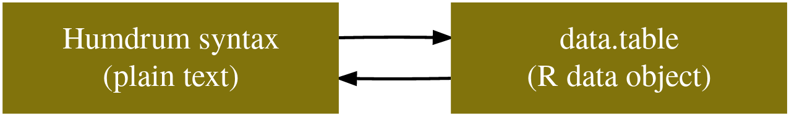

# HumdrumR Data Fields

Welcome to “Humdrum$_{\mathbb{R}}$ data fields”! This article explains
how humdrum$_{\mathbb{R}}$ encodes different pieces of musical data in
the “fields” of a R data.frame. Understanding data fields is essential
to making effective use of humdrum$_{\mathbb{R}}$.

This article, like all of our articles, closely parallels information in
humdrum$_{\mathbb{R}}$’s detailed code documentation, which can be found
in the
“[Reference](https://humdrumR.ccml.gtcmt.gatech.edu/reference/index.html#reading-and-writing "HumdrumR function reference, Reading and Writing")”
section of the
humdrum$_{\mathbb{R}}$[homepage](https://humdrumR.ccml.gtcmt.gatech.edu).
You can also find this information within R, once humdrum$_{\mathbb{R}}$
is loaded, using
[`?fields`](https://humdrumR.ccml.gtcmt.gatech.edu/reference/humTable.md)
or
[`?withinHumdrum`](https://humdrumR.ccml.gtcmt.gatech.edu/reference/withinHumdrum.md).

## The HumdrumR Data Model

Humdrum$_{\mathbb{R}}$ bridges with *data* world of
[humdrum](https://www.humdrum.org) with the *coding and analysis* world
of R. It does this by mapping between the [humdrum data
syntax](https://www.humdrum.org) and a R *data.frame*.



To fully understand any of this, you should start with at least a basic
understanding of the humdrum syntax! Read about the syntax at
[humdrum.org](https://www.humdrum.org) or check out [our
article](https://humdrumR.ccml.gtcmt.gatech.edu/articles/HumdrumSyntax.md "The Humdrum Syntax")
on the topic.

This article only covers how humdrum$_{\mathbb{R}}$ handles basic,
common humdrum syntax. The humdrum syntax includes a few more complex
structures—*spine paths* and *multi-stops* (a.k.a., sub-tokens)—which
are discussed in our [Complex humdrum
syntax](https://humdrumR.ccml.gtcmt.gatech.edu/articles/ComplexSyntax.md "Complex humdrum syntax article")
article.

### data.frames

Data.frames are the heart and soul of R. A data.frame is simply a
two-dimensional table of named columns. Each column is a vector of
values, all of which are the same length.

In humdrum$_{\mathbb{R}}$, every single token in a collection of
humdrum-syntax text files is given its own *row* in a data.frame, which
we call the “**humdrum table**.” For example, consider this simple,
humdrum-syntax file:

    >     !!!OTL: Example 1
    >     **kern                        **kern                        
    >     *M4/4                         *M4/4                         
    >     *C:                           *C:                           
    >     =                             =                             
    >     2G                            4g                            
    >     .                             4f                            
    >     2C                            2e                            
    >     ==                            ==                            
    >     *-                            *-
    >    NULL

This file contains nineteen individual tokens. To illustrate, here I’ll
print the same file, but with *each* token bracketed by `<` and `>`:

    >    <!!!OTL: Example 1>
    >    <**kern>                      <**kern>                      
    >    <*M4/4>                       <*M4/4>                       
    >    <*C:>                         <*C:>                         
    >    <=>                           <=>                           
    >    <2G>                          <4g>                          
    >    <.>                           <4f>                          
    >    <2C>                          <2e>                          
    >    <==>                          <==>                          
    >    <*->                          <*->

So what happens when humdrum$_{\mathbb{R}}$ reads this file? (This file
is bundled with humdrum$_{\mathbb{R}}$ in the `"humdrumRroot/examples"`
directory; See the [Getting
started](https://humdrumR.ccml.gtcmt.gatech.edu/articles/GettingStarted.md "Getting started with humdrumR article")
article for an explanation.)

``` r
example1 <- readHumdrum(humdrumRroot, 'examples/BasicExample.krn')

example1
>    ############ vvv BasicExample.krn vvv ############
>       1:  !!!OTL: Example 1
>       2:                **kern              **kern
>       3:                 *M4/4               *M4/4
>       4:                   *C:                 *C:
>       5:                     =                   =
>       6:                    2G                  4g
>       7:                     .                  4f
>       8:                    2C                  2e
>       9:                    ==                  ==
>      10:                    *-                  *-
>    ############ ^^^ BasicExample.krn ^^^ ############
>    
>       Data fields: 
>               *Token :: character
```

We see the same thing we saw earlier, when we were reading real humdrum
data from the `"HumdrumData"` folder. But what’s under the hood? We can
tell humdrum$_{\mathbb{R}}$ that we’d like to see the underlying
**humdrum table** by explicitly printing the data, and setting
`view = "table"`. Compare the difference between these two commands:

``` r
example1 |> print(view = "humdrum")
>    ############ vvv BasicExample.krn vvv ############
>       1:  !!!OTL: Example 1
>       2:                **kern              **kern
>       3:                 *M4/4               *M4/4
>       4:                   *C:                 *C:
>       5:                     =                   =
>       6:                    2G                  4g
>       7:                     .                  4f
>       8:                    2C                  2e
>       9:                    ==                  ==
>      10:                    *-                  *-
>    ############ ^^^ BasicExample.krn ^^^ ############
>    
>       Data fields: 
>               *Token :: character

example1 |> print(view = "table")
>      Piece           Spine           Record               Token
>    ################### vvv BasicExample.krn vvv ###################
>          1            <NA>                1   !!!OTL: Example 1
>          1               1                2              **kern
>          1               1                3               *M4/4
>          1               1                4                 *C:
>          1               1                5                   =
>          1               1                6                  2G
>          1               1                7                   .
>          1               1                8                  2C
>          1               1                9                  ==
>          1               1               10                  *-
>          1               2                2              **kern
>          1               2                3               *M4/4
>          1               2                4                 *C:
>          1               2                5                   =
>          1               2                6                  4g
>          1               2                7                  4f
>          1               2                8                  2e
>          1               2                9                  ==
>          1               2               10                  *-
>    ################### ^^^ BasicExample.krn ^^^ ###################
>      Piece           Spine           Record               Token
>    
>       Data fields: 
>               *Token :: character
```

When we use `view = "humdrum"`, we see the default
humdrum$_{\mathbb{R}}$ view of the data in humdrum syntax. However, with
`view = "table"`, we are showing the underling humdrum table. We can see
that there is one row for *each and every* token, with different columns
indicating which `File`, `Spine`, and `Record` each token comes from. In
humdrum$_{\mathbb{R}}$, we refer to the columns of the humdrum table as
**fields**.

------------------------------------------------------------------------

If you get tired of explicitly using
[`print()`](https://rdrr.io/r/base/print.html), you can change
`humdrumR`’s default print method using the
[`humdrumR()`](https://humdrumR.ccml.gtcmt.gatech.edu/reference/humdrumR.md)
*function*, the first argument of which is `view`.

``` r
humdrumR("data.frame")

example1
>      Piece           Spine           Record               Token
>    ################### vvv BasicExample.krn vvv ###################
>          1            <NA>                1   !!!OTL: Example 1
>          1               1                2              **kern
>          1               1                3               *M4/4
>          1               1                4                 *C:
>          1               1                5                   =
>          1               1                6                  2G
>          1               1                7                   .
>          1               1                8                  2C
>          1               1                9                  ==
>          1               1               10                  *-
>          1               2                2              **kern
>          1               2                3               *M4/4
>          1               2                4                 *C:
>          1               2                5                   =
>          1               2                6                  4g
>          1               2                7                  4f
>          1               2                8                  2e
>          1               2                9                  ==
>          1               2               10                  *-
>    ################### ^^^ BasicExample.krn ^^^ ###################
>      Piece           Spine           Record               Token
>    
>       Data fields: 
>               *Token :: character

humdrumR("humdrum")

example1
>    ############ vvv BasicExample.krn vvv ############
>       1:  !!!OTL: Example 1
>       2:                **kern              **kern
>       3:                 *M4/4               *M4/4
>       4:                   *C:                 *C:
>       5:                     =                   =
>       6:                    2G                  4g
>       7:                     .                  4f
>       8:                    2C                  2e
>       9:                    ==                  ==
>      10:                    *-                  *-
>    ############ ^^^ BasicExample.krn ^^^ ############
>    
>       Data fields: 
>               *Token :: character
```

### HumdrumR fields

Let’s take a look at our humdrum table again. To avoid typing
`print(view = "table")` over an over, let’s set the default `view`
option to `table` (see the previous paragraph).

``` r
humdrumR(view = "table")

example1 
>      Piece           Spine           Record               Token
>    ################### vvv BasicExample.krn vvv ###################
>          1            <NA>                1   !!!OTL: Example 1
>          1               1                2              **kern
>          1               1                3               *M4/4
>          1               1                4                 *C:
>          1               1                5                   =
>          1               1                6                  2G
>          1               1                7                   .
>          1               1                8                  2C
>          1               1                9                  ==
>          1               1               10                  *-
>          1               2                2              **kern
>          1               2                3               *M4/4
>          1               2                4                 *C:
>          1               2                5                   =
>          1               2                6                  4g
>          1               2                7                  4f
>          1               2                8                  2e
>          1               2                9                  ==
>          1               2               10                  *-
>    ################### ^^^ BasicExample.krn ^^^ ###################
>      Piece           Spine           Record               Token
>    
>       Data fields: 
>               *Token :: character
```

We see four fields in the table: `Piece`, `Spine`, `Record`, and
`Token`.

- `Token` is the primary data field in all humdrum$_{\mathbb{R}}$ data,
  containing the actual data tokens that originated in the humdrum data
  files your read. You’ll see lots and lots of references to `Token`
  throughout these articles, and in the
  humdrum$_{\mathbb{R}}$[documentation](https://humdrumr.ccml.gtcmt.gatech.edu/reference/index.html "HumdrumR function reference")!
- `Piece`, `Spine`, and `Record` are “structural fields,” indicating
  where each data token is located in the humdrum syntax.

These four fields are just the tip of the iceberg!
Humdrum$_{\mathbb{R}}$ datasets will generally have many more fields—you
can see them all listed by using
[`fields()`](https://humdrumR.ccml.gtcmt.gatech.edu/reference/humTable.md)
commands:

``` r
fields(example1)
>                 Name     Class           Type Selected GroupedBy Complement
>               <char>    <char>         <char>    <int>    <lgcl>     <lgcl>
>     1:         Token character           Data        1     FALSE      FALSE
>     2:           Bar   integer         Formal        0     FALSE      FALSE
>     3:      BarLabel character         Formal        0     FALSE      FALSE
>     4:     DoubleBar   integer         Formal        0     FALSE      FALSE
>     5:     Exclusive character Interpretation        0     FALSE      FALSE
>     6:           Key character Interpretation        0     FALSE      FALSE
>     7:        Tandem character Interpretation        0     FALSE      FALSE
>     8: TimeSignature character Interpretation        0     FALSE      FALSE
>     9:           OTL character      Reference        0     FALSE      FALSE
>    10:    DataRecord   integer      Structure        0     FALSE      FALSE
>    11:          File   integer      Structure        0     FALSE      FALSE
>    12:      Filename character      Structure        0     FALSE      FALSE
>    13:      Filepath character      Structure        0     FALSE      FALSE
>    14:        Global   logical      Structure        0     FALSE      FALSE
>    15:         Label character      Structure        0     FALSE      FALSE
>    16:    ParentPath   integer      Structure        0     FALSE      FALSE
>    17:          Path   integer      Structure        0     FALSE      FALSE
>    18:         Piece   integer      Structure        0     FALSE      FALSE
>    19:        Record   integer      Structure        0     FALSE      FALSE
>    20:         Spine   integer      Structure        0     FALSE      FALSE
>    21:          Stop   integer      Structure        0     FALSE      FALSE
>    22:          Type character      Structure        0     FALSE      FALSE
>                 Name     Class           Type Selected GroupedBy Complement
>               <char>    <char>         <char>    <int>    <lgcl>     <lgcl>
```

We see that there are six fields (columns), and that they are divided
into five types of fields:

- Data fields
- Structure fields
- Interpretation fields
- Form fields
- Reference fields

If you want a detailed explanation of what all these fields are, read
the [humdrum table
documentation](https://humdrumR.ccml.gtcmt.gatech.edu/reference/humTable.md "Humdrum table documentation"),
which you can always get by calling
[`?humTable`](https://humdrumR.ccml.gtcmt.gatech.edu/reference/humTable.md).

#### Selecting fields

What if we want to see some of these other fields? We can use the
[`select()`](https://humdrumR.ccml.gtcmt.gatech.edu/reference/selectedFields.md)
command to pick which fields we view:

``` r
example1 |> select(Token, Spine, Key, Bar)
>      Piece     Spine     Record               Token     Key      Bar
>    ###################### vvv BasicExample.krn vvv ######################
>          1      <NA>          1   !!!OTL: Example 1       .     <NA>
>          1         1          2              **kern       .        0
>          1         1          3               *M4/4       .        0
>          1         1          4                 *C:      C:        0
>          1         1          5                   =      C:        1
>          1         1          6                  2G      C:        1
>          1         1          7                   .      C:        1
>          1         1          8                  2C      C:        1
>          1         1          9                  ==      C:        2
>          1         1         10                  *-      C:        2
>          1         2          2              **kern       .        0
>          1         2          3               *M4/4       .        0
>          1         2          4                 *C:      C:        0
>          1         2          5                   =      C:        1
>          1         2          6                  4g      C:        1
>          1         2          7                  4f      C:        1
>          1         2          8                  2e      C:        1
>          1         2          9                  ==      C:        2
>          1         2         10                  *-      C:        2
>    ###################### ^^^ BasicExample.krn ^^^ ######################
>      Piece     Spine     Record               Token     Key      Bar
>    
>       Data fields: 
>               *Token :: character
>    
>       Formal fields: 
>               *Bar   :: integer
>    
>       Interpretation fields: 
>               *Key   :: character
>    
>       Structure fields: 
>               *Spine :: integer
```

We can also see all fields of a particular type, by specifying one of
the types that the
[`fields()`](https://humdrumR.ccml.gtcmt.gatech.edu/reference/humTable.md)
function showed us: for example, `"Data"`, `"Structure"`, or
`"Reference"`.

``` r
example1 |> select('Structure')
>      Piece          Filename  Spine  Path  Record  Stop  DataRecord  File    ***
>    ###################### vvv BasicExample.krn vvv ######################
>          1  BasicExample.krn   <NA>  <NA>       1  <NA>        <NA>     1    ***
>          1  BasicExample.krn      1     0       2     1        <NA>     1    ***
>          1  BasicExample.krn      1     0       3     1        <NA>     1    ***
>          1  BasicExample.krn      1     0       4     1        <NA>     1    ***
>          1  BasicExample.krn      1     0       5     1        <NA>     1    ***
>          1  BasicExample.krn      1     0       6     1           1     1    ***
>          1  BasicExample.krn      1     0       7     1           2     1    ***
>          1  BasicExample.krn      1     0       8     1           3     1    ***
>          1  BasicExample.krn      1     0       9     1        <NA>     1    ***
>          1  BasicExample.krn      1     0      10     1        <NA>     1    ***
>          1  BasicExample.krn      2     0       2     1        <NA>     1    ***
>          1  BasicExample.krn      2     0       3     1        <NA>     1    ***
>          1  BasicExample.krn      2     0       4     1        <NA>     1    ***
>          1  BasicExample.krn      2     0       5     1        <NA>     1    ***
>          1  BasicExample.krn      2     0       6     1           1     1    ***
>          1  BasicExample.krn      2     0       7     1           2     1    ***
>          1  BasicExample.krn      2     0       8     1           3     1    ***
>          1  BasicExample.krn      2     0       9     1        <NA>     1    ***
>          1  BasicExample.krn      2     0      10     1        <NA>     1    ***
>    ###################### ^^^ BasicExample.krn ^^^ ######################
>      Piece          Filename  Spine  Path  Record  Stop  DataRecord  File    ***
>                 (***five spines/paths not displayed due to screen size***)
>    
>       Data fields: 
>                Token      :: character
>    
>       Structure fields: 
>               *DataRecord :: integer
>               *File       :: integer
>               *Filename   :: character
>               *Filepath   :: character
>               *Global     :: logical
>               *Label      :: character
>               *ParentPath :: integer
>               *Path       :: integer
>               *Piece      :: integer
>               *Record     :: integer
>               *Spine      :: integer
>               *Stop       :: integer
>               *Type       :: character
```

We can also use [tidyverse
select](https://dplyr.tidyverse.org/reference/select.html "dyplr select article")
shortcuts, for example, `everything()`:

``` r
example1 |> select(everything())
>      Piece          Filename  Spine  Path  Record  Stop    ***
>    ################ vvv BasicExample.krn vvv ################
>          1  BasicExample.krn   <NA>  <NA>       1  <NA>    ***
>          1  BasicExample.krn      1     0       2     1    ***
>          1  BasicExample.krn      1     0       3     1    ***
>          1  BasicExample.krn      1     0       4     1    ***
>          1  BasicExample.krn      1     0       5     1    ***
>          1  BasicExample.krn      1     0       6     1    ***
>          1  BasicExample.krn      1     0       7     1    ***
>          1  BasicExample.krn      1     0       8     1    ***
>          1  BasicExample.krn      1     0       9     1    ***
>          1  BasicExample.krn      1     0      10     1    ***
>          1  BasicExample.krn      2     0       2     1    ***
>          1  BasicExample.krn      2     0       3     1    ***
>          1  BasicExample.krn      2     0       4     1    ***
>          1  BasicExample.krn      2     0       5     1    ***
>          1  BasicExample.krn      2     0       6     1    ***
>          1  BasicExample.krn      2     0       7     1    ***
>          1  BasicExample.krn      2     0       8     1    ***
>          1  BasicExample.krn      2     0       9     1    ***
>          1  BasicExample.krn      2     0      10     1    ***
>    ################ ^^^ BasicExample.krn ^^^ ################
>      Piece          Filename  Spine  Path  Record  Stop    ***
>                                                    (***sixteen
>              spines/paths not displayed due to screen size***)
>    
>       Data fields: 
>               *Token         :: character
>    
>       Formal fields: 
>               *Bar           :: integer
>               *BarLabel      :: character
>               *DoubleBar     :: integer
>    
>       Interpretation fields: 
>               *Exclusive     :: character
>               *Key           :: character
>               *Tandem        :: character
>               *TimeSignature :: character
>    
>       Reference fields: 
>               *OTL           :: character
>    
>       Structure fields: 
>               *DataRecord    :: integer
>               *File          :: integer
>               *Filename      :: character
>               *Filepath      :: character
>               *Global        :: logical
>               *Label         :: character
>               *ParentPath    :: integer
>               *Path          :: integer
>               *Piece         :: integer
>               *Record        :: integer
>               *Spine         :: integer
>               *Stop          :: integer
>               *Type          :: character
```

If you call
[`select()`](https://humdrumR.ccml.gtcmt.gatech.edu/reference/selectedFields.md)
with no arguments, the `Token` field will be selected. The `Token` field
is always the starting point of humdrum$_{\mathbb{R}}$ analysis, so it
is helpful to be able to “reset” by going back to `Token`.

------------------------------------------------------------------------

We can also view all of our fields in the default, humdrum view.

``` r
humdrumR(view = "humdrum")

example1 |> select(Token, Key)
>    ############ vvv BasicExample.krn vvv ############
>       1:  !!!OTL: Example 1
>       2:                **kern              **kern
>       3:                 *M4/4               *M4/4
>       4:                 *C:C:               *C:C:
>       5:                     =                   =
>       6:                  2GC:                4gC:
>       7:                    C:                4fC:
>       8:                  2CC:                2eC:
>       9:                  ==C:                ==C:
>      10:                  *-C:                *-C:
>    ############ ^^^ BasicExample.krn ^^^ ############
>    
>       Data fields: 
>               *Token :: character
>    
>       Interpretation fields: 
>               *Key   :: character
```

In the humdrum view, all the selected fields are pasted together (from
left to right). Don’t worry, the fields are still separate in the
humdrum table, they are just printed this way! Viewing multiple fields
in humdrum syntax view can be quite helpful for a small number of
fields, but not so much if you are looking at more than 2–3 fields. If
you want to look at lots of fields at once set
`humdrumR(view = "table")`.

#### Accessing fields

Sometimes, we might want to just pull fields out of the
humdrum$_{\mathbb{R}}$ data table, turning them into “plain” R data. The
best way to do this is with the
[`pull()`](https://humdrumR.ccml.gtcmt.gatech.edu/reference/pullHumdrum.md)
function.

``` r
example1 |> pull(Token)
>    [1] "2G" "."  "2C" "4g" "4f" "2e"

example1 |> pull(Key)
>    [1] "C:" "C:" "C:" "C:" "C:" "C:"
```

We can also pull fields using the `$` operator:

``` r
example1$Token
>    [1] "2G" "."  "2C" "4g" "4f" "2e"

example1$Key
>    [1] "C:" "C:" "C:" "C:" "C:" "C:"
```

------------------------------------------------------------------------

If you want to pull more than once field, use
[`pull_data.frame()`](https://humdrumR.ccml.gtcmt.gatech.edu/reference/pullHumdrum.md):

``` r
example1 |> pull_data.frame(Token, Key)
>      Token Key
>    1    2G  C:
>    2     .  C:
>    3    2C  C:
>    4    4g  C:
>    5    4f  C:
>    6    2e  C:
```

You get a “normal” R data.frame! (There is also
[`pull_tibble()`](https://humdrumR.ccml.gtcmt.gatech.edu/reference/pullHumdrum.md)
and
[`pull_data.table()`](https://humdrumR.ccml.gtcmt.gatech.edu/reference/pullHumdrum.md),
if you prefer those packages.) You could even pull the entire humdrum
table if you really want to work in “normal” R:

``` r
example1 |> pull_data.frame(everything())
>      Token Bar BarLabel DoubleBar Exclusive Key  Tandem TimeSignature       OTL
>    1    2G   1                  0      kern  C: C:,M4/4          M4/4 Example 1
>    2     .   1                  0      kern  C: C:,M4/4          M4/4 Example 1
>    3    2C   1                  0      kern  C: C:,M4/4          M4/4 Example 1
>    4    4g   1                  0      kern  C: C:,M4/4          M4/4 Example 1
>    5    4f   1                  0      kern  C: C:,M4/4          M4/4 Example 1
>    6    2e   1                  0      kern  C: C:,M4/4          M4/4 Example 1
>      DataRecord File         Filename
>    1          1    1 BasicExample.krn
>    2          2    1 BasicExample.krn
>    3          3    1 BasicExample.krn
>    4          1    1 BasicExample.krn
>    5          2    1 BasicExample.krn
>    6          3    1 BasicExample.krn
>                                                                                     Filepath
>    1 /home/nat/.tmp/RtmpGCgWwF/temp_libpath2869ab26c00287/humdrumR/examples/BasicExample.krn
>    2 /home/nat/.tmp/RtmpGCgWwF/temp_libpath2869ab26c00287/humdrumR/examples/BasicExample.krn
>    3 /home/nat/.tmp/RtmpGCgWwF/temp_libpath2869ab26c00287/humdrumR/examples/BasicExample.krn
>    4 /home/nat/.tmp/RtmpGCgWwF/temp_libpath2869ab26c00287/humdrumR/examples/BasicExample.krn
>    5 /home/nat/.tmp/RtmpGCgWwF/temp_libpath2869ab26c00287/humdrumR/examples/BasicExample.krn
>    6 /home/nat/.tmp/RtmpGCgWwF/temp_libpath2869ab26c00287/humdrumR/examples/BasicExample.krn
>      Global Label ParentPath Path Piece Record Spine Stop Type
>    1  FALSE    _1          0    0     1      6     1    1    D
>    2  FALSE    _1          0    0     1      7     1    1    D
>    3  FALSE    _1          0    0     1      8     1    1    D
>    4  FALSE    _1          0    0     1      6     2    1    D
>    5  FALSE    _1          0    0     1      7     2    1    D
>    6  FALSE    _1          0    0     1      8     2    1    D
```

## Working with Fields

So we have a bunch of “fields”—how to we work with them? One option is
to “pull” the fields we want out—as explained above in the [accessing
fields](https://humdrumR.ccml.gtcmt.gatech.edu/articles/DataFields.html#accessing-fields "Getting started with humdrumR article; accessing fields section")
sections above—and then work with them like any normal R data
structures. However, humdrum$_{\mathbb{R}}$ has a number of useful
features that only available when we keep our data wrapped up in the
`humdrumR` data object. Instead, we can access and manipulate our fields
directly within the humdrum table.

In the following sections, we’ll use our `chorales` data again, as we
did in our [Getting started with
humdrumR](https://humdrumR.ccml.gtcmt.gatech.edu/articles/GettingStarted.md "Getting started with humdrumR article")
article.

``` r
readHumdrum(humdrumRroot, 'HumdrumData/BachChorales/chor0') -> chorales
```

#### Humdrum style

In our [quick
start](https://humdrumR.ccml.gtcmt.gatech.edu/articles/GettingStarted.html#quick-start "Getting started with humdrumR article"),
we showed you the simplest and most intuitive way to manipulate
humdrum$_{\mathbb{R}}$ data: simply pipe data directly to any
humdrum$_{\mathbb{R}}$ function.

``` r
chorales |> 
  pitch(simple = TRUE) 
```

```
>    ######################## vvv chor001.krn vvv #########################
>                1:  !!!COM: Bach, Johann Sebastian
>                2:  !!!CDT: 1685/02/21/-1750/07/28/
>                3:  !!!OTL@@DE: Aus meines Herzens Grunde
>                4:  !!!OTL@EN:      From the Depths of My Heart
>                5:  !!!SCT: BWV 269
>                6:  !!!PC#: 1
>                7:  !!!AGN: chorale
>                8:          **pitch        **pitch        **pitch        **pitch
>                9:                .              .              .              .
>               10:                .              .              .              .
>               11:                .              .              .              .
>               12:        *>[A,A,B]      *>[A,A,B]      *>[A,A,B]      *>[A,A,B]
>               13:     *>norep[A,B]   *>norep[A,B]   *>norep[A,B]   *>norep[A,B]
>               14:              *>A            *>A            *>A            *>A
>               15:          *clefF4       *clefGv2        *clefG2        *clefG2
>               16:           *k[f#]         *k[f#]         *k[f#]         *k[f#]
>               17:              *G:            *G:            *G:            *G:
>               18:                .              .              .              .
>               19:                .              .              .              .
>               20:                G              B              D              G
>               21:               =1             =1             =1             =1
>               22:                G              B              D              G
>               23:                E              C              E              .
>               24:                .              B              .              .
>               25:               F#              A              D              D
>               26:               =2             =2             =2             =2
>               27:                G              G              D              B
>               28:                D             F#              .              .
>               29:                .              .              .              A
>               30:                E              G              B              G
>    31-133::::::::::::::::::::::::::::::::::::::::::::::::::::::::::::::::
>    ######################## ^^^ chor001.krn ^^^ #########################
>    
>           (eight more pieces...)
>    
>    ######################## vvv chor010.krn vvv #########################
>      1-70::::::::::::::::::::::::::::::::::::::::::::::::::::::::::::::::
>               71:                D             F#              D              B
>               72:                .              G              .              .
>               73:                D              .              C              A
>               74:                .             F#              .              .
>               75:                G              G              B              G
>               76:              =11            =11            =11            =11
>               77:                C              G              E              G
>               78:                A              A              E              C
>               79:                E             G#              E              B
>               80:                .              .              D              .
>               81:              =12            =12            =12            =12
>               82:                F              A              C              A
>               83:                C              G              C              E
>               84:               Bb              G              D              G
>               85:                A              A              .              F
>               86:              =13            =13            =13            =13
>               87:               G#              B              D              E
>               88:                A              A              C              .
>               89:                E             G#              B              .
>               90:               ==             ==             ==             ==
>               91:               *-             *-             *-             *-
>               92:  !!!hum2abc: -Q ''
>               93:  !!!title: @{PC#}. @{OTL@@DE}
>               94:  !!!YOR1: 371 vierstimmige Choralges&auml;nge von Johann Sebastian B***
>               95:  !!!YOR2: 4th ed. by Alfred D&ouml;rffel (Leipzig: Breitkopf und H&a***
>               96:  !!!YOR2: c.1875). 178 pp. Plate "V.A.10".  reprint: J.S. Bach, 371 ***
>               97:  !!!YOR4: Chorales (New York: Associated Music Publishers, Inc., c.1***
>               98:  !!!SMS: B&H, 4th ed, Alfred D&ouml;rffel, c.1875, plate V.A.10
>               99:  !!!EED:  Craig Stuart Sapp
>              100:  !!!EEV:  2009/05/22
>    ######################## ^^^ chor010.krn ^^^ #########################
>                  (***four global comments truncated due to screen size***)
>    
>       humdrumR corpus of ten pieces.
>    
>       Data fields: 
>               *Pitch :: character (**pitch tokens)
>                Token :: character
```

We call this “humdrum style,” because it looks a lot like the way the
original [humdrum toolkit](https://www.humdrum.org "Humdrum main page")
works.

------------------------------------------------------------------------

As we learned in the previous example, there are a bunch of fields in
our `chorales` object:

``` r
fields(chorales)
```

```
>                   Name     Class           Type Selected GroupedBy Complement
>                 <char>    <char>         <char>    <int>    <lgcl>     <lgcl>
>     1:           Token character           Data        1     FALSE      FALSE
>     2:             Bar   integer         Formal        0     FALSE      FALSE
>     3:        BarLabel character         Formal        0     FALSE      FALSE
>     4:       DoubleBar   integer         Formal        0     FALSE      FALSE
>     5:          Formal character         Formal        0     FALSE      FALSE
>     6:             BPM character Interpretation        0     FALSE      FALSE
>     7:            Clef character Interpretation        0     FALSE      FALSE
>     8:       Exclusive character Interpretation        0     FALSE      FALSE
>     9:      Instrument character Interpretation        0     FALSE      FALSE
>    10: InstrumentClass character Interpretation        0     FALSE      FALSE
>    11:             Key character Interpretation        0     FALSE      FALSE
>    12:    KeySignature character Interpretation        0     FALSE      FALSE
>    13:     Mensuration character Interpretation        0     FALSE      FALSE
>    14:          Tandem character Interpretation        0     FALSE      FALSE
>    15:   TimeSignature character Interpretation        0     FALSE      FALSE
>    16:             AGN character      Reference        0     FALSE      FALSE
>    17:             CDT character      Reference        0     FALSE      FALSE
>    18:             COM character      Reference        0     FALSE      FALSE
>    19:             EED character      Reference        0     FALSE      FALSE
>    20:             EEV character      Reference        0     FALSE      FALSE
>    21:             OPR character      Reference        0     FALSE      FALSE
>    22:         OTL@@DE character      Reference        0     FALSE      FALSE
>    23:          OTL@EN character      Reference        0     FALSE      FALSE
>    24:             PC# character      Reference        0     FALSE      FALSE
>    25:             SCT character      Reference        0     FALSE      FALSE
>    26:             SMS character      Reference        0     FALSE      FALSE
>    27:             YOR character      Reference        0     FALSE      FALSE
>    28:         hum2abc character      Reference        0     FALSE      FALSE
>    29:           title character      Reference        0     FALSE      FALSE
>    30:      DataRecord   integer      Structure        0     FALSE      FALSE
>    31:            File   integer      Structure        0     FALSE      FALSE
>    32:        Filename character      Structure        0     FALSE      FALSE
>    33:        Filepath character      Structure        0     FALSE      FALSE
>    34:          Global   logical      Structure        0     FALSE      FALSE
>    35:           Label character      Structure        0     FALSE      FALSE
>    36:      ParentPath   integer      Structure        0     FALSE      FALSE
>    37:            Path   integer      Structure        0     FALSE      FALSE
>    38:           Piece   integer      Structure        0     FALSE      FALSE
>    39:          Record   integer      Structure        0     FALSE      FALSE
>    40:           Spine   integer      Structure        0     FALSE      FALSE
>    41:            Stop   integer      Structure        0     FALSE      FALSE
>    42:            Type character      Structure        0     FALSE      FALSE
>                   Name     Class           Type Selected GroupedBy Complement
>                 <char>    <char>         <char>    <int>    <lgcl>     <lgcl>
```

So when we write something like `chorales |> pitch()`, how does the
[`pitch()`](https://humdrumR.ccml.gtcmt.gatech.edu/reference/pitch.md)
function know which field to work on? It is applied to the first
**selected** field, which we learned about
[above](https://humdrumR.ccml.gtcmt.gatech.edu/articles/DataFields.html#selecting-fields "Getting started with humdrumR article; selecting fields section").
By default, this is the `Token` field, which is what we want!

##### New fields

Notice that, when we run `chorales |> pitch()`, the printout tells us
there are two data fields: the original `Token` and a *new* `Pitch`
field! That new `Pitch` field can be view/accessed/manipulated just like
any other field! Any new field is automatically selected, so you can
continue the pipe:

``` r
chorales |> 
  pitch(simple = TRUE) |>
  count()
>    humdrumR count distribution 
>    Pitch    n
>        C  232
>       C#  115
>       Db   35
>        D  253
>       D#   37
>       Eb   34
>        E  334
>       E#    8
>        F  121
>       F#  182
>       Gb    1
>        G  237
>       G#  109
>       Ab   45
>        A  318
>       A#   11
>       Bb   60
>        B  297
>    Pitch    n
>    humdrumR count distribution
```

The
[`pitch()`](https://humdrumR.ccml.gtcmt.gatech.edu/reference/pitch.md)
function creates a new `Pitch` field, and selects it; the
[`count()`](https://humdrumR.ccml.gtcmt.gatech.edu/reference/count.md)
function is then applied to the `Pitch` field!

------------------------------------------------------------------------

When a new field is created, it can immediately by piped to a subsequent
command (as we just saw) but it isn’t actually *saved* in or data object
unless we explicitly assign the result to a variable. In many cases
we’ll want to assign back to the same variable, like so:

``` r
chorales |> 
  pitch(simple = TRUE) -> chorales
```

We can now, select, access, or manipulate the new `Pitch` field:

``` r
chorales$Pitch
```

```
>    **pitch (character)
>       [1] G  G  E  F# G  D  E  C  B  A  G  D  G  F# G  A  B  C  D  G  G  G  A  B 
>      [25] B  A  G  D  E  E  D  C  B  C  D  G  A  B  G  C  G  F# G  A  B  G  D  E 
>      [49] D  C  B  A  G  D  G  G  F# E  E  D  C  D  G  B  B  C  B  A  G  F# G  C 
>      [73] B  C  D  D  D  A  B  C  D  E  D  C  B  D  D  C  B  A  B  C  D  D  D  B 
>      [97] G  B  E  D  D  D  C  D  D  C  B  C  D  D  C  B  C  D  D  D  D  E  E  D 
>     [121] C  B  D  D  E  D  D  B  E  D  E  F# G  F# G  D  E  F# G  F# D  G  G  F#
>     [145] E  F# G  G  A  G  F# G  F# E  E  F# G  A  A  G  F# G  F  E  G  A  G  F#
>     [169] G  F# F# E  E  F# G  F# G  A  G  F# G  F# D  G  G  D  B  A  G  G  A  B 
>     [193] A  B  D  C  B  A  G  B  B  C  D  D  C  B  A  G  B  C  D  C  B  G  B  D 
>     [217] C  B  A  G  A  B  A  B  D  C  B  A  G  A  G# F# C# D  D# E  B  E  E  A 
>     [241] B  C# B  A  B  B  E  C# F# G# A  E  C# A  D  C# D  E  C# B  C# D  G  F#
>     [265] B  C# F# E  D  C# B  A  B  C# D  E  B  F# G# A  G# E  A  A  G# F# E  D 
>     [289] E  A  C# C# C# B  A  G# F# B  A  G# E  E  D# C# B  A  G# G# A  B  C# D 
>     [313] E  E  D  E  E  E  F# B  A# B  C# D  G# A  G# F# E  E  D  C# D  E  F# G#
>     [337] F# F# E  D  C# B  C# D  E  D  C# F# B  E  D  C# E  F# E  F# F# E  D# B 
>     [361] G# A  G# F# E  E  D# B  C# B  A  A  G# A  G  F# G# A  G# A# B  A  G  F#
>     [385] E  F# F# E  D  C# D  E  F# G# A  E  B  A  G# F# E  F# G# A  A  G# E  A 
>     [409] A  A  A  B  G  F# E  B  C# B  A  G# F# G# F# E  E  D  C# B  A  A  B  C#
>     [433] B  C# D  C# B  A# B  E  A  B  C# D  E  D  C# B  D  C# B  E  D  C# B  A 
>     [457] B  C# B  A  E  A  B  C  B  A  G# A  E  B  C  D  E  F  E  D  E  A  F# G 
>     [481] F# E  B  A  G  F# E  D  C  B  E  F  C  D  E  A  B  C  D  E  A  A  G# A 
>     [505] G  F  E  D  C# D  D# E  E  E  D  E  D  C  B  C  D  E  F  E  E  D  C  D 
>     [529] G# A  G# C  A  G  A  B  B  B  A  B  C  F# E  D  C  D  E  E  E  D  C  B 
>     [553] C  C  B  A  A  Bb A  E  F# G# G# A  G# A  G# A  B  E  F# G# G# A  G# A 
>     [577] G  F  E  E  D  D  D# E  D# E  D# E  G  F# E  D# B  A  A  G# A  E  E  E 
>     [601] E  E  E  F  G  F# G# A  E  B  C  B  A  E  E  D  C  B  D  C  B  A  B  C 
>     [625] D  C  B  A  A  B  A  G  F# E  F# G  A  B  G  A  B  C  B  C  B  A  G# A 
>     [649] A  E  C  D  E  D  C  B  E  D# B  E  F# G# A  E  A  D# E  F# G# C# F# E 
>     [673] D# C# B  F# B  E  C# D# E  F# B  G# E  F# B  E  G# E  A  B  C# E# F# C#
>     [697] E  B  C# D# E  B  A# B  E  E  F# E  D# E  A  B  C# D  E  D  C# B  B  A 
>     [721] G# F# F# B  A# F# G# C# F# F# F# B  A# D# E  B  E  E  C# D  C# C# B  B 
>     [745] E  E  D# B  F# G# G# F# G# A  G# F# E  A  G# E  F# E  E  D# E  C# F# E 
>     [769] D# E  D# E  F# G# A# B  A# B  B  F# F# G# E  F# G# A  E  F# G# F# E# E 
>     [793] D# C# B  B  C# B  B  B  B  B  B  D  C# B  A  B  G# E  F# G# A# B  C# B 
>     [817] B  E  D# C# D# E  D# C# B  B  E  B  C# G# A  B  A  G# G# F# A  G# F# C#
>     [841] D# E  G  C  D  E  F# G  A  D  G  F# G  F# E  B  C  D  G  G  F# E  D  E 
>     [865] F# G  D  G  C  G  F  E  D  C  B  C  D  E  A  D  G  A  B  C  F# G# A  A 
>     [889] E  G# A  B  C  A  F  E  D  E  E  A  A  B  C# D  C# D  A  D  B  E  D  G 
>     [913] F# E  B  A  G  C  B  A  D  C  D  G  B  C  B  A  E  A  B  C  E  D  D  D 
>     [937] D  G  A  B  G  E  A  B  C  B  B  A  D  G  A  A  G  G  F# G  G  G  G  G 
>     [961] G  G  A  B  A  A  G  G  D  C  B  A  E  E  E  E  D  C  B  A  A  G# A  B 
>     [985] G# A  G# A  E  F# G  D  C  Bb A  A  G  F# F# G  D  D  E  D  E  D  C  D 
>    [1009] E  D  C  B  G  G  F# G  F# E  G  G  F# G  A  G  G  G  G  G  F# D  D  D 
>    [1033] E  F# E  E  D  D  C  B  E  D  E  F  E  F# G  F# G  A  F# D  G  G  A  B 
>    [1057] B  G# A  G# B  A  E  C  D  E  F  E  D  C  A  D  E  F  E  D  E  E  D  D 
>    [1081] C# D  D  C  B  A  G  F# G  G  F# G  G  G  G  F# D  D  E  D  C  B  C  D 
>    [1105] C  B  C  B  A  B  C  D  C  B  A  G  A  G  G  A  B  C  B  A  B  A  G  G 
>    [1129] A  B  C  D  E  B  C# D  B  C  D  E  D  C  B  C  B  E  E  E  A  D  C  B 
>    [1153] A  C  B  A  G  A  G  F  E  D  D  G  A  B  C  D  C  B  A  B  C  A  G  F 
>    [1177] F  E  Eb D  C  D  E  C  F  Bb A  G  F  A  C  F  A  B  C  D  F  A  G  F 
>    [1201] D  G  C  F  G  A  Bb C  F  A  C  C  C  D  G  C  C  Bb C  D  Bb C  C  C 
>    [1225] F  F  E  E  D  C  C  B  E  C  Bb C  D  C  Bb A  C  F  G  F  F  E  F  G 
>    [1249] E  F  F  F  E  F  E  F  A  A  G  G  C  Bb A  A  A  G  G  F  F  E  F  F 
>    [1273] E  C  F  A  G  A  Bb C  A  D  C  Bb A  G  A  C  D  E  F  E  D  C  A  Bb
>    [1297] A  G  G  F  A  F# C# D  D  C# D  E  A  A  E# C# F# E  D  C# D  E  A  A 
>    [1321] D  A  G# F# E# F# B  C# F# D# E  D  C# A  B  E  C# F# E  F# G# F# E  A 
>    [1345] A  D  C# B  B  A  G  F# E  F# G  F# B  E  A  G# F# B  A  G  C# D  A  D#
>    [1369] E  A  B  E  C# F# E  B  C# D  D# E  E# F# G# A  E  F# D  E  E  A  C# C#
>    [1393] C# A  G# A  G# A  C# C# B  A  E  E  F# E  C# C# D  E  E# F# G# C# D  C#
>    [1417] A  A  G# A  B  C# B  A  G# G# A  D  B  E  E  D  E  F# B  E  D  C# B  A#
>    [1441] B  G# A  A  B  B  B  A  G  F# A  F# B  C# B  A  G# G# A  B  B  A  G# D 
>    [1465] A  G# C# F# E  E  E  D  C# F# E  D  C# E  F# E  D  C# B  E  F# E  E  E 
>    [1489] F# G# E# F# G# A  G# E  E  F# G# A  B  A  G# F# E# C# F# E  E  E  D# B 
>    [1513] C# C# F# E  F# G# A  G  F# A  B  B  A  G  A  B  E  D# E  E  F# F# G  G 
>    [1537] F# E  D  E  F# E  E  D# B  C# C# D# E  D# E  F# G# A  E  G# A  B  A  G#
>    [1561] A  A  G# E  A  A  G# F# E  A  B  C# C# C# B  C# C# B  A  B  A  A  A  B 
>    [1585] C# B  C# A  G# F# B  B  A  G# A  F# E  E  A  A  B  B  C# B  C# A  A  D 
>    [1609] D  C# B  C# B  B  C# C# D  D  E  A  C# B  A  G# A  F# E  E  A  G# F# E 
>    [1633] B  C# B  C# D  C# B  A  G# A  B  C# B  A  F  Eb Db C  Bb C  F  F  F  Eb
>    [1657] Db C  Bb Ab Db Eb Ab Db C  Bb C  Db Bb C  F  F  G  A  F  Bb C  Db Bb Eb
>    [1681] F  G  Eb Ab Ab Db Eb F  Db Bb C  Db Bb Eb C  F  Bb Bb Ab G  F  Bb C  F 
>    [1705] F  G  Ab Bb C  D  Eb F  G  G  C  C  F  Eb Db C  Bb C  Db Eb Eb Ab Ab Db
>    [1729] Eb Db C  Bb C  Db Bb Eb F  Eb Db C  Db Eb C  F  E  F  G  Ab G  Ab Bb C 
>    [1753] C  F  F  Ab A  Bb C  Db C  Bb Ab Ab C  Bb Eb Eb F  Eb Db C  Db Db G  F 
>    [1777] Ab Db C  Bb Ab A  Bb C  A  Bb Bb Bb Eb Eb Eb Db Db F  F  Gb F  Eb Db C 
>    [1801] C  Bb C  Db C  Bb Ab C  C  C  C  C  B  C  G  A  A  Bb Eb Eb Db C  C  Db
>    [1825] Db F  F  Eb Eb G  G  F  F  C  F  C  C  C  C  F  F  F  E  F  F  G  E  F 
>    [1849] C  F  G  Ab Ab Ab F  G  Eb F  G  E  F  F  E  C  F  F  F  F  G  Ab Bb G 
>    [1873] Ab Ab F  F  Bb Bb Bb A  F  E  F  F  E  F  F  E  C  Ab Ab G  G  G  Ab G 
>    [1897] F  E  E  F  F  F  G  Ab Ab F  G  Eb Eb F  F  Bb Bb G  G  C  C  Ab G  Ab
>    [1921] Bb C  Bb Ab G  G  A  A  C  C  Bb Ab G  F  F  F  Ab Bb C  C  Bb Ab Ab Ab
>    [1945] Bb Bb Ab G  F  F  C  C  Db Db Bb Bb C  C  Ab Ab Db Db C  C  Bb G  Ab Bb
>    [1969] Ab G  G  F  F  F  Eb Eb D  D  C  C  C  C  Db C  Bb Ab Ab Ab Ab Ab Db Db
>    [1993] Bb Bb Eb Eb C  C  F  F  E  E  F  F  G  F# E  D  G  F# G  A  A  D  D# E 
>    [2017] F# G  C  C  B  A  G  D  D  G  D  D  C  B  A  D# E  E  A  E  F# G  G# A 
>    [2041] A# B  B  E  D  C  B  A  G  F# E  F# G  E  C# B  C# A  D  B  C  D  E  F#
>    [2065] G  C  D  G  B  B  C  C  D  B  A  A  A  A  A  B  A  G  A  B  C  D  D  D 
>    [2089] C  B  D  E  F# E  D  E  F# B  E  D  C  G  A  B  C  D  E  C  C# B  B  B 
>    [2113] D  D  G  G  A  B  E  D  E  C# D  D  D  C  C  B  B  A  G  G  F# E  F# C 
>    [2137] B  D  E  F# D  E  F# E  F# G  F# F# E  D  E  F# G  G  F# D  F# G  A  G#
>    [2161] A  G# A  A  G# E  E  D# E  E  E  F# G  F# F# G  A  G  A  G  A  B  B  A 
>    [2185] A  G  G  F# G  F# E  F# G  A  D  E  D  D  G  G  A  B  C# D  D  C# D  B 
>    [2209] C  B  A  B  A  G  A  A  B  C  C  B  A  B  A  B  B  B  C  D  E  E  D# E 
>    [2233] F# G  B  C  B  A  A  D  E  D  C  B  C  A  G  D  C  B  A  B  C  B  A  E 
>    [2257] E  A  G  F  E  F  C  D  E  C  B  A  G  F  E  D  E  A  A  E  D  C  B  C 
>    [2281] D  D  G  C  A  E  F  C  Bb A  G# A  E  G# A  D  E  D  E  D  C  B  E  E 
>    [2305] F  G  C  C  B  A  G# A  B  C  D  D  E  F  B  C  E  E  E  D  C  F# G  F#
>    [2329] G  G  A  G# A  G  G  A  B  A  G# E  E  G# A  G  F# E  F# G# G# A  B  C 
>    [2353] F  E  D  C  B  E  D  E  F# G  A  B  A  G# E  A  G  G  G  F  E  D  C  B 
>    [2377] E  E  E  D  C  C  D  D  C  B  B  E  B  C  B  A  G  A  B  B  C  D  C  B 
>    [2401] A  G  F  E  A  G  C  B  A  D  C  B  A  C  B  C  D  G  B  A  G  G  C  B 
>    [2425] A  E  G  F  E 
>    attr(,"visible")
>    [1] TRUE
```

``` r
chorales |> select(Pitch, Token, Key) |> print(view = "table")
```

```
>      Piece    Spine    Record    Pitch               Token    Key
>    ####################### vvv chor001.krn vvv ########################
>          1     <NA>         1        .!!!COM: Bach, J...nn      .
>          1     <NA>         2        .!!!CDT: 1685/02.../-      .
>          1     <NA>         3        .!!!OTL@@DE: Aus...in      .
>          1     <NA>         4        .!!!OTL@EN:     ...om      .
>          1     <NA>         5        .     !!!SCT: BWV 269      .
>          1     <NA>         6        .           !!!PC#: 1      .
>          1     <NA>         7        .     !!!AGN: chorale      .
>          1     <NA>       125        .   !!!hum2abc: -Q ''      .
>          1     <NA>       126        .!!!title: @{PC#...@{      .
>          1     <NA>       127        .!!!YOR1: 371 vi...ti      .
>          1     <NA>       128        .!!!YOR2: 4th ed...y       .
>          1     <NA>       129        .!!!YOR3: c.1875...17      .
>          1     <NA>       130        .!!!YOR4: Choral...(N      .
>          1     <NA>       131        .!!!SMS: B&H, 4t...d,      .
>          1     <NA>       132        .!!!EED:  Craig ...ar      .
>          1     <NA>       133        . !!!EEV:  2009/05/22      .
>          1        1         8        .              **kern      .
>          1        1         9        .              *ICvox      .
>          1        1        10        .              *Ibass      .
>          1        1        11        .             *I"Bass      .
>          1        1        12        .           *>[A,A,B]      .
>          1        1        13        .        *>norep[A,B]      .
>          1        1        14        .                 *>A      .
>          1        1        15        .             *clefF4      .
>          1        1        16        .              *k[f#]      .
>          1        1        17        .                 *G:     G:
>          1        1        18        .               *M3/4     G:
>          1        1        19        .              *MM100     G:
>          1        1        20        G                 4GG     G:
>          1        1        21        .                  =1     G:
>    ####################### ^^^ chor001.krn ^^^ ########################
>    
>           (eight more pieces...)
>    
>    ####################### vvv chor010.krn vvv ########################
>         10        4        62        C                 2cc     a:
>         10        4        63        .                  =9     a:
>         10        4        64        B                  4b     a:
>         10        4        65        C                 4cc     a:
>         10        4        66        .                   .     a:
>         10        4        67        D                 4dd     a:
>         10        4        68        .                   .     a:
>         10        4        69        G                  4g     a:
>         10        4        70        .                 =10     a:
>         10        4        71        B                  4b     a:
>         10        4        72        .                   .     a:
>         10        4        73        A                  4a     a:
>         10        4        74        .                   .     a:
>         10        4        75        G                 2g;     a:
>         10        4        76        .                 =11     a:
>         10        4        77        G                  2g     a:
>         10        4        78        C                 4cc     a:
>         10        4        79        B                  4b     a:
>         10        4        80        .                   .     a:
>         10        4        81        .                 =12     a:
>         10        4        82        A                  4a     a:
>         10        4        83        E                  4e     a:
>         10        4        84        G                  4g     a:
>         10        4        85        F                  4f     a:
>         10        4        86        .                 =13     a:
>         10        4        87        E                 1e;     a:
>         10        4        88        .                   .     a:
>         10        4        89        .                   .     a:
>         10        4        90        .                  ==     a:
>         10        4        91        .                  *-     a:
>    ####################### ^^^ chor010.krn ^^^ ########################
>      Piece    Spine    Record    Pitch               Token    Key
>    
>       humdrumR corpus of ten pieces.
>    
>       Data fields: 
>               *Pitch :: character (**pitch tokens)
>               *Token :: character
>    
>       Interpretation fields: 
>               *Key   :: character
```

``` r
chorales |> select(Pitch)
```

```
>    ######################## vvv chor001.krn vvv #########################
>                1:  !!!COM: Bach, Johann Sebastian
>                2:  !!!CDT: 1685/02/21/-1750/07/28/
>                3:  !!!OTL@@DE: Aus meines Herzens Grunde
>                4:  !!!OTL@EN:      From the Depths of My Heart
>                5:  !!!SCT: BWV 269
>                6:  !!!PC#: 1
>                7:  !!!AGN: chorale
>                8:          **pitch        **pitch        **pitch        **pitch
>                9:                .              .              .              .
>               10:                .              .              .              .
>               11:                .              .              .              .
>               12:        *>[A,A,B]      *>[A,A,B]      *>[A,A,B]      *>[A,A,B]
>               13:     *>norep[A,B]   *>norep[A,B]   *>norep[A,B]   *>norep[A,B]
>               14:              *>A            *>A            *>A            *>A
>               15:          *clefF4       *clefGv2        *clefG2        *clefG2
>               16:           *k[f#]         *k[f#]         *k[f#]         *k[f#]
>               17:              *G:            *G:            *G:            *G:
>               18:                .              .              .              .
>               19:                .              .              .              .
>               20:                G              B              D              G
>               21:               =1             =1             =1             =1
>               22:                G              B              D              G
>               23:                E              C              E              .
>               24:                .              B              .              .
>               25:               F#              A              D              D
>               26:               =2             =2             =2             =2
>               27:                G              G              D              B
>               28:                D             F#              .              .
>               29:                .              .              .              A
>               30:                E              G              B              G
>    31-133::::::::::::::::::::::::::::::::::::::::::::::::::::::::::::::::
>    ######################## ^^^ chor001.krn ^^^ #########################
>    
>           (eight more pieces...)
>    
>    ######################## vvv chor010.krn vvv #########################
>      1-70::::::::::::::::::::::::::::::::::::::::::::::::::::::::::::::::
>               71:                D             F#              D              B
>               72:                .              G              .              .
>               73:                D              .              C              A
>               74:                .             F#              .              .
>               75:                G              G              B              G
>               76:              =11            =11            =11            =11
>               77:                C              G              E              G
>               78:                A              A              E              C
>               79:                E             G#              E              B
>               80:                .              .              D              .
>               81:              =12            =12            =12            =12
>               82:                F              A              C              A
>               83:                C              G              C              E
>               84:               Bb              G              D              G
>               85:                A              A              .              F
>               86:              =13            =13            =13            =13
>               87:               G#              B              D              E
>               88:                A              A              C              .
>               89:                E             G#              B              .
>               90:               ==             ==             ==             ==
>               91:               *-             *-             *-             *-
>               92:  !!!hum2abc: -Q ''
>               93:  !!!title: @{PC#}. @{OTL@@DE}
>               94:  !!!YOR1: 371 vierstimmige Choralges&auml;nge von Johann Sebastian B***
>               95:  !!!YOR2: 4th ed. by Alfred D&ouml;rffel (Leipzig: Breitkopf und H&a***
>               96:  !!!YOR2: c.1875). 178 pp. Plate "V.A.10".  reprint: J.S. Bach, 371 ***
>               97:  !!!YOR4: Chorales (New York: Associated Music Publishers, Inc., c.1***
>               98:  !!!SMS: B&H, 4th ed, Alfred D&ouml;rffel, c.1875, plate V.A.10
>               99:  !!!EED:  Craig Stuart Sapp
>              100:  !!!EEV:  2009/05/22
>    ######################## ^^^ chor010.krn ^^^ #########################
>                  (***four global comments truncated due to screen size***)
>    
>       humdrumR corpus of ten pieces.
>    
>       Data fields: 
>               *Pitch :: character (**pitch tokens)
>                Token :: character
```

##### Another new field

So we added a `Pitch` field to our `chorales` data—what if we also
wanted a rhythm field? Be careful! After our last command, the `Pitch`
field is currently selected. If we apply a [rhythm
function](https://humdrumR.ccml.gtcmt.gatech.edu/articles/RhythmAndMeter.md "Rhythm and Meter in humdrumR article")
now, it won’t work because the `Pitch` field has no rhythm information
in it. We need to “reset” by selecting the `Token` field again.

``` r
chorales |>
  select() |>  # this will select Token!
  duration() -> chorales
  
chorales
```

```
>    ######################## vvv chor001.krn vvv #########################
>                1:  !!!COM: Bach, Johann Sebastian
>                2:  !!!CDT: 1685/02/21/-1750/07/28/
>                3:  !!!OTL@@DE: Aus meines Herzens Grunde
>                4:  !!!OTL@EN:      From the Depths of My Heart
>                5:  !!!SCT: BWV 269
>                6:  !!!PC#: 1
>                7:  !!!AGN: chorale
>                8:       **duration     **duration     **duration     **duration
>                9:                .              .              .              .
>               10:                .              .              .              .
>               11:                .              .              .              .
>               12:        *>[A,A,B]      *>[A,A,B]      *>[A,A,B]      *>[A,A,B]
>               13:     *>norep[A,B]   *>norep[A,B]   *>norep[A,B]   *>norep[A,B]
>               14:              *>A            *>A            *>A            *>A
>               15:                .              .              .              .
>               16:                .              .              .              .
>               17:                .              .              .              .
>               18:            *M3/4          *M3/4          *M3/4          *M3/4
>               19:           *MM100         *MM100         *MM100         *MM100
>               20:             0.25           0.25           0.25           0.25
>               21:               =1             =1             =1             =1
>               22:             0.25           0.25           0.25            0.5
>               23:             0.25          0.125           0.25              .
>               24:                .          0.125              .              .
>               25:             0.25           0.25           0.25           0.25
>               26:               =2             =2             =2             =2
>               27:             0.25           0.25            0.5          0.375
>               28:             0.25           0.25              .              .
>               29:                .              .              .          0.125
>               30:             0.25           0.25           0.25           0.25
>    31-133::::::::::::::::::::::::::::::::::::::::::::::::::::::::::::::::
>    ######################## ^^^ chor001.krn ^^^ #########################
>    
>           (eight more pieces...)
>    
>    ######################## vvv chor010.krn vvv #########################
>      1-70::::::::::::::::::::::::::::::::::::::::::::::::::::::::::::::::
>               71:             0.25          0.125           0.25           0.25
>               72:                .           0.25              .              .
>               73:             0.25              .           0.25           0.25
>               74:                .          0.125              .              .
>               75:              0.5            0.5            0.5            0.5
>               76:              =11            =11            =11            =11
>               77:              0.5            0.5            0.5            0.5
>               78:             0.25           0.25           0.25           0.25
>               79:             0.25           0.25          0.125           0.25
>               80:                .              .          0.125              .
>               81:              =12            =12            =12            =12
>               82:             0.25           0.25           0.25           0.25
>               83:             0.25           0.25           0.25           0.25
>               84:             0.25           0.25            0.5           0.25
>               85:             0.25           0.25              .           0.25
>               86:              =13            =13            =13            =13
>               87:             0.25           0.25           0.25              1
>               88:             0.25           0.25           0.25              .
>               89:              0.5            0.5            0.5              .
>               90:               ==             ==             ==             ==
>               91:               *-             *-             *-             *-
>               92:  !!!hum2abc: -Q ''
>               93:  !!!title: @{PC#}. @{OTL@@DE}
>               94:  !!!YOR1: 371 vierstimmige Choralges&auml;nge von Johann Sebastian B***
>               95:  !!!YOR2: 4th ed. by Alfred D&ouml;rffel (Leipzig: Breitkopf und H&a***
>               96:  !!!YOR2: c.1875). 178 pp. Plate "V.A.10".  reprint: J.S. Bach, 371 ***
>               97:  !!!YOR4: Chorales (New York: Associated Music Publishers, Inc., c.1***
>               98:  !!!SMS: B&H, 4th ed, Alfred D&ouml;rffel, c.1875, plate V.A.10
>               99:  !!!EED:  Craig Stuart Sapp
>              100:  !!!EEV:  2009/05/22
>    ######################## ^^^ chor010.krn ^^^ #########################
>                  (***four global comments truncated due to screen size***)
>    
>       humdrumR corpus of ten pieces.
>    
>       Data fields: 
>               *Duration :: numeric (**duration tokens)
>                Pitch    :: character (**pitch tokens)
>                Token    :: character
```

Once you start creating many fields, it can be easy to lose track of
which field is selected, which can lead to common errors!

##### Multiple fields

Once we get to have more than one field to work with, it gets harder to
use the “humdrum style.” Most humdrum$_{\mathbb{R}}$ function wills only
pipe the *first* selected field, so it doesn’t matter if you select
multiple fields. However, the
[`count()`](https://humdrumR.ccml.gtcmt.gatech.edu/reference/count.md)
function can accept multiple fields. Now that we’ve created a `Pitch`
*and* `Duration` fields, we can do stuff like:

``` r
chorales |> 
  select(Pitch, Duration) |>
  count() 
>    humdrumR count distribution 
>    Pitch  Duration                                            
>             0.0625  0.125  0.1875  0.25  0.375  0.5  0.75    1
>       NA         .      .       .     4      .    .     .    .
>        C         2     78       1   137      1   12     1    .
>       C#         2     21       .    77      1   12     2    .
>       Db         .     14       .    20      .    1     .    .
>        D         3     81       .   132      2   32     3    .
>       D#         1     10       .    23      .    3     .    .
>       Eb         .     13       .    19      1    1     .    .
>        E         3     92       .   200      2   33     3    1
>       E#         .      .       .     7      .    1     .    .
>        F         .     31       .    78      3    7     2    .
>       F#         1     69       .    89      1   21     1    .
>       Gb         .      .       .     1      .    .     .    .
>        G         .     74       .   142      5   14     2    .
>       G#         .     31       .    67      .   11     .    .
>       Ab         .     13       .    27      1    4     .    .
>        A         1     82       .   188      2   42     3    .
>       A#         .      4       .     7      .    .     .    .
>       Bb         2     20       .    34      2    2     .    .
>        B         2     73       .   185      7   26     4    .
>             0.0625  0.125  0.1875  0.25  0.375  0.5  0.75    1
>    Pitch  Duration                                            
>    humdrumR count distribution
```

#### Tidyverse style

The “humdrum style” from the previous section is a wonderful place to
start, but it has a few limitations. The main one is **it only works
with humdrum$_{\mathbb{R}}$ functions**. If you try to use base-R
function like `chorales |> mean()` or a tidyverse function like
`chorales |> map()`, you’ll get an error. What’s more, the humdrum style
is limited in the complexity of commands you can execute.

To get beyond these limitations, we can instead use functions (“verbs”)
from the tidyverse
[dplyr](https://dplyr.tidyverse.org/articles/dplyr.html "Dyplr Get Started page")
package: `mutate()`, `summarize()`, and `reframe()`. In a call to these
functions, you can freely and access and manipulate any field of your
humdrumR data. For example:

``` r
chorales |>
  select(Token) |>
  mutate(mint(Token))
>    ######################## vvv chor001.krn vvv #########################
>                1:  !!!COM: Bach, Johann Sebastian
>                2:  !!!CDT: 1685/02/21/-1750/07/28/
>                3:  !!!OTL@@DE: Aus meines Herzens Grunde
>                4:  !!!OTL@EN:      From the Depths of My Heart
>                5:  !!!SCT: BWV 269
>                6:  !!!PC#: 1
>                7:  !!!AGN: chorale
>                8:       **interval     **interval     **interval     **interval
>                9:                .              .              .              .
>               10:                .              .              .              .
>               11:                .              .              .              .
>               12:        *>[A,A,B]      *>[A,A,B]      *>[A,A,B]      *>[A,A,B]
>               13:     *>norep[A,B]   *>norep[A,B]   *>norep[A,B]   *>norep[A,B]
>               14:              *>A            *>A            *>A            *>A
>               15:          *clefF4       *clefGv2        *clefG2        *clefG2
>               16:           *k[f#]         *k[f#]         *k[f#]         *k[f#]
>               17:              *G:            *G:            *G:            *G:
>               18:                .              .              .              .
>               19:                .              .              .              .
>               20:             [GG]            [B]            [d]            [g]
>               21:               =1             =1             =1             =1
>               22:              +P8             P1             P1             P1
>               23:              -m3            +m2            +M2              .
>               24:                .            -m2              .              .
>               25:              +M2            -M2            -M2            +P5
>               26:               =2             =2             =2             =2
>               27:              +m2            -M2             P1            -m3
>               28:              -P4            -m2              .              .
>               29:                .              .              .            -M2
>               30:              +M2            +m2            -m3            -M2
>    31-133::::::::::::::::::::::::::::::::::::::::::::::::::::::::::::::::
>    ######################## ^^^ chor001.krn ^^^ #########################
>    
>           (eight more pieces...)
>    
>    ######################## vvv chor010.krn vvv #########################
>      1-70::::::::::::::::::::::::::::::::::::::::::::::::::::::::::::::::
>               71:              +M2            -d5            -M2            +M3
>               72:                .            +m2              .              .
>               73:               P1              .            -M2            -M2
>               74:                .            -m2              .              .
>               75:              -P5            +m2            -m2            -M2
>               76:              =11            =11            =11            =11
>               77:              +P4             P1            +P4             P1
>               78:              -m3            +M2             P1            +P4
>               79:              +P5            -m2             P1            -m2
>               80:                .              .            -M2              .
>               81:              =12            =12            =12            =12
>               82:              +m2            +m2            -M2            -M2
>               83:              -P4            -M2             P1            -P4
>               84:              -M2             P1            +M2            +m3
>               85:              -m2            +M2              .            -M2
>               86:              =13            =13            =13            =13
>               87:              -m2            +M2             P1            -m2
>               88:              +m2            -M2            -M2              .
>               89:              -P4            -m2            -m2              .
>               90:               ==             ==             ==             ==
>               91:               *-             *-             *-             *-
>               92:  !!!hum2abc: -Q ''
>               93:  !!!title: @{PC#}. @{OTL@@DE}
>               94:  !!!YOR1: 371 vierstimmige Choralges&auml;nge von Johann Sebastian B***
>               95:  !!!YOR2: 4th ed. by Alfred D&ouml;rffel (Leipzig: Breitkopf und H&a***
>               96:  !!!YOR2: c.1875). 178 pp. Plate "V.A.10".  reprint: J.S. Bach, 371 ***
>               97:  !!!YOR4: Chorales (New York: Associated Music Publishers, Inc., c.1***
>               98:  !!!SMS: B&H, 4th ed, Alfred D&ouml;rffel, c.1875, plate V.A.10
>               99:  !!!EED:  Craig Stuart Sapp
>              100:  !!!EEV:  2009/05/22
>    ######################## ^^^ chor010.krn ^^^ #########################
>                  (***four global comments truncated due to screen size***)
>    
>       humdrumR corpus of ten pieces.
>    
>       Data fields: 
>                Duration               :: numeric (**duration tokens)
>                Pitch                  :: character (**pitch tokens)
>                Token                  :: character
>               *humdrumR:::mint(Token) :: character (**interval tokens)
```

What happened here?

1.  The call `mint(Token)` is evaluated, using the `Token` field from
    “inside” the `chorales` data object.
2.  The resulting data ([melodic
    intervals](https://humdrumR.ccml.gtcmt.gatech.edu/reference/int.md "Mint documentation"))
    is put into a new field, which it calls `mint(Token)`.

Of course,
[`mint()`](https://humdrumR.ccml.gtcmt.gatech.edu/reference/int.md) is a
humdrum$_{\mathbb{R}}$ function, so we could do this simple command
without using `mutate()`, by calling `chorales |> mint()` in “humdrum
style.” However, by using `mutate()` we can do a few nifty things. For
one, we can execute more complex commands involving any of our fields:

``` r

chorales |>
  mutate(ifelse(Duration > (1/8), 
                mint(Token), 
                "NA"))
```

```
>    ######################## vvv chor001.krn vvv #########################
>                1:  !!!COM: Bach, Johann Sebastian
>                2:  !!!CDT: 1685/02/21/-1750/07/28/
>                3:  !!!OTL@@DE: Aus meines Herzens Grunde
>                4:  !!!OTL@EN:      From the Depths of My Heart
>                5:  !!!SCT: BWV 269
>                6:  !!!PC#: 1
>                7:  !!!AGN: chorale
>                8:           **kern         **kern         **kern         **kern
>                9:           *ICvox         *ICvox         *ICvox         *ICvox
>               10:           *Ibass        *Itenor         *Ialto        *Isoprn
>               11:          *I"Bass       *I"Tenor        *I"Alto     *I"Soprano
>               12:        *>[A,A,B]      *>[A,A,B]      *>[A,A,B]      *>[A,A,B]
>               13:     *>norep[A,B]   *>norep[A,B]   *>norep[A,B]   *>norep[A,B]
>               14:              *>A            *>A            *>A            *>A
>               15:          *clefF4       *clefGv2        *clefG2        *clefG2
>               16:           *k[f#]         *k[f#]         *k[f#]         *k[f#]
>               17:              *G:            *G:            *G:            *G:
>               18:            *M3/4          *M3/4          *M3/4          *M3/4
>               19:           *MM100         *MM100         *MM100         *MM100
>               20:             [GG]            [B]            [d]            [g]
>               21:               =1             =1             =1             =1
>               22:              +P8             P1             P1             P1
>               23:              -m3             NA            +M2              .
>               24:                .             NA              .              .
>               25:              +M2            -M2            -M2            +P5
>               26:               =2             =2             =2             =2
>               27:              +m2            -M2             P1            -m3
>               28:              -P4            -m2              .              .
>               29:                .              .              .             NA
>               30:              +M2            +m2            -m3            -M2
>    31-133::::::::::::::::::::::::::::::::::::::::::::::::::::::::::::::::
>    ######################## ^^^ chor001.krn ^^^ #########################
>    
>           (eight more pieces...)
>    
>    ######################## vvv chor010.krn vvv #########################
>      1-70::::::::::::::::::::::::::::::::::::::::::::::::::::::::::::::::
>               71:              +M2             NA            -M2            +M3
>               72:                .            +m2              .              .
>               73:               P1              .            -M2            -M2
>               74:                .             NA              .              .
>               75:              -P5            +m2            -m2            -M2
>               76:              =11            =11            =11            =11
>               77:              +P4             P1            +P4             P1
>               78:              -m3            +M2             P1            +P4
>               79:              +P5            -m2             NA            -m2
>               80:                .              .             NA              .
>               81:              =12            =12            =12            =12
>               82:              +m2            +m2            -M2            -M2
>               83:              -P4            -M2             P1            -P4
>               84:              -M2             P1            +M2            +m3
>               85:              -m2            +M2              .            -M2
>               86:              =13            =13            =13            =13
>               87:              -m2            +M2             P1            -m2
>               88:              +m2            -M2            -M2              .
>               89:              -P4            -m2            -m2              .
>               90:               ==             ==             ==             ==
>               91:               *-             *-             *-             *-
>               92:  !!!hum2abc: -Q ''
>               93:  !!!title: @{PC#}. @{OTL@@DE}
>               94:  !!!YOR1: 371 vierstimmige Choralges&auml;nge von Johann Sebastian B***
>               95:  !!!YOR2: 4th ed. by Alfred D&ouml;rffel (Leipzig: Breitkopf und H&a***
>               96:  !!!YOR2: c.1875). 178 pp. Plate "V.A.10".  reprint: J.S. Bach, 371 ***
>               97:  !!!YOR4: Chorales (New York: Associated Music Publishers, Inc., c.1***
>               98:  !!!SMS: B&H, 4th ed, Alfred D&ouml;rffel, c.1875, plate V.A.10
>               99:  !!!EED:  Craig Stuart Sapp
>              100:  !!!EEV:  2009/05/22
>    ######################## ^^^ chor010.krn ^^^ #########################
>                  (***four global comments truncated due to screen size***)
>    
>       humdrumR corpus of ten pieces.
>    
>       Data fields: 
>                Duration                                               :: numeric (**duration tokens)
>                Pitch                                                  :: character (**pitch tokens)
>                Token                                                  :: character
>               *ifelse(Duration > (1/8), humdrumR:::mint(Token), "NA") :: character
```

------------------------------------------------------------------------

We can use non-humdrum$_{\mathbb{R}}$ functions, like
[`gsub()`](https://rdrr.io/r/base/grep.html),
[`nchar()`](https://rdrr.io/r/base/nchar.html), or
[`mean()`](https://rdrr.io/r/base/mean.html):

``` r
chorales |>
  mutate(gsub('-', 'b', Token))
>    ######################## vvv chor001.krn vvv #########################
>                1:  !!!COM: Bach, Johann Sebastian
>                2:  !!!CDT: 1685/02/21/-1750/07/28/
>                3:  !!!OTL@@DE: Aus meines Herzens Grunde
>                4:  !!!OTL@EN:      From the Depths of My Heart
>                5:  !!!SCT: BWV 269
>                6:  !!!PC#: 1
>                7:  !!!AGN: chorale
>                8:           **kern         **kern         **kern         **kern
>                9:           *ICvox         *ICvox         *ICvox         *ICvox
>               10:           *Ibass        *Itenor         *Ialto        *Isoprn
>               11:          *I"Bass       *I"Tenor        *I"Alto     *I"Soprano
>               12:        *>[A,A,B]      *>[A,A,B]      *>[A,A,B]      *>[A,A,B]
>               13:     *>norep[A,B]   *>norep[A,B]   *>norep[A,B]   *>norep[A,B]
>               14:              *>A            *>A            *>A            *>A
>               15:          *clefF4       *clefGv2        *clefG2        *clefG2
>               16:           *k[f#]         *k[f#]         *k[f#]         *k[f#]
>               17:              *G:            *G:            *G:            *G:
>               18:            *M3/4          *M3/4          *M3/4          *M3/4
>               19:           *MM100         *MM100         *MM100         *MM100
>               20:              4GG             4B             4d             4g
>               21:               =1             =1             =1             =1
>               22:               4G             4B             4d             2g
>               23:               4E            8cL             4e              .
>               24:                .            8BJ              .              .
>               25:              4F#             4A             4d            4dd
>               26:               =2             =2             =2             =2
>               27:               4G             4G             2d            4.b
>               28:               4D            4F#              .              .
>               29:                .              .              .             8a
>               30:               4E             4G             4B             4g
>    31-133::::::::::::::::::::::::::::::::::::::::::::::::::::::::::::::::
>    ######################## ^^^ chor001.krn ^^^ #########################
>    
>           (eight more pieces...)
>    
>    ######################## vvv chor010.krn vvv #########################
>      1-70::::::::::::::::::::::::::::::::::::::::::::::::::::::::::::::::
>               71:               4D            8F#             4d             4b
>               72:                .             4G              .              .
>               73:               4D              .             4c             4a
>               74:                .            8F#              .              .
>               75:             2GG;            2G;            2B;            2g;
>               76:              =11            =11            =11            =11
>               77:               2C             2G             2e             2g
>               78:              4AA             4A             4e            4cc
>               79:               4E            4G#            8eL             4b
>               80:                .              .            8dJ              .
>               81:              =12            =12            =12            =12
>               82:               4F             4A             4c             4a
>               83:               4C             4G             4c             4e
>               84:             4BBb             4G            [2d             4g
>               85:              4AA             4A              .             4f
>               86:              =13            =13            =13            =13
>               87:             4GG#             4B            4d]            1e;
>               88:              4AA             4A             4c              .
>               89:             2EE;          2G#X;            2B;              .
>               90:               ==             ==             ==             ==
>               91:               *-             *-             *-             *-
>               92:  !!!hum2abc: -Q ''
>               93:  !!!title: @{PC#}. @{OTL@@DE}
>               94:  !!!YOR1: 371 vierstimmige Choralges&auml;nge von Johann Sebastian B***
>               95:  !!!YOR2: 4th ed. by Alfred D&ouml;rffel (Leipzig: Breitkopf und H&a***
>               96:  !!!YOR2: c.1875). 178 pp. Plate "V.A.10".  reprint: J.S. Bach, 371 ***
>               97:  !!!YOR4: Chorales (New York: Associated Music Publishers, Inc., c.1***
>               98:  !!!SMS: B&H, 4th ed, Alfred D&ouml;rffel, c.1875, plate V.A.10
>               99:  !!!EED:  Craig Stuart Sapp
>              100:  !!!EEV:  2009/05/22
>    ######################## ^^^ chor010.krn ^^^ #########################
>                  (***four global comments truncated due to screen size***)
>    
>       humdrumR corpus of ten pieces.
>    
>       Data fields: 
>                Duration              :: numeric (**duration tokens)
>                Pitch                 :: character (**pitch tokens)
>                Token                 :: character
>               *gsub("-", "b", Token) :: character
```

After [`gsub()`](https://rdrr.io/r/base/grep.html), the token in the
first spine of record 84 is changed from 4BB- to 4BBb.

``` r
chorales |>
  summarize(Token |> nchar() |> mean())
>       humdrumR:::mean(nchar(Token))
>                               <num>
>    1:                      2.852857
```

------------------------------------------------------------------------

We can choose the names for our new field(s):

``` r
chorales |>
  mutate(MelodicIntervals = ifelse(Duration > (1/8), 
                mint(Token), 
                "NA"))
>    ######################## vvv chor001.krn vvv #########################
>                1:  !!!COM: Bach, Johann Sebastian
>                2:  !!!CDT: 1685/02/21/-1750/07/28/
>                3:  !!!OTL@@DE: Aus meines Herzens Grunde
>                4:  !!!OTL@EN:      From the Depths of My Heart
>                5:  !!!SCT: BWV 269
>                6:  !!!PC#: 1
>                7:  !!!AGN: chorale
>                8:           **kern         **kern         **kern         **kern
>                9:           *ICvox         *ICvox         *ICvox         *ICvox
>               10:           *Ibass        *Itenor         *Ialto        *Isoprn
>               11:          *I"Bass       *I"Tenor        *I"Alto     *I"Soprano
>               12:        *>[A,A,B]      *>[A,A,B]      *>[A,A,B]      *>[A,A,B]
>               13:     *>norep[A,B]   *>norep[A,B]   *>norep[A,B]   *>norep[A,B]
>               14:              *>A            *>A            *>A            *>A
>               15:          *clefF4       *clefGv2        *clefG2        *clefG2
>               16:           *k[f#]         *k[f#]         *k[f#]         *k[f#]
>               17:              *G:            *G:            *G:            *G:
>               18:            *M3/4          *M3/4          *M3/4          *M3/4
>               19:           *MM100         *MM100         *MM100         *MM100
>               20:             [GG]            [B]            [d]            [g]
>               21:               =1             =1             =1             =1
>               22:              +P8             P1             P1             P1
>               23:              -m3             NA            +M2              .
>               24:                .             NA              .              .
>               25:              +M2            -M2            -M2            +P5
>               26:               =2             =2             =2             =2
>               27:              +m2            -M2             P1            -m3
>               28:              -P4            -m2              .              .
>               29:                .              .              .             NA
>               30:              +M2            +m2            -m3            -M2
>    31-133::::::::::::::::::::::::::::::::::::::::::::::::::::::::::::::::
>    ######################## ^^^ chor001.krn ^^^ #########################
>    
>           (eight more pieces...)
>    
>    ######################## vvv chor010.krn vvv #########################
>      1-70::::::::::::::::::::::::::::::::::::::::::::::::::::::::::::::::
>               71:              +M2             NA            -M2            +M3
>               72:                .            +m2              .              .
>               73:               P1              .            -M2            -M2
>               74:                .             NA              .              .
>               75:              -P5            +m2            -m2            -M2
>               76:              =11            =11            =11            =11
>               77:              +P4             P1            +P4             P1
>               78:              -m3            +M2             P1            +P4
>               79:              +P5            -m2             NA            -m2
>               80:                .              .             NA              .
>               81:              =12            =12            =12            =12
>               82:              +m2            +m2            -M2            -M2
>               83:              -P4            -M2             P1            -P4
>               84:              -M2             P1            +M2            +m3
>               85:              -m2            +M2              .            -M2
>               86:              =13            =13            =13            =13
>               87:              -m2            +M2             P1            -m2
>               88:              +m2            -M2            -M2              .
>               89:              -P4            -m2            -m2              .
>               90:               ==             ==             ==             ==
>               91:               *-             *-             *-             *-
>               92:  !!!hum2abc: -Q ''
>               93:  !!!title: @{PC#}. @{OTL@@DE}
>               94:  !!!YOR1: 371 vierstimmige Choralges&auml;nge von Johann Sebastian B***
>               95:  !!!YOR2: 4th ed. by Alfred D&ouml;rffel (Leipzig: Breitkopf und H&a***
>               96:  !!!YOR2: c.1875). 178 pp. Plate "V.A.10".  reprint: J.S. Bach, 371 ***
>               97:  !!!YOR4: Chorales (New York: Associated Music Publishers, Inc., c.1***
>               98:  !!!SMS: B&H, 4th ed, Alfred D&ouml;rffel, c.1875, plate V.A.10
>               99:  !!!EED:  Craig Stuart Sapp
>              100:  !!!EEV:  2009/05/22
>    ######################## ^^^ chor010.krn ^^^ #########################
>                  (***four global comments truncated due to screen size***)
>    
>       humdrumR corpus of ten pieces.
>    
>       Data fields: 
>                Duration         :: numeric (**duration tokens)
>               *MelodicIntervals :: character
>                Pitch            :: character (**pitch tokens)
>                Token            :: character
```

------------------------------------------------------------------------

We can make more than one field at once:

``` r
chorales |>
  mutate(MelodicIntervals = ifelse(Duration > (1/8), 
                mint(Token), 
                "NA"),
         MetricPosition = metsubpos(Token))
>    ######################## vvv chor001.krn vvv #########################
>                1:  !!!COM: Bach, Johann Sebastian
>                2:  !!!CDT: 1685/02/21/-1750/07/28/
>                3:  !!!OTL@@DE: Aus meines Herzens Grunde
>                4:  !!!OTL@EN:      From the Depths of My Heart
>                5:  !!!SCT: BWV 269
>                6:  !!!PC#: 1
>                7:  !!!AGN: chorale
>                8:     ****duration   ****duration   ****duration   ****duration
>                9:                .              .              .              .
>               10:                .              .              .              .
>               11:                .              .              .              .
>               12:        *>[A,A,B]      *>[A,A,B]      *>[A,A,B]      *>[A,A,B]
>               13:     *>norep[A,B]   *>norep[A,B]   *>norep[A,B]   *>norep[A,B]
>               14:              *>A            *>A            *>A            *>A
>               15:                .              .              .              .
>               16:                .              .              .              .
>               17:                .              .              .              .
>               18:            *M3/4          *M3/4          *M3/4          *M3/4
>               19:           *MM100         *MM100         *MM100         *MM100
>               20:            [GG]0           [B]0           [d]0           [g]0
>               21:               =1             =1             =1             =1
>               22:             +P80            P10            P10            P10
>               23:             -m30            NA0           +M20              .
>               24:                .            NA0              .              .
>               25:             +M20           -M20           -M20           +P50
>               26:               =2             =2             =2             =2
>               27:             +m20           -M20            P10           -m30
>               28:             -P40           -m20              .              .
>               29:                .              .              .            NA0
>               30:             +M20           +m20           -m30           -M20
>    31-133::::::::::::::::::::::::::::::::::::::::::::::::::::::::::::::::
>    ######################## ^^^ chor001.krn ^^^ #########################
>    
>           (eight more pieces...)
>    
>    ######################## vvv chor010.krn vvv #########################
>      1-70::::::::::::::::::::::::::::::::::::::::::::::::::::::::::::::::
>               71:             +M20            NA0           -M20           +M30
>               72:                .           +m20              .              .
>               73:              P10              .           -M20           -M20
>               74:                .            NA0              .              .
>               75:             -P50           +m20           -m20           -M20
>               76:              =11            =11            =11            =11
>               77:             +P40            P10           +P40            P10
>               78:             -m30           +M20            P10           +P40
>               79:             +P50           -m20            NA0           -m20
>               80:                .              .            NA0              .
>               81:              =12            =12            =12            =12
>               82:             +m20           +m20           -M20           -M20
>               83:             -P40           -M20            P10           -P40
>               84:             -M20            P10           +M20           +m30
>               85:             -m20           +M20              .           -M20
>               86:              =13            =13            =13            =13
>               87:             -m20           +M20            P10           -m20
>               88:             +m20           -M20           -M20              .
>               89:             -P40           -m20           -m20              .
>               90:               ==             ==             ==             ==
>               91:               *-             *-             *-             *-
>               92:  !!!hum2abc: -Q ''
>               93:  !!!title: @{PC#}. @{OTL@@DE}
>               94:  !!!YOR1: 371 vierstimmige Choralges&auml;nge von Johann Sebastian B***
>               95:  !!!YOR2: 4th ed. by Alfred D&ouml;rffel (Leipzig: Breitkopf und H&a***
>               96:  !!!YOR2: c.1875). 178 pp. Plate "V.A.10".  reprint: J.S. Bach, 371 ***
>               97:  !!!YOR4: Chorales (New York: Associated Music Publishers, Inc., c.1***
>               98:  !!!SMS: B&H, 4th ed, Alfred D&ouml;rffel, c.1875, plate V.A.10
>               99:  !!!EED:  Craig Stuart Sapp
>              100:  !!!EEV:  2009/05/22
>    ######################## ^^^ chor010.krn ^^^ #########################
>                  (***four global comments truncated due to screen size***)
>    
>       humdrumR corpus of ten pieces.
>    
>       Data fields: 
>                Duration         :: numeric (**duration tokens)
>               *MelodicIntervals :: character
>               *MetricPosition   :: numeric (**duration tokens)
>                Pitch            :: character (**pitch tokens)
>                Token            :: character
```

### Base-R style (With and Within)

In addition to the tidyverse “verbs” `mutate()` and `summarize()`,
humdrum$_{\mathbb{R}}$ also defines methods of the base-R functions
`with` and
[`within()`](https://humdrumR.ccml.gtcmt.gatech.edu/reference/withinHumdrum.md).
These functions work a lot like `mutate()` and `summarize()`, but are
more flexible (see
[?withHumdrum](https://humdrumR.ccml.gtcmt.gatech.edu/reference/withinHumdrum.md "withinHumdrum documentation page")
for details). The
[`with()`](https://humdrumR.ccml.gtcmt.gatech.edu/reference/withinHumdrum.md)
function is particularly useful, as using it is basically like going
`mutate() |> pull()` in one step. You will see
[`with()`](https://humdrumR.ccml.gtcmt.gatech.edu/reference/withinHumdrum.md)
and
[`within()`](https://humdrumR.ccml.gtcmt.gatech.edu/reference/withinHumdrum.md)
used in many articles!

## Why work within the humdrumR table?

You might be wondering, especially if you already a strong R user, why
not just
[pull](https://humdrumR.ccml.gtcmt.gatech.edu/articles/DataFields.html#accessing-fields "Getting started with humdrumR article; accessing fields section")
the data fields out of the humdrum$_{\mathbb{R}}$ data and use “normal”
base-R, or perhaps tidyverse functions. You certainly can do that!
However, humdrum$_{\mathbb{R}}$ offers a number of special features that
make it particularly useful for musicological analysis of humdrum data.

#### Humdrum syntax

An obvious example, is that as long as your data is in
humdrum$_{\mathbb{R}}$ data object, you have the option of viewing the
data in its humdrum-syntax form. This allows you to “see” where things
are happening in the original data/score, which maintains a transparency
that affords good research. You can also generate new humdrum syntax
data, and
[write](https://humdrumR.ccml.gtcmt.gatech.edu/articles/ReadWrite.md "Reading and writing humdrum data")
it to new humdrum-syntax files.

#### Isolating data tokens

By default, Humdrum$_{\mathbb{R}}$ commands only operate on humdrum
*data* tokens, ignoring bar lines, intepretations, and null data tokens.
You can override this by providing a `dataTypes` argument to most
humdrum$_{\mathbb{R}}$ functions. For example, compare these two
commands:

``` r
chorales |>
  mutate(Nchar = nchar(Token))
```

```
>    ######################## vvv chor001.krn vvv #########################
>                1:  !!!COM: Bach, Johann Sebastian
>                2:  !!!CDT: 1685/02/21/-1750/07/28/
>                3:  !!!OTL@@DE: Aus meines Herzens Grunde
>                4:  !!!OTL@EN:      From the Depths of My Heart
>                5:  !!!SCT: BWV 269
>                6:  !!!PC#: 1
>                7:  !!!AGN: chorale
>                8:           **kern         **kern         **kern         **kern
>                9:           *ICvox         *ICvox         *ICvox         *ICvox
>               10:           *Ibass        *Itenor         *Ialto        *Isoprn
>               11:          *I"Bass       *I"Tenor        *I"Alto     *I"Soprano
>               12:        *>[A,A,B]      *>[A,A,B]      *>[A,A,B]      *>[A,A,B]
>               13:     *>norep[A,B]   *>norep[A,B]   *>norep[A,B]   *>norep[A,B]
>               14:              *>A            *>A            *>A            *>A
>               15:          *clefF4       *clefGv2        *clefG2        *clefG2
>               16:           *k[f#]         *k[f#]         *k[f#]         *k[f#]
>               17:              *G:            *G:            *G:            *G:
>               18:            *M3/4          *M3/4          *M3/4          *M3/4
>               19:           *MM100         *MM100         *MM100         *MM100
>               20:                3              2              2              2
>               21:               =1             =1             =1             =1
>               22:                2              2              2              2
>               23:                2              3              2              .
>               24:                .              3              .              .
>               25:                3              2              2              3
>               26:               =2             =2             =2             =2
>               27:                2              2              2              3
>               28:                2              3              .              .
>               29:                .              .              .              2
>               30:                2              2              2              2
>    31-133::::::::::::::::::::::::::::::::::::::::::::::::::::::::::::::::
>    ######################## ^^^ chor001.krn ^^^ #########################
>    
>           (eight more pieces...)
>    
>    ######################## vvv chor010.krn vvv #########################
>      1-70::::::::::::::::::::::::::::::::::::::::::::::::::::::::::::::::
>               71:                2              3              2              2
>               72:                .              2              .              .
>               73:                2              .              2              2
>               74:                .              3              .              .
>               75:                4              3              3              3
>               76:              =11            =11            =11            =11
>               77:                2              2              2              2
>               78:                3              2              2              3
>               79:                2              3              3              2
>               80:                .              .              3              .
>               81:              =12            =12            =12            =12
>               82:                2              2              2              2
>               83:                2              2              2              2
>               84:                4              2              3              2
>               85:                3              2              .              2
>               86:              =13            =13            =13            =13
>               87:                4              2              3              3
>               88:                3              2              2              .
>               89:                4              5              3              .
>               90:               ==             ==             ==             ==
>               91:               *-             *-             *-             *-
>               92:  !!!hum2abc: -Q ''
>               93:  !!!title: @{PC#}. @{OTL@@DE}
>               94:  !!!YOR1: 371 vierstimmige Choralges&auml;nge von Johann Sebastian B***
>               95:  !!!YOR2: 4th ed. by Alfred D&ouml;rffel (Leipzig: Breitkopf und H&a***
>               96:  !!!YOR2: c.1875). 178 pp. Plate "V.A.10".  reprint: J.S. Bach, 371 ***
>               97:  !!!YOR4: Chorales (New York: Associated Music Publishers, Inc., c.1***
>               98:  !!!SMS: B&H, 4th ed, Alfred D&ouml;rffel, c.1875, plate V.A.10
>               99:  !!!EED:  Craig Stuart Sapp
>              100:  !!!EEV:  2009/05/22
>    ######################## ^^^ chor010.krn ^^^ #########################
>                  (***four global comments truncated due to screen size***)
>    
>       humdrumR corpus of ten pieces.
>    
>       Data fields: 
>                Duration :: numeric (**duration tokens)
>               *Nchar    :: integer
>                Pitch    :: character (**pitch tokens)
>                Token    :: character
```

``` r
chorales |> 
  mutate(Nchar = nchar(Token), dataTypes= 'GLIMDd')
```

```
>    ######################## vvv chor001.krn vvv #########################
>                1:               30                                             
>                2:               31                                             
>                3:               37                                             
>                4:               43                                             
>                5:               15                                             
>                6:                9                                             
>                7:               15                                             
>                8:                6              6              6              6
>                9:                6              6              6              6
>               10:                6              7              6              7
>               11:                7              8              7             10
>               12:                9              9              9              9
>               13:               12             12             12             12
>               14:                3              3              3              3
>               15:                7              8              7              7
>               16:                6              6              6              6
>               17:                3              3              3              3
>               18:                5              5              5              5
>               19:                6              6              6              6
>               20:                3              2              2              2
>               21:                2              2              2              2
>               22:                2              2              2              2
>               23:                2              3              2              1
>               24:                1              3              1              1
>               25:                3              2              2              3
>               26:                2              2              2              2
>               27:                2              2              2              3
>               28:                2              3              1              1
>               29:                1              1              1              2
>               30:                2              2              2              2
>    31-133::::::::::::::::::::::::::::::::::::::::::::::::::::::::::::::::
>    ######################## ^^^ chor001.krn ^^^ #########################
>    
>           (eight more pieces...)
>    
>    ######################## vvv chor010.krn vvv #########################
>      1-70::::::::::::::::::::::::::::::::::::::::::::::::::::::::::::::::
>               71:                2              3              2              2
>               72:                1              2              1              1
>               73:                2              1              2              2
>               74:                1              3              1              1
>               75:                4              3              3              3
>               76:                3              3              3              3
>               77:                2              2              2              2
>               78:                3              2              2              3
>               79:                2              3              3              2
>               80:                1              1              3              1
>               81:                3              3              3              3
>               82:                2              2              2              2
>               83:                2              2              2              2
>               84:                4              2              3              2
>               85:                3              2              1              2
>               86:                3              3              3              3
>               87:                4              2              3              3
>               88:                3              2              2              1
>               89:                4              5              3              1
>               90:                2              2              2              2
>               91:                2              2              2              2
>               92:               17                                             
>               93:               28                                             
>               94:               72                                             
>               95:               77                                             
>               96:               77                                             
>               97:               72                                             
>               98:               62                                             
>               99:               26                                             
>              100:               19                                             
>    ######################## ^^^ chor010.krn ^^^ #########################
>    
>       humdrumR corpus of ten pieces.
>    
>       Data fields: 
>                Duration :: numeric (**duration tokens)
>               *Nchar    :: integer
>                Pitch    :: character (**pitch tokens)
>                Token    :: character
```

If you pull your data out of humdrum$_{\mathbb{R}}$, you’ll have to
manually manage what data types you want to work with yourself.

#### Automatic field arguments

For some functions, humdrum$_{\mathbb{R}}$ will automatically pass
specific fields as arguments to functions you call. For example,
humdrum$_{\mathbb{R}}$[pitch
functions](https://humdrumR.ccml.gtcmt.gatech.edu/references/pitchFunctions.md "HumdrumR pitch functions")
like
[`solfa()`](https://humdrumR.ccml.gtcmt.gatech.edu/reference/solfa.md)
(solfege) need to key information to get you the information you want.
Many humdrum data sets will have a `Key` field, which is automatically
created if you read data files containing key interpretations, like
`G*:`. Unless you explicitly override it with a different `Key`
argument, humdrum$_{\mathbb{R}}$ will automatically pass the `Key`
argument to pitch functions. Thus:

``` r
identical(chorales |> mutate(Solfa = solfa(Token)), 
          chorales |> mutate(Solfa = solfa(Token, Key = Key)))
>    [1] TRUE
```

Many humdrum$_{\mathbb{R}}$ functions are automatically passed the
`Exclusive` field, to help them decide how to parse data. Other examples
of “automatic arguments” include functions like
[`metlev()`](https://humdrumR.ccml.gtcmt.gatech.edu/reference/metlev.md),
which is automatically called as `metlev(meter = TimeSignature)` if a
`TimeSignature` field is defined. Function documentation will always
tell you about any automatic arguments: for example, see
[`?solfa`](https://humdrumR.ccml.gtcmt.gatech.edu/reference/solfa.md) or
[`?metlev`](https://humdrumR.ccml.gtcmt.gatech.edu/reference/metlev.md).

#### Automatic musical boundaries

A special case of “automatic arguments” (see previous section) is
“lagged” functions, like
[`mint()`](https://humdrumR.ccml.gtcmt.gatech.edu/reference/int.md),
[`ditto()`](https://humdrumR.ccml.gtcmt.gatech.edu/reference/ditto.md),
and [`lag()`](https://humdrumR.ccml.gtcmt.gatech.edu/reference/lag.md).
These functions work by shifting of “lagging” the contents of a field.
The `groupby` argument allows humdrum to treat each group separately, so
that data is not shifted across inappropriate boundaries in the
music/data. For example, we don’t want the first note from the second
spine of data to be shifted into the last note of the first spine. The
following commands will all, automatically, respect logical (melodic)
grouping boundaries in the data:

``` r
chorales |> ditto(Token)
```

```
>    ######################## vvv chor001.krn vvv #########################
>                1:  !!!COM: Bach, Johann Sebastian
>                2:  !!!CDT: 1685/02/21/-1750/07/28/
>                3:  !!!OTL@@DE: Aus meines Herzens Grunde
>                4:  !!!OTL@EN:      From the Depths of My Heart
>                5:  !!!SCT: BWV 269
>                6:  !!!PC#: 1
>                7:  !!!AGN: chorale
>                8:           **kern         **kern         **kern         **kern
>                9:           *ICvox         *ICvox         *ICvox         *ICvox
>               10:           *Ibass        *Itenor         *Ialto        *Isoprn
>               11:          *I"Bass       *I"Tenor        *I"Alto     *I"Soprano
>               12:        *>[A,A,B]      *>[A,A,B]      *>[A,A,B]      *>[A,A,B]
>               13:     *>norep[A,B]   *>norep[A,B]   *>norep[A,B]   *>norep[A,B]
>               14:              *>A            *>A            *>A            *>A
>               15:          *clefF4       *clefGv2        *clefG2        *clefG2
>               16:           *k[f#]         *k[f#]         *k[f#]         *k[f#]
>               17:              *G:            *G:            *G:            *G:
>               18:            *M3/4          *M3/4          *M3/4          *M3/4
>               19:           *MM100         *MM100         *MM100         *MM100
>               20:              4GG             4B             4d             4g
>               21:               =1             =1             =1             =1
>               22:               4G             4B             4d             2g
>               23:               4E            8cL             4e             2g
>               24:               4E            8BJ             4e             2g
>               25:              4F#             4A             4d            4dd
>               26:               =2             =2             =2             =2
>               27:               4G             4G             2d            4.b
>               28:               4D            4F#             2d            4.b
>               29:               4D            4F#             2d             8a
>               30:               4E             4G             4B             4g
>    31-133::::::::::::::::::::::::::::::::::::::::::::::::::::::::::::::::
>    ######################## ^^^ chor001.krn ^^^ #########################
>    
>           (eight more pieces...)
>    
>    ######################## vvv chor010.krn vvv #########################
>      1-70::::::::::::::::::::::::::::::::::::::::::::::::::::::::::::::::
>               71:               4D            8F#             4d             4b
>               72:               4D             4G             4d             4b
>               73:               4D             4G             4c             4a
>               74:               4D            8F#             4c             4a
>               75:             2GG;            2G;            2B;            2g;
>               76:              =11            =11            =11            =11
>               77:               2C             2G             2e             2g
>               78:              4AA             4A             4e            4cc
>               79:               4E            4G#            8eL             4b
>               80:               4E            4G#            8dJ             4b
>               81:              =12            =12            =12            =12
>               82:               4F             4A             4c             4a
>               83:               4C             4G             4c             4e
>               84:             4BB-             4G            [2d             4g
>               85:              4AA             4A            [2d             4f
>               86:              =13            =13            =13            =13
>               87:             4GG#             4B            4d]            1e;
>               88:              4AA             4A             4c            1e;
>               89:             2EE;          2G#X;            2B;            1e;
>               90:               ==             ==             ==             ==
>               91:               *-             *-             *-             *-
>               92:  !!!hum2abc: -Q ''
>               93:  !!!title: @{PC#}. @{OTL@@DE}
>               94:  !!!YOR1: 371 vierstimmige Choralges&auml;nge von Johann Sebastian B***
>               95:  !!!YOR2: 4th ed. by Alfred D&ouml;rffel (Leipzig: Breitkopf und H&a***
>               96:  !!!YOR2: c.1875). 178 pp. Plate "V.A.10".  reprint: J.S. Bach, 371 ***
>               97:  !!!YOR4: Chorales (New York: Associated Music Publishers, Inc., c.1***
>               98:  !!!SMS: B&H, 4th ed, Alfred D&ouml;rffel, c.1875, plate V.A.10
>               99:  !!!EED:  Craig Stuart Sapp
>              100:  !!!EEV:  2009/05/22
>    ######################## ^^^ chor010.krn ^^^ #########################
>                  (***four global comments truncated due to screen size***)
>    
>       humdrumR corpus of ten pieces.
>    
>       Data fields: 
>                Duration     :: numeric (**duration tokens)
>                Pitch        :: character (**pitch tokens)
>                Token        :: character
>               *ditto(Token) :: character
```

[`ditto()`](https://humdrumR.ccml.gtcmt.gatech.edu/reference/ditto.md)
fills null values with non-null values from earlier. For example, the
null values at the fourth spine of record 23 and 24 are replaced by 2g,
the value of the token at record 22.

``` r
chorales |> mint()
```

```
>    ######################## vvv chor001.krn vvv #########################
>                1:  !!!COM: Bach, Johann Sebastian
>                2:  !!!CDT: 1685/02/21/-1750/07/28/
>                3:  !!!OTL@@DE: Aus meines Herzens Grunde
>                4:  !!!OTL@EN:      From the Depths of My Heart
>                5:  !!!SCT: BWV 269
>                6:  !!!PC#: 1
>                7:  !!!AGN: chorale
>                8:       **interval     **interval     **interval     **interval
>                9:                .              .              .              .
>               10:                .              .              .              .
>               11:                .              .              .              .
>               12:        *>[A,A,B]      *>[A,A,B]      *>[A,A,B]      *>[A,A,B]
>               13:     *>norep[A,B]   *>norep[A,B]   *>norep[A,B]   *>norep[A,B]
>               14:              *>A            *>A            *>A            *>A
>               15:          *clefF4       *clefGv2        *clefG2        *clefG2
>               16:           *k[f#]         *k[f#]         *k[f#]         *k[f#]
>               17:              *G:            *G:            *G:            *G:
>               18:                .              .              .              .
>               19:                .              .              .              .
>               20:             [GG]            [B]            [d]            [g]
>               21:               =1             =1             =1             =1
>               22:              +P8             P1             P1             P1
>               23:              -m3            +m2            +M2              .
>               24:                .            -m2              .              .
>               25:              +M2            -M2            -M2            +P5
>               26:               =2             =2             =2             =2
>               27:              +m2            -M2             P1            -m3
>               28:              -P4            -m2              .              .
>               29:                .              .              .            -M2
>               30:              +M2            +m2            -m3            -M2
>    31-133::::::::::::::::::::::::::::::::::::::::::::::::::::::::::::::::
>    ######################## ^^^ chor001.krn ^^^ #########################
>    
>           (eight more pieces...)
>    
>    ######################## vvv chor010.krn vvv #########################
>      1-70::::::::::::::::::::::::::::::::::::::::::::::::::::::::::::::::
>               71:              +M2            -d5            -M2            +M3
>               72:                .            +m2              .              .
>               73:               P1              .            -M2            -M2
>               74:                .            -m2              .              .
>               75:              -P5            +m2            -m2            -M2
>               76:              =11            =11            =11            =11
>               77:              +P4             P1            +P4             P1
>               78:              -m3            +M2             P1            +P4
>               79:              +P5            -m2             P1            -m2
>               80:                .              .            -M2              .
>               81:              =12            =12            =12            =12
>               82:              +m2            +m2            -M2            -M2
>               83:              -P4            -M2             P1            -P4
>               84:              -M2             P1            +M2            +m3
>               85:              -m2            +M2              .            -M2
>               86:              =13            =13            =13            =13
>               87:              -m2            +M2             P1            -m2
>               88:              +m2            -M2            -M2              .
>               89:              -P4            -m2            -m2              .
>               90:               ==             ==             ==             ==
>               91:               *-             *-             *-             *-
>               92:  !!!hum2abc: -Q ''
>               93:  !!!title: @{PC#}. @{OTL@@DE}
>               94:  !!!YOR1: 371 vierstimmige Choralges&auml;nge von Johann Sebastian B***
>               95:  !!!YOR2: 4th ed. by Alfred D&ouml;rffel (Leipzig: Breitkopf und H&a***
>               96:  !!!YOR2: c.1875). 178 pp. Plate "V.A.10".  reprint: J.S. Bach, 371 ***
>               97:  !!!YOR4: Chorales (New York: Associated Music Publishers, Inc., c.1***
>               98:  !!!SMS: B&H, 4th ed, Alfred D&ouml;rffel, c.1875, plate V.A.10
>               99:  !!!EED:  Craig Stuart Sapp
>              100:  !!!EEV:  2009/05/22
>    ######################## ^^^ chor010.krn ^^^ #########################
>                  (***four global comments truncated due to screen size***)
>    
>       humdrumR corpus of ten pieces.
>    
>       Data fields: 
>                Duration :: numeric (**duration tokens)
>               *Mint     :: character (**interval tokens)
>                Pitch    :: character (**pitch tokens)
>                Token    :: character
```

``` r
chorales |> mutate(lag(Token))
```

```
>    ######################## vvv chor001.krn vvv #########################
>                1:  !!!COM: Bach, Johann Sebastian
>                2:  !!!CDT: 1685/02/21/-1750/07/28/
>                3:  !!!OTL@@DE: Aus meines Herzens Grunde
>                4:  !!!OTL@EN:      From the Depths of My Heart
>                5:  !!!SCT: BWV 269
>                6:  !!!PC#: 1
>                7:  !!!AGN: chorale
>                8:           **kern         **kern         **kern         **kern
>                9:           *ICvox         *ICvox         *ICvox         *ICvox
>               10:           *Ibass        *Itenor         *Ialto        *Isoprn
>               11:          *I"Bass       *I"Tenor        *I"Alto     *I"Soprano
>               12:        *>[A,A,B]      *>[A,A,B]      *>[A,A,B]      *>[A,A,B]
>               13:     *>norep[A,B]   *>norep[A,B]   *>norep[A,B]   *>norep[A,B]
>               14:              *>A            *>A            *>A            *>A
>               15:          *clefF4       *clefGv2        *clefG2        *clefG2
>               16:           *k[f#]         *k[f#]         *k[f#]         *k[f#]
>               17:              *G:            *G:            *G:            *G:
>               18:            *M3/4          *M3/4          *M3/4          *M3/4
>               19:           *MM100         *MM100         *MM100         *MM100
>               20:                .              .              .              .
>               21:               =1             =1             =1             =1
>               22:              4GG             4B             4d             4g
>               23:               4G             4B             4d              .
>               24:                .            8cL              .              .
>               25:               4E            8BJ             4e             2g
>               26:               =2             =2             =2             =2
>               27:              4F#             4A             4d            4dd
>               28:               4G             4G              .              .
>               29:                .              .              .            4.b
>               30:               4D            4F#             2d             8a
>    31-133::::::::::::::::::::::::::::::::::::::::::::::::::::::::::::::::
>    ######################## ^^^ chor001.krn ^^^ #########################
>    
>           (eight more pieces...)
>    
>    ######################## vvv chor010.krn vvv #########################
>      1-70::::::::::::::::::::::::::::::::::::::::::::::::::::::::::::::::
>               71:               4C             4c             4e             4g
>               72:                .            8F#              .              .
>               73:               4D              .             4d             4b
>               74:                .             4G              .              .
>               75:               4D            8F#             4c             4a
>               76:              =11            =11            =11            =11
>               77:             2GG;            2G;            2B;            2g;
>               78:               2C             2G             2e             2g
>               79:              4AA             4A             4e            4cc
>               80:                .              .            8eL              .
>               81:              =12            =12            =12            =12
>               82:               4E            4G#            8dJ             4b
>               83:               4F             4A             4c             4a
>               84:               4C             4G             4c             4e
>               85:             4BB-             4G              .             4g
>               86:              =13            =13            =13            =13
>               87:              4AA             4A            [2d             4f
>               88:             4GG#             4B            4d]              .
>               89:              4AA             4A             4c              .
>               90:               ==             ==             ==             ==
>               91:               *-             *-             *-             *-
>               92:  !!!hum2abc: -Q ''
>               93:  !!!title: @{PC#}. @{OTL@@DE}
>               94:  !!!YOR1: 371 vierstimmige Choralges&auml;nge von Johann Sebastian B***
>               95:  !!!YOR2: 4th ed. by Alfred D&ouml;rffel (Leipzig: Breitkopf und H&a***
>               96:  !!!YOR2: c.1875). 178 pp. Plate "V.A.10".  reprint: J.S. Bach, 371 ***
>               97:  !!!YOR4: Chorales (New York: Associated Music Publishers, Inc., c.1***
>               98:  !!!SMS: B&H, 4th ed, Alfred D&ouml;rffel, c.1875, plate V.A.10
>               99:  !!!EED:  Craig Stuart Sapp
>              100:  !!!EEV:  2009/05/22
>    ######################## ^^^ chor010.krn ^^^ #########################
>                  (***four global comments truncated due to screen size***)
>    
>       humdrumR corpus of ten pieces.
>    
>       Data fields: 
>                Duration              :: numeric (**duration tokens)
>                Pitch                 :: character (**pitch tokens)
>                Token                 :: character
>               *humdrumR:::lag(Token) :: character
```

[`lag()`](https://humdrumR.ccml.gtcmt.gatech.edu/reference/lag.md)
shifts data down by n (default=1). For example,
[`lag()`](https://humdrumR.ccml.gtcmt.gatech.edu/reference/lag.md)
shifts the token 4GG at spine1 from record 20 to record 22 (skipping 21
because it is a bar), the token 4G from record 22 to record 23, etc..

#### Special syntactic “sugar”

Humdrum$_{\mathbb{R}}$ also provides some additional “syntatic” sugar
features. The simplest example is the `.` variable, which will be
automatically replaced with first selected field when using
tidyverse-style function. This is helpful when in pipes where you might
lose track of what the selected field is called. For example, in the
command

``` r
chorales |>
  select(Token) |> 
  mutate(lilypond(., simple = TRUE, generic = TRUE)) |>
  mutate(ifelse(. == 'e', 'X', Token))
>    ######################## vvv chor001.krn vvv #########################
>                1:  !!!COM: Bach, Johann Sebastian
>                2:  !!!CDT: 1685/02/21/-1750/07/28/
>                3:  !!!OTL@@DE: Aus meines Herzens Grunde
>                4:  !!!OTL@EN:      From the Depths of My Heart
>                5:  !!!SCT: BWV 269
>                6:  !!!PC#: 1
>                7:  !!!AGN: chorale
>                8:           **kern         **kern         **kern         **kern
>                9:           *ICvox         *ICvox         *ICvox         *ICvox
>               10:           *Ibass        *Itenor         *Ialto        *Isoprn
>               11:          *I"Bass       *I"Tenor        *I"Alto     *I"Soprano
>               12:        *>[A,A,B]      *>[A,A,B]      *>[A,A,B]      *>[A,A,B]
>               13:     *>norep[A,B]   *>norep[A,B]   *>norep[A,B]   *>norep[A,B]
>               14:              *>A            *>A            *>A            *>A
>               15:          *clefF4       *clefGv2        *clefG2        *clefG2
>               16:           *k[f#]         *k[f#]         *k[f#]         *k[f#]
>               17:              *G:            *G:            *G:            *G:
>               18:            *M3/4          *M3/4          *M3/4          *M3/4
>               19:           *MM100         *MM100         *MM100         *MM100
>               20:              4GG             4B             4d             4g
>               21:               =1             =1             =1             =1
>               22:               4G             4B             4d             2g
>               23:                X            8cL              X              .
>               24:                .            8BJ              .              .
>               25:              4F#             4A             4d            4dd
>               26:               =2             =2             =2             =2
>               27:               4G             4G             2d            4.b
>               28:               4D            4F#              .              .
>               29:                .              .              .             8a
>               30:                X             4G             4B             4g
>    31-133::::::::::::::::::::::::::::::::::::::::::::::::::::::::::::::::
>    ######################## ^^^ chor001.krn ^^^ #########################
>    
>           (eight more pieces...)
>    
>    ######################## vvv chor010.krn vvv #########################
>      1-70::::::::::::::::::::::::::::::::::::::::::::::::::::::::::::::::
>               71:               4D            8F#             4d             4b
>               72:                .             4G              .              .
>               73:               4D              .             4c             4a
>               74:                .            8F#              .              .
>               75:             2GG;            2G;            2B;            2g;
>               76:              =11            =11            =11            =11
>               77:               2C             2G              X             2g
>               78:              4AA             4A              X            4cc
>               79:                X            4G#              X             4b
>               80:                .              .            8dJ              .
>               81:              =12            =12            =12            =12
>               82:               4F             4A             4c             4a
>               83:               4C             4G             4c              X
>               84:             4BB-             4G            [2d             4g
>               85:              4AA             4A              .             4f
>               86:              =13            =13            =13            =13
>               87:             4GG#             4B            4d]              X
>               88:              4AA             4A             4c              .
>               89:                X          2G#X;            2B;              .
>               90:               ==             ==             ==             ==
>               91:               *-             *-             *-             *-
>               92:  !!!hum2abc: -Q ''
>               93:  !!!title: @{PC#}. @{OTL@@DE}
>               94:  !!!YOR1: 371 vierstimmige Choralges&auml;nge von Johann Sebastian B***
>               95:  !!!YOR2: 4th ed. by Alfred D&ouml;rffel (Leipzig: Breitkopf und H&a***
>               96:  !!!YOR2: c.1875). 178 pp. Plate "V.A.10".  reprint: J.S. Bach, 371 ***
>               97:  !!!YOR4: Chorales (New York: Associated Music Publishers, Inc., c.1***
>               98:  !!!SMS: B&H, 4th ed, Alfred D&ouml;rffel, c.1875, plate V.A.10
>               99:  !!!EED:  Craig Stuart Sapp
>              100:  !!!EEV:  2009/05/22
>    ######################## ^^^ chor010.krn ^^^ #########################
>                  (***four global comments truncated due to screen size***)
>    
>       humdrumR corpus of ten pieces.
>    
>       Data fields: 
>                Duration                                              :: numeric (**duration tokens)
>                Pitch                                                 :: character (**pitch tokens)
>                Token                                                 :: character
>                humdrumR:::lilypond(., simple = TRUE, generic = TRUE) :: character (**lilypond tokens)
>               *ifelse(. == "e", "X", Token)                          :: character
```

the first `mutate()` call creates a field called
`lilypond(Token, simple = TRUE, generic = TRUE)`, but we don’t have to
type this out: we can just type `.`.

------------------------------------------------------------------------

All of humdrum$_{\mathbb{R}}$’s syntactic tricks are fully explained
elsewhere, including in the
[?withinHumdrum](https://humdrumR.ccml.gtcmt.gatech.edu/reference/withinHumdrum.md "Within humdrum data")
documentation.

## What’s next?

Once you get the hang of our humdrum- and tidyverse- style manipulation
of humdrum data fields, you’ll want to read about some of the important,
advanced features humdrum$_{\mathbb{R}}$ offers. When you are ready, you
can continue learning about other features humdrum$_{\mathbb{R}}$
provides for manipulating and analyzing humdrum data:

- [Filtering humdrum
  data](https://humdrumR.ccml.gtcmt.gatech.edu/articles/Filtering.md "Filtering humdrum data article")
- [Grouping humdrum
  data](https://humdrumR.ccml.gtcmt.gatech.edu/articles/Grouping.md "Grouping humdrum data article")
- [Contextualizing humdrum
  data](https://humdrumR.ccml.gtcmt.gatech.edu/articles/Context.md "Contextualizing humdrum data article")
