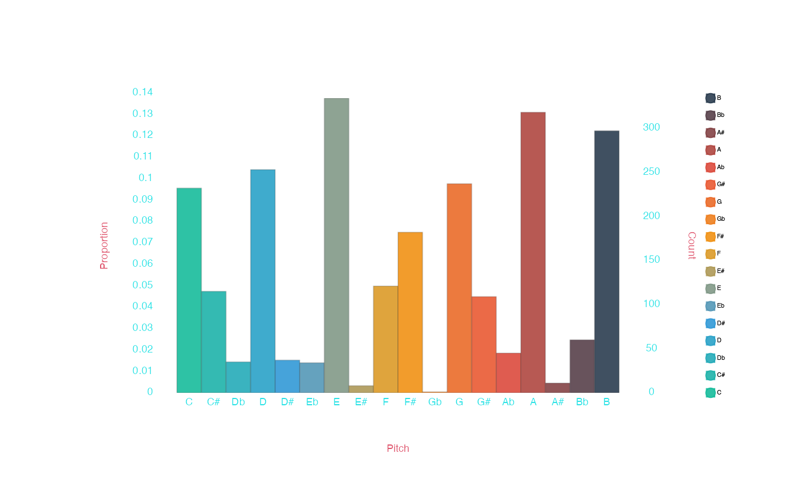
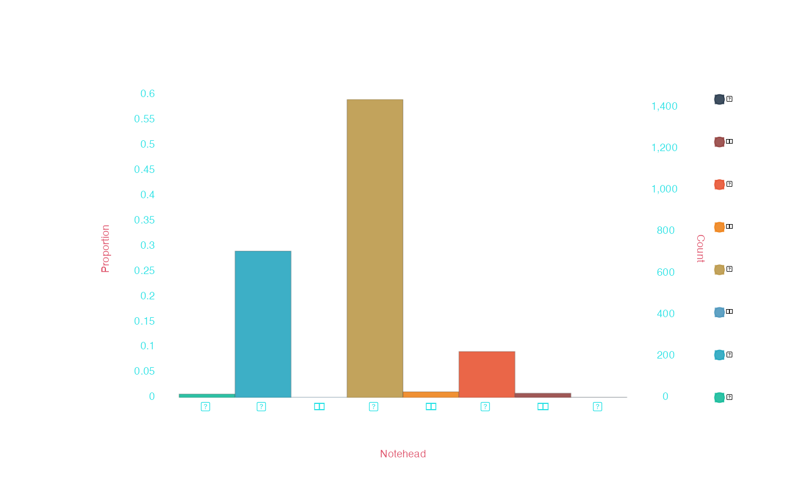

# Getting started with humdrumR

Welcome to “Getting started with humdrum$`_{\mathbb{R}}`$”! This article
provides a quick introduction to the basics of humdrum$`_{\mathbb{R}}`$,
getting you started loading humdrum data and performing (very) simple
analyses of humdrum data. Before you continue, make sure
humdrum$`_{\mathbb{R}}`$ is installed: [how to install
humdrumR](https://humdrumr.ccml.gtcmt.gatech.edu/#installing-humdrum_mathbbr "Installing humdrumR").  
Once it’s installed, you can open an R session and load the library
using the command
[`library(humdrumR)`](https://humdrumR.ccml.gtcmt.gatech.edu)—now you
are ready to rock!

This article, like all of our articles, closely parallels information in
humdrum$`_{\mathbb{R}}`$’s detailed code documentation, which can be
found in the
“[Reference](https://humdrumr.ccml.gtcmt.gatech.edu/reference/index.html "HumdrumR function reference")”
section of the
humdrum$`_{\mathbb{R}}`$[homepage](https://humdrumR.ccml.gtcmt.gatech.edu/articles/humdrumR.ccml.gtcmt.gatech.edu).
Once humdrum$`_{\mathbb{R}}`$ is installed and loaded, the code
documentation can also be accessed directly within an R session by using
the `?` command, like
[`?humdrumR`](https://humdrumR.ccml.gtcmt.gatech.edu/reference/humdrumR.md),
Anywhere in one of our articles where you see a named variable followed
by parentheses, like
[`kern()`](https://humdrumR.ccml.gtcmt.gatech.edu/reference/kern.md) or
[`recip()`](https://humdrumR.ccml.gtcmt.gatech.edu/reference/recip.md),
you can call
[`?kern`](https://humdrumR.ccml.gtcmt.gatech.edu/reference/kern.md) or
[`?recip`](https://humdrumR.ccml.gtcmt.gatech.edu/reference/recip.md) to
see the corresponding documentation.

## Quick Start

Let’s just dive right in!

To illustrate how humdrum$`_{\mathbb{R}}`$ works, we’ll need some
[humdrum
data](https://humdrumR.ccml.gtcmt.gatech.edu/articles/HumdrumSyntax.md "The Humdrum Syntax")
to work with. Fortunately, humdrum$`_{\mathbb{R}}`$ comes packaged with
a small number of humdrum data files just for you to play around with.
These files are stored in the directory where your computer installed
humdrum$`_{\mathbb{R}}`$, in a subdirectory called “`HumdrumData`”. You
can move your R session to this directory using R’s “set working
directory” command: `setwd(humdrumRroot)`. Once you’re in the humdrumR
directory, you can use the base R `dir` function to see what humdrum
data is available to you.

``` r
library(humdrumR)

setwd(humdrumRroot)

dir('HumdrumData')
>    [1] "BachChorales"        "BeethovenVariations" "InvalidFile.krn"    
>    [4] "MozartVariations"    "RapFlow"             "RollingStoneCorpus"
```

It looks like there are six directories of humdrum data available to
you. Using `dir` again, we can look inside one: let’s start with the
“`BachChorales`” directory.

``` r
dir('HumdrumData/BachChorales')
>     [1] "chor001.krn" "chor002.krn" "chor003.krn" "chor004.krn" "chor005.krn"
>     [6] "chor006.krn" "chor007.krn" "chor008.krn" "chor009.krn" "chor010.krn"
```

There are ten files in the directory, named “`chor001.krn`”,
“`chor002.krn`”, etc. These are humdrum plain-text files, representing
ten chorales by J.S. Bach; each file contains four spines (columns) of
`**kern` data, representing musical pitch and rhythm (among other
things). Take a minute to find the files in your computer’s
finder/explorer and open them up with a simple text editor. One of the
core philosophies of humdrum$`_{\mathbb{R}}`$ is that we maintain a
direct, transparent relationship with our symbolic data—so always take
the time to look at your data! You can also do this within Rstudio’s
“Files” pane—in fact, Rstudio will make things extra easy for you
because you can (within the Files pane) click “More” \> “Go To Working
Directory” to quickly find the files.

### Reading humdrum data

Now that we’ve found some humdrum data to look at, let’s read it into
humdrum$`_{\mathbb{R}}`$. We can do this using
humdrum$`_{\mathbb{R}}`$’s
[`readHumdrum()`](https://humdrumR.ccml.gtcmt.gatech.edu/reference/readHumdrum.md)
command. Try this:

``` r

readHumdrum('HumdrumData/BachChorales/chor001.krn') -> chor1
```

This command does two things:

1.  The
    [`readHumdrum()`](https://humdrumR.ccml.gtcmt.gatech.edu/reference/readHumdrum.md)
    function will read the “chor001.krn” file into R and create a
    humdrum$`_{\mathbb{R}}`$ data object from it.
2.  This new object will be saved to a variable called `chor1`. (The
    name ‘chor1’ is just a name I chose—you are welcome to give it a
    different name if you want.)

Once we’ve created our `chor1` object (or whatever you chose to call
it), we can take a quick look at what it is by just typing its name on
the command line and pressing enter:

``` r
chor1
>    ######################## vvv chor001.krn vvv #########################
>        1:  !!!COM: Bach, Johann Sebastian
>        2:  !!!CDT: 1685/02/21/-1750/07/28/
>        3:  !!!OTL@@DE: Aus meines Herzens Grunde
>        4:  !!!OTL@EN:      From the Depths of My Heart
>        5:  !!!SCT: BWV 269
>        6:  !!!PC#: 1
>        7:  !!!AGN: chorale
>        8:           **kern         **kern         **kern         **kern
>        9:           *ICvox         *ICvox         *ICvox         *ICvox
>       10:           *Ibass        *Itenor         *Ialto        *Isoprn
>       11:          *I"Bass       *I"Tenor        *I"Alto     *I"Soprano
>       12:        *>[A,A,B]      *>[A,A,B]      *>[A,A,B]      *>[A,A,B]
>       13:     *>norep[A,B]   *>norep[A,B]   *>norep[A,B]   *>norep[A,B]
>       14:              *>A            *>A            *>A            *>A
>       15:          *clefF4       *clefGv2        *clefG2        *clefG2
>       16:           *k[f#]         *k[f#]         *k[f#]         *k[f#]
>       17:              *G:            *G:            *G:            *G:
>       18:            *M3/4          *M3/4          *M3/4          *M3/4
>       19:           *MM100         *MM100         *MM100         *MM100
>       20:              4GG             4B             4d             4g
>       21:               =1             =1             =1             =1
>       22:               4G             4B             4d             2g
>       23:               4E            8cL             4e              .
>       24:                .            8BJ              .              .
>       25:              4F#             4A             4d            4dd
>       26:               =2             =2             =2             =2
>       27:               4G             4G             2d            4.b
>       28:               4D            4F#              .              .
>       29:                .              .              .             8a
>       30:               4E             4G             4B             4g
>       31:               =3             =3             =3             =3
>       32:               4C            8cL            8eL            4.g
>       33:                .            8BJ             8d              .
>       34:             8BBL             4c             8e              .
>       35:             8AAJ              .           8f#J             8a
>       36:              4GG             4d             4g             4b
>       37:               =4             =4             =4             =4
>       38:              2D;            2d;           2f#;            2a;
>       39:              4GG             4d             4g             4b
>       40:               =5             =5             =5             =5
>       41:             4FF#             4A             4d            2dd
>       42:              4GG             4B             4e              .
>       43:              4AA             4c            4f#            4cc
>       44:               =6             =6             =6             =6
>       45:              4BB             4d             2g             4b
>       46:               4C             4e              .             2a
>       47:               4D            8dL            4f#              .
>       48:                .            8cJ              .              .
>       49:               =7             =7             =7             =7
>       50:             2GG;            2B;            2d;            2g;
>       51:             =:|!           =:|!           =:|!           =:|!
>       52:              *>B            *>B            *>B            *>B
>       53:              4GG             4d            [4g             4b
>       54:               =8             =8             =8             =8
>       55:              4GG             4d           8gL]             4b
>       56:                .              .           8f#J              .
>       57:              4AA             4c            8eL            4cc
>       58:                .              .           8f#J              .
>       59:              4BB            8BL            [4g            4dd
>       60:                .            8AJ              .              .
>       61:               =9             =9             =9             =9
>       62:             4.BB            8BL           8gL]           4.dd
>       63:                .            8cJ            8aJ              .
>       64:                .             4d            8gL              .
>       65:              8AA              .           8f#J            8cc
>       66:              4GG             4d             4g             4b
>       67:              =10            =10            =10            =10
>       68:              2D;            2d;           2f#;            2a;
>       69:              [4E             4B             4e             4g
>       70:              =11            =11            =11            =11
>       71:              4E]             4G             4e             2b
>       72:               4D             4B           8f#L              .
>       73:                .              .            8gJ              .
>       74:               4C             4e             4a            4cc
>       75:              =12            =12            =12            =12
>       76:             4.BB             2d             4a            2dd
>       77:                .              .            4.g              .
>       78:               8C              .              .              .
>       79:               4D             4d              .            4cc
>       80:                .              .            8f#              .
>       81:              =13            =13            =13            =13
>       82:             8GGL            2.d             2g            2.b
>       83:             8AAJ              .              .              .
>       84:              4BB              .              .              .
>       85:              4GG              .             4f              .
>       86:              =14            =14            =14            =14
>       87:              2C;            2c;            2e;            2g;
>       88:              4GG             4d             4g             4b
>       89:              =15            =15            =15            =15
>       90:             4FF#            8dL            4.a            2dd
>       91:                .            8cJ              .              .
>       92:              4GG             4B              .              .
>       93:                .              .             8g              .
>       94:              4AA             4c            4f#            4cc
>       95:              =16            =16            =16            =16
>       96:              4BB             2d             2g             2b
>       97:              4GG              .              .              .
>       98:               4D            8dL           [4f#             4a
>       99:                .            8cJ              .              .
>      100:              =17            =17            =17            =17
>      101:              8EL             4B          8f#L]            4.g
>      102:               8D              .            8eJ              .
>      103:               8C             4c            8eL              .
>      104:              8BB              .           8f#J             8a
>      105:              8AA             4d             4g             4b
>      106:             8GGJ              .              .              .
>      107:              =18            =18            =18            =18
>      108:              2D;            2d;           2f#;            2a;
>      109:              [4G             4d             4g             4b
>      110:              =19            =19            =19            =19
>      111:              4G]             2d             2a            2dd
>      112:              4F#              .              .              .
>      113:              [4E             4e            8gL            4cc
>      114:                .              .           8f#J              .
>      115:              =20            =20            =20            =20
>      116:             8EL]             2e             2g             4b
>      117:              8DJ              .              .              .
>      118:               4C              .              .             2a
>      119:               4D            8dL            4f#              .
>      120:                .            8cJ              .              .
>      121:              =21            =21            =21            =21
>      122:            2.GG;           2.B;           2.d;           2.g;
>      123:               ==             ==             ==             ==
>      124:               *-             *-             *-             *-
>      125:  !!!hum2abc: -Q ''
>      126:  !!!title: @{PC#}. @{OTL@@DE}
>      127:  !!!YOR1: 371 vierstimmige Choralges&auml;nge von Johann Sebastian ***
>      128:  !!!YOR2: 4th ed. by Alfred D&ouml;rffel (Leipzig: Breitkopf und H&***
>      129:  !!!YOR3: c.1875). 178 pp. Plate "V.A.10".  reprint: J.S. Bach, 371***
>      130:  !!!YOR4: Chorales (New York: Associated Music Publishers, Inc., c.***
>      131:  !!!SMS: B&H, 4th ed, Alfred D&ouml;rffel, c.1875, plate V.A.10
>      132:  !!!EED:  Craig Stuart Sapp
>      133:  !!!EEV:  2009/05/22
>    ######################## ^^^ chor001.krn ^^^ #########################
>                  (***four global comments truncated due to screen size***)
>    
>       Data fields: 
>               *Token :: character
```

(In R, when you enter something on the command line, R “prints” it out
for you to read.) The print-out you see shows you the name of the file,
the contents of the file, and some stuff about “Data fields” that you
will learn about in our [next
article](https://humdrumR.ccml.gtcmt.gatech.edu/articles/DataFields.md "HumdrumR data fields").

Cool! Still, looking at a single humdrum file is not really that
exciting. The whole point of using computers is that they allow us to
work with large amounts of data. Luckily, humdrum$`_{\mathbb{R}}`$ makes
this very easy. Check out this next command:

``` r

readHumdrum('HumdrumData/BachChorales/chor0') -> chorales
```

Instead of writing `'chor001.krn'`, I wrote `'chor0'`. When we feed the
string `'chor0'` to
[`readHumdrum()`](https://humdrumR.ccml.gtcmt.gatech.edu/reference/readHumdrum.md),
it won’t just look for a file called “`chor0`”; it will read *any* file
in that directory whose name *contains* the sub-string `"chor0"`—which
in this case is all ten files! Try printing the new `chorales` object to
see how it is different:

``` r
chorales
>    ######################## vvv chor001.krn vvv #########################
>                1:  !!!COM: Bach, Johann Sebastian
>                2:  !!!CDT: 1685/02/21/-1750/07/28/
>                3:  !!!OTL@@DE: Aus meines Herzens Grunde
>                4:  !!!OTL@EN:      From the Depths of My Heart
>                5:  !!!SCT: BWV 269
>                6:  !!!PC#: 1
>                7:  !!!AGN: chorale
>                8:           **kern         **kern         **kern         **kern
>                9:           *ICvox         *ICvox         *ICvox         *ICvox
>               10:           *Ibass        *Itenor         *Ialto        *Isoprn
>               11:          *I"Bass       *I"Tenor        *I"Alto     *I"Soprano
>               12:        *>[A,A,B]      *>[A,A,B]      *>[A,A,B]      *>[A,A,B]
>               13:     *>norep[A,B]   *>norep[A,B]   *>norep[A,B]   *>norep[A,B]
>               14:              *>A            *>A            *>A            *>A
>               15:          *clefF4       *clefGv2        *clefG2        *clefG2
>               16:           *k[f#]         *k[f#]         *k[f#]         *k[f#]
>               17:              *G:            *G:            *G:            *G:
>               18:            *M3/4          *M3/4          *M3/4          *M3/4
>               19:           *MM100         *MM100         *MM100         *MM100
>               20:              4GG             4B             4d             4g
>               21:               =1             =1             =1             =1
>               22:               4G             4B             4d             2g
>               23:               4E            8cL             4e              .
>               24:                .            8BJ              .              .
>               25:              4F#             4A             4d            4dd
>               26:               =2             =2             =2             =2
>               27:               4G             4G             2d            4.b
>               28:               4D            4F#              .              .
>               29:                .              .              .             8a
>               30:               4E             4G             4B             4g
>    31-133::::::::::::::::::::::::::::::::::::::::::::::::::::::::::::::::
>    ######################## ^^^ chor001.krn ^^^ #########################
>    
>           (eight more pieces...)
>    
>    ######################## vvv chor010.krn vvv #########################
>      1-70::::::::::::::::::::::::::::::::::::::::::::::::::::::::::::::::
>               71:               4D            8F#             4d             4b
>               72:                .             4G              .              .
>               73:               4D              .             4c             4a
>               74:                .            8F#              .              .
>               75:             2GG;            2G;            2B;            2g;
>               76:              =11            =11            =11            =11
>               77:               2C             2G             2e             2g
>               78:              4AA             4A             4e            4cc
>               79:               4E            4G#            8eL             4b
>               80:                .              .            8dJ              .
>               81:              =12            =12            =12            =12
>               82:               4F             4A             4c             4a
>               83:               4C             4G             4c             4e
>               84:             4BB-             4G            [2d             4g
>               85:              4AA             4A              .             4f
>               86:              =13            =13            =13            =13
>               87:             4GG#             4B            4d]            1e;
>               88:              4AA             4A             4c              .
>               89:             2EE;          2G#X;            2B;              .
>               90:               ==             ==             ==             ==
>               91:               *-             *-             *-             *-
>               92:  !!!hum2abc: -Q ''
>               93:  !!!title: @{PC#}. @{OTL@@DE}
>               94:  !!!YOR1: 371 vierstimmige Choralges&auml;nge von Johann Sebastian B***
>               95:  !!!YOR2: 4th ed. by Alfred D&ouml;rffel (Leipzig: Breitkopf und H&a***
>               96:  !!!YOR2: c.1875). 178 pp. Plate "V.A.10".  reprint: J.S. Bach, 371 ***
>               97:  !!!YOR4: Chorales (New York: Associated Music Publishers, Inc., c.1***
>               98:  !!!SMS: B&H, 4th ed, Alfred D&ouml;rffel, c.1875, plate V.A.10
>               99:  !!!EED:  Craig Stuart Sapp
>              100:  !!!EEV:  2009/05/22
>    ######################## ^^^ chor010.krn ^^^ #########################
>                  (***four global comments truncated due to screen size***)
>    
>       humdrumR corpus of ten pieces.
>    
>       Data fields: 
>               *Token :: character
```

Wow! We’ve now got a “humdrumR corpus of ten pieces”—and that’s nothing:
[`readHumdrum()`](https://humdrumR.ccml.gtcmt.gatech.edu/reference/readHumdrum.md)
will work just as well reading hundreds or thousands of files! Notice
that when you print a humdrum$`_{\mathbb{R}}`$ object,
humdrum$`_{\mathbb{R}}`$ shows you the beginning of the first file and
the end of the last file, as well as telling you how many files there
are in total.

------------------------------------------------------------------------

> [`readHumdrum()`](https://humdrumR.ccml.gtcmt.gatech.edu/reference/readHumdrum.md)
> has a number of other cool options which you can read about in more
> detail in our [humdrumR read/write
> tutorial](https://humdrumR.ccml.gtcmt.gatech.edu/articles/ReadWrite.md "Reading and writing data with humdrumR").

### Counting Things

Once we have some data loaded, the next thing a good computational
musicologist does is start counting! To count the contents of data, we
can use the
[`count()`](https://humdrumR.ccml.gtcmt.gatech.edu/reference/count.md)
function.

``` r
chorales |> 
  count() 
```

```
>    humdrumR count distribution 
>      Token    n
>        [2d    1
>        [2e    1
>        [4a    1
>        [4A    2
>        [4B    1
>        [4c    1
>        [4d    1
>        [4e    2
>        [4E    2
>        [4f    1
>       [4f#    1
>        [4g    4
>        [4G    2
>       [8cJ    1
>       [8CJ    1
>       [8gJ    1
>       16AL    1
>     16B-Jk    1
>    16b-XJJ    1
>     16BBJJ    1
>      16BJJ    1
>      16C#L    1
>     16c#LL    1
>      16ccL    1
>     16ccLL    1
>     16d#JJ    1
>     16ddJJ    1
>      16dJJ    2
>      16EJJ    1
>       16eL    2
>      16F#L    1
>        1e;    1
>       2.a;    1
>       2.A;    1
>      2.AA;    1
>        2.b    1
>       2.b;    1
>       2.B;    1
>      2.BB;    1
>       2.c;    1
>       2.C#    1
>      2.c#;    1
>        2.d    1
>       2.d;    2
>        2.e    1
>       2.e;    1
>       2.ee    1
>       2.f;    1
>      2.f#;    1
>      2.FF;    1
>       2.g;    1
>      2.GG;    1
>         2a   17
>         2A   10
>       2a-;    1
>       2A-;    2
>        2a;    9
>        2A;    2
>      2AA-;    1
>       2AA;    4
>         2b   10
>         2B    2
>       2b-;    1
>        2b;    3
>        2B;    8
>        2BB    2
>      2BB-;    1
>       2BB;    1
>         2c    1
>         2C    1
>        2c;    6
>        2C;    1
>        2c#    5
>       2c#;    3
>        2cc    3
>       2cc#    3
>      2cc#;    1
>         2d    6
>         2D    5
>       2d-;    1
>        2d;    6
>        2D;    5
>        2d#    1
>        2D#    1
>       2d#;    1
>        2dd    8
>       2DnX    1
>         2e   13
>         2E    4
>       2e-;    1
>        2e;    9
>        2E;    5
>        2E#    1
>       2EE;    1
>        2f;    4
>        2f#   10
>        2F#    4
>       2f#;    5
>       2F#;    1
>       2FF;    3
>      2FF#;    1
>         2g    7
>         2G    1
>        2g;    3
>        2G;    1
>        2g#    4
>        2G#    1
>       2g#;    1
>       2G#;    4
>      2G#X;    1
>       2GG;    2
>        4.a    2
>       4.a-    1
>        4.b    2
>        4.B    3
>       4.b-    2
>       4.BB    2
>        4.c    1
>      4.cc#    1
>        4.d    1
>       4.dd    1
>        4.e    1
>       4.e-    1
>       4.ee    1
>        4.f    3
>       4.f#    1
>        4.g    5
>         4a   90
>         4A   58
>        4a-   15
>        4A-    4
>       4a-;    2
>       4A-;    2
>       4a-X    1
>        4a;    8
>        4A;    3
>        4a#    4
>        4A#    2
>        4AA   20
>       4AA-    2
>      4AA-;    1
>       4AA;    5
>       4AA#    1
>       4anX    1
>         4b   81
>         4B   56
>        4b-   16
>        4B-   10
>       4B-X    1
>        4b;    9
>        4B;    9
>        4B]    1
>        4BB   25
>       4BB-    7
>       4BB;    3
>         4c   49
>         4C   23
>        4c;    8
>        4C;    2
>        4c]    1
>        4c#   27
>        4C#   19
>       4c#;    2
>       4C#;    1
>        4cc   48
>       4cc;    3
>       4cc#   28
>      4ccnX    1
>       4CnX    1
>         4d   53
>         4D   30
>        4d-    9
>        4D-    4
>        4d;    8
>        4D;    4
>        4d]    1
>        4d#    9
>        4D#    8
>       4d#;    3
>        4dd   29
>        4DD    1
>       4dd-    7
>       4dd;    2
>       4dd#    3
>       4dnX    2
>       4DnX    1
>         4e  103
>         4E   43
>        4e-    7
>        4E-    6
>       4e-;    2
>        4e;   14
>        4E;    7
>        4e]    1
>        4E]    1
>        4e#    3
>        4E#    2
>       4e#;    1
>       4E#X    1
>        4ee   20
>        4EE    2
>       4ee-    3
>      4ee-X    1
>       4ee;    1
>       4EE;    2
>       4enX    1
>       4EnX    1
>         4f   50
>         4F   12
>        4f;    2
>        4F;    2
>        4f#   47
>        4F#   30
>       4f#;    4
>       4F#;    2
>       4F#X    1
>      4F#X;    1
>        4ff    6
>        4FF    3
>       4ff;    1
>       4FF;    1
>       4ff#    1
>       4FF#    2
>         4g   66
>         4G   33
>        4g-    1
>        4g;    8
>        4G;    3
>        4g]    2
>        4G]    1
>        4g#   34
>        4G#   21
>       4g#;    5
>       4G#;    3
>       4G#X    1
>      4G#X;    1
>        4gg    1
>        4GG   15
>       4GG;    5
>       4GG#    2
>       4gnX    1
>       4GnX    1
>         4r    2
>        4ry    2
>       8.cL    1
>         8a    5
>         8A    5
>        8a-    2
>        8A-    1
>       8a-J    2
>       8A-J    1
>       8a-L    4
>       8A-L    1
>      8a-XJ    1
>        8A#    2
>       8a#J    1
>       8A#J    1
>        8AA    3
>       8AA-    1
>       8AAJ    7
>       8AAL    4
>        8aJ   15
>        8AJ   17
>        8aL   10
>        8AL   12
>       8aL]    1
>       8AL]    2
>      8AnXL    1
>         8b    2
>        8b-    1
>        8B-    1
>       8b-J    1
>       8B-J    6
>       8b-L    2
>        8BB    3
>      8BB-J    6
>      8BB-L    3
>       8BBJ    6
>       8BBL    4
>        8bJ   11
>        8BJ   15
>        8bL   14
>        8BL   18
>         8c    1
>         8C    5
>        8C#    2
>       8c#J    3
>       8C#J    2
>       8c#L    5
>       8C#L    4
>      8c#XJ    1
>        8cc    2
>      8cc#J    2
>      8cc#L    2
>       8ccJ    7
>       8ccL    7
>        8cJ   15
>        8CJ    8
>        8cL   14
>        8CL   14
>       8cL]    1
>       8CL]    1
>      8cnXJ    1
>         8d    5
>         8D    3
>        8d-    1
>        8D-    6
>       8D-J    4
>       8D-L    2
>      8d-XJ    1
>       8d#J    5
>       8D#J    1
>       8d#L    1
>       8D#L    2
>        8dd    1
>      8dd#J    1
>       8ddJ    2
>       8ddL    4
>        8dJ   19
>        8DJ   15
>        8dL   24
>        8DL    6
>       8dL]    1
>       8dnJ    1
>         8e    6
>         8E    2
>        8E-    6
>       8e-J    1
>       8E-J    1
>       8e-L    1
>       8E-L    4
>       8EEJ    1
>       8eeL    2
>       8EEL    1
>        8eJ   20
>        8EJ    7
>        8eL   35
>        8EL   15
>       8eL]    2
>       8EL]    1
>         8f    3
>         8F    4
>        8f#    2
>        8F#    3
>       8f#J   26
>       8F#J   14
>       8f#L   12
>       8F#L    7
>      8f#L]    1
>      8F#XJ    1
>      8f#XL    1
>      8FF#J    2
>       8FFL    2
>        8fJ    4
>        8FJ    5
>        8fL    5
>        8FL    6
>       8fL]    1
>      8FnXL    1
>         8g    3
>         8G    4
>        8g#    4
>        8G#    4
>       8g#J    7
>       8G#J    7
>       8g#L    5
>       8G#L    3
>      8g#XJ    1
>        8GG    2
>       8GGJ    2
>       8GGL    2
>        8gJ   14
>        8GJ    8
>        8gL   14
>        8GL   17
>       8gL]    3
>       8GL]    1
>      8gnXL    2
>      8GnXL    1
>      Token    n
>    humdrumR count distribution
```

That’s quite a mess! What have we done? When we pass our `chorales` data
to
[`count()`](https://humdrumR.ccml.gtcmt.gatech.edu/reference/count.md),
it counted all the unique data tokens (ignoring non-data tokens, like
barline and interpretations) in the data. There are a *lot* of unique
tokens in this data, so it’s not super helpful. Maybe we’d like to look
at just the twenty most common tokens in the `chorales`? To this, we can
pass the count through to two base R functions,
[`sort()`](https://rdrr.io/r/base/sort.html) and
[`tail()`](https://rdrr.io/r/utils/head.html):

``` r
chorales |> 
  count() |>
  sort() |>
  head(n = 20)
>    humdrumR count distribution 
>    Token    n
>       4e  103
>       4a   90
>       4b   81
>       4g   66
>       4A   58
>       4B   56
>       4d   53
>       4f   50
>       4c   49
>      4cc   48
>      4f#   47
>       4E   43
>      8eL   35
>      4g#   34
>       4G   33
>       4D   30
>      4F#   30
>      4dd   29
>     4cc#   28
>      4c#   27
>    Token    n
>    humdrumR count distribution
```

Ah, that’s more promising! We see that the most common token is a
quarter-note E4 (`4e`), which occurs 103 times.

#### Separating pitch and rhythm

To make our tallies more useful, we might want to count only the pitch
or rhythm part of the `**kern` data. To do this, we need to to be able
to extract the pitch/rhythm from the original `**kern` tokens, which we
can do that using humdrum$`_{\mathbb{R}}`$’s suite of
[pitch](https://computational-cognitive-musicology-lab.github.io/humdrumR/reference/pitchFunctions.html)
and
[rhythm](https://computational-cognitive-musicology-lab.github.io/humdrumR/reference/rhythmFunctions.html)
functions. For example, let’s try the
[`pitch()`](https://humdrumR.ccml.gtcmt.gatech.edu/reference/pitch.md)
function:

``` r
chorales |> 
  pitch()
>    ######################## vvv chor001.krn vvv #########################
>                1:  !!!COM: Bach, Johann Sebastian
>                2:  !!!CDT: 1685/02/21/-1750/07/28/
>                3:  !!!OTL@@DE: Aus meines Herzens Grunde
>                4:  !!!OTL@EN:      From the Depths of My Heart
>                5:  !!!SCT: BWV 269
>                6:  !!!PC#: 1
>                7:  !!!AGN: chorale
>                8:          **pitch        **pitch        **pitch        **pitch
>                9:                .              .              .              .
>               10:                .              .              .              .
>               11:                .              .              .              .
>               12:        *>[A,A,B]      *>[A,A,B]      *>[A,A,B]      *>[A,A,B]
>               13:     *>norep[A,B]   *>norep[A,B]   *>norep[A,B]   *>norep[A,B]
>               14:              *>A            *>A            *>A            *>A
>               15:          *clefF4       *clefGv2        *clefG2        *clefG2
>               16:           *k[f#]         *k[f#]         *k[f#]         *k[f#]
>               17:              *G:            *G:            *G:            *G:
>               18:                .              .              .              .
>               19:                .              .              .              .
>               20:               G2             B3             D4             G4
>               21:               =1             =1             =1             =1
>               22:               G3             B3             D4             G4
>               23:               E3             C4             E4              .
>               24:                .             B3              .              .
>               25:              F#3             A3             D4             D5
>               26:               =2             =2             =2             =2
>               27:               G3             G3             D4             B4
>               28:               D3            F#3              .              .
>               29:                .              .              .             A4
>               30:               E3             G3             B3             G4
>    31-133::::::::::::::::::::::::::::::::::::::::::::::::::::::::::::::::
>    ######################## ^^^ chor001.krn ^^^ #########################
>    
>           (eight more pieces...)
>    
>    ######################## vvv chor010.krn vvv #########################
>      1-70::::::::::::::::::::::::::::::::::::::::::::::::::::::::::::::::
>               71:               D3            F#3             D4             B4
>               72:                .             G3              .              .
>               73:               D3              .             C4             A4
>               74:                .            F#3              .              .
>               75:               G2             G3             B3             G4
>               76:              =11            =11            =11            =11
>               77:               C3             G3             E4             G4
>               78:               A2             A3             E4             C5
>               79:               E3            G#3             E4             B4
>               80:                .              .             D4              .
>               81:              =12            =12            =12            =12
>               82:               F3             A3             C4             A4
>               83:               C3             G3             C4             E4
>               84:              Bb2             G3             D4             G4
>               85:               A2             A3              .             F4
>               86:              =13            =13            =13            =13
>               87:              G#2             B3             D4             E4
>               88:               A2             A3             C4              .
>               89:               E2            G#3             B3              .
>               90:               ==             ==             ==             ==
>               91:               *-             *-             *-             *-
>               92:  !!!hum2abc: -Q ''
>               93:  !!!title: @{PC#}. @{OTL@@DE}
>               94:  !!!YOR1: 371 vierstimmige Choralges&auml;nge von Johann Sebastian B***
>               95:  !!!YOR2: 4th ed. by Alfred D&ouml;rffel (Leipzig: Breitkopf und H&a***
>               96:  !!!YOR2: c.1875). 178 pp. Plate "V.A.10".  reprint: J.S. Bach, 371 ***
>               97:  !!!YOR4: Chorales (New York: Associated Music Publishers, Inc., c.1***
>               98:  !!!SMS: B&H, 4th ed, Alfred D&ouml;rffel, c.1875, plate V.A.10
>               99:  !!!EED:  Craig Stuart Sapp
>              100:  !!!EEV:  2009/05/22
>    ######################## ^^^ chor010.krn ^^^ #########################
>                  (***four global comments truncated due to screen size***)
>    
>       humdrumR corpus of ten pieces.
>    
>       Data fields: 
>               *Pitch :: character (**pitch tokens)
>                Token :: character
```

The
[`pitch()`](https://humdrumR.ccml.gtcmt.gatech.edu/reference/pitch.md)
function takes the original `**kern` tokens, reads the pitch part of
each token, and translates it to [scientific
pitch](https://en.wikipedia.org/wiki/Scientific_pitch) notation. Let’s
pass *that* to count:

``` r
chorales |>
  pitch() |>
  count()
```

```
>    humdrumR count distribution 
>    Pitch    n
>       C2    .
>      C#2    .
>      Db2    .
>       D2    1
>      D#2    .
>      Eb2    .
>       E2    7
>      E#2    .
>       F2   10
>      F#2    5
>      Gb2    .
>       G2   29
>      G#2    2
>      Ab2    5
>       A2   44
>      A#2    1
>      Bb2   17
>       B2   48
>       C3   57
>      C#3   30
>      Db3   16
>       D3   70
>      D#3   12
>      Eb3   17
>       E3   89
>      E#3    4
>       F3   30
>      F#3   65
>      Gb3    .
>       G3   73
>      G#3   46
>      Ab3   11
>       A3  114
>      A#3    5
>      Bb3   19
>       B3  115
>       C4  102
>      C#4   48
>      Db4   12
>       D4  134
>      D#4   21
>      Eb4   13
>       E4  213
>      E#4    4
>       F4   74
>      F#4  111
>      Gb4    1
>       G4  134
>      G#4   61
>      Ab4   29
>       A4  160
>      A#4    5
>      Bb4   24
>       B4  134
>       C5   73
>      C#5   37
>      Db5    7
>       D5   48
>      D#5    4
>      Eb5    4
>       E5   25
>      E#5    .
>       F5    7
>      F#5    1
>      Gb5    .
>       G5    1
>      G#5    .
>      Ab5    .
>       A5    .
>      A#5    .
>      Bb5    .
>       B5    .
>    Pitch    n
>    humdrumR count distribution
```

Pretty cool, but still quite a big table. Maybe we’d like to ignore
octave information for now? Luckily, humdrum$`_{\mathbb{R}}`$’s [pitch
functions](https://computational-cognitive-musicology-lab.github.io/humdrumR/reference/pitchFunctions.html)
have a “`simple`” argument, which can be used to ask for only *simple*
pitch information (no octave).

``` r
chorales |>
  pitch(simple = TRUE) |>
  count() 
>    humdrumR count distribution 
>    Pitch    n
>        C  232
>       C#  115
>       Db   35
>        D  253
>       D#   37
>       Eb   34
>        E  334
>       E#    8
>        F  121
>       F#  182
>       Gb    1
>        G  237
>       G#  109
>       Ab   45
>        A  318
>       A#   11
>       Bb   60
>        B  297
>    Pitch    n
>    humdrumR count distribution
```

We can make plot of our nice simple-pitch table, using
humdrum$`_{\mathbb{R}}`$’s
[`draw()`](https://humdrumR.ccml.gtcmt.gatech.edu/reference/draw.md)
function:

``` r
chorales |>
  pitch(simple = TRUE) |>
  count() |>
  draw()
```



Instead of pitch, we could do the same sort of counting of rhythm
information, for example, using the
[`notehead()`](https://humdrumR.ccml.gtcmt.gatech.edu/reference/notehead.md)
function:

``` r

chorales |>
  notehead() |>
  count() |>
  draw()
```



### Filtering

Sometimes, we might only want to look at a subset of our data. For
example, maybe we only want to count notes sung by the soprano. In the
Bach chorale data we are working with, the soprano voice is always in
the fourth spine (column). We can use the
[`filter()`](https://humdrumR.ccml.gtcmt.gatech.edu/reference/subset.humdrumR.md)
function to indicate a subset we’d like to study:

``` r
chorales |> 
  pitch(simple = TRUE) |> 
  filter(Spine == 4) |>
  count()
>    humdrumR count distribution 
>    Pitch    n
>        C   68
>       C#   37
>       Db    7
>        D   50
>       D#    5
>       Eb    4
>        E   42
>        F   18
>       F#   14
>        G   43
>       G#   15
>       Ab   15
>        A   93
>       A#    2
>       Bb   15
>        B  115
>    Pitch    n
>    humdrumR count distribution
```

Let’s try something even cooler. Notice that, in the chorale data, there
are tandem interpretations that look like `*G:` and `*E:`. These are
indications of the key. Anytime you read humdrum data that has these key
interpretations, humdrum$`_{\mathbb{R}}`$ will read them into a “field”
called `Key`. We could, for example, count all the notes sung when the
key is G major like this:

``` r
chorales |>
  filter(Key == 'G:') |>
  pitch(simple = TRUE) |>
  count()
>    humdrumR count distribution 
>    Pitch    n
>        C   87
>       C#   10
>        D  142
>       D#    4
>       Eb    .
>        E   98
>        F    7
>       F#   70
>        G  145
>       G#   11
>       Ab    .
>        A  113
>       A#    1
>       Bb    1
>        B  116
>    Pitch    n
>    humdrumR count distribution
```

Guess what? There are a bunch more “fields” hidden in your
humdrum$`_{\mathbb{R}}`$ data object that you can use…and you can make
your own! Check out our next article, on humdrum$`_{\mathbb{R}}`$’s data
[fields](https://humdrumR.ccml.gtcmt.gatech.edu/articles/DataFields.md "HumdrumR data fields"),
to learn more.

## What next?

You’ve gotten started, but there is much more to learn! To keep learning
check out the other articles on the [humdrumR
homepage](https://humdrumR.ccml.gtcmt.gatech.edu). If you want to
continue along the path we’ve started here, the next articles to check
out are probably [HumdrumR data
fields](https://humdrumR.ccml.gtcmt.gatech.edu/articles/DataFields.md "HumdrumR data fields"),
[Getting to know your
data](https://humdrumR.ccml.gtcmt.gatech.edu/articles/Summary.md "Getting to know your data"),
[Filtering humdrum
data](https://humdrumR.ccml.gtcmt.gatech.edu/articles/Filtering.md "Filtering humdrum data"),
and [Working with humdrum
data](https://humdrumR.ccml.gtcmt.gatech.edu/articles/WorkingWithData.md "Working with humdrum data").
Since most musicological analysis involves pitch or rhythm, you’ll
probably want to learn about relevant ideas from the [Pitch and
tonality](https://humdrumR.ccml.gtcmt.gatech.edu/articles/PitchAndTonality.md "Pitch and tonality in humdrumR")
and [Rhythm and
meter](https://humdrumR.ccml.gtcmt.gatech.edu/articles/RhythmAndMeter.md "Rhythm and meter in humdrumR")
articles.

If the humdrum data you are working with is complex—e.g., including
multiple different exclusive interpretations, spine paths, or
multi-stops—you’ll probably find you need to check out the [Shaping
humdrum
data](https://humdrumR.ccml.gtcmt.gatech.edu/articles/Reshaping.md "Shaping humdrum data")
article, which will give you tools to deal with with more complex
humdrum data sets.
