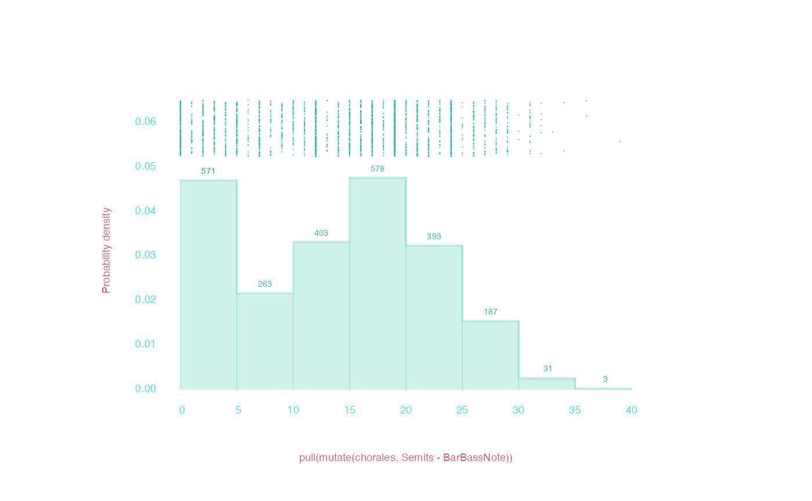

# Grouping humdrum data

Welcome to “Grouping humdrum data”! This article explains functionality
humdrum$`_{\mathbb{R}}`$ has to break your data into subgroups, and work
with each subgroup separately.

In this article, we’ll once again work with our prepackaged `chorales`
dataset, as we did in our [quick
start](https://humdrumR.ccml.gtcmt.gatech.edu/articles/GettingStarted.html#quick-start "Getting started with humdrumR article")
article.

``` r
chorales <- readHumdrum(humdrumRroot, 'HumdrumData/BachChorales/chor.*.krn')

chorales
```

```
>    ######################## vvv chor001.krn vvv #########################
>                1:  !!!COM: Bach, Johann Sebastian
>                2:  !!!CDT: 1685/02/21/-1750/07/28/
>                3:  !!!OTL@@DE: Aus meines Herzens Grunde
>                4:  !!!OTL@EN:      From the Depths of My Heart
>                5:  !!!SCT: BWV 269
>                6:  !!!PC#: 1
>                7:  !!!AGN: chorale
>                8:           **kern         **kern         **kern         **kern
>                9:           *ICvox         *ICvox         *ICvox         *ICvox
>               10:           *Ibass        *Itenor         *Ialto        *Isoprn
>               11:          *I"Bass       *I"Tenor        *I"Alto     *I"Soprano
>               12:        *>[A,A,B]      *>[A,A,B]      *>[A,A,B]      *>[A,A,B]
>               13:     *>norep[A,B]   *>norep[A,B]   *>norep[A,B]   *>norep[A,B]
>               14:              *>A            *>A            *>A            *>A
>               15:          *clefF4       *clefGv2        *clefG2        *clefG2
>               16:           *k[f#]         *k[f#]         *k[f#]         *k[f#]
>               17:              *G:            *G:            *G:            *G:
>               18:            *M3/4          *M3/4          *M3/4          *M3/4
>               19:           *MM100         *MM100         *MM100         *MM100
>               20:              4GG             4B             4d             4g
>               21:               =1             =1             =1             =1
>               22:               4G             4B             4d             2g
>               23:               4E            8cL             4e              .
>               24:                .            8BJ              .              .
>               25:              4F#             4A             4d            4dd
>               26:               =2             =2             =2             =2
>               27:               4G             4G             2d            4.b
>               28:               4D            4F#              .              .
>               29:                .              .              .             8a
>               30:               4E             4G             4B             4g
>    31-133::::::::::::::::::::::::::::::::::::::::::::::::::::::::::::::::
>    ######################## ^^^ chor001.krn ^^^ #########################
>    
>           (eight more pieces...)
>    
>    ######################## vvv chor010.krn vvv #########################
>      1-70::::::::::::::::::::::::::::::::::::::::::::::::::::::::::::::::
>               71:               4D            8F#             4d             4b
>               72:                .             4G              .              .
>               73:               4D              .             4c             4a
>               74:                .            8F#              .              .
>               75:             2GG;            2G;            2B;            2g;
>               76:              =11            =11            =11            =11
>               77:               2C             2G             2e             2g
>               78:              4AA             4A             4e            4cc
>               79:               4E            4G#            8eL             4b
>               80:                .              .            8dJ              .
>               81:              =12            =12            =12            =12
>               82:               4F             4A             4c             4a
>               83:               4C             4G             4c             4e
>               84:             4BB-             4G            [2d             4g
>               85:              4AA             4A              .             4f
>               86:              =13            =13            =13            =13
>               87:             4GG#             4B            4d]            1e;
>               88:              4AA             4A             4c              .
>               89:             2EE;          2G#X;            2B;              .
>               90:               ==             ==             ==             ==
>               91:               *-             *-             *-             *-
>               92:  !!!hum2abc: -Q ''
>               93:  !!!title: @{PC#}. @{OTL@@DE}
>               94:  !!!YOR1: 371 vierstimmige Choralges&auml;nge von Johann Sebastian B***
>               95:  !!!YOR2: 4th ed. by Alfred D&ouml;rffel (Leipzig: Breitkopf und H&a***
>               96:  !!!YOR2: c.1875). 178 pp. Plate "V.A.10".  reprint: J.S. Bach, 371 ***
>               97:  !!!YOR4: Chorales (New York: Associated Music Publishers, Inc., c.1***
>               98:  !!!SMS: B&H, 4th ed, Alfred D&ouml;rffel, c.1875, plate V.A.10
>               99:  !!!EED:  Craig Stuart Sapp
>              100:  !!!EEV:  2009/05/22
>    ######################## ^^^ chor010.krn ^^^ #########################
>                  (***four global comments truncated due to screen size***)
>    
>       humdrumR corpus of ten pieces.
>    
>       Data fields: 
>               *Token :: character
```

## Group-apply-combine

One of the fundamental data analysis techniques in R is the
*group-apply-combine* routine. We break our data.frames into groups (by
row), apply calculations or manipulations to each group independently,
and then (optionally) recombine the groups back into a single
data.frame. For example, if we want know the average pitch height (in
MIDI pitch) of the chorales, we could run this command:

``` r
chorales |>
  midi() |>
  summarize(mean(.))
>       humdrumR:::mean(.)
>                    <num>
>    1:           61.16509
```

(We use the `summarize()` command because we are only getting *one*
(scalar) value.) But what if wanted to calculate the mean pitch, for
*each* chorale? We can use the
[`group_by()`](https://humdrumR.ccml.gtcmt.gatech.edu/reference/groupHumdrum.md)
command:

``` r
chorales |>
  midi() |>
  group_by(Piece) |>
  summarize(mean(.))
>        humdrumR:::mean(.) Piece
>                     <num> <int>
>     1:           60.24017     1
>     2:           62.03896     2
>     3:           61.86735     3
>     4:           61.66129     4
>     5:           60.89189     5
>     6:           60.65600     6
>     7:           61.62428     7
>     8:           60.71788     8
>     9:           61.15638     9
>    10:           60.82418    10
```

How does this work? The
[`group_by()`](https://humdrumR.ccml.gtcmt.gatech.edu/reference/groupHumdrum.md)
function looks at all the unique values in the fields we give it—in this
case the `Piece` field—and breaks the humdrum table into groups based on
those values. So whereever `Piece == 1`, that’s a group; wherever
`Piece == 2`, that’s another group, etc. After
[`group_by()`](https://humdrumR.ccml.gtcmt.gatech.edu/reference/groupHumdrum.md)
is applied, the humdrum$`_{\mathbb{R}}`$ dataset is grouped, and any
subsequent tidy-commands will automatically be applied *within* the
groups.

------------------------------------------------------------------------

Once a humdrum$`_{\mathbb{R}}`$ dataset has been grouped, it will stay
grouped until you call
[`ungroup()`](https://humdrumR.ccml.gtcmt.gatech.edu/reference/groupHumdrum.md)
on it!

#### More complex grouping

If we like, we can pass more than one field to
[`group_by()`](https://humdrumR.ccml.gtcmt.gatech.edu/reference/groupHumdrum.md).
Groups will be formed for every unique *combinations* of values across
grouping fields:

``` r
chorales |>
  midi() |>
  group_by(Piece, Spine) |>
  summarize(mean(.))
```

```
>        humdrumR:::mean(.) Piece Spine
>                     <num> <int> <int>
>     1:           47.58730     1     1
>     2:           60.28814     1     2
>     3:           65.57377     1     3
>     4:           70.43478     1     4
>     5:           51.83607     2     1
>     6:           60.79032     2     2
>     7:           66.38182     2     3
>     8:           70.73585     2     4
>     9:           52.28846     3     1
>    10:           59.88000     3     2
>    11:           65.61702     3     3
>    12:           70.82979     3     4
>    13:           51.67347     4     1
>    14:           60.31111     4     2
>    15:           65.38776     4     3
>    16:           70.20930     4     4
>    17:           50.23171     5     1
>    18:           58.53409     5     2
>    19:           64.54118     5     3
>    20:           70.78205     5     4
>    21:           48.35294     6     1
>    22:           60.32258     6     2
>    23:           65.82353     6     3
>    24:           70.38462     6     4
>    25:           51.64444     7     1
>    26:           59.97701     7     2
>    27:           65.57471     7     3
>    28:           70.13415     7     4
>    29:           49.57798     8     1
>    30:           60.08333     8     2
>    31:           66.33708     8     3
>    32:           70.81579     8     4
>    33:           49.90625     9     1
>    34:           59.81159     9     2
>    35:           66.04918     9     3
>    36:           71.65306     9     4
>    37:           49.89130    10     1
>    38:           59.60870    10     2
>    39:           64.82979    10     3
>    40:           69.44186    10     4
>        humdrumR:::mean(.) Piece Spine
```

You can also create new grouping fields on the fly. For example, what
if, instead of groups for four separate voices, we wanted to group
bass/tenor and alto/soprano within each piece? We could do this:

``` r
chorales |>
  midi() |>
  group_by(Piece, Spine > 2) |>
  summarize(mean(.))
>        humdrumR:::mean(.) Spine > 2 Piece
>                     <num>    <lgcl> <int>
>     1:           53.72951     FALSE     1
>     2:           67.66355      TRUE     1
>     3:           56.34959     FALSE     2
>     4:           68.51852      TRUE     2
>     5:           56.00980     FALSE     3
>     6:           68.22340      TRUE     3
>     7:           55.80851     FALSE     4
>     8:           67.64130      TRUE     4
>     9:           54.52941     FALSE     5
>    10:           67.52761      TRUE     5
>    11:           54.06154     FALSE     6
>    12:           67.80000      TRUE     6
>    13:           55.74011     FALSE     7
>    14:           67.78698      TRUE     7
>    15:           54.15026     FALSE     8
>    16:           68.40000      TRUE     8
>    17:           55.04511     FALSE     9
>    18:           68.54545      TRUE     9
>    19:           54.75000     FALSE    10
>    20:           67.03333      TRUE    10
>        humdrumR:::mean(.) Spine > 2 Piece
```

------------------------------------------------------------------------

Grouping isn’t just good for calculating single values. We can, for
instance, tabulate each group separately:

``` r
chorales |>
  kern(simple = TRUE) |>
  group_by(Spine) |>
  count() 
>    humdrumR count distribution 
>    Kern  Spine               
>              1    2    3    4
>       c     62   83   19   68
>      c#     32   34   12   37
>      d-     16   12    .    7
>       d     72   88   43   50
>      d#     12    4   16    5
>      e-     16   11    3    4
>       e     92   79  121   42
>      e#      4    1    3    .
>       f     38   15   50   18
>      f#     49   35   84   14
>      g-      .    1    .    .
>       g     65   39   90   43
>      g#     19   31   44   15
>      a-     10    6   14   15
>       a     80   76   69   93
>      a#      2    4    3    2
>      b-     19   17    9   15
>       b     62   85   35  115
>              1    2    3    4
>    Kern  Spine               
>    humdrumR count distribution
```

### Common groupings

#### By file

It is *very* common in humdrum$`_{\mathbb{R}}`$ analyses that we want to
apply commands grouped by piece. In most cases, two pieces of music are
completely separate entities, so it makes sense to apply
calculations/manipulations separately to each piece. However,
humdrum$`_{\mathbb{R}}`$ won’t (always) do this for you. You might
think, “I want to count how many notes occur in each record” and run the
command `group_by(Record)`—but watch out! Grouping by `Record` will
group *all* the records 1s across all the pieces, all the record 2s
across all the pieces, etc. What you probably want is
(`group_by(Piece, Record)`). Don’t forget to group by piece…unless you
are sure you don’t want to.

#### Melodic grouping

In lots of humdrum data, each spine (or at least some spines) in the
data represent a musical part of voice. We often want to isolate each
voice, so `group_by(Piece, Spine)` gets used a lot. However, watch out
for spine paths and multi-stops, if your data has them—you might want
something like `group_by(Piece, Spine, Path)`, for example, if you data
has spine paths. Check out the [complex
syntax](https://humdrumR.ccml.gtcmt.gatech.edu/articles/ComplexSyntax.md "Complex humdrum syntax article")
for more ideas/options about this.

### Recycling results

As
[usual](https://humdrumR.ccml.gtcmt.gatech.edu/articles/DataFields.html#tidyverse-style "Data fields article, tidyverse style section"),
if you use `mutate()` with grouped data, the results of you command will
be “recycled”—in this case, to fill *each* group. This can be very
useful for maintaining vectorization. For example, let’s say we want to
calculate the lowest note in each bar.

``` r

chorales |>
  semits() |>
  group_by(File, Bar) |>
  mutate(BarBassNote = min(Semits)) |>
  ungroup() -> chorales

chorales
```

```
>    ######################## vvv chor001.krn vvv #########################
>                1:  !!!COM: Bach, Johann Sebastian
>                2:  !!!CDT: 1685/02/21/-1750/07/28/
>                3:  !!!OTL@@DE: Aus meines Herzens Grunde
>                4:  !!!OTL@EN:      From the Depths of My Heart
>                5:  !!!SCT: BWV 269
>                6:  !!!PC#: 1
>                7:  !!!AGN: chorale
>                8:         **semits       **semits       **semits       **semits
>                9:                .              .              .              .
>               10:                .              .              .              .
>               11:                .              .              .              .
>               12:        *>[A,A,B]      *>[A,A,B]      *>[A,A,B]      *>[A,A,B]
>               13:     *>norep[A,B]   *>norep[A,B]   *>norep[A,B]   *>norep[A,B]
>               14:              *>A            *>A            *>A            *>A
>               15:          *clefF4       *clefGv2        *clefG2        *clefG2
>               16:                .              .              .              .
>               17:                .              .              .              .
>               18:                .              .              .              .
>               19:                .              .              .              .
>               20:              -17            -17            -17            -17
>               21:               =1             =1             =1             =1
>               22:               -8             -8             -8             -8
>               23:               -8             -8             -8              .
>               24:                .             -8              .              .
>               25:               -8             -8             -8             -8
>               26:               =2             =2             =2             =2
>               27:              -10            -10            -10            -10
>               28:              -10            -10              .              .
>               29:                .              .              .            -10
>               30:              -10            -10            -10            -10
>    31-133::::::::::::::::::::::::::::::::::::::::::::::::::::::::::::::::
>    ######################## ^^^ chor001.krn ^^^ #########################
>    
>           (eight more pieces...)
>    
>    ######################## vvv chor010.krn vvv #########################
>      1-70::::::::::::::::::::::::::::::::::::::::::::::::::::::::::::::::
>               71:              -17            -17            -17            -17
>               72:                .            -17              .              .
>               73:              -17              .            -17            -17
>               74:                .            -17              .              .
>               75:              -17            -17            -17            -17
>               76:              =11            =11            =11            =11
>               77:              -15            -15            -15            -15
>               78:              -15            -15            -15            -15
>               79:              -15            -15            -15            -15
>               80:                .              .            -15              .
>               81:              =12            =12            =12            =12
>               82:              -15            -15            -15            -15
>               83:              -15            -15            -15            -15
>               84:              -15            -15            -15            -15
>               85:              -15            -15              .            -15
>               86:              =13            =13            =13            =13
>               87:              -20            -20            -20            -20
>               88:              -20            -20            -20              .
>               89:              -20            -20            -20              .
>               90:               ==             ==             ==             ==
>               91:               *-             *-             *-             *-
>               92:  !!!hum2abc: -Q ''
>               93:  !!!title: @{PC#}. @{OTL@@DE}
>               94:  !!!YOR1: 371 vierstimmige Choralges&auml;nge von Johann Sebastian B***
>               95:  !!!YOR2: 4th ed. by Alfred D&ouml;rffel (Leipzig: Breitkopf und H&a***
>               96:  !!!YOR2: c.1875). 178 pp. Plate "V.A.10".  reprint: J.S. Bach, 371 ***
>               97:  !!!YOR4: Chorales (New York: Associated Music Publishers, Inc., c.1***
>               98:  !!!SMS: B&H, 4th ed, Alfred D&ouml;rffel, c.1875, plate V.A.10
>               99:  !!!EED:  Craig Stuart Sapp
>              100:  !!!EEV:  2009/05/22
>    ######################## ^^^ chor010.krn ^^^ #########################
>                  (***four global comments truncated due to screen size***)
>    
>       humdrumR corpus of ten pieces.
>    
>       Data fields: 
>               *BarBassNote :: integer (**semits tokens)
>                Semits      :: integer (**semits tokens)
>                Token       :: character
```

What did this command do? It looked at every bar in each file and found
the lowest note, then “recycled” that note throughout the bar. Since the
lowset-notes have been recycled, there is one value for each and every
note in `Token` so everything is still neatly vectorized. This means we
can calculate the harmonic interval above each bar’s bass note by just
going:

``` r

chorales |>
  mutate(Semits - BarBassNote) |>
  pull() |>
  draw()
```


