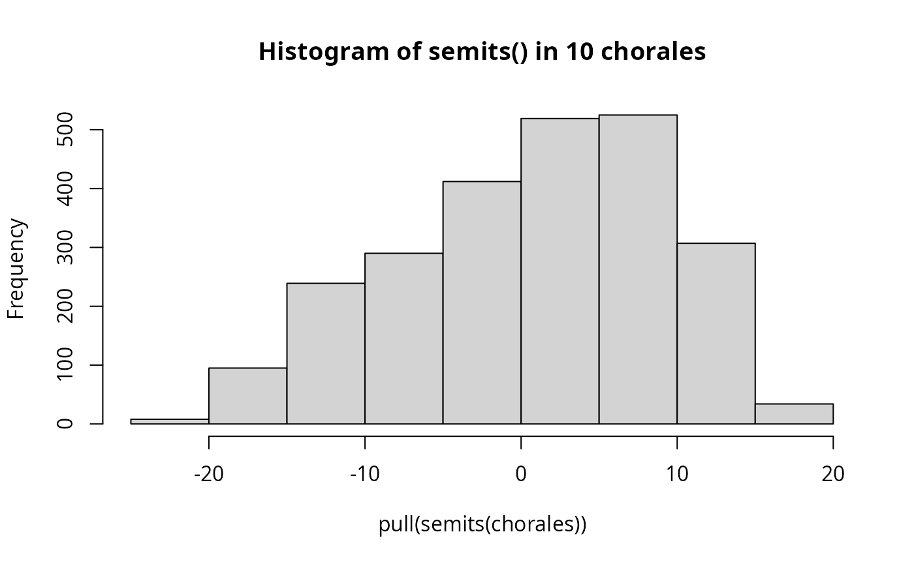
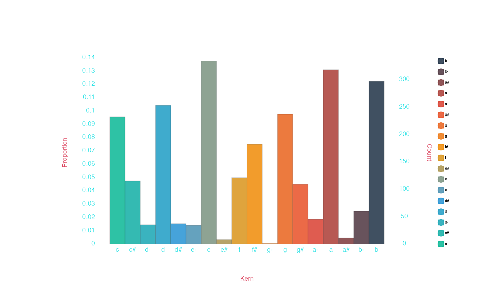
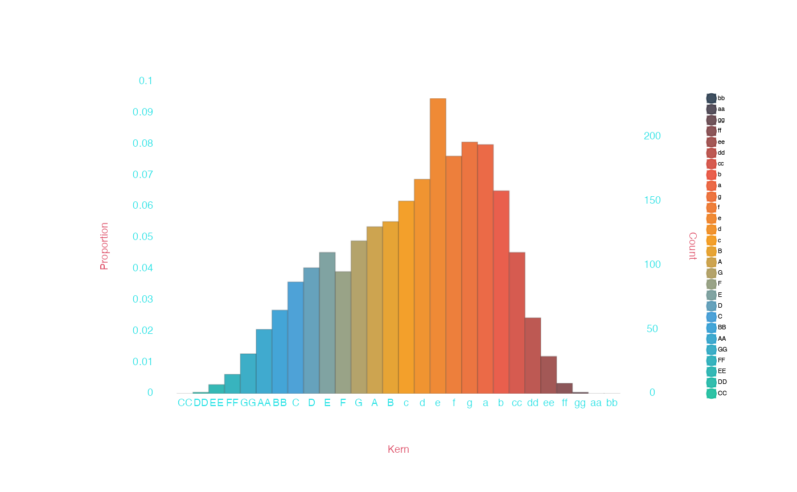
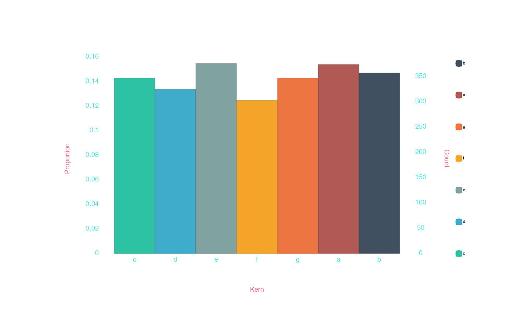
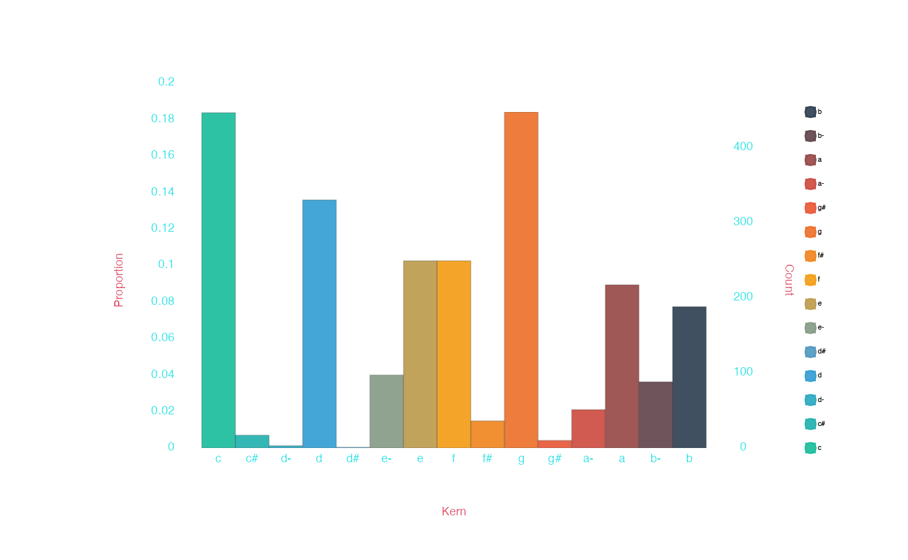
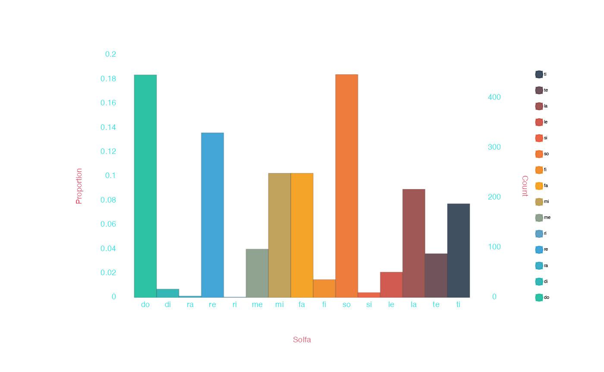

# Pitch and tonality in humdrumR

As a computational musicology toolkit, humdrum$`_{\mathbb{R}}`$’s tools
for analyzing and manipulating pitch data are just about the most
important tools in the toolbox. For the most part,
humdrum$`_{\mathbb{R}}`$’s pitch tools are focused on the Western system
of tonality, and tools for representing pitches in a tonal context are
the focus of *this* vignette—we also have standard tools for looking at
pitch from a Western, 12-tone atonal setting as well.

## Pitches and Intervals

Humdrum$`_{\mathbb{R}}`$ defines a suite of “pitch functions,” like
[`kern()`](https://humdrumR.ccml.gtcmt.gatech.edu/reference/kern.md),
[`solfa()`](https://humdrumR.ccml.gtcmt.gatech.edu/reference/solfa.md),
[`interval()`](https://humdrumR.ccml.gtcmt.gatech.edu/reference/interval.md),
and
[`semits()`](https://humdrumR.ccml.gtcmt.gatech.edu/reference/semits.md).
These functions all work in essentially the same way: they take in an
input argument and output pitch information in their own particular
format. For example, let’s take a little bit of `**kern` data:

``` r

input <- c('4.c', '8d', '4e', '2.g')
```

Notice that this data has both rhythmic information (`4.`, `8`, `4`,
`2.`) *and* pitch information (`c`, `d`, `e`, `g`). What happens if we
give this data to our “pitch functions”?:

``` r
kern(input)
>    **kern (character)
>    [1] c d e g
interval(input)
>    **interval (character)
>    [1] P1  +M2 +M3 +P5
semits(input)
>    **semits (integer)
>    [1] 0 2 4 7
solfa(input)
>    **solfa (character)
>    [1] do re mi so
```

Each function correctly reads the `**kern` pitch information, ignoring
the rhythm information, and outputs the pitch information in a different
format. This allows us to “translate” between different ways of
representing pitch information.

If you *want* to keep the non-pitch (rhythm) information, use the
`inPlace` argument:

``` r
kern(input, inPlace = TRUE)
>    [1] "4.c" "8d"  "4e"  "2.g"
interval(input, inPlace = TRUE)
>    [1] "4.P1"  "8+M2"  "4+M3"  "2.+P5"
semits(input, inPlace = TRUE)
>    [1] "4.0" "82"  "44"  "2.7"
solfa(input, inPlace = TRUE)
>    [1] "4.do" "8re"  "4mi"  "2.so"
```

The cool thing is that each of these functions can read any of the other
functions’ output. So you can do things like:

``` r

kern('Cb6')
>    **kern (character)
>    [1] ccc-

pitch("eee-")
>    **pitch (character)
>    [1] Eb6

pitch(-4) # semits
>    **pitch (character)
>    [1] Ab3

kern('-4')
>    **kern (character)
>    [1] f

solfa('A#6')
>    **solfa (character)
>    [1] ^^li

semits('Ab3')
>    **semits (integer)
>    [1] -4
```

------------------------------------------------------------------------

The complete list of basic pitch functions is:

- **Tonal pitch representations**
  - *Absolute pitch representations*
    - `kern`
    - `pitch`
    - `lilypond`
    - `helmholtz`
    - `tonh` (German-style notation)
  - *Relative pitch representations*
    - `interval`
    - `solfa` (relative-do solfege)
    - `solfg` (French-style fixed-do solfege)
    - `degree` (absolute scale degrees)
    - `deg` (melodic scale degrees)
    - `bhatk` (hindustani swara)
  - *Partial pitch representations*
    - `step`
    - `accidental`
    - `quality`
    - `octave`
- **Atonal pitch representations**
  - *Musical pitch representations*
    - `semits`
    - `midi`
    - `cents`
    - `pc` (pitch classes)
  - *Physical pitch representations*
    - `freq`

Each one of these functions represents a different way of representing
equivalent pitch information.

##### Documentation

The global documentation for *all* the pitch functions can be seen by
calling
[`?pitchFunctions`](https://humdrumR.ccml.gtcmt.gatech.edu/reference/pitchFunctions.md).
You can also call documentation for any individual function, like
[`?kern`](https://humdrumR.ccml.gtcmt.gatech.edu/reference/kern.md).

### Scale degree

Some pitch representations encode [scale
degree](https://en.wikipedia.org/wiki/Degree_(music)), which depends on
the key. We can use the `Key` argument to control how our pitch
functions interpret key—either translating *from* degrees to absolute
pitches, or vice versa. Pass the `Key` argument a humdrum key
interpretation, like `c:` (c minor) or `A-:` (a-flat major).

``` r
absoluteInput <- c('c', 'd-', 'e-', 'g', 'a-')
solfa(absoluteInput)
>    **solfa (character)
>    [1] do ra me so le
solfa(absoluteInput, Key = 'A-:')
>    **solfa (character)
>    [1] mi fa so ti do

degreeInput <- c('do', 're', 'mi', 'fi', 'so')

kern(degreeInput)
>    **kern (character)
>    [1] c  d  e  f# g
kern(degreeInput, Key = 'A-:')
>    **kern (character)
>    [1] a-  b-  cc  dd  ee-
```

------------------------------------------------------------------------

The `Key` argument is vectorized (see the [R
primer](https://humdrumR.ccml.gtcmt.gatech.edu/articles/RPrimer.md) if
you don’t know what that means!); that means that you can actually read
information with different/changing keys.

### Working with pitch representations

Let’s have a look at using pitch functions on real data. Let’s load
humdrum$`_{\mathbb{R}}`$’s built-in Bach chorales:

``` r
chorales <- readHumdrum(humdrumRroot, 'HumdrumData/BachChorales/.*krn')
```

These chorales are full of `**kern` data in the (default) `Token` field,
which can easily be parsed/translated. Maybe we’d like to convert the
`**kern` to semitones. Humdrum$`_{\mathbb{R}}`$’s pitch functions can
all be used in
[humdrum-style](https://humdrumR.ccml.gtcmt.gatech.edu/articles/DataFields.html#humdrum-style "HumdrumR data fields article, humdrum-style section"),
so using
[`semits()`](https://humdrumR.ccml.gtcmt.gatech.edu/reference/semits.md)
is very easy:

``` r

chorales |>
  semits()
```

```
>    ######################## vvv chor001.krn vvv #########################
>                1:  !!!COM: Bach, Johann Sebastian
>                2:  !!!CDT: 1685/02/21/-1750/07/28/
>                3:  !!!OTL@@DE: Aus meines Herzens Grunde
>                4:  !!!OTL@EN:      From the Depths of My Heart
>                5:  !!!SCT: BWV 269
>                6:  !!!PC#: 1
>                7:  !!!AGN: chorale
>                8:         **semits       **semits       **semits       **semits
>                9:                .              .              .              .
>               10:                .              .              .              .
>               11:                .              .              .              .
>               12:        *>[A,A,B]      *>[A,A,B]      *>[A,A,B]      *>[A,A,B]
>               13:     *>norep[A,B]   *>norep[A,B]   *>norep[A,B]   *>norep[A,B]
>               14:              *>A            *>A            *>A            *>A
>               15:          *clefF4       *clefGv2        *clefG2        *clefG2
>               16:                .              .              .              .
>               17:                .              .              .              .
>               18:                .              .              .              .
>               19:                .              .              .              .
>               20:              -17             -1              2              7
>               21:               =1             =1             =1             =1
>               22:               -5             -1              2              7
>               23:               -8              0              4              .
>               24:                .             -1              .              .
>               25:               -6             -3              2             14
>               26:               =2             =2             =2             =2
>               27:               -5             -5              2             11
>               28:              -10             -6              .              .
>               29:                .              .              .              9
>               30:               -8             -5             -1              7
>    31-133::::::::::::::::::::::::::::::::::::::::::::::::::::::::::::::::
>    ######################## ^^^ chor001.krn ^^^ #########################
>    
>           (eight more pieces...)
>    
>    ######################## vvv chor010.krn vvv #########################
>      1-70::::::::::::::::::::::::::::::::::::::::::::::::::::::::::::::::
>               71:              -10             -6              2             11
>               72:                .             -5              .              .
>               73:              -10              .              0              9
>               74:                .             -6              .              .
>               75:              -17             -5             -1              7
>               76:              =11            =11            =11            =11
>               77:              -12             -5              4              7
>               78:              -15             -3              4             12
>               79:               -8             -4              4             11
>               80:                .              .              2              .
>               81:              =12            =12            =12            =12
>               82:               -7             -3              0              9
>               83:              -12             -5              0              4
>               84:              -14             -5              2              7
>               85:              -15             -3              .              5
>               86:              =13            =13            =13            =13
>               87:              -16             -1              2              4
>               88:              -15             -3              0              .
>               89:              -20             -4             -1              .
>               90:               ==             ==             ==             ==
>               91:               *-             *-             *-             *-
>               92:  !!!hum2abc: -Q ''
>               93:  !!!title: @{PC#}. @{OTL@@DE}
>               94:  !!!YOR1: 371 vierstimmige Choralges&auml;nge von Johann Sebastian B***
>               95:  !!!YOR2: 4th ed. by Alfred D&ouml;rffel (Leipzig: Breitkopf und H&a***
>               96:  !!!YOR2: c.1875). 178 pp. Plate "V.A.10".  reprint: J.S. Bach, 371 ***
>               97:  !!!YOR4: Chorales (New York: Associated Music Publishers, Inc., c.1***
>               98:  !!!SMS: B&H, 4th ed, Alfred D&ouml;rffel, c.1875, plate V.A.10
>               99:  !!!EED:  Craig Stuart Sapp
>              100:  !!!EEV:  2009/05/22
>    ######################## ^^^ chor010.krn ^^^ #########################
>                  (***four global comments truncated due to screen size***)
>    
>       humdrumR corpus of ten pieces.
>    
>       Data fields: 
>               *Semits :: integer (**semits tokens)
>                Token  :: character
```

We could then, for instance, make a histogram of the semitone values:

``` r

chorales |>
  semits() |>
  pull() |>
  hist(main = 'Histogram of semits() in 10 chorales')
```



#### Keys

The chorale dataset has key information in its built-in `Key` field. If
we use a pitch function in humdrum- or -tidy style, the `Key` field is
*automatically* passed as a `Key` argument to the function! That means
if we apply
[`solfa()`](https://humdrumR.ccml.gtcmt.gatech.edu/reference/solfa.md),
we will get the correct scale degrees, *given* the keys in the data:

``` r

chorales |>
  solfa(Token)
```

```
>    ######################## vvv chor001.krn vvv #########################
>                1:  !!!COM: Bach, Johann Sebastian
>                2:  !!!CDT: 1685/02/21/-1750/07/28/
>                3:  !!!OTL@@DE: Aus meines Herzens Grunde
>                4:  !!!OTL@EN:      From the Depths of My Heart
>                5:  !!!SCT: BWV 269
>                6:  !!!PC#: 1
>                7:  !!!AGN: chorale
>                8:          **solfa        **solfa        **solfa        **solfa
>                9:                .              .              .              .
>               10:                .              .              .              .
>               11:                .              .              .              .
>               12:        *>[A,A,B]      *>[A,A,B]      *>[A,A,B]      *>[A,A,B]
>               13:     *>norep[A,B]   *>norep[A,B]   *>norep[A,B]   *>norep[A,B]
>               14:              *>A            *>A            *>A            *>A
>               15:          *clefF4       *clefGv2        *clefG2        *clefG2
>               16:           *k[f#]         *k[f#]         *k[f#]         *k[f#]
>               17:              *G:            *G:            *G:            *G:
>               18:                .              .              .              .
>               19:                .              .              .              .
>               20:             vvdo            vmi             so             do
>               21:               =1             =1             =1             =1
>               22:              vdo            vmi             so             do
>               23:              vla             fa             la              .
>               24:                .            vmi              .              .
>               25:              vti            vre             so            ^so
>               26:               =2             =2             =2             =2
>               27:              vdo            vdo             so             mi
>               28:              vso            vti              .              .
>               29:                .              .              .             re
>               30:              vla            vdo            vmi             do
>    31-133::::::::::::::::::::::::::::::::::::::::::::::::::::::::::::::::
>    ######################## ^^^ chor001.krn ^^^ #########################
>    
>           (eight more pieces...)
>    
>    ######################## vvv chor010.krn vvv #########################
>      1-70::::::::::::::::::::::::::::::::::::::::::::::::::::::::::::::::
>               71:              vfa            vla             fa             re
>               72:                .            vte              .              .
>               73:              vfa              .             me             do
>               74:                .            vla              .              .
>               75:             vvte            vte            vre             te
>               76:              =11            =11            =11            =11
>               77:              vme            vte             so             te
>               78:             vvdo            vdo             so            ^me
>               79:              vso            vti             so             re
>               80:                .              .             fa              .
>               81:              =12            =12            =12            =12
>               82:              vle            vdo             me             do
>               83:              vme            vte             me             so
>               84:             vvra            vte             fa             te
>               85:             vvdo            vdo              .             le
>               86:              =13            =13            =13            =13
>               87:             vvti            vre             fa             so
>               88:             vvdo            vdo             me              .
>               89:             vvso            vti            vre              .
>               90:               ==             ==             ==             ==
>               91:               *-             *-             *-             *-
>               92:  !!!hum2abc: -Q ''
>               93:  !!!title: @{PC#}. @{OTL@@DE}
>               94:  !!!YOR1: 371 vierstimmige Choralges&auml;nge von Johann Sebastian B***
>               95:  !!!YOR2: 4th ed. by Alfred D&ouml;rffel (Leipzig: Breitkopf und H&a***
>               96:  !!!YOR2: c.1875). 178 pp. Plate "V.A.10".  reprint: J.S. Bach, 371 ***
>               97:  !!!YOR4: Chorales (New York: Associated Music Publishers, Inc., c.1***
>               98:  !!!SMS: B&H, 4th ed, Alfred D&ouml;rffel, c.1875, plate V.A.10
>               99:  !!!EED:  Craig Stuart Sapp
>              100:  !!!EEV:  2009/05/22
>    ######################## ^^^ chor010.krn ^^^ #########################
>                  (***four global comments truncated due to screen size***)
>    
>       humdrumR corpus of ten pieces.
>    
>       Data fields: 
>               *Solfa :: character (**solfa tokens)
>                Token :: character
```

### Rests

`**kern` data, like in these chorales, includes *rests*, indicated by
`r` in place of a pitch. What happens when a pitch function sees a rest
in our data? Let’s see:

``` r
solfa(c('8gg', '8ff', '4ee', '8dd', '8r', '2cc'))
>    **solfa (character)
>    [1] ^so ^fa ^mi ^re .   ^do
```

The rest token, is output as a null (`.`) value—this null `.` is
actually an R `NA` value. In fact, any token in the input which fails to
parse as pitch will return as `.` (`NA`). For example:

``` r
kern(c('C4', 'X', 'E4'))
>    **kern (character)
>    [1] c . e
```

## Pitch arguments

Since all the “pitch functions” do the same sort of task, they share a
number of common arguments. The complete list of these pitch arguments
can be found in the
[`?pitchParsing`](https://humdrumR.ccml.gtcmt.gatech.edu/reference/pitchParsing.md)
and
[`?pitchDeparsing`](https://humdrumR.ccml.gtcmt.gatech.edu/reference/pitchDeparsing.md)
pages, but the most important ones are described here:

##### Generic vs Specific pitch

All pitch functions accept logical (`TRUE` or `FALSE`) `generic` and
`specific` arguments. If `generic == TRUE`, only generic pitch
information is returned. This affects different pitch representations in
different ways:

- For representations like
  [`kern()`](https://humdrumR.ccml.gtcmt.gatech.edu/reference/kern.md),
  [`pitch()`](https://humdrumR.ccml.gtcmt.gatech.edu/reference/pitch.md)
  and
  [`lilypond()`](https://humdrumR.ccml.gtcmt.gatech.edu/reference/lilypond.md),
  no accidentals are included in generic output;
- For `intervals()`, the interval quality is removed;
- For `solfa`, scale degree four will be “fa”, never “fi” (sharp four).

The `specific` argument is simply the opposite of `generic`, so you have
the choice of indicating `genric = TRUE` or `specific = FALSE`—they are
equivalent.

------------------------------------------------------------------------

In code:

``` r
input <- c('E', 'G#', 'A', 'B-', 'F#', 'G')

pitch(input, generic = FALSE)
>    **pitch (character)
>    [1] E3  G#3 A3  Bb3 F#3 G3
pitch(input, generic = TRUE)
>    **pitch (character)
>    [1] E3 G3 A3 B3 F3 G3

interval(input, specific = TRUE)
>    **interval (character)
>    [1] -m6 -d4 -m3 -M2 -d5 -P4
interval(input, generic = TRUE)
>    **interval (character)
>    [1] -6 -4 -3 -2 -5 -4

solfa(input, specific = TRUE)
>    **solfa (character)
>    [1] vmi vsi vla vte vfi vso
solfa(input, specific = FALSE)
>    **solfa (character)
>    [1] vmi vso vla vti vfa vso
```

##### Simple vs Compound pitch

All pitch functions accept logical (`TRUE` or `FALSE`) `simple` and
`compound` arguments. If `simple == TRUE`, octave information is
stripped from the output, leaving only “simple” pitch information. This
affects different pitch representations in different ways:

- For
  [`pitch()`](https://humdrumR.ccml.gtcmt.gatech.edu/reference/pitch.md)
  and
  [`degree()`](https://humdrumR.ccml.gtcmt.gatech.edu/reference/degree.md),
  the octave number is removed.
- For
  [`lilypond()`](https://humdrumR.ccml.gtcmt.gatech.edu/reference/lilypond.md)
  and
  [`helmholtz()`](https://humdrumR.ccml.gtcmt.gatech.edu/reference/helmholtz.md),
  the octave marks `'` and `,` are removed.
- For
  [`solfa()`](https://humdrumR.ccml.gtcmt.gatech.edu/reference/solfa.md)
  and
  [`deg()`](https://humdrumR.ccml.gtcmt.gatech.edu/reference/degree.md),
  the contour indicators (explanation below) `v` and `^` are removed.
- For
  [`interval()`](https://humdrumR.ccml.gtcmt.gatech.edu/reference/interval.md),
  only steps between 1–7 and returned (i.e., no 10ths).

The `compound` argument is simply the opposite of `simple`, so you have
the choice of indicating `simple = TRUE` or `compound = FALSE`—they are
equivalent.

------------------------------------------------------------------------

In code:

``` r
input <- c('c', 'a', 'dd#', 'ee', 'G', 'GG', 'GG-', 'CCC')

degree(input, simple = FALSE)
>    **degree (character)
>    [1] 1/4  6/4  2+/5 3/5  5/3  5/2  5-/2 1/1
degree(input, simple = TRUE)
>    **degree (character)
>    [1] 1  6  2+ 3  5  5  5- 1


lilypond(input, compound = TRUE)
>    **lilypond (character)
>    [1] c'    a'    dis'' e''   g     g,    ges,  c,,
lilypond(input, simple = TRUE)
>    **lilypond (character)
>    [1] c   a   dis e   g   g   ges c

semits(input, compound = TRUE) 
>    **semits (integer)
>    [1]   0   9  15  16  -5 -17 -18 -36
semits(input, compound = FALSE)
>    **semits (integer)
>    [1] 0 9 3 4 7 7 6 0

solfa(input, compound = TRUE)
>    **solfa (character)
>    [1] do    la    ^ri   ^mi   vso   vvso  vvse  vvvdo
solfa(input, compound = FALSE)
>    **solfa (character)
>    [1] do la ri mi so so se do

interval(input, simple = FALSE)
>    **interval (character)
>    [1] P1   +M6  +A9  +M10 -P4  -P11 -A11 -P22
interval(input, simple = TRUE)
>    **interval (character)
>    [1] P1  +M6 +A2 +M3 -P4 -P4 -A4 -P1
```

#### Working with pitch arguments

The `generic` and `simple` arguments are useful if you want to tabulate
pitch classes, for example:

``` r
chorales <- readHumdrum(humdrumRroot, 'HumdrumData/BachChorales/.*krn')


chorales |>
  kern(simple = TRUE) |>
  count() |>
  draw()
```



``` r
chorales |>
  kern(generic = TRUE) |>
  count() |>
  draw()
```



``` r

chorales |>
  kern(simple = TRUE, generic = TRUE) |>
  count() |>
  draw()
```



### Transposition

All of humdrum$`_{\mathbb{R}}`$’s pitch functions have built-in
transposition functionality. You can use this functionality by passing a
named list of arguments to the
[`transpose()`](https://humdrumR.ccml.gtcmt.gatech.edu/reference/transpose.md)
function, as the `transposeArgs` argument to the pitch function call,
like in this example using the `by` argument:

``` r
kern(c('c', 'd', 'e', 'f', 'f#', 'g'), transposeArgs = list(by = 'M2'))
>    **kern (character)
>    [1] d  e  f# g  g# a
```

Another option is to transpose by key. You can the `to` argument through
to `tranpose()`. Let’s say we have music in A major that we’d like to
transpose *to* C major:

``` r
Amelody <- c('8A', '8B', '4.c#', '16d', '8c#','8f#', '8e', '8d#', '4e')

kern(Amelody, Key = 'A:', transposeArgs = list(to = 'C:'))
>    **kern (character)
>    [1] C  D  E  F  E  A  G  F# G
```

So the `Key` argument to
[`kern()`](https://humdrumR.ccml.gtcmt.gatech.edu/reference/kern.md)
indicates the key the music is coming from, and the `to` argument in
`tranposeArgs` indicates where to transpose it to. Since humdrum/tidy
functions automatically use `Key` information from a data set, this
makes it very easy to, say, transpose all `**kern` tokens in your data
to C major:

``` r
chorales <- readHumdrum(humdrumRroot, 'HumdrumData/BachChorales/.*krn')

chorales |>
  kern(simple = TRUE, transposeArgs = list(to = 'C:')) |>
  count() |>
  draw()
```



This looks exactly like calling
[`solfa()`](https://humdrumR.ccml.gtcmt.gatech.edu/reference/solfa.md):

``` r
chorales |>
  solfa(simple = TRUE) |>
  count() |>
  draw()
```



## Melody and Harmony

### Melodic Intervals

What if we want to calculate melodic intervals in each part of a score?
This the purpose of the
[`mint()`](https://humdrumR.ccml.gtcmt.gatech.edu/reference/int.md)
(melodic intervals) command. We can use
[`mint()`](https://humdrumR.ccml.gtcmt.gatech.edu/reference/int.md) on
any pitch data:

``` r
input <- c('d', 'B-', 'A', 'G', 'D', 'd', 'B-', 'G#', 'A', 'f', 'e', 'd')

mint(input)
>    **interval (character)
>     [1] [d] -M3 -m2 -M2 -P4 +P8 -M3 -d3 +m2 +m6 -m2 -M2
```

If you use
[`mint()`](https://humdrumR.ccml.gtcmt.gatech.edu/reference/int.md) in
humdrum- or tidy- style on a humdrum$`_{\mathbb{R}}`$ dataobject,
[`mint()`](https://humdrumR.ccml.gtcmt.gatech.edu/reference/int.md) will
automatically be called within each spine/path in each file (this is
accomplished using the `groupby` argument to
[`mint()`](https://humdrumR.ccml.gtcmt.gatech.edu/reference/int.md)):

``` r

chorales <- readHumdrum(humdrumRroot, 'HumdrumData/BachChorales/.*krn')

chorales |> 
  mint()
```

```
>    ######################## vvv chor001.krn vvv #########################
>                1:  !!!COM: Bach, Johann Sebastian
>                2:  !!!CDT: 1685/02/21/-1750/07/28/
>                3:  !!!OTL@@DE: Aus meines Herzens Grunde
>                4:  !!!OTL@EN:      From the Depths of My Heart
>                5:  !!!SCT: BWV 269
>                6:  !!!PC#: 1
>                7:  !!!AGN: chorale
>                8:       **interval     **interval     **interval     **interval
>                9:                .              .              .              .
>               10:                .              .              .              .
>               11:                .              .              .              .
>               12:        *>[A,A,B]      *>[A,A,B]      *>[A,A,B]      *>[A,A,B]
>               13:     *>norep[A,B]   *>norep[A,B]   *>norep[A,B]   *>norep[A,B]
>               14:              *>A            *>A            *>A            *>A
>               15:          *clefF4       *clefGv2        *clefG2        *clefG2
>               16:           *k[f#]         *k[f#]         *k[f#]         *k[f#]
>               17:              *G:            *G:            *G:            *G:
>               18:                .              .              .              .
>               19:                .              .              .              .
>               20:             [GG]            [B]            [d]            [g]
>               21:               =1             =1             =1             =1
>               22:              +P8             P1             P1             P1
>               23:              -m3            +m2            +M2              .
>               24:                .            -m2              .              .
>               25:              +M2            -M2            -M2            +P5
>               26:               =2             =2             =2             =2
>               27:              +m2            -M2             P1            -m3
>               28:              -P4            -m2              .              .
>               29:                .              .              .            -M2
>               30:              +M2            +m2            -m3            -M2
>    31-133::::::::::::::::::::::::::::::::::::::::::::::::::::::::::::::::
>    ######################## ^^^ chor001.krn ^^^ #########################
>    
>           (eight more pieces...)
>    
>    ######################## vvv chor010.krn vvv #########################
>      1-70::::::::::::::::::::::::::::::::::::::::::::::::::::::::::::::::
>               71:              +M2            -d5            -M2            +M3
>               72:                .            +m2              .              .
>               73:               P1              .            -M2            -M2
>               74:                .            -m2              .              .
>               75:              -P5            +m2            -m2            -M2
>               76:              =11            =11            =11            =11
>               77:              +P4             P1            +P4             P1
>               78:              -m3            +M2             P1            +P4
>               79:              +P5            -m2             P1            -m2
>               80:                .              .            -M2              .
>               81:              =12            =12            =12            =12
>               82:              +m2            +m2            -M2            -M2
>               83:              -P4            -M2             P1            -P4
>               84:              -M2             P1            +M2            +m3
>               85:              -m2            +M2              .            -M2
>               86:              =13            =13            =13            =13
>               87:              -m2            +M2             P1            -m2
>               88:              +m2            -M2            -M2              .
>               89:              -P4            -m2            -m2              .
>               90:               ==             ==             ==             ==
>               91:               *-             *-             *-             *-
>               92:  !!!hum2abc: -Q ''
>               93:  !!!title: @{PC#}. @{OTL@@DE}
>               94:  !!!YOR1: 371 vierstimmige Choralges&auml;nge von Johann Sebastian B***
>               95:  !!!YOR2: 4th ed. by Alfred D&ouml;rffel (Leipzig: Breitkopf und H&a***
>               96:  !!!YOR2: c.1875). 178 pp. Plate "V.A.10".  reprint: J.S. Bach, 371 ***
>               97:  !!!YOR4: Chorales (New York: Associated Music Publishers, Inc., c.1***
>               98:  !!!SMS: B&H, 4th ed, Alfred D&ouml;rffel, c.1875, plate V.A.10
>               99:  !!!EED:  Craig Stuart Sapp
>              100:  !!!EEV:  2009/05/22
>    ######################## ^^^ chor010.krn ^^^ #########################
>                  (***four global comments truncated due to screen size***)
>    
>       humdrumR corpus of ten pieces.
>    
>       Data fields: 
>               *Mint  :: character (**interval tokens)
>                Token :: character
```

[`mint()`](https://humdrumR.ccml.gtcmt.gatech.edu/reference/int.md) has
a number of special options, which you can read about in the manual by
checking out
[`?mint`](https://humdrumR.ccml.gtcmt.gatech.edu/reference/int.md). For
now, we’ll just show you the `classify` argument, which can be used to
classify output intervals as either `Unison`, `Step`, `Skip`, or `Leap`:

``` r
chorales |>
  mint(classify = TRUE)
```

```
>    ######################## vvv chor001.krn vvv #########################
>                1:  !!!COM: Bach, Johann Sebastian
>                2:  !!!CDT: 1685/02/21/-1750/07/28/
>                3:  !!!OTL@@DE: Aus meines Herzens Grunde
>                4:  !!!OTL@EN:      From the Depths of My Heart
>                5:  !!!SCT: BWV 269
>                6:  !!!PC#: 1
>                7:  !!!AGN: chorale
>                8:           **kern         **kern         **kern         **kern
>                9:           *ICvox         *ICvox         *ICvox         *ICvox
>               10:           *Ibass        *Itenor         *Ialto        *Isoprn
>               11:          *I"Bass       *I"Tenor        *I"Alto     *I"Soprano
>               12:        *>[A,A,B]      *>[A,A,B]      *>[A,A,B]      *>[A,A,B]
>               13:     *>norep[A,B]   *>norep[A,B]   *>norep[A,B]   *>norep[A,B]
>               14:              *>A            *>A            *>A            *>A
>               15:          *clefF4       *clefGv2        *clefG2        *clefG2
>               16:           *k[f#]         *k[f#]         *k[f#]         *k[f#]
>               17:              *G:            *G:            *G:            *G:
>               18:            *M3/4          *M3/4          *M3/4          *M3/4
>               19:           *MM100         *MM100         *MM100         *MM100
>               20:             [GG]            [B]            [d]            [g]
>               21:               =1             =1             =1             =1
>               22:          +Unison         Unison         Unison         Unison
>               23:            -Skip          +Step          +Step              .
>               24:                .          -Step              .              .
>               25:            +Step          -Step          -Step          +Leap
>               26:               =2             =2             =2             =2
>               27:            +Step          -Step         Unison          -Skip
>               28:            -Leap          -Step              .              .
>               29:                .              .              .          -Step
>               30:            +Step          +Step          -Skip          -Step
>    31-133::::::::::::::::::::::::::::::::::::::::::::::::::::::::::::::::
>    ######################## ^^^ chor001.krn ^^^ #########################
>    
>           (eight more pieces...)
>    
>    ######################## vvv chor010.krn vvv #########################
>      1-70::::::::::::::::::::::::::::::::::::::::::::::::::::::::::::::::
>               71:            +Step          -Leap          -Step          +Skip
>               72:                .          +Step              .              .
>               73:           Unison              .          -Step          -Step
>               74:                .          -Step              .              .
>               75:            -Leap          +Step          -Step          -Step
>               76:              =11            =11            =11            =11
>               77:            +Leap         Unison          +Leap         Unison
>               78:            -Skip          +Step         Unison          +Leap
>               79:            +Leap          -Step         Unison          -Step
>               80:                .              .          -Step              .
>               81:              =12            =12            =12            =12
>               82:            +Step          +Step          -Step          -Step
>               83:            -Leap          -Step         Unison          -Leap
>               84:            -Step         Unison          +Step          +Skip
>               85:            -Step          +Step              .          -Step
>               86:              =13            =13            =13            =13
>               87:            -Step          +Step         Unison          -Step
>               88:            +Step          -Step          -Step              .
>               89:            -Leap          -Step          -Step              .
>               90:               ==             ==             ==             ==
>               91:               *-             *-             *-             *-
>               92:  !!!hum2abc: -Q ''
>               93:  !!!title: @{PC#}. @{OTL@@DE}
>               94:  !!!YOR1: 371 vierstimmige Choralges&auml;nge von Johann Sebastian B***
>               95:  !!!YOR2: 4th ed. by Alfred D&ouml;rffel (Leipzig: Breitkopf und H&a***
>               96:  !!!YOR2: c.1875). 178 pp. Plate "V.A.10".  reprint: J.S. Bach, 371 ***
>               97:  !!!YOR4: Chorales (New York: Associated Music Publishers, Inc., c.1***
>               98:  !!!SMS: B&H, 4th ed, Alfred D&ouml;rffel, c.1875, plate V.A.10
>               99:  !!!EED:  Craig Stuart Sapp
>              100:  !!!EEV:  2009/05/22
>    ######################## ^^^ chor010.krn ^^^ #########################
>                  (***four global comments truncated due to screen size***)
>    
>       humdrumR corpus of ten pieces.
>    
>       Data fields: 
>               *Mint  :: character
>                Token :: character
```

### Harmonic intervals

In parallel to
[`mint()`](https://humdrumR.ccml.gtcmt.gatech.edu/reference/int.md) is
[`hint()`](https://humdrumR.ccml.gtcmt.gatech.edu/reference/int.md)
(harmonic intervals) command.
[`hint()`](https://humdrumR.ccml.gtcmt.gatech.edu/reference/int.md)
works just like
[`mint()`](https://humdrumR.ccml.gtcmt.gatech.edu/reference/int.md)
except it calculates intervals from left to right in each record of a
file:

``` r
chorales |>
  hint()
```

```
>    ######################## vvv chor001.krn vvv #########################
>                1:  !!!COM: Bach, Johann Sebastian
>                2:  !!!CDT: 1685/02/21/-1750/07/28/
>                3:  !!!OTL@@DE: Aus meines Herzens Grunde
>                4:  !!!OTL@EN:      From the Depths of My Heart
>                5:  !!!SCT: BWV 269
>                6:  !!!PC#: 1
>                7:  !!!AGN: chorale
>                8:       **interval     **interval     **interval     **interval
>                9:                .              .              .              .
>               10:                .              .              .              .
>               11:                .              .              .              .
>               12:        *>[A,A,B]      *>[A,A,B]      *>[A,A,B]      *>[A,A,B]
>               13:     *>norep[A,B]   *>norep[A,B]   *>norep[A,B]   *>norep[A,B]
>               14:              *>A            *>A            *>A            *>A
>               15:          *clefF4       *clefGv2        *clefG2        *clefG2
>               16:           *k[f#]         *k[f#]         *k[f#]         *k[f#]
>               17:              *G:            *G:            *G:            *G:
>               18:                .              .              .              .
>               19:                .              .              .              .
>               20:             [GG]           +M10            +m3            +P4
>               21:               =1             =1             =1             =1
>               22:              [G]            +M3            +m3            +P4
>               23:              [E]            +m6            +M3              .
>               24:                .            [B]              .              .
>               25:             [F#]            +m3            +P4            +P8
>               26:               =2             =2             =2             =2
>               27:              [G]             P1            +P5            +M6
>               28:              [D]            +M3              .              .
>               29:                .              .              .            [a]
>               30:              [E]            +m3            +M3            +m6
>    31-133::::::::::::::::::::::::::::::::::::::::::::::::::::::::::::::::
>    ######################## ^^^ chor001.krn ^^^ #########################
>    
>           (eight more pieces...)
>    
>    ######################## vvv chor010.krn vvv #########################
>      1-70::::::::::::::::::::::::::::::::::::::::::::::::::::::::::::::::
>               71:              [D]            +M3            +m6            +M6
>               72:                .            [G]              .              .
>               73:              [D]              .            +m7            +M6
>               74:                .           [F#]              .              .
>               75:             [GG]            +P8            +M3            +m6
>               76:              =11            =11            =11            =11
>               77:              [C]            +P5            +M6            +m3
>               78:             [AA]            +P8            +P5            +m6
>               79:              [E]            +M3            +m6            +P5
>               80:                .              .            [d]              .
>               81:              =12            =12            =12            =12
>               82:              [F]            +M3            +m3            +M6
>               83:              [C]            +P5            +P4            +M3
>               84:            [BB-]            +M6            +P5            +P4
>               85:             [AA]            +P8              .            +m6
>               86:              =13            =13            =13            =13
>               87:            [GG#]           +m10            +m3            +M2
>               88:             [AA]            +P8            +m3              .
>               89:             [EE]           +M10            +m3              .
>               90:               ==             ==             ==             ==
>               91:               *-             *-             *-             *-
>               92:  !!!hum2abc: -Q ''
>               93:  !!!title: @{PC#}. @{OTL@@DE}
>               94:  !!!YOR1: 371 vierstimmige Choralges&auml;nge von Johann Sebastian B***
>               95:  !!!YOR2: 4th ed. by Alfred D&ouml;rffel (Leipzig: Breitkopf und H&a***
>               96:  !!!YOR2: c.1875). 178 pp. Plate "V.A.10".  reprint: J.S. Bach, 371 ***
>               97:  !!!YOR4: Chorales (New York: Associated Music Publishers, Inc., c.1***
>               98:  !!!SMS: B&H, 4th ed, Alfred D&ouml;rffel, c.1875, plate V.A.10
>               99:  !!!EED:  Craig Stuart Sapp
>              100:  !!!EEV:  2009/05/22
>    ######################## ^^^ chor010.krn ^^^ #########################
>                  (***four global comments truncated due to screen size***)
>    
>       humdrumR corpus of ten pieces.
>    
>       Data fields: 
>               *Hint  :: character (**interval tokens)
>                Token :: character
```

A special trick is to use the `lag` argument to calculate harmonic
intervals all in relation to the same spine. For example, you can
calculate harmonic intervals between each voice and the bass voice like
so:

``` r

chorales |>
  hint(lag = Spine == 1)
```

```
>    ######################## vvv chor001.krn vvv #########################
>                1:  !!!COM: Bach, Johann Sebastian
>                2:  !!!CDT: 1685/02/21/-1750/07/28/
>                3:  !!!OTL@@DE: Aus meines Herzens Grunde
>                4:  !!!OTL@EN:      From the Depths of My Heart
>                5:  !!!SCT: BWV 269
>                6:  !!!PC#: 1
>                7:  !!!AGN: chorale
>                8:       **interval     **interval     **interval     **interval
>                9:                .              .              .              .
>               10:                .              .              .              .
>               11:                .              .              .              .
>               12:        *>[A,A,B]      *>[A,A,B]      *>[A,A,B]      *>[A,A,B]
>               13:     *>norep[A,B]   *>norep[A,B]   *>norep[A,B]   *>norep[A,B]
>               14:              *>A            *>A            *>A            *>A
>               15:          *clefF4       *clefGv2        *clefG2        *clefG2
>               16:           *k[f#]         *k[f#]         *k[f#]         *k[f#]
>               17:              *G:            *G:            *G:            *G:
>               18:                .              .              .              .
>               19:                .              .              .              .
>               20:             [GG]           +M10           +P12           +P15
>               21:               =1             =1             =1             =1
>               22:              [G]            +M3            +P5            +P8
>               23:              [E]            +m6            +P8              .
>               24:                .            [B]              .              .
>               25:             [F#]            +m3            +m6           +m13
>               26:               =2             =2             =2             =2
>               27:              [G]             P1            +P5           +M10
>               28:              [D]            +M3              .              .
>               29:                .              .              .            [a]
>               30:              [E]            +m3            +P5           +m10
>    31-133::::::::::::::::::::::::::::::::::::::::::::::::::::::::::::::::
>    ######################## ^^^ chor001.krn ^^^ #########################
>    
>           (eight more pieces...)
>    
>    ######################## vvv chor010.krn vvv #########################
>      1-70::::::::::::::::::::::::::::::::::::::::::::::::::::::::::::::::
>               71:              [D]            +M3            +P8           +M13
>               72:                .            [G]              .              .
>               73:              [D]              .            +m7           +P12
>               74:                .           [F#]              .              .
>               75:             [GG]            +P8           +M10           +P15
>               76:              =11            =11            =11            =11
>               77:              [C]            +P5           +M10           +P12
>               78:             [AA]            +P8           +P12           +m17
>               79:              [E]            +M3            +P8           +P12
>               80:                .              .            [d]              .
>               81:              =12            =12            =12            =12
>               82:              [F]            +M3            +P5           +M10
>               83:              [C]            +P5            +P8           +M10
>               84:            [BB-]            +M6           +M10           +M13
>               85:             [AA]            +P8              .           +m13
>               86:              =13            =13            =13            =13
>               87:            [GG#]           +m10           +d12           +m13
>               88:             [AA]            +P8           +m10              .
>               89:             [EE]           +M10           +P12              .
>               90:               ==             ==             ==             ==
>               91:               *-             *-             *-             *-
>               92:  !!!hum2abc: -Q ''
>               93:  !!!title: @{PC#}. @{OTL@@DE}
>               94:  !!!YOR1: 371 vierstimmige Choralges&auml;nge von Johann Sebastian B***
>               95:  !!!YOR2: 4th ed. by Alfred D&ouml;rffel (Leipzig: Breitkopf und H&a***
>               96:  !!!YOR2: c.1875). 178 pp. Plate "V.A.10".  reprint: J.S. Bach, 371 ***
>               97:  !!!YOR4: Chorales (New York: Associated Music Publishers, Inc., c.1***
>               98:  !!!SMS: B&H, 4th ed, Alfred D&ouml;rffel, c.1875, plate V.A.10
>               99:  !!!EED:  Craig Stuart Sapp
>              100:  !!!EEV:  2009/05/22
>    ######################## ^^^ chor010.krn ^^^ #########################
>                  (***four global comments truncated due to screen size***)
>    
>       humdrumR corpus of ten pieces.
>    
>       Data fields: 
>               *Hint  :: character (**interval tokens)
>                Token :: character
```

Or, harmonic intervals from the soprano like so:

``` r
chorales |>
  hint(lag = Spine == 4)
```

```
>    ######################## vvv chor001.krn vvv #########################
>                1:  !!!COM: Bach, Johann Sebastian
>                2:  !!!CDT: 1685/02/21/-1750/07/28/
>                3:  !!!OTL@@DE: Aus meines Herzens Grunde
>                4:  !!!OTL@EN:      From the Depths of My Heart
>                5:  !!!SCT: BWV 269
>                6:  !!!PC#: 1
>                7:  !!!AGN: chorale
>                8:       **interval     **interval     **interval     **interval
>                9:                .              .              .              .
>               10:                .              .              .              .
>               11:                .              .              .              .
>               12:        *>[A,A,B]      *>[A,A,B]      *>[A,A,B]      *>[A,A,B]
>               13:     *>norep[A,B]   *>norep[A,B]   *>norep[A,B]   *>norep[A,B]
>               14:              *>A            *>A            *>A            *>A
>               15:          *clefF4       *clefGv2        *clefG2        *clefG2
>               16:           *k[f#]         *k[f#]         *k[f#]         *k[f#]
>               17:              *G:            *G:            *G:            *G:
>               18:                .              .              .              .
>               19:                .              .              .              .
>               20:             -P15            -m6            -P4            [g]
>               21:               =1             =1             =1             =1
>               22:              -P8            -m6            -P4            [g]
>               23:              [E]            [c]            [e]              .
>               24:                .            [B]              .              .
>               25:             -m13           -P11            -P8           [dd]
>               26:               =2             =2             =2             =2
>               27:             -M10           -M10            -M6            [b]
>               28:              [D]           [F#]              .              .
>               29:                .              .              .            [a]
>               30:             -m10            -P8            -m6            [g]
>    31-133::::::::::::::::::::::::::::::::::::::::::::::::::::::::::::::::
>    ######################## ^^^ chor001.krn ^^^ #########################
>    
>           (eight more pieces...)
>    
>    ######################## vvv chor010.krn vvv #########################
>      1-70::::::::::::::::::::::::::::::::::::::::::::::::::::::::::::::::
>               71:             -M13           -P11            -M6            [b]
>               72:                .            [G]              .              .
>               73:             -P12              .            -M6            [a]
>               74:                .           [F#]              .              .
>               75:             -P15            -P8            -m6            [g]
>               76:              =11            =11            =11            =11
>               77:             -P12            -P8            -m3            [g]
>               78:             -m17           -m10            -m6           [cc]
>               79:             -P12           -m10            -P5            [b]
>               80:                .              .            [d]              .
>               81:              =12            =12            =12            =12
>               82:             -M10            -P8            -M6            [a]
>               83:             -M10            -M6            -M3            [e]
>               84:             -M13            -P8            -P4            [g]
>               85:             -m13            -m6              .            [f]
>               86:              =13            =13            =13            =13
>               87:             -m13            -P4            -M2            [e]
>               88:             [AA]            [A]            [c]              .
>               89:             [EE]           [G#]            [B]              .
>               90:               ==             ==             ==             ==
>               91:               *-             *-             *-             *-
>               92:  !!!hum2abc: -Q ''
>               93:  !!!title: @{PC#}. @{OTL@@DE}
>               94:  !!!YOR1: 371 vierstimmige Choralges&auml;nge von Johann Sebastian B***
>               95:  !!!YOR2: 4th ed. by Alfred D&ouml;rffel (Leipzig: Breitkopf und H&a***
>               96:  !!!YOR2: c.1875). 178 pp. Plate "V.A.10".  reprint: J.S. Bach, 371 ***
>               97:  !!!YOR4: Chorales (New York: Associated Music Publishers, Inc., c.1***
>               98:  !!!SMS: B&H, 4th ed, Alfred D&ouml;rffel, c.1875, plate V.A.10
>               99:  !!!EED:  Craig Stuart Sapp
>              100:  !!!EEV:  2009/05/22
>    ######################## ^^^ chor010.krn ^^^ #########################
>                  (***four global comments truncated due to screen size***)
>    
>       humdrumR corpus of ten pieces.
>    
>       Data fields: 
>               *Hint  :: character (**interval tokens)
>                Token :: character
```

Check out the “Logical lags” section of the
[`?hint`](https://humdrumR.ccml.gtcmt.gatech.edu/reference/int.md)
manual for details.
