# Making plots with humdrumR

Welcome to “Making plots with humdrum$_{\mathbb{R}}$”! R has two major
plotting systems that are widely used: 1) R’s built-in base graphics
functions (`?graphics-package`) and 2) the more modern
[ggplot2](#ggplot2). Humdrum$_{\mathbb{R}}$ is compatible with both of
these systems. Humdrum$_{\mathbb{R}}$ also has it’s own, built-in
[draw()](#draw) function, which is basically a spiffy (easier to use)
extension of base-R graphics.

In this vignette we give a detailed showcase of the features of
[draw()](#draw). We’ll then we go over some basic concepts from base-R
graphics, which you can use if you want to customize [draw()](#draw)
plots. Finally, we’ll show you how to use [ggplot2](#ggplot2) with
humdrum$_{\mathbb{R}}$ data, if that floats your boat.

------------------------------------------------------------------------

Let’s load some humdrum data, and create some data fields to plot:

``` r
bach <- readHumdrum(humdrumRroot, 'HumdrumData/BachChorales/.*krn')
```

We’ll use
[`semits()`](https://humdrumR.ccml.gtcmt.gatech.edu/reference/semits.md)
and
[`duration()`](https://humdrumR.ccml.gtcmt.gatech.edu/reference/duration.md)
to convert pitch and rhythmic information into numbers, and
[`solfa()`](https://humdrumR.ccml.gtcmt.gatech.edu/reference/solfa.md)
and
[`recip()`](https://humdrumR.ccml.gtcmt.gatech.edu/reference/recip.md)
to represent them in categorical form.

``` r
bach |>
  mutate(Semits = semits(Token),
         Duration = duration(Token),
         Recip = recip(Token)) -> bach
```

## Draw()

Humdrum$_{\mathbb{R}}$’s [draw()](#draw) function is basically a fancy
wrapper around base-R functions like
[`plot()`](https://rdrr.io/r/graphics/plot.default.html) and
[`hist()`](https://rdrr.io/r/graphics/hist.html). Like these functions,
using [draw()](#draw) is simple: just pass data (atomic vectors
[`?vector`](https://rdrr.io/r/base/vector.html)) in to get a plot. The
[draw()](#draw) function will look at the input arguments you give it,
and make an appropriate plot for that input type. Currently,
[`draw()`](https://humdrumR.ccml.gtcmt.gatech.edu/reference/draw.md) can
make seven different types of plots, depending on the input passed to
it.

To decide what kind of plot to make, [draw()](#draw) looks at its first
two arguments, `x` and `y`, which represent (you guessed it) the X and Y
axes. Here are the types of plots associated with different types of
`x`/`y` arguments:

| `x`                   | `y`                     | Plot type                 | Function                                                                             |
|-----------------------|-------------------------|---------------------------|--------------------------------------------------------------------------------------|
| `numeric`             | (missing)               | Density Histogram/Contour | [`draw_density()`](https://humdrumR.ccml.gtcmt.gatech.edu/reference/draw_density.md) |
| (missing)             | `numeric`               | Quantile plot             | [`draw_Qplot()`](https://humdrumR.ccml.gtcmt.gatech.edu/reference/draw_Qplot.md)     |
|                       |                         | (or Violin plot)          |                                                                                      |
| `numeric`             | `numeric`               | Scatter/line plot         | [`draw_scatter()`](https://humdrumR.ccml.gtcmt.gatech.edu/reference/draw_scatter.md) |
| `character`/`factor`  | `numeric`               | Violin plot               | [`draw_violins()`](https://humdrumR.ccml.gtcmt.gatech.edu/reference/draw_violins.md) |
| `numeric`             | `character` or `factor` | Area chart                | [`draw_area()`](https://humdrumR.ccml.gtcmt.gatech.edu/reference/draw_area.md)       |
| `character`/ `factor` | (missing)               | barplot                   | [`draw_barplot()`](https://humdrumR.ccml.gtcmt.gatech.edu/reference/draw_barplot.md) |
| (missing)             | `character`/`factor`    | barplot                   | [`draw_barplot()`](https://humdrumR.ccml.gtcmt.gatech.edu/reference/draw_barplot.md) |
| `character`/`factor`  | `character`/`factor`    | Heat map                  | [`draw_heat()`](https://humdrumR.ccml.gtcmt.gatech.edu/reference/draw_heat.md)       |

To see this in action, let’s see what happens if we pass our `Semits`
field as either the first (`x`) or second (`y`) argument to
[draw()](#draw):

``` r

bach |> draw(Semits)
```


``` r

bach |> draw( , Semits)
```

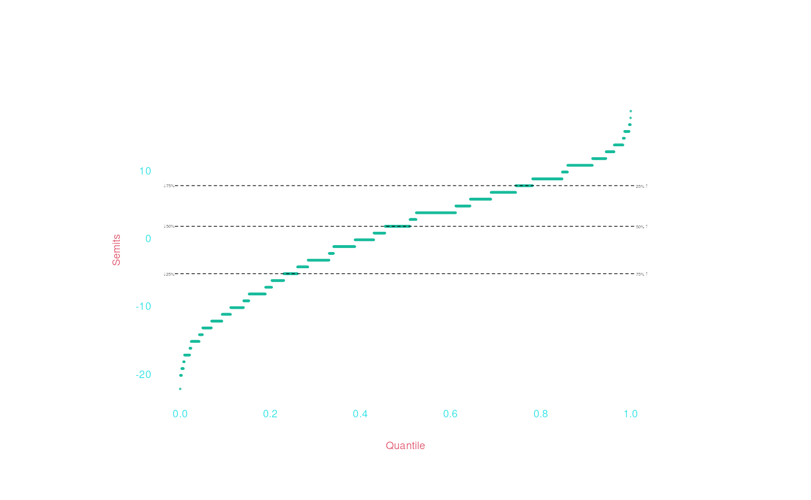

On the X axis, numeric data is drawn as a density histogram
([`draw_density()`](https://humdrumR.ccml.gtcmt.gatech.edu/reference/draw_density.md));
on the Y axis, a quantile plot
([`draw_Qplot()`](https://humdrumR.ccml.gtcmt.gatech.edu/reference/draw_Qplot.md)).
What if we pass two numeric variables (`Semits` *and* `Duration`)? We
get a scatter plot:

``` r

bach |> draw(Duration, Semits)
```

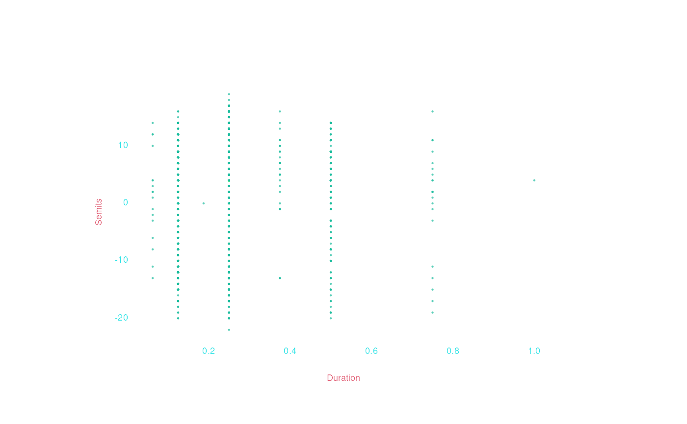

We can see that there are really only eight duration values in the data
(because durations in music scores aren’t really continuous numbers). To
make the data easier to interpret, we can use the `jitter` argument to
randomly move points a little bit, so you can see how many there are.
(Also check out the `lm` argument.)

``` r

bach |> draw(Duration, Semits, jitter = 'xy', lm = TRUE)
```

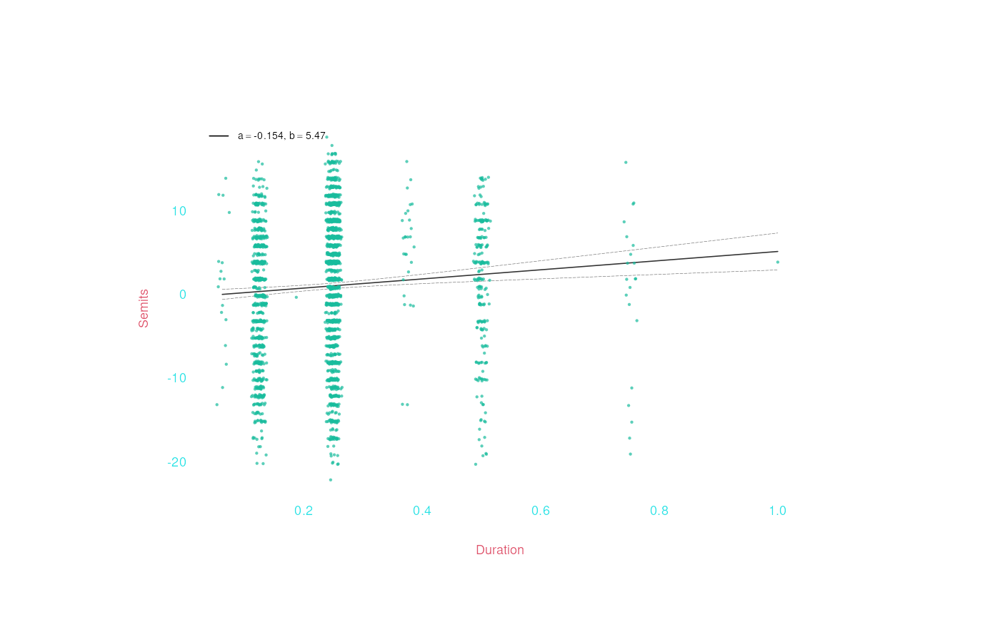

Maybe it would make more sense with duration on a logarithmic scale?

``` r

bach |> draw(Duration, Semits, jitter = 'xy', log = 'x', lm = TRUE)
```

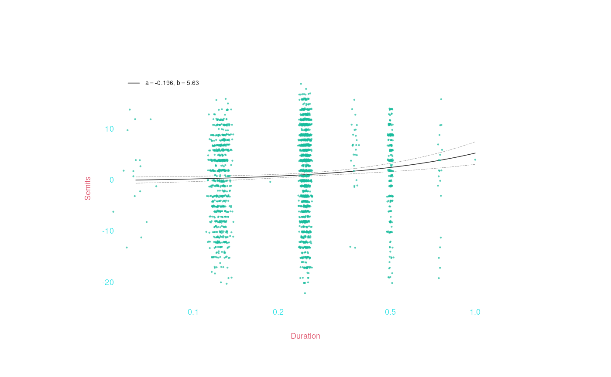

It does appear that there is a positive corelation/slope between
duration and pitch (though this is not a statistical test!), but it
still bothers me that the duration values aren’t really continous
numbers. Let’s instead treat duration as categories: we can simply pass
[draw()](#draw) the `Recip` representation of duration, which are
`character` strings:

``` r

bach |> draw(Recip)
```

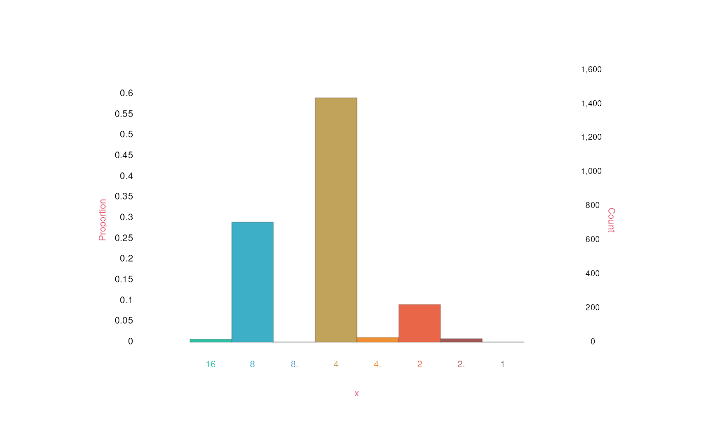

We can also check out other categorical data, like the `Instrument`
field, which records the voice type in our chorale data:

``` r

bach |> draw(Instrument)
```

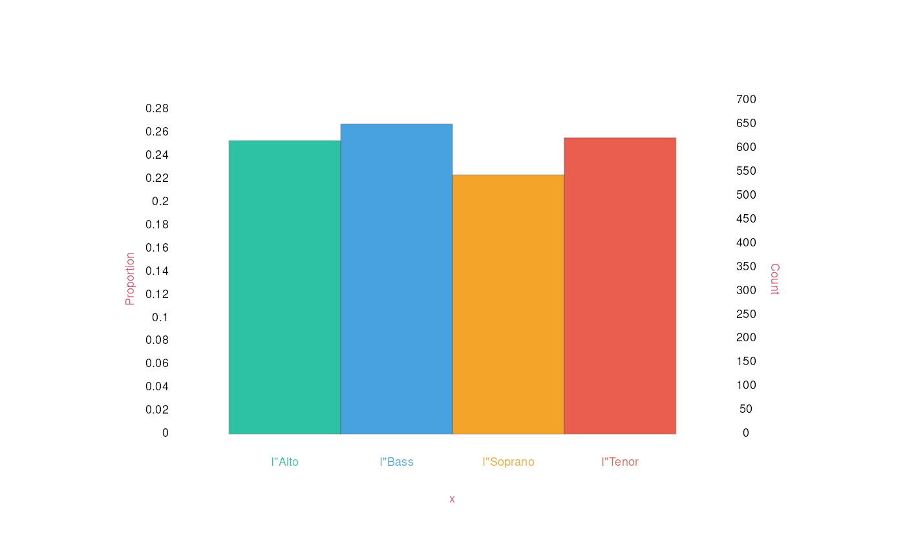

``` r

bach |> draw(Instrument, Recip)
```

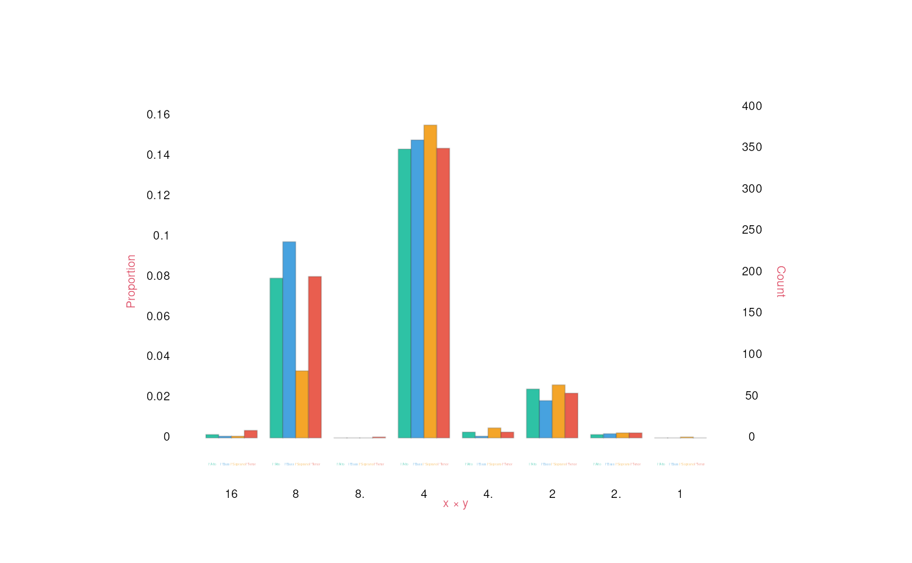

But going back to our original goal, what if you mix number and
categorical data?

``` r


bach |> draw(Recip, Semits)
```

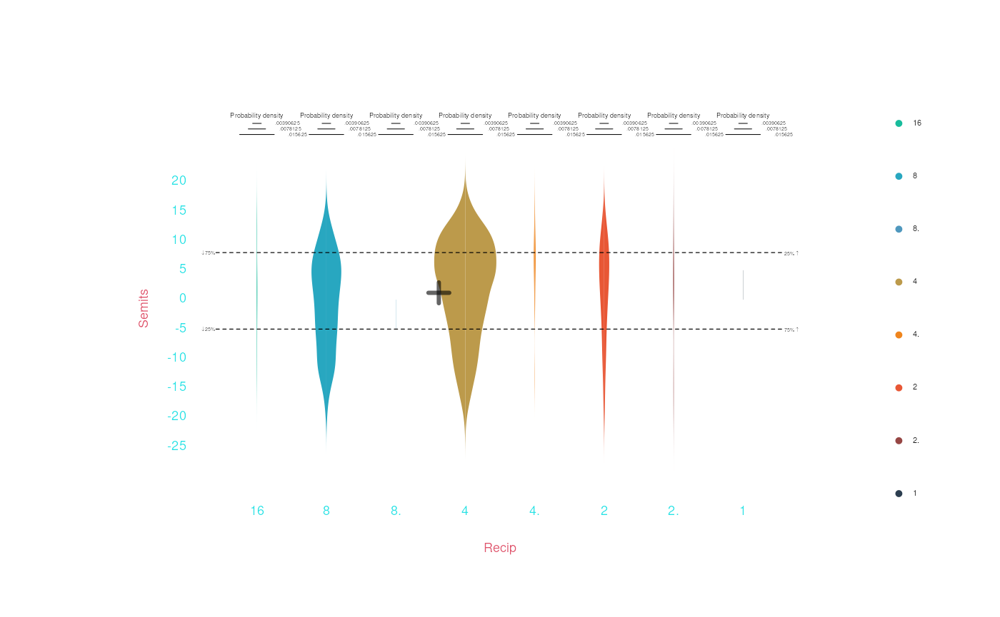

The relationship between duration and pitch height does seem plausible,
though it is weak. What about a relationship we’d expect to be a bit
stronger? Let’s look at voice type vs pitch height (we’ll make two
plots, flipping the X and Y axes):

``` r

bach |> draw(Instrument, Semits)
```

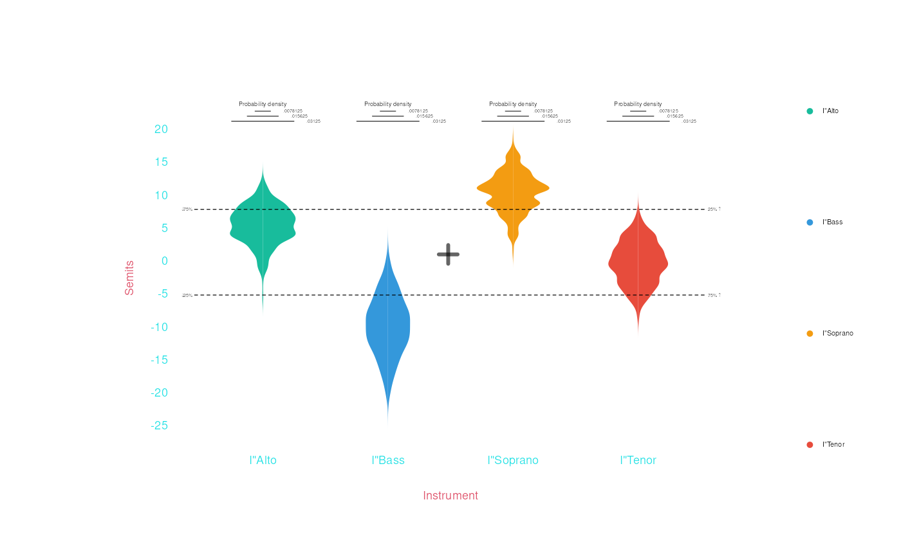

``` r

bach |> draw(Semits, Instrument)
```

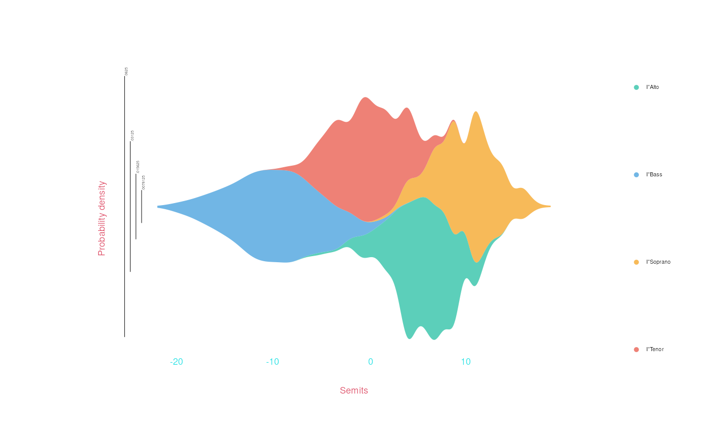

There is a clear relationship between voice type and pitch height—which
is, of course, what we’d expect!

### Title and Axis Labels

Use the `title` (and/or `subtitle`) arguments to set a plot title. You
can also use `xlabel` and `ylabel` to set the axis labels.

``` r
bach |> draw(Instrument, Semits, 
             title = 'Violin Plot of Pitch by Voice Type', subtitle = 'In 371 Bach Chorales',
             ylabel = 'Semitones')
```

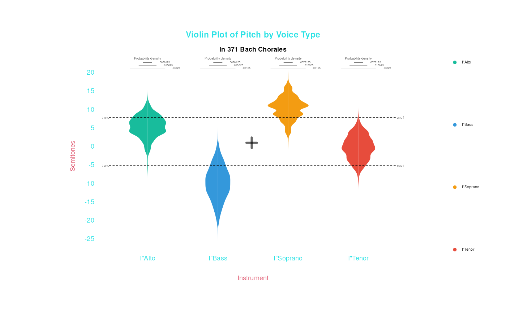

### Plotting more dimensions

When plotting data, we can use other “dimensions” than X and Y position
to show data. For example, color. Look what happens if we pass
`Instrument` (or another categorical variable) as the `color` argument,
instead of `x` or `y`:

``` r

bach |> draw(color = Instrument, Semits, smooth = TRUE,
             title = 'Pitch by Voice Type',
             xlabel = 'Semitones')
```

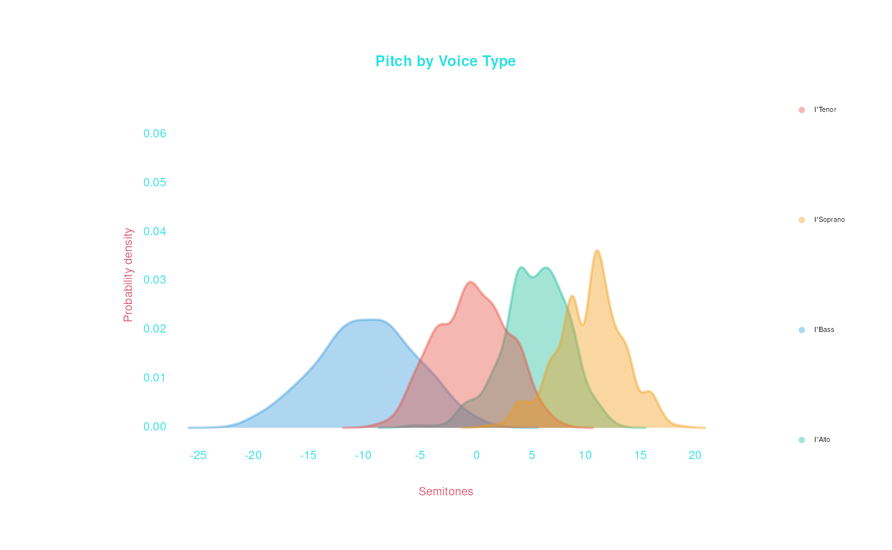

We can also use `color` to *add* dimensionality to a plot. For example,
we can go back to our duration-pitch plot, but use color to represent
voice types:

``` r

bach |> draw(Duration, Semits, jitter = 'x', lm = TRUE,
             color = Instrument)
```

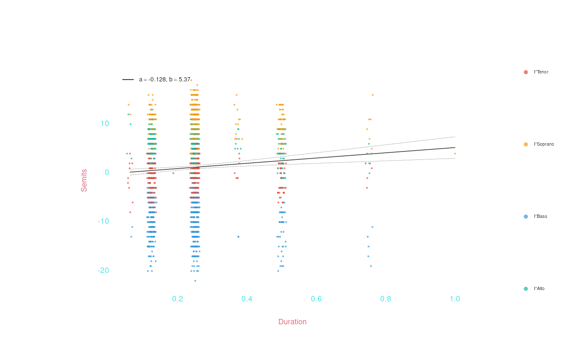

What if we want a separate regression line for each group? Use the
`conditional` argument to indicate that we want `lm` computed separately
within groups:

``` r

bach |> draw(Duration, Semits, jitter = 'x', lm = TRUE,
             color = Instrument, conditional = list(lm = TRUE))
```

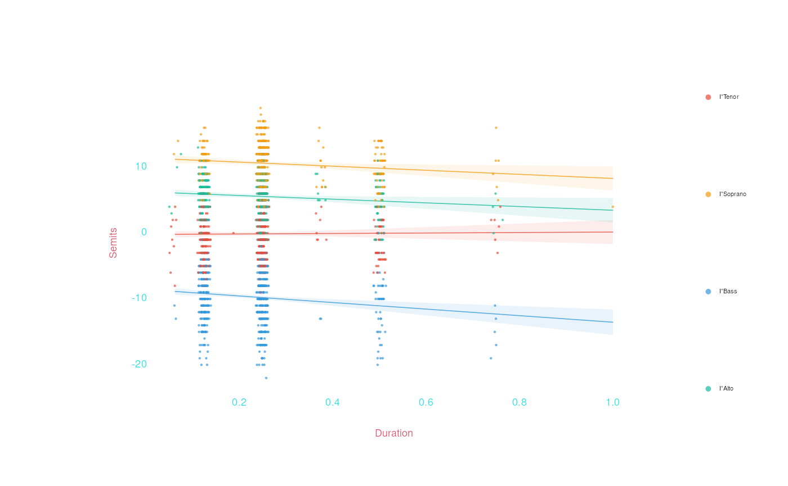

We can also use `pointStyle` and `pointSize` arguments to represent
dimensions of data.

### Other arguments

The [draw()](#draw) function has a bunch more cool arguments. Below we
show a bunch of arguments used when plotting a 1-dimensional
distribution of numeric values. Many (but not all) of the arguments
shown below can be used with other types of plots—and other types of
plots also have their own special arguments, which you can read about in
the manual pages.

#### Mean and quantiles

The most useful are `mean` and `quantiles`, which can be used to add the
mean or quantiles of numeric data to a plot. For example, looking at the
semitone value, we can mark the mean semitone and the 25th-75th
interquartile range, like this:

``` r
bach |> draw(Semits, mean = TRUE, quantiles = c(.25, .75),
             title = 'Distribution of pitch in Chorales',
             subtitle = 'Showing the mean and interquartile range')
```

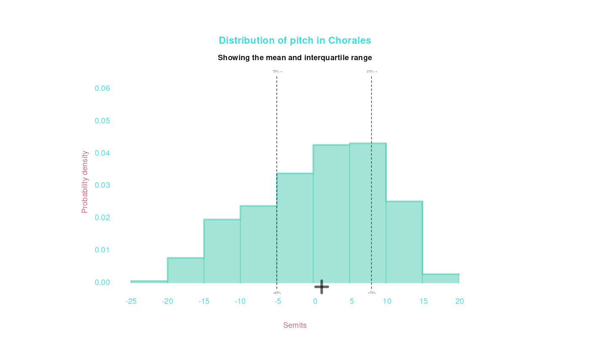

The median value is the 50% quantile, so you could use that instead:

``` r

bach |> draw(Semits, quantiles = .5, 
             title = 'Distribution of pitch in Chorales', subtitle = 'Showing the median')
```

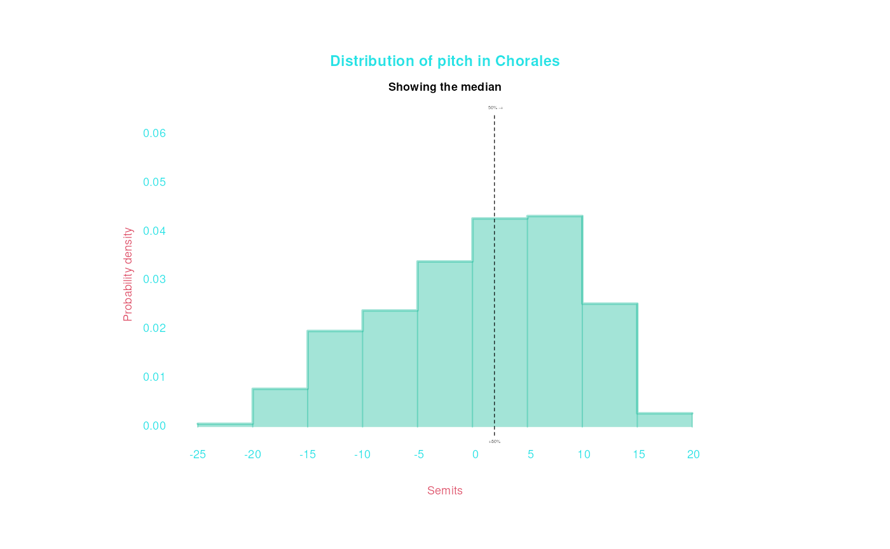

If you want to group the histogram by color again, you can use the
`conditional` argument to control whether you compute the mean/quantiles
separately for each group, or not. As before, let’s turn on
`smooth = TRUE`, cause otherwise the histogram gets a bit messy:

``` r
bach |> draw(Semits, color = Instrument,
             mean = TRUE, quantiles = .5, smooth = TRUE, 
             title = 'Distribution of pitch in Chorales', subtitle = 'Showing the overall mean and median')
```


``` r

bach |> draw(Semits, color = Instrument,
             mean = TRUE, quantiles = .5, smooth = TRUE,
             conditional = list(mean = TRUE, quantiles = TRUE), 
             title = 'Distribution of pitch in Chorales', subtitle = 'Showing the mean and median of each voice type')
```

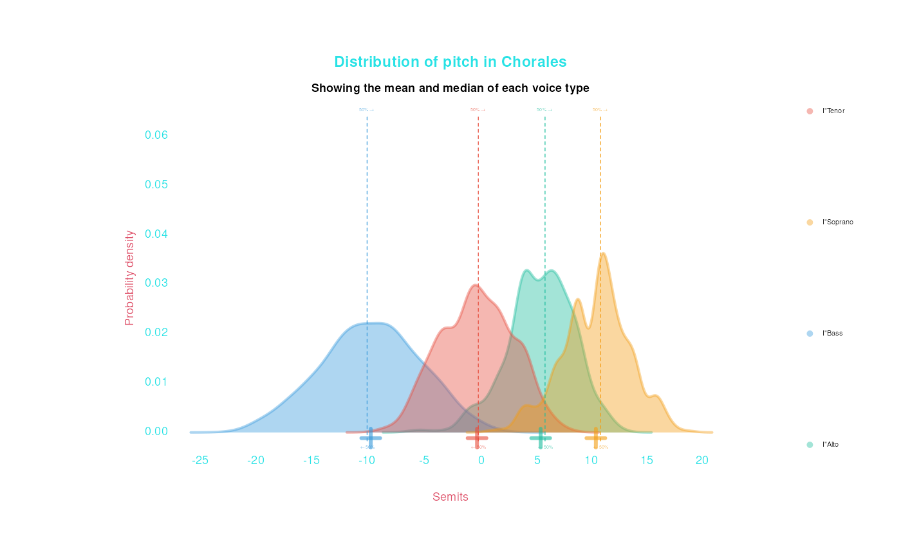

#### Showing points and counts

A histogram is a visual *approximation* of the distribution of a data,
and it may obscure true aspects of the data. Notably, the *ammount* of
of data isn’t shown in a histogram. It can be a good idea to take a look
at how much data there is using `showCounts`:

``` r
bach |> draw(Semits, mean = TRUE,
             showCounts = TRUE,
             title = 'Distribution of pitch in Chorales',
             subtitle = 'Showing count in each bin')
```


You can also use `showPoints` to actually *show* all the data points,
spread out above the histogram:

``` r
bach |> draw(Semits, mean = TRUE,
             showPoints = TRUE,
             title = 'Distribution of pitch in Chorales',
             subtitle = 'Showing all data points')
```


Ah! Using `showPoints` reminds us that the semitone data is not really
continuous, and that there are clear bars of more common (C) and less
common (F#) notes thoughout the range of data.

------------------------------------------------------------------------

We can also manipulate our histogram/density plots by passing arguments
through to the underlying
[`hist()`](https://rdrr.io/r/graphics/hist.html) and
[`density()`](https://rdrr.io/r/stats/density.html) functions. You can
look at those function manuals to learn all the possibilities, but for
now, you can focus on the `breaks` argument (for histograms) and the
`bw` (bandwidth) argument (for smooth density contours):

``` r
bach |> draw(Semits, mean = TRUE,title = 'Distribution of pitch in Chorales',
             breaks = 20)
```

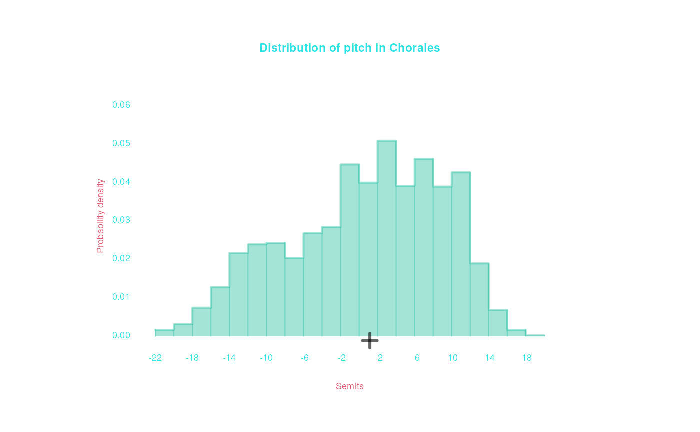

``` r
bach |> draw(Semits, mean = TRUE,title = 'Distribution of pitch in Chorales',
             breaks = 40)
```

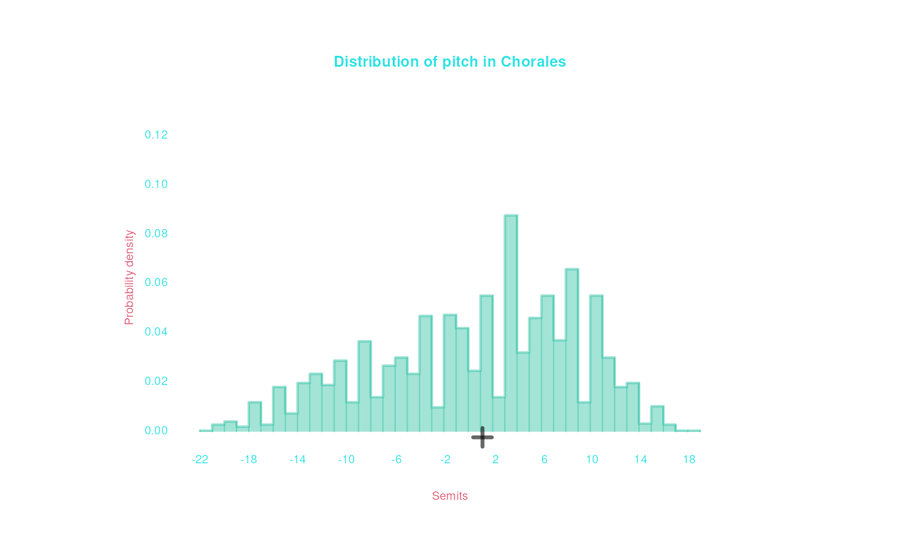

``` r
bach |> draw(Semits, mean = TRUE, smooth = TRUE,
             title = 'Distribution of pitch in Chorales',
             bw = 1)
```


``` r
bach |> draw(Semits, mean = TRUE, smooth = TRUE,
             title = 'Distribution of pitch in Chorales',
             bw = .5)
```

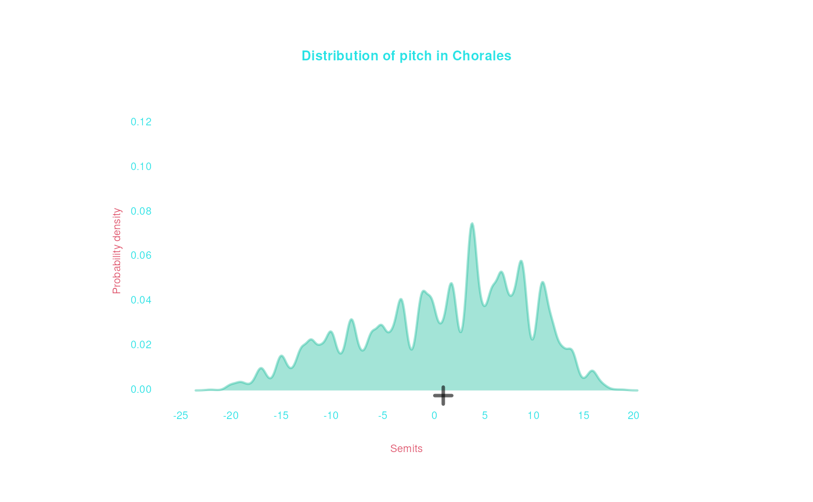

#### Normal Reference

Another cool argument is `normalReference`, which can be used to overlay
a “reference” normal (Gaussian) distribution on a plot of numeric data.
The mean and standard deviation of this “reference” distribution are
taken from the data. If the data is normally distributed, it should come
close to the reference distribution; if the data clearly mismatches the
reference, this means the data is not well approximated by a normal
distribution.

``` r
bach |> draw(Semits, mean = TRUE, smooth = TRUE,
             title = 'Distribution of pitch in Chorales',
             normalReference = TRUE)
```


We can see that the semitone data is skewed a bit, compared to a normal
distribution. Maybe, the pitches are normally distributed within each
voice?

``` r
bach |> draw(Semits, mean = TRUE, smooth = TRUE,
             color = Instrument,
             title = 'Distribution of pitch in Chorales, by Voice Type',
             normalReference = TRUE, conditional = list(normalReference = TRUE))
```

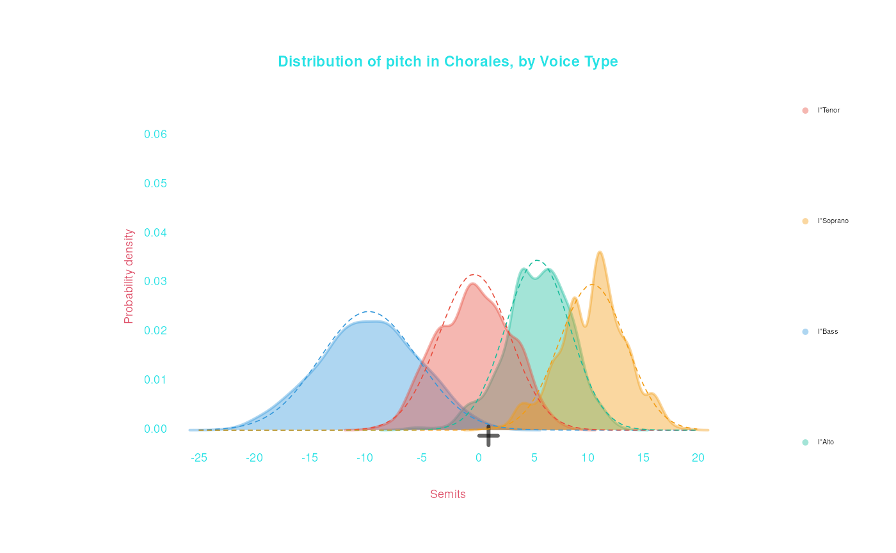

The data in each voice group is a bit less skewed, but still diverges
from normal a little bit.

### Multiple plots

#### Facets

Another approach is to create multiple plots for different groups. We
can do this with the `facets` argument. See what happens we pass
`list(Instrument)` to `facets`, instead of color:

``` r
bach |> draw(Duration, Semits, mean = TRUE, smooth = TRUE,
             facets = list(Instrument),
             title = 'Distribution of pitch in Chorales, by Voice Type')
```

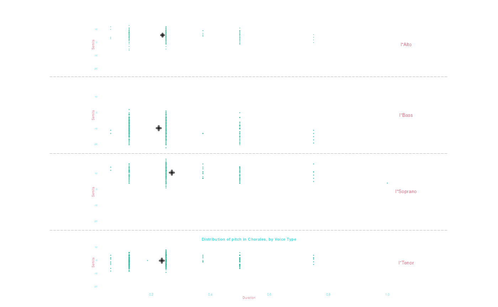

To put the plots side by side, make the first argument of the `facets`
list `NULL`:

``` r
bach |> draw(Recip, Semits, mean = TRUE, smooth = TRUE,
             facets = list(NULL, Instrument),
             title = 'Distribution of pitch in Chorales, by Voice Type')
```

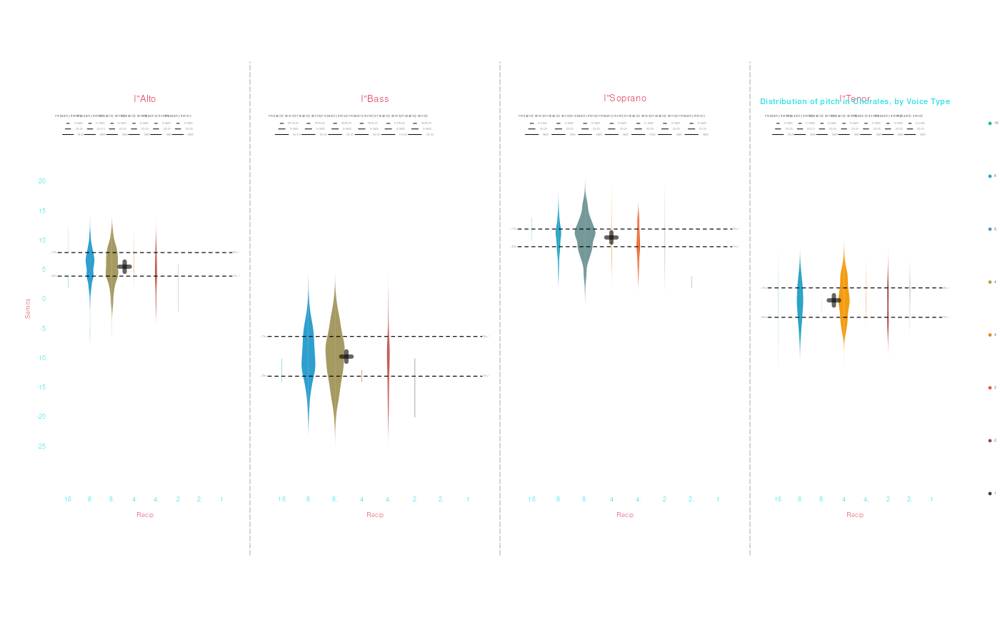

To arrange plots in two dimensions, pass a `facet` with two elements
(the first for rows, the second for columns).

``` r
bach |> draw(Recip, Semits, mean = TRUE, smooth = TRUE,
             facets = list(ifelse(is.major(Key), 'Major', 'Minor'), 
                           Instrument),
             title = 'Distribution of pitch in Chorales, by Voice Type')
```

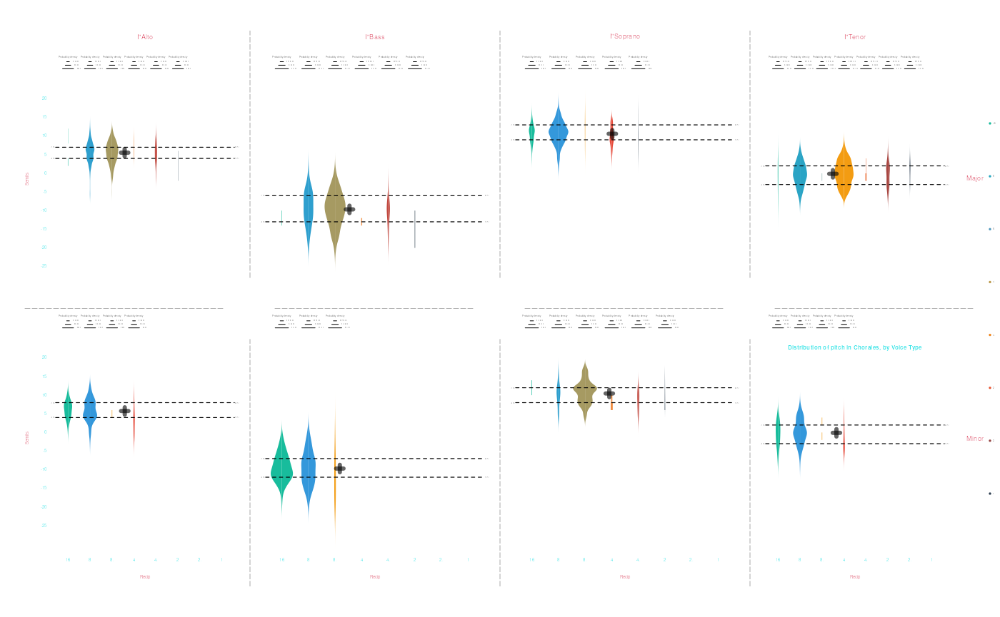

#### Beside/Below

Another option is to explicitly place plots side-by-side (or one above
the other) using the
[`drawBeside()`](https://humdrumR.ccml.gtcmt.gatech.edu/reference/drawMultiple.md)
or
[`drawBelow()`](https://humdrumR.ccml.gtcmt.gatech.edu/reference/drawMultiple.md)
functions, which can be combined:

``` r

histogram <- bach |> draw(Semits)
violins <- bach |> draw(Recip, Semits)
scatter <- bach |> draw(Duration, Semits)

drawBeside(histogram, violins)
```

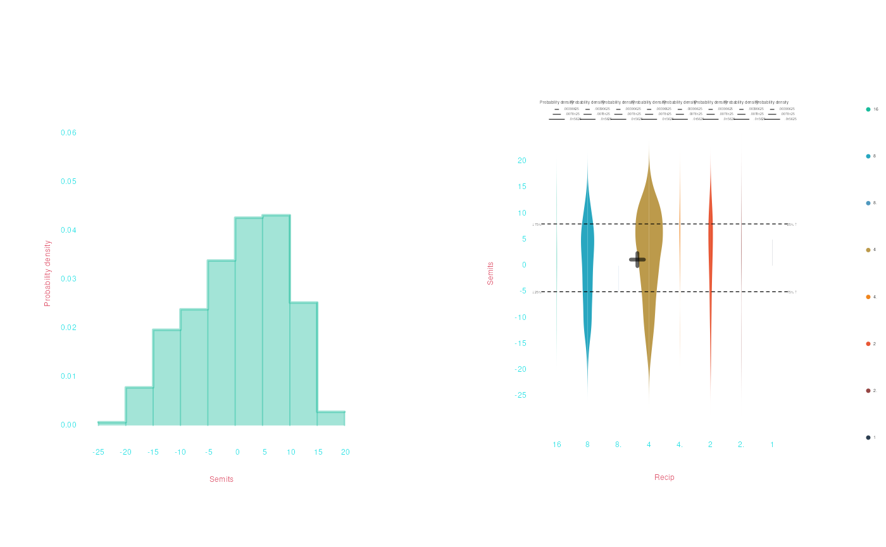

``` r
drawBelow(histogram, violins)
```

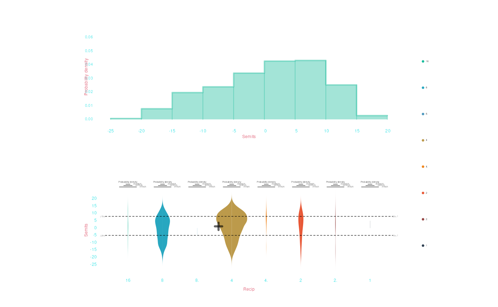

``` r

drawBelow(drawBeside(histogram, violins), scatter)
```

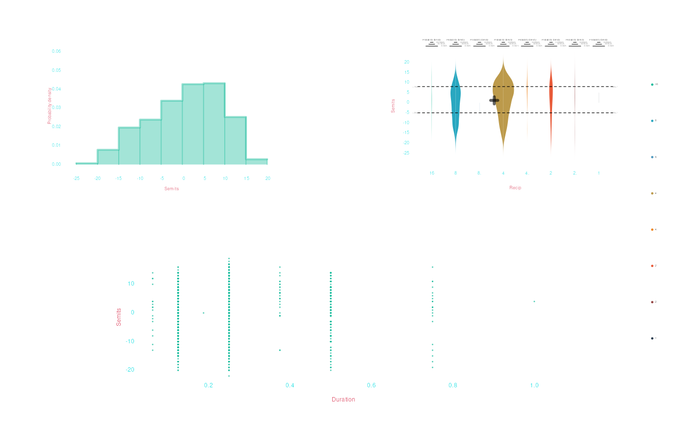

Use
[`drawNothing()`](https://humdrumR.ccml.gtcmt.gatech.edu/reference/drawMultiple.md)
to insert empty spots in a layout you are creating:

``` r

drawBelow(drawBeside(histogram, violins), drawBeside(scatter, drawNothing()))
```


### Saving plots

Making pretty plots on the fly is all well and good, but what if want to
save them for later, or use them in a paper? We can save any plot
created by [draw()](#draw) to a file by passing it to
[`drawToFile()`](https://humdrumR.ccml.gtcmt.gatech.edu/reference/drawToFile.md).
The only the thing you need is a filename with an extension (either
`bmp`, `jpg`, `pdf`, `png`, `svg`, or
`tiff`)—[`drawToFile()`](https://humdrumR.ccml.gtcmt.gatech.edu/reference/drawToFile.md)
will use the extension of your filename to determine what kind of file
to create.

``` r
bach |> draw(Semits, color = Instrument,
             mean = TRUE, quantiles = .5, smooth = TRUE,
             conditional = list(mean = TRUE, quantiles = TRUE), 
             title = 'Distribution of pitch in Chorales', subtitle = 'Showing the mean and median of each voice type') |>
  drawToFile("Myplot.png")


violins <- bach |> 
  draw(Recip, Semits, title = 'Violin plot of Pitch') 

drawToFile(violins, 'Violins.png')
drawToFile(violins, 'Violins.svg')
```

## Customizing draw() plots

We’ve shown here that humdrum$_{\mathbb{R}}$’s [draw()](#draw) function
has a lot of great options. However, it’s inevitable that you might want
to make plots that can’t be done with [draw()](#draw)—or `ggplot`.
Fortunately, [draw()](#draw) is built on top of R’s base graphics
system, which is extremely powerful, giving you precise control of every
aspect of plots.

The simplest option to customize [draw()](#draw) plots is to *add* to
them using base-R graph functions. However, for more complex/customized
plots, you’ll eventually need to dive deep into base-R graphics (or
[ggplot2](#ggplot2)).

------------------------------------------------------------------------

Base-R graphics is centered around a few main plotting functions:
[`plot()`](https://rdrr.io/r/graphics/plot.default.html),
[`barplot()`](https://rdrr.io/r/graphics/barplot.html), and
[`hist()`](https://rdrr.io/r/graphics/hist.html). These functions
actually work, under the hood, at the core of
[`draw()`](https://humdrumR.ccml.gtcmt.gatech.edu/reference/draw.md).
Additional functions can then be used to *add* elements on top of plots
you already created:
[`points()`](https://rdrr.io/r/graphics/points.html),
[`arrows()`](https://rdrr.io/r/graphics/arrows.html),
[`abline()`](https://rdrr.io/r/graphics/abline.html),
[`lines()`](https://rdrr.io/r/graphics/lines.html),
[`axis()`](https://rdrr.io/r/graphics/axis.html),
[`polygon()`](https://rdrr.io/r/graphics/polygon.html), etc. These
“adding” functions can be used with
[`draw()`](https://humdrumR.ccml.gtcmt.gatech.edu/reference/draw.md)
too.

### Adding plot functions

The best way to “add” content to
[`draw()`](https://humdrumR.ccml.gtcmt.gatech.edu/reference/draw.md)
plots by writing code using base-R adding functions, and then using
[`drawMore()`](https://humdrumR.ccml.gtcmt.gatech.edu/reference/drawMore.md).
For example, we know that
[`draw()`](https://humdrumR.ccml.gtcmt.gatech.edu/reference/draw.md) has
the `mean` argument to mark the mean of the data with a cross—but what
if you wanted to draw a line across the screen marking the mean? There
is no [draw()](#draw) argument for that (yet), but you can use the
base-R [`abline()`](https://rdrr.io/r/graphics/abline.html) function to
do this—specifically, the `v` argument can be used to draw a vertical
line. So we could do something like this:

``` r

bach |>
  draw(Duration, Semits, jitter = 'x') |>
  drawMore(abline(v = mean(x), col = 'red', lwd = 2))
```

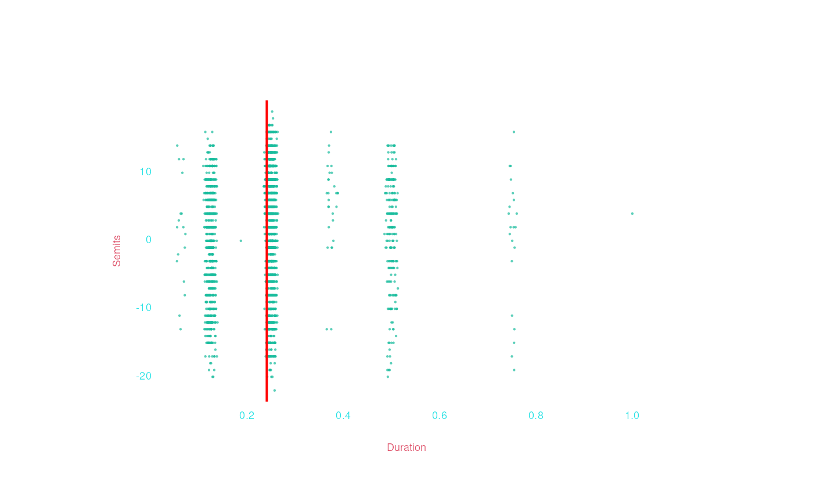

Maybe we ’d also like to add some text, like the exact value of that
mean? Use the base-R [`mtext()`](https://rdrr.io/r/graphics/mtext.html)
function:

``` r
bach |>
  draw(Duration, Semits, jitter = 'x') |>
  drawMore(abline(v = mean(x), col = 'red', lwd = 2),
           mtext(paste0('mean duration:\n', round(mean(x), 2)), side = 3, at = mean(x), col = 'red'))
```

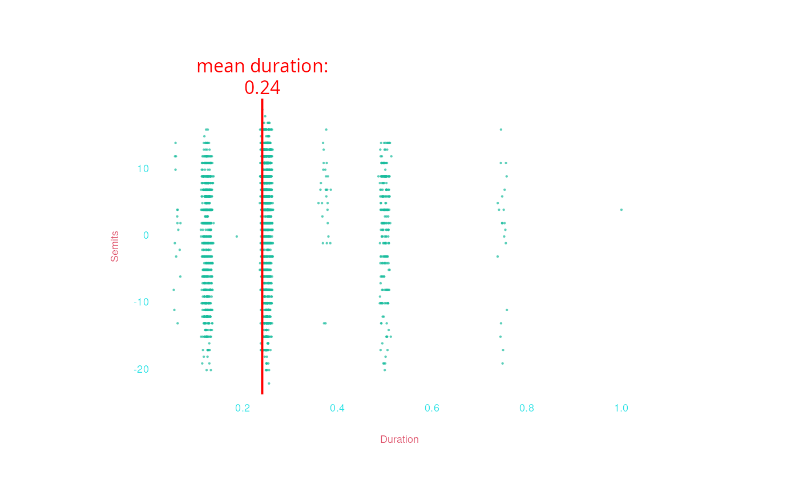

Or maybe you’d like to shade the area containing pitches below middle C,
with durations longer than a quarter note. We can do this with base-R
[`polygon()`](https://rdrr.io/r/graphics/polygon.html), though it’s a
bit complicated:

``` r

bach |>
  draw(Duration, Semits, jitter = 'x') |>
  drawMore(polygon(x = c(.25, 1, 1, .25), 
                   y = c(-25, -25, 0, 0),
                   col = rgb(.5, .5,1 ,.5, alpha = .1), border = FALSE))
```

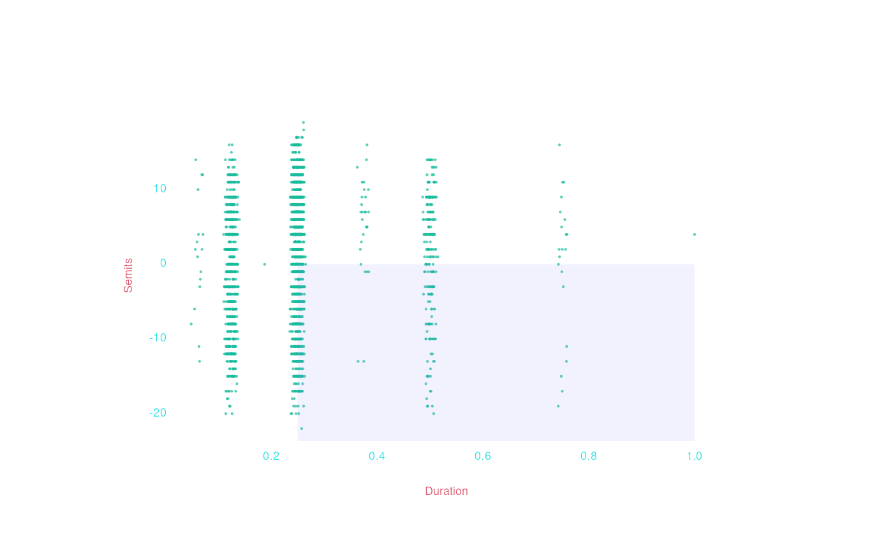

Other functions you might want to read about are
[`arrows()`](https://rdrr.io/r/graphics/arrows.html),
[`graphics::segments()`](https://rdrr.io/r/graphics/segments.html),
[`points()`](https://rdrr.io/r/graphics/points.html),
[`text()`](https://rdrr.io/r/graphics/text.html).

## GGplot2

[GGplot2](https://ggplot2.tidyverse.org/) is probably R’s most popular
graphing library. Humdrum$_{\mathbb{R}}$ has methods to enable us to use
`ggplot2` with humdrum data.

``` r
library(ggplot2)
```

I won’t give a full explanation of how to use `ggplot2` here, but here
is how we can reproduce the same basic plots we did above:

``` r
bach |>
  ggplot(aes(Duration, Semits)) + geom_point()
>    Warning: 
[1m
[22mRemoved 4 rows containing missing values or values outside the scale range
>    (`geom_point()`).
```

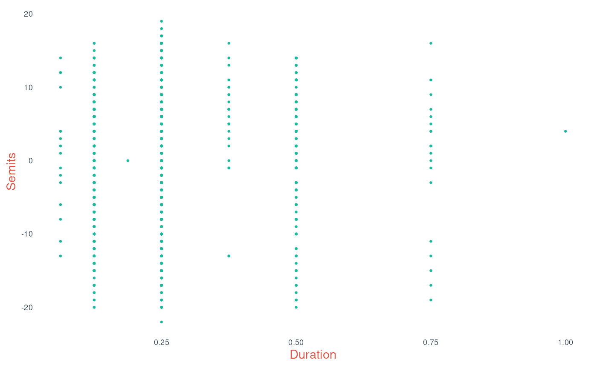

``` r

bach |>
    ggplot(aes(Recip)) + geom_bar()
```

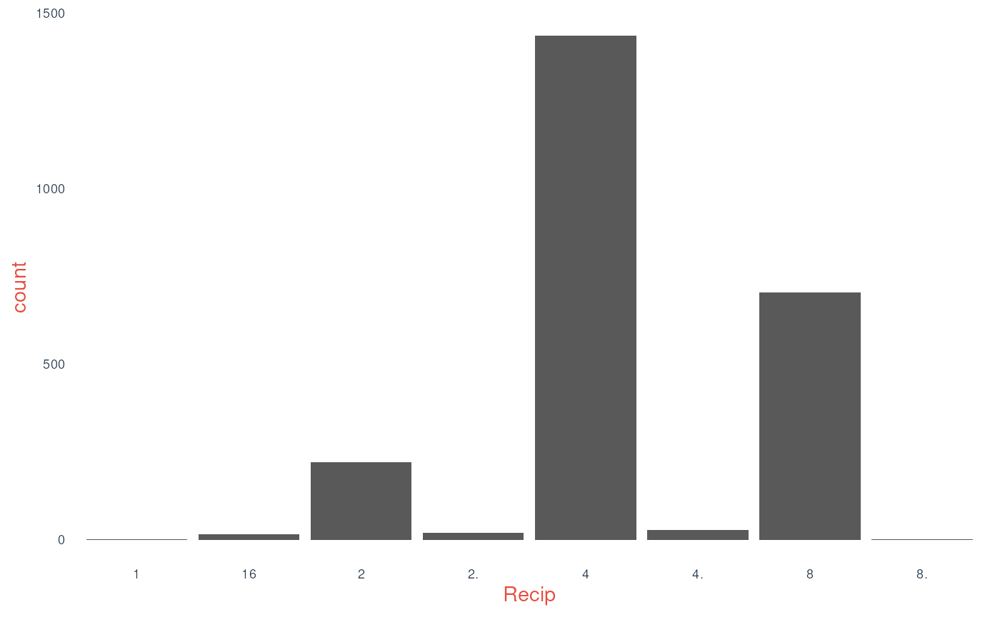

``` r
bach |>
    ggplot(aes(Semits)) + geom_histogram()
>    Warning: 
[1m
[22mRemoved 4 rows containing non-finite outside the scale range
>    (`stat_bin()`).
```

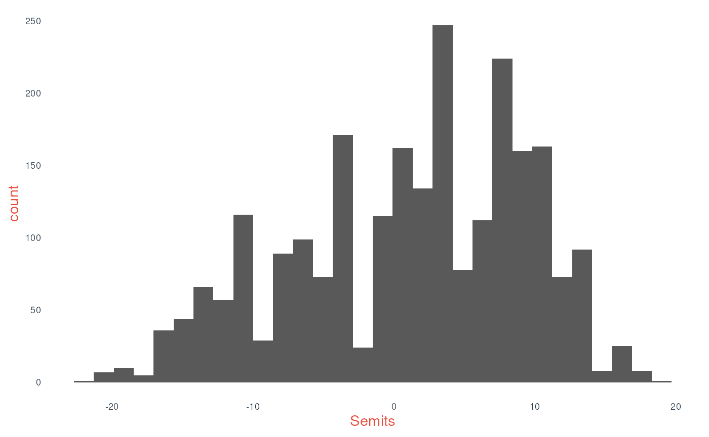

``` r
bach |>
    ggplot(aes(Semits)) + geom_density()
>    Warning: 
[1m
[22mRemoved 4 rows containing non-finite outside the scale range
>    (`stat_density()`).
```

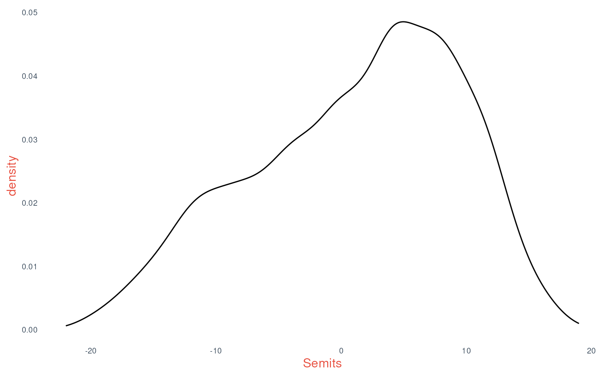

``` r
bach |>
    ggplot(aes(Instrument, Semits)) + geom_violin()
>    Warning: 
[1m
[22mRemoved 4 rows containing non-finite outside the scale range
>    (`stat_ydensity()`).
```

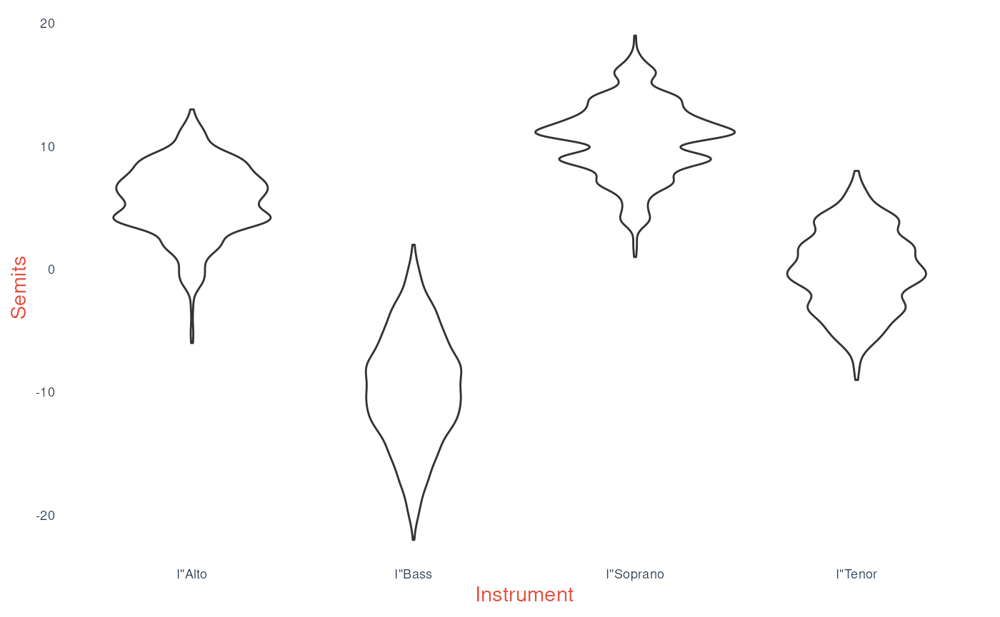
