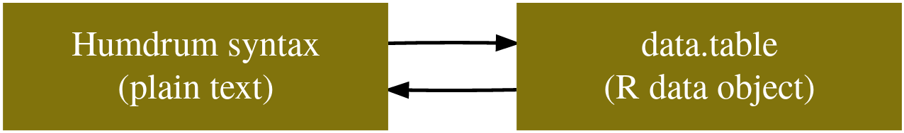

# Humdrum$_{\mathbb{R}}$

Welcome to the main website of humdrum$_{\mathbb{R}}$!


## What is humdrum$_{\mathbb{R}}$?

Humdrum$_{\mathbb{R}}$ is an [R package](https://en.wikipedia.org/wiki/R_package): a "library" of preexisting code for the
[R programming language](https://en.wikipedia.org/wiki/R_(programming_language)).
Humdrum$_{\mathbb{R}}$ code provides tools for the visualization, manipulation, and analysis of data formatted in the humdrum syntax.


> Note: The name of the package is pronounced _hum-drum-**ARRRRR**_, with the last syllable emphasized in pirate fashion.
> The name should always be typeset $h\mu m^{\Delta r \mu m}_{\mathbb{R}}$.
> Failure to pronounce or typeset $h\mu m^{\Delta r \mu m}_{\mathbb{R}}$ correctly will void the warranty.
 

### What is humdrum?

Humdrum is a system for computational musicology developed by David Huron.
The Humdrum "ecosystem" includes two main parts: a data format called the [humdrum syntax](http://www.humdrum.org/guide/ch05/) and a musicological software system
called the [humdrum toolkit](http://www.humdrum.org/).
Another key component of the ecosystem is the [Verovio Humdrum Viewer](http://verovio.humdrum.org/), which is a great way to get to view and edit humdrum data.
Humdrum$_{\mathbb{R}}$ is a complement to the original humdrum toolkit, leveraging
 the power of R to give us unprecedented power to manipulate and analyze humdrum data using concise, expressive syntax.

Humdrum$_{\mathbb{R}}$ is mainly used to manipulate and analyze data encoded in the humdrum syntax and/or humdrum interpretations like `**kern`.
The humdrum syntax is an incredibly flexible, and powerful, scheme for encoding musical data.
Tens of thousands of musical scores (and other musical data) have been encoded in the humdrum syntax, many available online 
through repositories such as [KernScores](http://kern.ccarh.org/).
Our [humdrum syntax](articles/HumdrumSyntax.html "The humdrum syntax") vignette gives a detailed introduction to the data format.


### What is R?

R is programming language, designed from the ground up for statistical computing and data analysis.
R has many features which make it ideal for data analysis, particularly if research and analysis is your only background in programming.
Our [R primer](articles/RPrimer.html "An R primer for humdrumR users") introduces the core concepts of R programming.

## What can humdrum$_{\mathbb{R}}$ do?

Humdrum$_{\mathbb{R}}$ provides a number of tools for working with [humdrum data](http://www.humdrum.org/guide/ch05/) and more generally, musicological analysis.
Humdrum$_{\mathbb{R}}$ does seven main things:
 
 
#### Represent humdrum data in R

To represent humdrum data in R, humdrum$_{\mathbb{R}}$ defines a special data type---the `humdrumR` class---which we call "humdrumR objects" throughout the documentation.
The most important part of a `humdrumR` object is the "*humdrum table*" which it contains.
You can read about how the humdrum-syntax data is represented in the [getting started with humdrumR](articles/GettingStarted.html "Getting started with humdrumR")
vignette.

{width=600px}

For more details, read the [humdrumR class](reference/humdrumRclass.html) 
and [humdrum table](reference/humTable.html);
If humdrum$_{\mathbb{R}}$ is installed and loaded, you can read these directly in an R session by typing `?humdrumR-class` or `?humTable`.


#### Read and write humdrum data


To create `humdrumR` data objects, humdrum$_{\mathbb{R}}$ includes a humdrum data parser, which finds humdrum data on your local machine, reads it into
R, then creates a humdrumR object from the data.
The [Reading and writing data](articles/ReadWrite.html "Reading and writing data with humdrumR") vignette is the best place to realm how this works.
You can get more details from the [readHumdrum()](reference/readHumdrum.html)
and [writeHumdrum()](reference/writeHumdrum.html) documentation;
If humdrum$_{\mathbb{R}}$ is installed and loaded, you can read these directly in an R session by typing `?readHumdrum` or `?writeHumdrum`.


#### "Reshape" humdrum data

Once you've imported humdrum data in R, the next step is often to organize and prepare your data.
You'll often want to pick out specific subsets of the data, or rearrange the data representations to be easier to work with.
Humdrum$_{\mathbb{R}}$ gives us a number of powerful tools for "shaping the data":
The [Shaping humdrum data](articles/Reshaping.html "Shaping humdrum data with humdrumR") and [Filtering humdrum data](articles/Filtering.html "Filtering humdrum data with humdrumR") vignettes are the best places to learn about these processes.
You can find more details on sub-setting data in the [subset.humdrumR()](reference/subset.humdrumR.html)
 and [indexHumdrum](reference/indexHumdrum.html) documentation;
If humdrum$_{\mathbb{R}}$ is installed and loaded, you can read these directly in an R session by typing `?subset.humdrumR` or `?indexHumdrum`.

#### Analyze humdrum data

Humdrum$_{\mathbb{R}}$ makes it very easy to manipulate, modify, and analyze humdrum data.
The [Working with humdrum data](articles/WorkingWithData.html "Working with humdrum data using humdrumR") vignette gives an overview of this functionality.
You can find more details in the [withinHumdrum](reference/withinHumdrum.html) documentation;
If humdrum$_{\mathbb{R}}$ is installed and loaded, you can read this directly in an R session by typing `?withinHumdrum`.

#### Manipulate (musical) pitch information

Humdrum$_{\mathbb{R}}$ defines tools for manipulating numerous representations of pitch and tonality, including 
[diatonic keys](reference/diatonicSet.html) and [tertian harmonies](reference/tertianSet.html).
The [Pitch and tonality](articles/PitchAndTonality.html "Pitch and tonality in humdrumR") vignette explains how to work with pitch data in humdrum$_{\mathbb{R}}$.
You can find more details in the [humdrumPitch](reference/humdrumPitch.html)
documentation;
If humdrum$_{\mathbb{R}}$ is installed and loaded, you can read this directly in an R session by typing `?humdrumPitch`.


#### Manipulate (musical) rhythm information


Humdrum$_{\mathbb{R}}$ defines tools for manipulating numerous representations of rhythm, timing, and meter.
The [Rhythm and meter](articles/RhythmAndMeter.html "Rhythm and Meter in humdrumR") vignette explains how to work with rhythmic information humdrum$_{\mathbb{R}}$.
You can find more details in the [humdrumRhythm](reference/humdrumPitch.html)
documentation;
If humdrum$_{\mathbb{R}}$ is installed and loaded, you can read this directly in an R session by typing `?humdrumRhythm`.


#### Develop new humdrum tools

To facilitate the development of *new* functions to work with humdrum tokens---which are simple character strings packed with information---, 
Humdrum$_{\mathbb{R}}$ provides several useful development tools, including our [struct](reference/struct.html) data type and a useful API we call our [regular-expression dispatch system](reference/humdrumDispatch.html),
which makes it easy to dispatch different methods based on matches to regular expressions.


## Installing humdrum$_{\mathbb{R}}$

### Installing R

To use humdrum$_{\mathbb{R}}$, you'll first need to install [R](https://www.r-project.org/), version 4.1 or later.
We *highly* recommend that you install the Integrated Development Environment [RStudio](https://rstudio.com/) as well!
This link---[Installing R and RStudio](https://rstudio-education.github.io/hopr/starting.html)---is a good starting place.

### Installing humdrum$_{\mathbb{R}}$

Humdrum$_{\mathbb{R}}$ is not yet available on the standard R package repository, [CRAN](https://cran.r-project.org/), so (for now) it can only be installed from this github repository.
To install the latest version (master branch) of humdrum$_{\mathbb{R}}$, you'll first need to install the R package [devtools](https://www.rdocumentation.org/packages/devtools/versions/2.2.1)---`devtools` is used for creating and maintaining R packages.
Luckily, `devtools` is on CRAN, so all you have to do is open an R session on your machine and type:

```

install.packages('devtools')

```

Once you have successfully installed `devtools`, you are now ready to use it to install humdrum$_{\mathbb{R}}$ straight from github.
In an R session, type:

```

devtools::install_github("Computational-Cognitive-Musicology-Lab/humdrumR", build_vignettes = TRUE)

```

#### Humdrum$_{\mathbb{R}}$ source

Another option---useful, if you want to inspect, or contribute to, the humdrum$_{\mathbb{R}}$ source code---is to actually download the humdrum$_{\mathbb{R}}$ package source from github and install it directly.
You'll first need to install [git](https://git-scm.com/book/en/v2/Getting-Started-Installing-Git).
Once git is installed on your computer, you can download the humdrum$_{\mathbb{R}}$ repository by clicking on the "Clone or download" on the github page.

Alternatively, you can use git directly: navigate to the directory on machine where you'd like to save the package source and type:


```

git clone https://github.com/Computational-Cognitive-Musicology-Lab/humdrumR

```

Once you've done this, you can install the source on your computer using `devtools`:
Open an R session and use `setwd` to move your working directory inside the repository you just downloaded (i.e., cloned).
Once there, type 

```

devtools::install()

```


> If you downloaded RStudio, you can make humdrum$_{\mathbb{R}}$ a RStudio "Project" on your local computer, which 
> enables some useful features.
> To do this in RStudio, click the "New Project > Existing Directory" option and select the directory where you downloaded the repository.
> Once the project is created, you can install your local copy of humdrum$_{\mathbb{R}}$ by clicking "Install and Restart" in RStudio's "Build" pane.

---

Once you've completed the installation of humdrum$_{\mathbb{R}}$ you can used it by simply calling:

```

library(humdrumR)

```

### Updating humdrum$_{\mathbb{R}}$

Humdrum$_{\mathbb{R}}$ is under active development, with new features being added, documentation being updated, and bugs being fixed on a weekly basis.
We recommend you keep up to date with the newest version of humdrum$_{\mathbb{R}}$.
Luckily, you can easily update to the latest version by simply running the same `devtools::install_github()` command from above in an R session.
However, *if* you have already loaded the humdrumR$_{\mathbb{R}}$ library in your R session---using `library(humdrumR)`---you'll need to 
"detach" the old version before the new version will work.
You can do this be either 1) quitting R studio and opening it again, 2) going to RStudio's package panel and unchecking `humdrumR`, or 3) running the command
`detach("package:humdrumR", unload = TRUE)`.

If you installed humdrum$_{\mathbb{R}}$ from source using the `git clone` command, you can't simply run `clone` again.
Instead, you should navigate to the package directory and run `git pull origin main`.
This will "pull" the latest changes down to your local machine.
You can then rerun `devtools::install()`.


## Learning humdrum$_{\mathbb{R}}$

To learn how to use humdrum$_{\mathbb{R}}$
the "Articles" list at the top of this page is the best place to start---in particular,
the [Getting started with humdrumR](articles/GettingStarted.html) article!
Documentation for specific functions and other general topics can be found in the "[Reference](reference/index.html)"
section.

Once humdrum$_{\mathbb{R}}$ is installed, you can also access documentation directly in R sessions.
On the R command line, use the `?` operator with the name of a function or topic to see the documentation:

```

library(humdrumR)

?humdrumR

```
