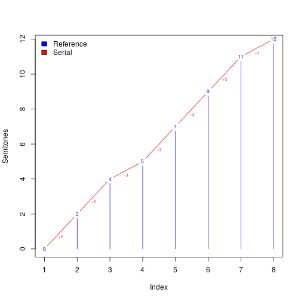
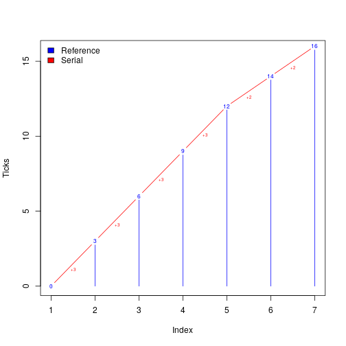
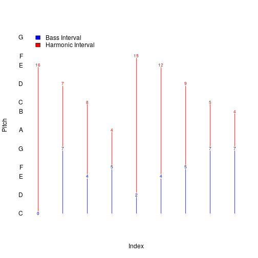
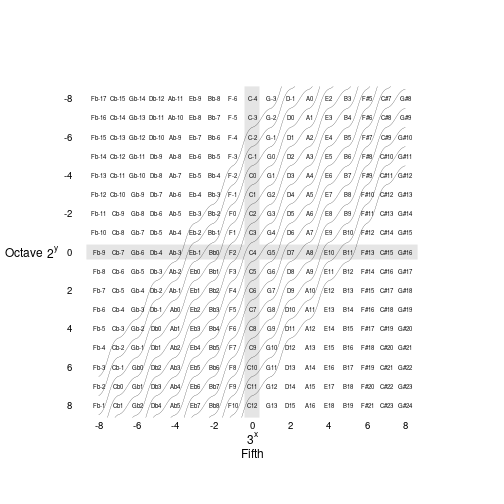
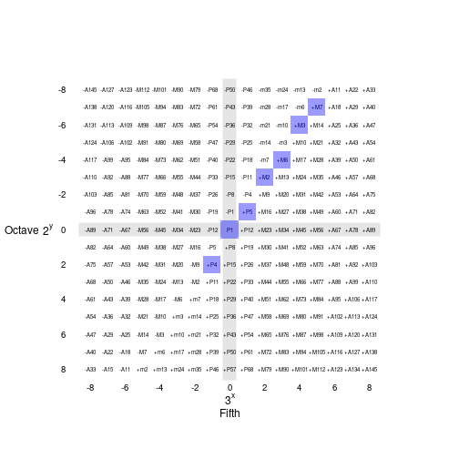

`humdrumR` contains a rich set of built in representations and functions for representing musical tonality and meter.
A core philosophical/design choice is that both structures are conceptualized/encoded as *intervals*.


# Intervals 

Both pitch and time are perceived *relatively*: as a relationship between two points.
Thus we represent them, conceptually, as an *interval*---a difference.
In the case of pitch, an interval between two frequencies (or more abstractly, a "tonal" interval on the circle-of-fifths).
In the case of rhythm, an interval between two time points---between two onsets, or between an onset and an offset.
In `humdrumR`, these abstract intervals are represented as `tonalInterval` and `rhythmInterval` objects, respectively.

To concretize our abstract intervals, we must establish what they are relative to. 
What is the reference?
There are actually multiple, useful ways we can represent the same information.
Since all intervals are relative, there is always an *implicit* reference---the origin, zero.
For `tonalIntervals` the origin is the unison interval.
For `rhythmIntervals` the origin is zero.

`tonalInterval`s and `rhythmIntervals` form mathematical groups---addition is defined (associatively), there is an identity element (the reference point: e.g., unison, 0), and the intervals are invertible.
Since intervals can be added/subtracted, any interval can be thought of as a combination (addition) of other intervals.
In `humdrumR`, we often "partition" a `interval` as a combination of useful sub-intervals.

## Serial and Fixed Reference

Vectors of `humdrumR` intervals can be represented in two fundamental ways: *serial reference representation* and *fixed reference representation*.
To illustrate, we will use two examples, one rhythmic, one pitched:

1. The major scale
2. The "tag-line" rhythm `3+3+3+3+2+2`


### Fixed reference

In a fixed-reference representation, all intervals are interpreted relative to a fixed point (implicitly 0).
Fixed-reference representations of the major scale (using semitones) and the tag-line rhythm are as follows:


```r
referenceMajor   <- c(0, 2, 4, 5, 7, 9, 11, 12)

referenceTagline <- c(0, 3, 6, 9, 12, 14, 16)
```

Note that this representation is quite commonly used by musicians, in various forms, *for pitch*.
In contrast, fixed-reference representations are **not** commonly used by musicians *for rhythm*.
However, they *are* used in some contexts, as they essentially represent "time from the beginning" of a piece:
Thus, the timestamps/timelines in DAWs or "offsets" in `music21` are examples of fixed-reference representations of time.

### Serial reference

An alternative representation is a serial-reference representation, where each interval is measured relative to the previous one.
Thus, each data point represents the local change ($\Delta$) in the parameter.
To be lossless (as explained below) the first element of a serial data vector is measured relative to the implicit reference (0).
Serial representations of our tag-line and the major scale are as follows:


```r
serialMajor   <- c(0, 2, 2, 1, 2, 2, 2, 1)

serialTagline <- c(0, 3, 3, 3, 3, 2, 2) 
```

This representations is also fairly intuitive to musicians---representing "melodic intervals"---but is *not* how music notation or sequencers represent pitch.
In contrast, the serial-reference representation for rhythm *is* normative: traditional music notation note values are a serial-reference representation.


### Transformations ("Interval Calculus")


Since addition is defined for `interval`s fixed-reference and serial-reference representations can be translated between each other.

A serial-reference representation can be calculated as the pairwise differences between elements in a fixed-reference data, with the first reference element appended at the beginning.
Conversely, a fixed-reference representation can be calculated as the cumulative sum of serial-reference data.
Thus:


```r
identical(cumsum(serialMajor), referenceMajor)
```

```
## [1] TRUE
```

```r
identical(cumsum(serialTagline), referenceTagline)
```

```
## [1] TRUE
```

```r
identical(c(referenceMajor[1], diff(referenceMajor)), serialMajor)
```

```
## [1] TRUE
```

```r
identical(c(referenceTagline[1], diff(referenceTagline)), serialTagline)
```

```
## [1] TRUE
```

In `humdrumR`, we refer to these two transformations as `delta` ($\Delta$) and `sigma` ($\Sigma$), for differences and sums respecticely.
In `humdrumR`, we note that the relationship between fixed- and serial-reference representations is analogous to the relationship between a function and its derivative.
The fixed-reference representation represents a sequence of independent values as a function of (serial) index position.
The serial-reference representation represents the same sequence as the differences between adjacent elements at each index---how much the fixed representation *changes* at each index.
(Since the first element in a serial-reference representation is relative to a fixed (implicit) reference, the normal one-to-many relationship between derivatives and functions is removed, and a lossless one-to-one relationship is maintained.)
These two transformations are thus inverses of each other: $x = sigma(delta(x))$ and $x = delta(sigma(x))$.
<!--These two transformations are thus inverses of each other: $x = integrate(derive(x))$ and $x = derive(integrate(x))$.-->

<!--Is is because of this analogy that `humdrumR` refers to these functions as `derive` (pairwise differences) and `integrate` (cumulative sum) respectively.-->


```r
library(humdrumR)
```

```
## Loading required package: magrittr
```

```
## Loading required package: rlang
```

```
## 
## Attaching package: 'rlang'
```

```
## The following object is masked from 'package:magrittr':
## 
##     set_names
```

```
## 
## Attaching package: 'humdrumR'
```

```
## The following objects are masked from 'package:stats':
## 
##     integrate, sigma
```

```r
identical(referenceMajor, sigma(delta(referenceMajor)))
```

```
## [1] TRUE
```

```r
identical(referenceMajor, delta(sigma(referenceMajor)))
```

```
## [1] TRUE
```






## Dynamic Reference

Since `intervals` are additive, another possibilty is to use one vector of intervals as the reference point for a second vector of intervals.
This allows us to create dynamic reference points.

Some examples 

+ **Figured Bass**: the bass voice in the texture is encoded (in serial/reference reprsentation) while other voices are represented relative to the bass voice.
+ **Chord Tones**: the abstract "root" of chord progression is represented in one vector, with other vectors representing the "chord tones" (root, 3rd, 5th, 7th, etc.) relative to chord root.
+ **Scale degrees**: The tonic of the key is used as a dynamic reference, with notes calculated relative to the tonic.



Calculating dynamic reference intervals is lossless only if the complete information on the reference intervals are maintained.
For instance, we we keep track of the serial or fixed intervals off the bass voice.
Or, if we keep track of the local key (usually using a fixed interval to "C").


# Tonality

Tonality is represented in `humdrumR` using three `S4` classes and associated methods: 

+ `humdrumVector`
    + `tonalInterval` (pitches)
    + `diatonicSet` (keys)
         + `tertianSet` (chords)

`tertianSet` inherits from `diatonicSet`---thus any `tertianSet` is also a `diatonicSet`.
(All three classes inherit from `humdrumVector`, giving them generic atomic-vector-like behavior.)


## tonalInterval

The `tonalInterval` class is the core pitch representation in `humdrumR`.
As the name suggests, pitch is encoded *tonally*.
What does that mean?


#### Western Tuning

At first glance, pitch appears to by a straightforward, one-dimensional phenomenon:
every harmonic "pitched event" has a frequency (perceptually) associated with it, with perceptible frequencies ranging from approximately 20Hz--20kHz.
However, [as mentioned above](#intervals), humans perception of pitch is predominantly relative, specifically *rational*: we perceive the ratios between pitches.
(This has the immediate effect of changing the 20Hz-20kHz "linear range" of frequency into a logarithmic space.)
What's more, "simple", whole-number ratios are privileged in our perception---and the simpler the better.
The simplest ratio is the 2-to-1 ratio known as an octave: pitches separated by an octave are perceived as being "the same" in some respect.
Pitches which are "the same" (i.e., multiples of 2 or powers of 2) as each other are said to have the same *pitch chroma*.
Due to this perceptual phenomenon, most (essentially all) musical scales use the octave as a bounding point---the same patterns pitch chroma (scales) are repeated in each octave we can perceive.


The octave however, is not the whole story.
The next few higher harmonic ratios are also perceptually privileged.
Both the third and fifth harmonics---corresponding to the major scale degrees $\hat{5}$ (perfect fifth) and $\hat{3}$ (major third) respectively---have influenced the development of Western tonality (and other tonalities around the world).
That is to say, musical scales have been tuned in such a way as to create ratios between scale degrees that are as close to the 3-to-1 or 5-to-1 as possible.
"Just intonation" is the preeminent Western example.

Even between the third and fifth harmonics, the third harmonic ($\approx\hat{5}$) is the much more prominent: indeed, it is the primary shaper of the Western tonal system.
The Western diatonic scale is constructed, fundamentally, from arranging 3rd-harmonic intervals within the octave.
The logical result of this approach is an octave divided into five (pentatonic), seven (diatonic), or twelve (chromatic) *unequal* steps.
The seven-note diatonic has been the fundamental unit of Western tonality for several thousand years.
The chromatic (12-note) superset has gradually grown in prominence over the last five centuries, yet in most tonal contexts, the chromatic set is still distinctly a superset of the diatonic, seen as a diatonic set plus five "alterations."

The role of the 3rd-harmonic as the fundamental *generator* of the diatonic scale is evidenced by its conceptual role in Western tuning.
A scale *actually* tuned to "pure" 3rd-harmonic results in the *pythagorean tuning*.
However, it has been a common practice to systematically mistune, or *temper*, some of the scales 3rd-harmonic ratios in order to produce pure 5th harmonics (meantone temperament) or to minimize dissonance with the 2nd harmonic (equal temperament).
(Here forward, and throughout `humdrumR`, we refer to the generating 3rd-harmonic ratios as "(perfect) fifths.")
If twelve fifths are flattened by $\sqrt[{12}]{\frac{3^{19}}{2^{12}}}$ (about 2 cents), the result is a chromatic scale which equally divides the octave---creating *semitones*.
This *equal temperament* tuning system has been dominant in the West for less than 250 years.

Despite the ubiquity of equal temperament in the modern era, Pythagorean tuning---and variants which incorporate the pure 5th harmonic---remains the conceptual framework for Western tonality.
Notably, in Pythagorean tuning, pitches that are separated by twelve fifths *are not* the same.
Traditional notation/theory reflects this in the distinction between, for example, G# and Ab, and between minor-3rd and augmented-2nd.
In contrast, in equal temperament, these values are "*enharmonic*"---i.e., equivalent.

The fifth-based tonal system results in a general structure known as the *line of fifths* (LoF).
Each "step" on the LoF corresponds to a fifth (i.e., a 3rd-harmonic ratio).
The LoF ranges from $-\infty$--$\infty$, with zero corresponding to the "unison" interval, root, or the note C.
A complete chromatic set consists of 12 contiguous steps on the LoF---if we apply a modulo 12 transformation, a chromatic the twelfth step is the same as the first "enharmonically." 
This modulus operation turns the line-of-fifths into the *circle-of-fifths* (CoF).

Seven contiguous values on the line-of-fifths form a diatonic scale, or tonal *key*.
Shifting this contiguous block up/down on the line gets us the different keys of Western music.
If we perform a modulo 7 operation on the LoF, we get a pure diatonic set---"chromatic" notes are mapped to their diatonic counterpoints.


#### Encoding Western Pitches

To mimic the fundamental logic of Western tonality, `tonalIntervals` are represented by a combination of 2nd and 3rd harmonic powers.
These are encoded as integers in the `Octave` and `Fifth` fields respectively.
The `Fifth` slot represents "tonal chroma"---the line-of-fifths space in which diatonic and chromatic structures are defined.
The `Octave` slot specifies specific shifts in absolute frequency.
The `Fifth` and `Octave` fields are combined to represent specific notes.
This combination is modeled on the way their harmonic ratios would combine in Pythagorean tuning.
The `Octave` value represents a power of 2 ($2^n$), while the `Fifth` value represents a power of 3 ($3^n$), and the values are multiplied together (which is how human rational/logarithmic perception of pitch works).
Thus,

$2^{Octave} * 3^{Fifth} = \text{tonal ratio}$

For example, the `tonalInterval` `(Octave = -2, Fifth = 2)` represents

$2^{-2} * 3^{2} = \frac{1}{4} * 9 = \frac{9}{4}$

which corresponds to a (Pythagorean) major-9th.

The `tonalInterval` representation *is not* in any sense "locked" into Pythagorean tuning.
Any "tempered fifth" can be used as the generating "tonal harmonic" ratio:

$2^{Octave} * \text{tonalHarmonic}^{Fifth} = \text{tonal ratio}$

For instance, if the $\text{tonalHarmonic} = 2^{\frac{19}{12}}$, the result is equal temperament.
All `humdrumR` functions that relate to precise frequency values---such as `as.frequency`---have a `tonalHarmonic` argument.
This discussion illustrates that what "actual" harmonic we use to generate frequencies is largely irrelevant.
The combination of the `Octave` and `Fifth` integer slots represents Western "pitch space" abstractly.
In many research use cases, we ignore the `Octave` field altogether, only considering the abstract "tonal chroma" (i.e., the line-of-fifths) described by the `Fifth` slot.
(Indeed, the `diatonicSet` and `tertianSet` classes are *only* concerned with the abstract "tonal space.")

The following figure illustrate how the dimensions of a `tonalInterval` vector map to pitches as labeled in "scientific pitch notation."


As you can see, the `Fifth` (x) dimension is simple the line-of-fifths.
However, the way that the `Octave` dimension relates to specific pitches is not very intuitive.
This is by design.
The `tonalInterval` $2^{Octave} * 3^{Fifth}$ scheme is not meant to be engaged directly by users.
Rather it is a back-end, with very nice properties.


#### Algebra and Arithmetic

Tonal intervals as defined constitute an algebraic *module over integers* (module over $\mathbb{Z}$), with appropriate arithmetic operations fully defined in `humdrumR`.
As a module, they necessarily are abelian groups, with the requisite operations:

1. `tonalIntervals` can be added (`+`) or subtracted (`-`), resulting in new `tonalIntervals`. 
   For example, $\text{P5} + \text{M2} = \text{M6}$.
2. All `tonalIntervals` have a "negative," inverted counterpart. Summing a `tonalInterval` with it's negative/inversion results in the identity element.
   For example, $-\text{M3} + \text{M3} = \text{P1}$.
3) They have an identify element---"the reference point", middle C, or unison.
   (`Octave`$= 0$ and `Fifth` $=0$.)

As modules, `tonalIntervals` can also be multiplied by "scalar" integer values.
For instance, $\text{P5} * 2 = \text{M9}$.
Finally, `tonalIntervals` have euclidean division (`%/%`) and modulo/remainder (`%%`) operations defined.
(Rational division (`/` in R) is *not* defined.)
Euclidean division of `tonalInterval`s is based on tonal (fifths) space, not frequency space.
This is useful for articulating tonal structures (module 7 for example), but can unintuitive when applied to specific pitches.


### Tonal "Intervals"

Western music theory/practice has a rich set of interrelated ways of describing pitch:

+ Letter names (+ accidentals)
     - "C#", "G", "Eb"
+ Melodic intervals
     - "+M3", "+P5", "-M2"
+ Harmonic intervals
     - "M3", "P11", "P8"
+ Scale degrees
     - "P1", "P5", "d5"
+ Solfege
     - "do", "mi", "so"

In `humdrumR` we note that all of these *concrete* representations are simply different perspectives on the same abstract information---they are all "tonal intervals" which can be represented as `tonalInterval`s.
They differ only in 1) fixed-reference, dynamic-reference, or serial-reference interpretations; 2) whether `Octave` information is included; 3) what "tonal modulo" is used.

At first, musicians may be taken aback by this system: we are accustomed to thinking of values like F# as "absolute" pitch representations, while "so" is a "relative" pitch representations, and melodic intervals as, well, melodic intervals.
However, recognizing that they are all essentially equivalent is powerful.
Thus, "middle C" is equivalent to "unison", "do", "P1", and "Tonic."

Representation            "C#"  "G"  "Ab"
------------------------- ----- ---- -----
Scientific pitch          C#4   G4   Ab3
Melodic/HarmonicInterval  +A1   +P5  -M3 
Scale Degree              A1    P5   m6
Solfege                   di    so   le

That letter names are not really "absolute" is quite evident in many musical practices.
Transposing instruments right their parts relative to middle C, but their middle C is defined relative to "concert pitch."
Similarly, guitars are often "drop-tuned" or capoed, with chords still identified using names relative to the open strings.

The following figure is equivalent to figure XXX, but shows interval values instead.




## tonalInterval Partitions


Many of the practical distinctions between different "concrete" representation of pitch (previous section) boil down to different ways we *partition* (or discard) `tonalInterval` information.


### Simple and Complex

HumdrumR `tonalIntervals` can represent any *complex* interval: i.e., intervals in any octave.
For instance, we can distinguish between "M2" and "M9".
In many cases, we want to partition our intervals into a *simple* part and an *octave* part:
The simple part is the interval "within" one octave; the general part is simply a number of octaves.[^1]
When an interval includes it's octave part, it is called a *complex* interval: 

$\text{interval}_{simple} + \text{interval}_{octave} = \text{interval}_{complex}$ <!--\_-->

[^1]: This partition corresponds to euclidean division by the octave in frequency space.
      However, since this operation becomes meaningless when "dividing" by other intervals, we do not include a generalized version of this sort of euclidean division.)

There is actually four different ways to make the simple/octave partition, depending on how we "round" our intervals to an octave.
These four methods correspond to four different ways of rounding numbers in general.
In terms of `base::` R functions:

+ `floor`: round towards $-\infty$---the simple part is always positive.
   This is the most common (default) approach to simple intervals, and is used in many pitch representations (notably, scale degrees).

   Simple  Octave  Complex
   ------- ------- --------
   +M6      0      +M6
   +m3     -1      -M6
   +M6     +1      +M13
   +m3     -2      -M13
  
+ `ceiling`: round towards $\infty$---the simple part is always negative.
   This is an unusual use case.

   Simple  Octave  Complex
   ------- ------- --------
   -m3     +1      +M6
   -M6      0      -M6
   -m3     +2      +M13
   -M6     -1      -M13

+ `trunc`: "truncate" (round) towards zero---the two parts have the same sign as the complex interval.
  This method preserves the direction of the interval.

   Simple  Octave  Complex
   ------- ------- --------
   +M6      0      +M6
   -M6      0      -M6
   +M6     +1      +M13
   -M6     -1      -M13

+ `round`: round to the *nearest* octave, regardless of direction.
  This method results in simple intervals which are always less than a 5th in size.
  If combined with `abs`, the result is an interval class (intervals are equivalent to their inversions).

   Simple  Octave  Complex
   ------- ------- --------
   -m3     +1      +M6
   +m3     -1      -M6
   -m3     +2      +M13
   +m3     -2      -M13
     


### Generic and Specific

HumdrumR `tonalIntervals` can represent any *specific* tonal, interval:
For instance, we can distinguish between "M2" and "m2".
In many cases, we want to partition our intervals tonally, into *generic* parts and *alteration* parts:
The generic part is the interval within a (diatonic) key---also called a generic step;
The alteration part represents the specific quality of the interval relative to the key (i.e., perfect/major/minor), including shifts outside of a key (augment/diminish, sharp/flat, etc.).


A generic/alteration partition must be made given a *key*, including a root and a mode.
This means that a generic/alteration partition can be lossy if the key used is lost---in other words, you need to know the key used in the partition to reconstruct the specific interval.
The default key is C major ($-1$ through $5$ on the circle-of-fifths).

$\text{key} + \text{interval}_{generic} + \text{interval}_{alteration} = \text{interval}_{specific}$ <!--\_ -->

Key  Generic Step  Quality  Specific
---- ------------- -------- ---------
Cmaj G                      G           
Cmaj G             #        G#          
Cmaj A             b        Ab
Cmaj A                      A           
Cmaj B             b        Bb          
Cmaj B                      B           
Cmin G                      G           
Cmin G             #        G#          
Cmin Ab                     Ab          
Cmin Ab            #        A           
Cmin Bb                     Bb          
Cmin Bb            #        B           
Amaj B             b        G           
Amaj B                      G#		
Amaj C             b        Ab
Amaj C                      A
Amaj D             b        Bb
Amaj D                      B


#### Cautionary Qualities

In some cases we want to know how to tonally partition a `tonalInterval` relative to a key, which is relative to another key!
One example of this is "cautionary" accidentals in music notation---"cautionary" accidentals involve pitches which are *generic* in a particular key (like A major), but not generic in C major.
Another example would be chord quality annotations given a key (for instance, a major IV chord in a minor key has a raised 6th scale degree, or scale degrees in a secondary key.

### Enharmonic and Comma


HumdrumR `tonalIntervals` can represent *any* tonal pitch on the circle-of-fifths, even `G#######`!
In the context of equal-temperament tuning, we consider tones separated by 12 steps on the circle-of-fifths to be "the same"---they are *enharmonic*.
Thus, in equal temperament, the interval of a dimished second---also known as the *pythagorean comma*---is identical to a unison.
We can thus partition notes as combinations of a *harmonic* part and a *comma* part.

$\text{interval}_{enharmonic} + \text{interval}_{comma} = \text{interval}_{tonal}$ <!--\_ -->

In traditional tuning systems, such as pythagorean tuning, enharmonic notes (like G# and Ab) were not exactly the same.
However, when tuning an instrument, musicians were often forced to "pick a side"---is it G# or Ab? 
Whatever choice you made, you'd end up with strange "wolf" intervals wherever you "wrapped" around from the flat to the sharp side: for instance, if we choose Ab, we'll end up the interval "C#-Ab" (really, a diminished 6th) standing in for our perfect fifth---we'd call this the "wolf fifth."
In `humdrumR`, what partitioning `tonalIntervals` as enharmonic/comma pairs, you must specify a `wolf` argument:
The note you specify as the "wolf" defines the boundary (exclusive) of a 12-fifth range.
If you specify G# as the wolf, then the range `-4:7` (Ab--C#) is used---anything outside this range, like Db or G#, are respelled enharmonically (to C# and Ab respectively).
You can also specify a key, in which case everything is shifted a key.


## Contour

A serial-reference representation of tonalIntervals *is* representation of the contour.
By partitioning a serial-representation we can find more abstract--specific representations.
Most basically, the sign ($+$, $-$, or null) of a serial contour indicates its overall direction.
We can also use generic representations.

More generally, we can count contour if the interval crosses an absolute threshold.


# Methods


`humdrumR` exports numerous functions for converting to/from `rhythmInterval`s and various string representations, as well as integer/numeric representations:


+ as.double.tonalInterval 
+ as.semit 
	+ tonalInterval -> integer
	+ character -> integer
	+ numeric -> integer
+ as.midi 
	+ tonalInterval 
	+ character 
	+ numeric 
+ as.tonalname 
	+ tonalInterval 
	+ character 
+ as.sciPitch 
	+ tonalInterval 
	+ character 
+ as.kernPitch 
	+ tonalInterval 
	+ character 
	+ integer 
	+ numeric 
+ as.contour 
	+ tonalInterval 
+ as.interval 
	+ tonalInterval 
	+ character 
+ as.scaleDegree 
	+ tonalInterval 
	+ integer 
	+ character 
+ as.solfa 
	+ tonalInterval 
	+ numeric 
	+ character 
+ as.ratio 
	+ numeric 
	+ tonalInterval 
+ as.ratio.character 
+ as.fraction 
+ as.decimal 
	+ tonalInterval 
+ as.frequency 
	+ tonalInterval 
	+ character 
+ as.tonalInterval 
	+ tonalInterval 
	+ integer 
	+ numeric 
	+ character 

# Arguments

Various tonal interval functions share a number of common arguments.


Argument      `semit`
------------- --------
`sigma`       T
`delta`       T
`contour`      
`key`         T
`generic`     T
`cautionary`   
`simplify`    T
`directed`    T

# rhythmIntervals


